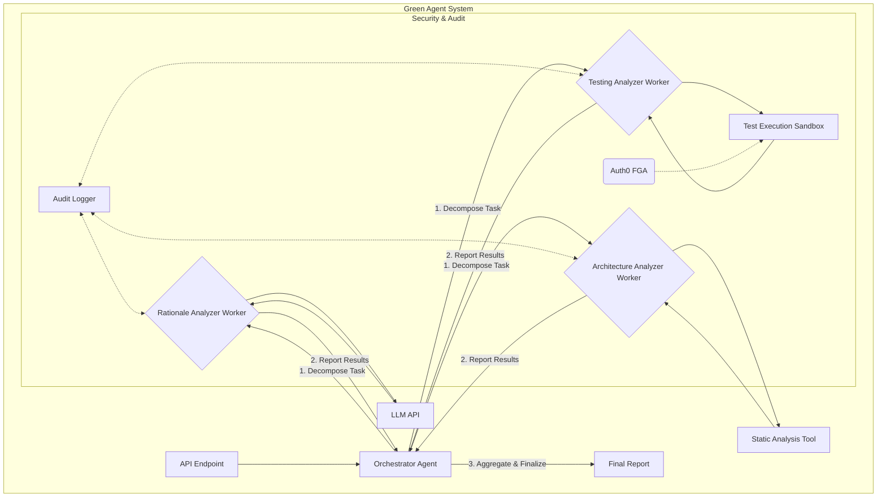

# Deep Research Prompt: Simulating the AgentX Judge Evaluation Process

**Objective:** To generate a comprehensive research report that simulates the evaluation process of the AgentX AgentBeats competition judges. This report will serve as an "inside peek" to help our team anticipate the judges' criteria, focus, and potential critiques.

**Persona:** You are a senior research analyst and AI strategist. Your task is to provide a detailed briefing to a team that has submitted a project to the AgentX "Benchmarks Track." Your analysis should be critical, insightful, and grounded in the specific context of the competition and its key players.

---

## **Core Research Question**

**"Based on all available information, how will the AgentX AgentBeats competition organizers and judges likely review our Green Agent submission for the 'Benchmarks Track'?"**

To answer this, your report must address the following sub-questions:

### **1. Judge and Competition Analysis (External Research)**

*   **Past Precedents:** What projects have won past AgentX competitions, and what were the stated reasons for their victory? Conversely, what common themes or weaknesses were present in projects that did not win? Analyze past winner announcements, blog posts, or publications.
*   **Judge Identification:** Who are the likely judges for this year's "Benchmarks Track"? Can you identify them from the official AgentX website, associated academic institutions (like Berkeley RDI), or sponsor organizations?
*   **Judge Profiling:** For any identified judges, what are their professional backgrounds, research interests, and publicly stated opinions on AI agents, software quality, and evaluation methodologies? (e.g., are they from industry or academia? Do they focus on security, scalability, or novel AI architectures?).
*   **Implicit Biases:** Based on the profiles of the judges and the explicit goals of the competition sponsors (like Auth0), what are the likely implicit biases of the judging panel? Will they favor projects with deep commercial potential, novel academic research, or flawless technical execution?

### **2. Submission Analysis (Internal Context)**

Based *only* on the provided source material below, perform a "red team" analysis of our project as if you were a judge. Identify the strengths a judge would praise and, more importantly, the weaknesses or questions they would raise.

*   **First Impressions:** Based on the `README.md`, how easy is it to understand the project's purpose and verify its functionality? Are the "Quick Start" instructions clear, professional, and effective?
*   **Novelty and Impact:** Does the core concept of "Contextual Debt," as explained in the submission paper, represent a truly novel and important contribution to agent evaluation? Is it a "Zero to One" benchmark, or an incremental improvement?
*   **Technical Rigor:** Does the architecture, as shown in the diagram, appear robust, scalable, and well-designed for its purpose? Are there any obvious architectural flaws a judge might question?
*   **Meeting the Criteria:** How well does the project align with the stated goals of the "Benchmarks Track," which are to "enable meaningful cross-agent comparisons and offer insights into efficiency, accuracy, and generalization"?

### **3. Predictive Synthesis**

Synthesize your external research and internal analysis into a final, actionable "mock judging report." This section should:

*   Outline the step-by-step process a judge will likely follow when reviewing our submission, from cloning the repository to reading the paper.
*   Predict the 3-5 key questions the judges will ask during a Q&A session.
*   Identify the single biggest strength of our submission that we should emphasize, and the single biggest weakness we need to be prepared to defend.

---

## **Source Material for Submission Analysis**

You must use the following documents as the complete and total context for your analysis of our project.

### **Document 1: The `README.md` (Quick Start Guide)**

```markdown
# LogoMesh Green Agent: A Benchmark for Contextual Debt

**Submission for the AgentX AgentBeats Competition (Benchmarks Track)**

---

## 1. Mission Overview

This repository contains the source code for our "Green Agent," a system designed to introduce a new benchmark for evaluating AI coding agents: the **Contextual Debt Score**.

Current benchmarks primarily measure task completion, failing to capture the long-term engineering quality of AI-generated code. Our project addresses this gap by quantifying "Contextual Debt"—the liability incurred from code that lacks clear human intent and sound architectural reasoning. Our agent provides a more holistic evaluation of agent performance, moving beyond *if* a task was completed to *how well* it was completed.

For a complete explanation of the theory and methodology, please review our full submission paper.

**➡️ [Read the Full Submission Paper](./docs/AgentX_Submission_Paper.md)**

## 2. Quick Start & Verification

To ensure our system is reproducible and transparent, you can run the core evaluation logic with two simple commands. This will execute the end-to-end test suite for our Minimum Viable Product (MVP), which validates the functionality of our API and analysis services.

**Step 1: Install Dependencies**
```bash
pnpm install
```

**Step 2: Run the Verification Test**
```bash
pnpm test
```

Upon successful execution, the tests will confirm that the evaluation server can start, process a mock agent submission, and generate a correctly structured Contextual Debt report.
```

### **Document 2: The `AgentX_Submission_Paper.md`**

```markdown
# A Benchmark for Agentic Quality: Measuring and Managing Contextual Debt

## Abstract

The proliferation of AI-powered code generation tools has unlocked unprecedented development velocity but has also introduced a novel, insidious form of liability: **Contextual Debt**. This is the future cost incurred from a lack of discernible human intent and architectural rationale within a codebase. Current agentic benchmarks, which focus solely on task completion, fail to measure this critical dimension of software quality. This paper introduces a new benchmark and a reference implementation—a "Green Agent"—designed to quantify Contextual Debt. Our agent analyzes code submissions from other AI agents across three axes: rationale, architecture, and testing. It aggregates these findings into a single, actionable **Contextual Debt Score**, providing a more holistic measure of agent performance and paving the way for a new generation of quality-aware AI development tools.

## Introduction: The Problem of Contextual Debt

Agentic software engineering is grappling with a **productivity paradox**: while individual developers report massive speed gains, system-level stability and throughput are declining. The root cause is that AI agents, optimized for localized task completion, are flooding codebases with syntactically correct but semantically opaque code. This practice, termed **"vibecoding,"** prioritizes immediate results over intentional design, leading to a systemic erosion of the "why" behind the code.

This erosion creates **Contextual Debt**. Unlike traditional technical debt (a suboptimal "how"), contextual debt is the cost of a missing "why." It manifests as code that is difficult to debug, maintain, and evolve because its underlying logic and architectural purpose are not owned or understood by the human team. Existing benchmarks, which typically measure only whether an agent can complete a task (e.g., pass a set of unit tests), are insufficient. They incentivize the very "vibecoding" that generates this long-term liability, failing to distinguish between a brittle, context-free solution and a robust, well-architected one. A new benchmark is needed—one that measures not just *if* an agent can solve a problem, but *how well* it solves it from an engineering perspective.

## Methods: A Green Agent for Quantifying Debt

To address this gap, we have developed a Green Agent that acts as an automated code reviewer, specifically designed to score the quality of another agent's (a "Purple Agent") code submission. Our agent's architecture is built around an **`EvaluationOrchestrator`** that coordinates three specialized analyzer services:

1.  **`RationaleDebtAnalyzer`:** This service uses a Large Language Model (LLM) to evaluate the quality of the rationale submitted alongside the code. It scores the explanation based on its clarity, completeness, and discussion of trade-offs, directly measuring the "explainability" of the solution.
2.  **`ArchitecturalDebtAnalyzer`:** This service performs static analysis on the source code to measure its structural integrity. In its initial version, it uses metrics like cyclomatic complexity to identify code that is overly complex and difficult to maintain.
3.  **`TestingDebtAnalyzer`:** This service analyzes the submitted test code to gauge its thoroughness. It rewards submissions that go beyond simple "happy path" tests to include checks for edge cases and error conditions.

The orchestrator invokes these three analyzers in parallel and then aggregates their individual scores (each from 0.0 to 1.0) into a single, averaged **Contextual Debt Score**. This score provides a quantitative measure of the submission's overall engineering quality.

## Results: The MVP and its API

Our Minimum Viable Product (MVP) is a Node.js server that exposes a single API endpoint: `POST /v1/evaluate`. This endpoint accepts the URL of a competing Purple Agent. It then orchestrates the entire evaluation workflow: sending a task to the Purple Agent, receiving its submission, running the analysis, and returning a final report.

### Example JSON Report

The final output is a JSON object that provides the overall score and a detailed breakdown from each analyzer. This structured data is designed to be machine-readable, enabling its use in automated competition benchmarks.

```json
{
  "id": "01J8Y2Z5X3N4Q5R6S7T8V9W0X2",
"status": "complete",
  "contextualDebtScore": 0.77,
  "report": {
    "rationaleDebt": {
      "score": 0.9,
      "details": "The rationale is clear, well-structured, and discusses potential trade-offs."
    },
    "architecturalCoherenceDebt": {
      "score": 0.8,
      "details": "Code is well-structured with a low cyclomatic complexity score of 5."
    },
    "testingVerificationDebt": {
      "score": 0.6,
      "details": "Tests cover the happy path, but no explicit tests for edge cases were found."
    }
  },
  "createdAt": "2025-12-15T10:00:00.000Z",
  "completedAt": "2025-12-15T10:01:15.000Z"
}
```

## Discussion: Impact and Future Work

The Contextual Debt Score represents a new, more meaningful benchmark for comparing the performance of autonomous software agents. By moving beyond mere task completion, it encourages the development of agents that produce code that is not just functional, but also maintainable, robust, and understandable. We believe this benchmark is a valuable public good that will:

*   Enable more insightful cross-agent comparisons.
*   Incentivize the AI research community to focus on engineering quality, not just capability.
*   Provide a tool for organizations to measure and manage the quality of AI-generated code in their own systems.

Future work will involve expanding the sophistication of the analyzer services, such as incorporating more advanced static analysis, measuring test coverage directly, and fine-tuning the rationale analyzer on a dataset of expert code reviews. By open-sourcing our Green Agent, we invite the community to collaborate on building a comprehensive and standardized benchmark for agentic code quality.
```

### **Document 3: The System Architecture Diagram**


