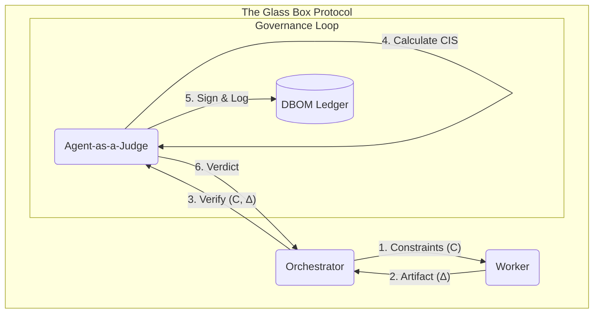

> **Context:**
> * [2026-01-31]: Validated Technical Report for AgentBeats Submission.

# **The Unknowable Code: A Framework for Measuring and Mitigating Software Liability**

## **Executive Summary: The Emerging Crisis of Intent**

A new and insidious form of liability is silently accumulating within the digital infrastructure of the global economy. We’ve spent 20 years managing **Technical Debt**—a failure of the "how." But the next decade of *liability* comes from **Contextual Debt**—a "failure of the 'why'". This is a massive, unmanaged risk, creating "amnesiac systems" that are ticking time bombs in every enterprise. The "context-free, AI-generated code" and fragmented microservices that power modern business are systematically eroding the human *intent* and *rationale* behind them.

**AgentBeats** is our response to this crisis. It is the world's first **Contextual Integrity Benchmark**, a system designed to measure the "Contextual Debt" of AI-generated code before it enters production.

This report formalizes the hypothesis that the greatest source of liability in the next decade of software will be the unmanageable accumulation of **Contextual Debt**.

**Contextual Debt** is the compounding liability a software organization incurs from a lack of discernible human intent, architectural rationale, and domain-specific knowledge within its codebase.

This is not a failure of *implementation* (the "how"), like traditional technical debt, but a more profound failure of *intent* (the "why"). It manifests as a quantifiable drag on developer velocity and a direct threat to system security, creating subtle logic flaws that are invisible to traditional analysis tools. While accelerated by the proliferation of context-free, AI-generated code, its accumulation is a systemic risk that can only be managed through proactive disciplines that codify intent, automated governance architectures that preserve it, and new quantitative benchmarks like the **Contextual Integrity Score (CIS)**.

This analysis establishes a critical distinction between traditional technical debt and this emerging liability. Technical debt is a failure of the "how"—a suboptimal implementation chosen as a deliberate, short-term tradeoff for spee d. [1] Contextual Debt, in stark contrast, is a failure of the "why"—the evaporation of the purpose, rationale, and business logic that underpins the cod e. [3] While the former makes a system difficult to change, the latter makes it dangerous to touch.

The **AgentBeats** platform implements the protocols described in this paper: the **Contextual Integrity Score (CIS)**, the **Agent-as-a-Judge** architecture, and the **Decision Bill of Materials (DBOM)**. It provides the first empirical method for quantifying the "why" of software, turning abstract liability into a measurable, manageable metric.

## **Defining Contextual Debt: The Liability of Amnesiac Systems**

Contextual Debt represents a fundamental shift in how we must conceptualize liability in software. It moves beyond the mechanics of implementation to the very essence of a system's purpose. Where technical debt describes a system that is poorly constructed, Contextual Debt describes a system that has forgotten why it was built. It is the liability of unknowable code.

### **The Anatomy of Contextual Debt**

At its core, Contextual Debt is "the accumulated, compounding liability from all the un-captured, siloed, or difficult-to-find information across the software development lifecycle".3 It is the organizational friction and risk generated by amnesiac systems. Every time a team member is forced to halt productive work to manually reconstruct the history and purpose of a piece of code, they are paying an interest tax on this deb t. [3] This liability is built upon three pillars of missing context:

1. **Lack of Discernible Human Intent:** This is the loss of the original purpose, business goals, and user needs that drove the creation of a feature or system. A developer might encounter a complex algorithm for calculating customer discounts but find no record of the business rules it is meant to enforce. Why was this specific formula chosen? Was it to comply with a regional regulation, to support a temporary marketing campaign, or to handle a specific type of enterprise client? Without this intent, any modification to the algorithm risks violating a critical business assumption, potentially leading to revenue loss or customer dissatisfactio n. [21]
2. **Lack of Architectural Rationale:** This refers to the undocumented and unrecoverable reasons behind significant design choices. Modern systems are a series of complex tradeoffs: the choice of a particular database technology (e.g., SQL vs. NoSQL), the design of an API contract, the decision to use a message queue instead of direct calls, or the selection of a specific cloud servic e. [22] When the rationale for these decisions is lost, the architecture becomes a collection of sacred, unchangeable artifacts. Teams become afraid to refactor or replace components because they do not know what constraints or assumptions the original choice was meant to satisfy. The system becomes brittle and impossible to evolve safely.
3. **Lack of Domain-Specific Knowledge:** This is the evaporation of the nuanced understanding of the business domain from the codebase itself. Software is a model of a real-world process, and that model is only as good as its understanding of the domain. For example, in an e-commerce system, the distinction between a "Customer" (someone who has made a purchase) and a "Prospect" (someone who has not) is a critical piece of domain knowledg e. [23] If this distinction is not explicitly encoded in the system's types and variable names, but instead exists only as an implicit assumption in a few scattered functions, the model becomes ambiguous. A new developer tasked with creating a marketing email list could easily—and incorrectly—target both groups, because the code itself has lost the context of this vital business distinctio n. [24]

### **The Failure of "Why" vs. "How": A Comparative Framework**

The fundamental difference between technical and Contextual Debt is the axis of failure. Technical debt is a failure of the **"how"**; Contextual Debt is a failure of the **"why"**. While technical debt makes code difficult and expensive to *change*, Contextual Debt makes code profoundly dangerous to *touch*.

Technical debt manifests in the implementation. The code may be convoluted ("spaghetti code"), inefficient, or reliant on outdated dependencie s. [10] The intent might be clear—for example, a function named calculateSalesTax—but its implementation is suboptimal, making it hard to maintain or debug.

Contextual Debt manifests in the semantics. The code may be perfectly clean, efficient, and well-structured according to a specification that has been lost to time. It is "semantically opaque, architecturally adrift, and lacks a clear, human-centric design philosophy" \[User Query\]. Any attempt to modify it is fraught with peril, as the developer is operating without the critical knowledge of the unstated business rules, architectural constraints, or domain assumptions that the code implicitly enforces.

The following table provides a systematic comparison of these two forms of liability:

| Dimension | Technical Debt | Contextual Debt |
| :---- | :---- | :---- |
| **Nature of Failure** | A failure of the **"How"** (suboptimal implementation) | A failure of the **"Why"** (missing or opaque intent) |
| **Core Metaphor** | A financial loan taken to speed delivery, requiring repayment. | Organizational amnesia; a system that has forgotten its own purpose. |
| **Primary Cause** | Deliberate tradeoffs, tight deadlines, evolving understanding of a known problem. | Siloed information, team turnover, poor documentation, lack of knowledge capture. |
| **Typical Manifestation** | Spaghetti code, high cyclomatic complexity, outdated libraries, poor performance. | "Unknowable" code, magic numbers, ambiguous variable names, undocumented architectural choices, lost business rules. |
| **"Interest" Payment** | Increased time to add features, higher bug rates, difficulty refactoring. | Fear of making changes, inability to onboard new developers, critical production failures from violating hidden assumptions, security vulnerabilities. |
| **Repayment Strategy** | Refactoring, code cleanup, library upgrades. | Archeological code digs, reverse-engineering intent, interviewing past team members, implementing ADRs and DDD retroactively. |
| **Relationship to Code** | Syntactically or structurally flawed, but intent may be clear. | Syntactically correct, but semantically and conceptually opaque. |

### **The Silent Accumulation: A Tax Accrued by Default**

A defining characteristic of Contextual Debt is its insidious accumulation. While much technical debt is the result of a conscious decision—a "deliberate and prudent" choice to prioritize speed—Contextual Debt is rarely a conscious choice. It is described as a "silent tax that accrues by default".21

This tax is the natural byproduct of modern, fragmented development ecosystems. The "why" behind a feature is not located in a single place. It is scattered across a constellation of tools: the initial client feedback might be in an email, the feature request in a Jira ticket, the technical discussion in a series of Slack messages, the architectural decision on a whiteboard photo, and the final implementation in Gi t. [21] Each of these tools captures a fragment of the context, but no process exists to synthesize them into a coherent whole that lives with the code. This fragmentation stands in contrast to the failed "Organizational Memory Information Systems" of the 1990s, which were envisioned as centralized, top-down repositories. These systems failed because they were destinations separate from the actual workflow; they became digital graveyards because they fought against the natural, chaotic flow of wor k. [21] Contextual Debt accumulates precisely because our modern tools *are* the workflow, but they are not designed to preserve memory.

This silent accumulation changes the very nature of risk in software development. The primary risk associated with technical debt has traditionally been economic friction—projects take longer and cost more than they shoul d. [2] The consequences of Contextual Debt are of a different order of magnitude. When a developer modifies a piece of semantically opaque code, they may do so with the best of intentions. The change may appear correct and pass all automated tests. However, because the developer lacks the original context, their change might inadvertently violate a crucial, unstated compliance rule, a subtle financial calculation, or a critical security assumption. The result is not a simple bug; it is a potential data breach, a major accounting error, or a catastrophic system outag e. [25] While technical debt can cause a project to go over budget, unmanaged Contextual Debt can cause a company to face regulatory fines, lose customer trust, or suffer an existential security failure. It elevates the problem from a technical concern to a core issue of business governance.

## **The Accelerants: Modern Catalysts for Contextual Debt**

The accumulation of Contextual Debt is not a new phenomenon, but its rate of growth has been supercharged by powerful, contemporary trends in software development. The widespread adoption of AI coding assistants, the architectural paradigm of microservices, and the relentless pursuit of scalability are not merely contributing to the problem; they are acting as powerful catalysts. These forces, often adopted to increase velocity and flexibility, are inadvertently creating a new generation of systems that are more powerful but profoundly less understandable than their predecessors.

### **The AI Co-Pilot's Blind Spot: Comprehension Debt and the Lost "Theory"**

The integration of generative AI into software development environments represents a paradigm shift in productivity. Tools like GitHub Copilot can make developers significantly faster, with some studies showing productivity gains of up to 55%.27 This acceleration, however, comes with a severe and often overlooked side effect: the rapid creation of what can be termed **"comprehension debt"**. This is a specific form of Contextual Debt that arises when developers "don't comprehend what the system does anymore" because they did not build the foundational understanding in the first plac e. [4]

This phenomenon can be understood through the lens of computer scientist Peter Naur's concept of "theory building".4 Naur argued that a program is not merely the source code itself, but also the "theory" or mental model of the problem and its solution that exists in the minds of the developers who built it. When that team dissolves, the theory is lost, and while the code may continue to run, any attempt to modify it is perilous because the new team lacks the requisite understandin g. [4] AI coding assistants create an exponential version of this problem. To fulfill a prompt, the AI builds a temporary, internal "theory" of the codebase, identifying connections and necessary changes. It then generates the code and, crucially, its theory is "immediately lost".4 The human developer, by accepting the code without deep engagement, never builds this essential mental model. The "why" behind the AI's solution is never transferred, creating an immediate and permanent pocket of Contextual Debt.

This AI-accelerated debt has several distinct consequences:

* **Lack of Global Context:** AI tools operate at the level of code snippets and functions. They lack a true understanding of the broader system architecture, long-term business goals, or nuanced domain constraints. The code they generate may be locally correct but globally incoherent, introducing subtle inconsistencies or violating unstated architectural principle s. [29]
* **Increased Code Churn and Duplication:** Empirical data indicates that the use of AI assistants has led to a doubling of "code churn"—code that is quickly added and then modified or removed—and a sharp decline in code reus e. [27] Developers, enabled by the AI's speed, are more likely to generate a new, slightly different version of an existing function than to find and refactor the original. This practice leads to a bloated, fragmented, and increasingly unknowable codebas e. [30]
* **Accumulation of Knowledge Debt:** Over time, the team becomes responsible for maintaining a significant volume of code that "nobody actually wrote".27 This creates a dangerous knowledge gap that snowballs with each new AI-generated feature, making the system progressively more opaque and fragile.

### **The Distributed Monolith: Architectural Fragmentation in Microservices**

Microservice architectures have become a dominant paradigm for building large-scale systems, promising high maintainability, scalability, and the ability for teams to develop and deploy their services independentl y. [31] However, when poorly implemented, this architectural style can become a primary driver of Contextual Debt. The risk is that instead of a set of loosely coupled, independent services, organizations inadvertently create a **"distributed monolith"**—a system where services are de jure separate but de facto tightly coupled through a web of complex, undocumented, and brittle dependencie s. [32]

The core issue is the "potential loss of the bigger architectural picture".5 In a traditional monolithic application, the architectural rationale, however well or poorly documented, is centralized. In a microservices ecosystem, that rationale becomes fragmented across dozens or even hundreds of services, often owned by different teams operating in semi-autonomy. The overarching "why" of the system's holistic design—how the pieces are meant to fit together to achieve a business outcome—is easily lost.

This fragmentation is a form of architectural debt that manifests in several ways:

* **Communication Layer Complexity:** Business logic that should reside within a specific service often leaks into the communication layer (e.g., API gateways, service meshes), making the interactions between services opaque and difficult to reason abou t. [33]
* **Point-to-Point Proliferation:** A high number of direct, point-to-point connections between services creates a "dependency hell" where a change in one service can have unforeseen cascading effects across the syste m. [33]
* **Siloed Knowledge:** The very structure of a microservices organization, with distinct teams owning individual services, is a natural breeding ground for the siloed knowledge that is a root cause of Contextual Deb t. [19] The team that owns the "Orders" service may have no deep understanding of the constraints within the "Inventory" service, leading to integrations that are functional but violate subtle, critical business rules.

### **The Scalability Trap: When Future-Proofing Creates Present-Day Liability**

Scalability—the ability of a system to handle a growing amount of work—is a critical non-functional requirement for any modern business. A system that cannot scale effectively will suffer from performance degradation, become more vulnerable to security threats, and ultimately prevent the business from seizing market opportunitie s. [34]

However, the pursuit of scalability can itself become a significant source of Contextual Debt. The "scalability trap" occurs when teams engage in premature or excessive optimization, designing architectures for a hypothetical massive scale that may never materializ e. [22] These highly "scalable" architectures often introduce immense complexity in the form of intricate multi-level caching strategies, complex message queues, event-sourcing patterns, and database sharding logi c. [36]

The Contextual Debt arises when the rationale for this added complexity is inevitably lost. A developer joining the team years later will encounter a labyrinthine system but will have no record of *why* it was designed that way. Was the complex caching layer implemented to solve a specific performance bottleneck that has since been rendered obsolete by a database upgrade? Was the event-sourcing pattern chosen to support a predicted user load that was an order of magnitude higher than reality? Without this context, the architecture becomes a rigid, unknowable liability. It is too complex to be easily understood and too risky to be simplified or removed, as the team cannot be certain what critical function it might still be serving. The prudent decision to build for the future, if its context is lost, becomes a crippling debt in the present.

These three accelerants do not operate in isolation; they form a vicious cycle of context destruction. A premature scalability decision creates an overly complex architecture whose rationale is not documented. This system is then implemented using microservices, which fragments the remaining architectural knowledge across siloed teams. Finally, a developer on one of those teams uses an AI assistant to add a feature. The AI, lacking the global context of the undocumented, fragmented architecture, generates code that is locally correct but violates a core, unstated principle of the system. This change passes its local tests and is deployed, only to cause a catastrophic, system-wide failure that is nearly impossible to debug because the original intent is lost, the architecture is fragmented, and the offending code was generated by a machine with no memory of its decision. Each accelerant amplifies the destructive potential of the others, creating a perfect storm for the accumulation of unknowable code.

## **The Consequences: From Development Friction to Corporate Liability**

The accumulation of Contextual Debt is not an abstract technical concern; it has tangible, high-stakes consequences that ripple through an organization. The "interest payments" on this debt begin as a drag on operational efficiency but can escalate into severe security vulnerabilities and, ultimately, significant corporate and legal liability. Understanding this progression is critical for reframing Contextual Debt from an engineering problem to a C-suite-level risk.

### **The Interest Payments: Quantifying the Operational Drag**

The most immediate and persistent consequence of Contextual Debt is a severe degradation of an organization's ability to execute. This operational drag manifests in several key areas:

* **Reduced Velocity and Innovation:** The primary interest payment is a dramatic slowdown in development velocity. As the codebase becomes more opaque, developers must spend an increasing percentage of their time on "software archeology"—painstakingly trying to reverse-engineer the purpose and function of existing code rather than building new, value-creating feature s. [25] This directly impacts time-to-market for new products and services, erodes competitive advantage, and stifles a company's capacity for innovatio n. [26]
* **Increased Complexity and Defect Rates:** A system without a discernible design philosophy or clear intent is a system where complexity grows unchecked. Every new feature added to an unknowable codebase is a patch on a mystery, increasing the system's entropy. Changes become more error-prone and are more likely to introduce subtle defects or regressions in seemingly unrelated parts of the syste m. [20] This leads to a decline in software quality, system instability, and a degradation of the customer experienc e. [38]
* **Onboarding and Talent Retention Challenges:** A codebase laden with Contextual Debt is a hostile environment for new engineers. Without clear documentation of intent and rationale, onboarding becomes a slow and frustrating process of draining "tribal knowledge" from a handful of senior engineers who may still hold fragments of the system's original contex t. [21] This not only makes the organization less efficient but also leads to burnout among senior staff and high turnover rates for frustrated new hire s. [11] This, in turn, accelerates the very knowledge loss that created the problem, creating a self-perpetuating cycle of decay.

### **The Ticking Time Bomb: Contextual Debt as a Security Threat Multiplier**

The connection between software quality and security is well-established, but Contextual Debt represents a particularly potent threat multiplier. The central axiom is simple: **unknowable code is unsecurable code**. When developers cannot reason about the intended behavior of a system, they cannot effectively secure it against unintended behaviors.

Contextual Debt directly undermines cybersecurity posture in several critical ways:

* **Difficulty in Remediating Vulnerabilities:** When a new vulnerability is discovered in a third-party library or a common software pattern, remediation requires developers to understand where and how that component is used throughout their system. In a system with high Contextual Debt, this becomes a monumental task. The increased complexity and lack of clear architectural understanding make it significantly harder to locate all instances of the vulnerability, assess the true risk, and apply a patch without causing unintended side effect s. [25]
* **Inadvertent Introduction of New Flaws:** The act of modifying opaque code is a primary vector for introducing new security vulnerabilities. For example, a developer tasked with "optimizing" a data access function might simplify the logic, inadvertently removing a subtle but critical authorization check that was never explicitly documented but was essential for preventing data leakag e. [25] The code "works," but it is now insecure, and the flaw is unlikely to be caught by standard testing that does not know to look for the violation of a forgotten rule.
* **A Fertile Environment for Exploits:** Complex, poorly understood systems are a breeding ground for security flaws. Issues like insecure configurations, improper error handling that leaks sensitive information, or broken access control logic are often not the result of a single, obvious bug, but the emergent property of a system whose components interact in ways that no one on the team fully comprehend s. [7] High Contextual Debt creates the ideal conditions for these types of vulnerabilities to fester undetected.

### **The New Legal Paradigm: The End of Software's Liability Shield**

For decades, the software industry has operated under a unique liability shield, largely protected by End-User License Agreements (EULAs) and legal precedents that placed the burden of risk on the consume r. [7] That era is decisively coming to an end. A significant global shift in policy and legal thinking is underway, aimed at holding software vendors accountable for the security and integrity of their products.

This shift is being driven by key policy initiatives:

* **The U.S. National Cybersecurity Strategy (NCS):** Released in 2023, the NCS explicitly calls for a fundamental rebalancing of liability. It states that vendors should be "held liable when they fail to live up to the duty of care they owe" to their customers and advocates for shifting liability onto producers who fail to take "reasonable precautions" to secure their softwar e. [7]
* **The E.U. Cyber Resilience Act (CRA):** This proposed regulation in the European Union seeks to establish a form of liability for all "products with digital elements" by requiring vendors to attest to their adherence to a set of basic cybersecurity practices throughout the product's lifecycl e. [42]

The emerging consensus is a move away from strict liability—where a vendor is liable for any harm caused by their product, regardless of fault—toward a **negligence standard**.8 Under this standard, the central legal question will be whether the software vendor exercised a reasonable "duty of care" in the development, maintenance, and deployment of their product.

This is where the concept of Contextual Debt transitions from a technical issue to a critical legal one. This report posits the central legal argument that **the presence of significant, unmanaged Contextual Debt within a software system is prima facie evidence of a failure to meet a reasonable duty of care.** In the aftermath of a significant security breach or system failure, investigators, regulators, and plaintiffs' attorneys will ask not only *what* happened, but *why*. They will demand to see the records demonstrating the rationale behind key architectural decisions. They will ask for the evidence that security tradeoffs were consciously evaluated. They will probe whether the organization had a coherent and consistent understanding of its own system's behavior.

An organization crippled by Contextual Debt will be unable to answer these questions. A company that cannot explain why its own authentication system was designed a certain way, or what business rules a critical financial calculation is supposed to enforce, cannot plausibly claim to have been reasonably diligent in its construction and maintenance. Contextual Debt thus becomes a direct, measurable proxy for legal and financial liability.

This evolution in liability is already being foreshadowed by the regulatory push for Software Bills of Materials (SBOMs), which require vendors to provide a manifest of all components in their softwar e. [7] However, SBOMs only answer the question of "what" is in the code. The next logical step in regulatory and legal scrutiny will be to ask "why." The demand will move beyond component lists to something akin to an "Architectural Bill of Materials" or a "Decision Bill of Materials"—artifacts that document the rationale, tradeoffs, and intent behind the system's design. The practices that mitigate Contextual Debt are, therefore, not merely good engineering hygiene; they are the proactive creation of the evidentiary record that will be required to defend against the coming wave of software liability claims.

## **Contextual Debt as a Direct Security Liability**

The accumulation of Contextual Debt is not merely a drag on productivity; it has transformed into an active, escalating, and largely invisible security liability. This is because the foundational principle of all cybersecurity is the enforcement of *intent*. A security policy is a codified expression of an organization's *intended* behavior for a system. An organization that does not understand *why* its own systems behave as they do has lost the ability to define, let alone enforce, intended behavior. You cannot secure what you do not understand.

AI coding agents are high-speed factories for this specific form of debt. Without explicit guidance and a deep, human-like understanding of context, an LLM may "inadvertently strip away critical safeguards or introduce subtle flaws in pursuit of perceived improvement". This act of "improving" code by removing seemingly redundant checks—checks that a human engineer placed for a specific, unstated security reason—is the "why" evaporating *during the moment of creation*.

### **The Failure of Traditional Security Tooling**

It is imperative to distinguish this new risk class from traditional vulnerabilities. The industry has spent two decades focused on **Technical Debt**, which is a failure of the "how"—a suboptimal implementation. This debt class leads to well-understood, pattern-based vulnerabilities like SQL injections or the use of stale libraries with known CVEs. The entire "Shift Left" security apparatus, dominated by Static Application Security Testing (SAST) and Dynamic Application Security Testing (DAST), was engineered to find these implementation flaws.

**Contextual Liability**, by contrast, is a failure of the "why". It does not manifest as a common vulnerability pattern but as "subtle business logic flaws" and "complex access control issues". An AI agent, lacking the human's "why" entirely, can generate a subtle logic flaw that *looks* like a safe, framework-mitigated pattern. This creates the perfect camouflage: a flaw in *intent* (Contextual Liability) that is perfectly disguised as a *valid implementation* (the "how"). This vulnerability is structurally invisible to the SAST scanner, which sees no pattern violation. Even automated CVE (Common Vulnerabilities and Exposures) scanners will miss these, as they are not known library defects but novel logic errors.

### **Case Study: The Fine-Grained Authorization (FGA) Tipping Point**

Nowhere is the danger of Contextual Liability more acute than in the industry's most advanced security systems: modern Fine-Grained Authorization (FGA). An FGA system is powerful because it makes decisions based on the *relationship* between a subject (a user) and an object (a resource). Crucially, an FGA system is not merely a security layer applied atop an application; it is a *codified model of the business itself*. Unlike authentication, which can be decoupled, authorization is "tightly coupled with business logic".

This creates a profound realization. FGA systems, when implemented correctly, are the *antidote* to Contextual Debt. A well-designed FGA model serves as a living, executable, and centralized database of the "why"—the exact business relationships and architectural rationale that define "who can do what." The advent of AI coding agents tragically *inverts* this. Instead of being the *solution* for Contextual Debt, the FGA model is now its *primary victim*. We are now asking AI agents—systems defined by their fundamental lack of "domain-specific knowledge"—to write and modify these hyper-sensitive, context-dependent models.

> [*Legal Note:*] When an AI "hallucinates" a business rule and codifies it as a security policy, it is committing the most dangerous possible injection of Contextual Debt. This action creates a direct pathway to liability, as the very system designed to be the fortress of intent has been poisoned with "semantically opaque" rules that look correct but are logically, and catastrophically, flawed. A post-breach legal discovery process would almost certainly identify this as a failure to meet the "duty of care."

### **The Cyber-Sentinel: A New Paradigm for Security**

The inescapable conclusion is that our current security paradigm is broken. We cannot solve an AI velocity problem with more human review or more static scans. We must fight a new class of AI-generated flaws with a new class of AI-driven defense. This calls for a "Cyber-Sentinel Agent"—a specialized evaluator agent designed not to find *bugs* but to audit for *intent*. This new category of "AI-Native SAST" is built from the ground up not to match patterns, but to "reason across users, data, and permissions" and to be "crucial for catching vulnerabilities like IDOR and Broken Object-Level Authorization (BOLA)".

## **Proactive Management: Strategies for Building Systems with Memory**

Confronting the challenge of Contextual Debt requires a deliberate shift from passive accumulation to proactive management. The goal is to build systems with institutional memory, where the "why" is treated as a first-class citizen of the software development lifecycle, just as important as the "what" and the "how." This requires adopting a set of disciplines and cultural practices designed to codify intent, embed domain knowledge, and enforce human oversight.

### **Codifying the "Why": Architectural Decision Records (ADRs) as Institutional Memory**

The most direct and powerful tool for combating the loss of architectural rationale is the **Architectural Decision Record (ADR)**. An ADR is a lightweight, structured document that captures a single, architecturally significant decision, along with its context and consequence s. [43] A collection of ADRs for a project forms a "decision log," which serves as an immutable, chronological record of the architecture's evolutio n. [43]

ADRs are a direct antidote to the second pillar of Contextual Debt. They explicitly document:

* **The Context:** The problem being solved, the constraints, and the forces at play when the decision was made.
* **The Decision:** The specific choice that was made (e.g., "We will use PostgreSQL as the primary database for the inventory service").
* **The Consequences:** The expected outcomes of the decision, including the accepted tradeoffs and any new risks or requirements that arise from it.
* **Considered Alternatives:** A brief description of the other options that were evaluated and the reasons they were rejected. This is crucial for preventing future teams from re-litigating old debate s. [45]

To be effective, the implementation of ADRs should follow several best practices:

* **Focus on Significance:** ADRs should be created only for "architecturally significant" decisions—those that are high-cost to change or that affect the system's core structure and non-functional requirements. This prevents the process from becoming an exercise in bureaucratic overhea d. [43]
* **Use a Simple, Consistent Template:** Adopting a lightweight, consistent template (such as the popular format proposed by Michael Nygard) makes creating and reading ADRs easie r. [44]
* **Integrate into Workflow:** ADRs should be treated as code. They should be stored in the same version control system (e.g., Git) as the source code they describe, allowing them to be reviewed and updated as part of the normal development process. They should be referenced in code reviews to ensure that new code complies with established architectural principle s. [43]
* **Embrace Immutability:** Once an ADR is accepted, it should not be changed. If a decision needs to be reversed or modified, a new ADR should be created that explicitly supersedes the old one. This preserves the historical record of *why* the original decision was made, which is itself valuable contex t. [43]

### **Embedding the "What": Domain-Driven Design (DDD) as a Bulwark Against Ambiguity**

While ADRs address architectural rationale, **Domain-Driven Design (DDD)** is a powerful discipline for combating the loss of domain-specific knowledge and human intent. DDD is a software development approach that centers on creating a rich, sophisticated model of the business domain and embedding that model directly into the cod e. [48] It seeks to make the software a faithful and explicit reflection of the business it serves.

Two core DDD principles are particularly effective at mitigating Contextual Debt:

1. **Ubiquitous Language:** DDD insists on the creation of a shared, unambiguous vocabulary that is used consistently by everyone involved in the project—domain experts, developers, product managers, and QA engineers. This "Ubiquitous Language" is not just for meetings and documents; it is used directly in the code for class names, methods, and variable s. [24] When the business talks about a "Premium Customer," the code should contain a PremiumCustomer class. This practice eliminates the ambiguity and mental translation that is a primary source of Contextual Debt, ensuring that the code's intent is clear and directly tied to the business realit y. [48]
2. **Bounded Contexts:** DDD recognizes that in any complex business, concepts can have different meanings in different contexts. For example, the concept of a "Product" in the sales and marketing context (focused on pricing, features, and campaigns) is very different from a "Product" in the shipping and logistics context (focused on weight, dimensions, and warehouse location).24 A Bounded Context is an explicit boundary within which a particular domain model and its Ubiquitous Language are consistent and well-defined. By dividing a large, complex system into a set of clearly defined Bounded Contexts, DDD prevents ambiguity and makes the overall complexity manageabl e. [24]

DDD is not just a set of technical patterns; it is a discipline of continuous collaboration. It requires developers and domain experts to work closely together in modeling sessions to ensure that the software's "theory" is shared, accurate, and constantly validated against the real worl d. [24]

### **Human-in-the-Loop Governance for AI-Generated Code**

The acceleration of Contextual Debt by AI coding assistants cannot be stopped by banning these tools; their productivity benefits are too great. Instead, organizations must implement a robust governance framework built on the principle of **human-in-the-loop accountability**. The core tenet is that the development team must retain full intellectual ownership and deep understanding of every line of code in their system, regardless of its origi n. [27] The AI is a powerful tool, but the human developer remains the responsible architect.

An effective framework for responsible AI usage includes:

1. **Mandatory, In-Depth Code Reviews:** All AI-generated code must be subject to the same, if not more rigorous, code review process as human-written code. The review must go beyond simple correctness ("Does it work?") to assess clarity, maintainability, adherence to the Ubiquitous Language, and compliance with documented architectural decisions (ADRs).27
2. **Prompting for Context:** Developers should be trained to write prompts that provide the AI with as much context as possible. This includes specifying constraints, referencing existing design patterns, and even asking the AI to explain the rationale behind its generated solution.
3. **Refactor, Don't Just Accept:** AI-generated code should be treated as a first draft or a suggestion. The primary role of the human developer shifts from pure code generation to that of a critical editor and integrator. Their job is to refactor, simplify, and thoughtfully integrate the AI's output into the broader system, building their own mental "theory" of the code in the proces s. [30]
4. **Document AI-Driven Decisions:** If a significant or novel solution is implemented using AI-generated code, that fact should be documented. Ideally, an ADR should be created to capture the prompt used, the code that was generated, and the human rationale for accepting and integrating it into the system.

Implementing these strategies is not a simple matter of adopting new tools or processes; it requires a profound cultural and organizational shift. It necessitates breaking down the silos that separate technology from the business and legal departments. It demands a redefinition of developer productivity, moving away from crude metrics like "lines of code" or "features shipped" and toward a more mature understanding that values "lines of understood, defensible code." An organization's ability to mitigate Contextual Debt is, therefore, a direct reflection of its engineering culture and its commitment to clarity, communication, and shared understanding over the deceptive allure of raw speed.

## **The Developer Experience of Contextual Debt: A New Market for Tooling**

While "liability" suggests a passive, abstract risk, the business impact of contextual debt is direct, quantifiable, and severe. It is not a hypothetical future problem but a present-tense drain on the three pillars of engineering health: productivity, quality, and talent retention. High contextual debt manifests as a direct, measurable tax on developer productivity. When the *intent* behind a piece of code is missing, or the *rationale* for an architectural choice is undocumented, developers are forced to become code archaeologists instead of builders.

The following table outlines the quantifiable business impact of high contextual debt:

| Metric | Impact of High Contextual Debt | Financial Consequence |
| :---- | :---- | :---- |
| **Developer Productivity** | 19% productivity loss vs. teams with high-quality documentation. Up to 33% of developer time spent on technical debt. | Lost engineering hours; direct inflation of R\&D budget. |
| **Time-to-Market** | 18% longer to release new features compared to industry peers. | Delayed revenue, loss of competitive advantage, reduced market share. |
| **Defect Rate & Quality** | 21% increase in defect rates. | 10x cost multiplier to fix bugs found late in the cycle; brand damage. |
| **New Hire Onboarding** | 3 weeks of additional ramp-up time required for new developers. | Increased cost-per-hire, reduced team velocity, strain on senior staff. |
| **Engineer Turnover** | 25-35% higher turnover rate in teams with high technical debt. | $50,000 \- $100,000 replacement cost per senior developer; loss of institutional knowledge. |

### **The "Contextual Debt Analyzer": A New Class of Tooling**

This new, acute problem—AI-generated code overwhelming human context—requires a new class of tooling. This new category, the "Contextual Debt Analyzer," is not just an add-on but the logical and necessary third step in the evolution of automated code analysis.

| Tool Category | Primary Function | Scope of Analysis | Example Tools |
| :---- | :---- | :---- | :---- |
| **Gen 1: Linters** | Enforce Code Style & Syntax | Single File | ESLint, Prettier |
| **Gen 2: SAST / Quality Platforms** | Find Bugs & Security Vulnerabilities | Project / Repository | SonarQube, Snyk, Checkmarx |
| **Gen 3: Contextual Analyzers** | Enforce Intent, Rationale, & Domain Knowledge | Entire Codebase \+ Org. Knowledge | Qodo, CodeRabbit, Greptile |

These platforms automate intent, rationale, and domain knowledge. They are "context-centric," not just "code-centric." They analyze new code against the organization's collective knowledge: its existing codebase, its architectural standards, its documented decisions, and its domain-specific language. Their scope is the entire, a multi-repository codebase and the human knowledge that surrounds it.

> [*Legal Note:*] The outputs of a Contextual Debt Analyzer, particularly its automated reports on architectural violations and missing intent, could serve as crucial evidence in a legal setting. These reports provide a time-stamped, objective record of whether an organization was actively monitoring and managing the clarity and defensibility of its AI-generated code, directly supporting a "duty of care" defense.

## **3. Formalization: The Contextual Integrity Score (CIS)**

To move beyond the subjectivity of traditional code quality metrics, we define **Contextual Integrity ($CI$)** not as a qualitative sentiment, but as a computable probability that a given software artifact preserves its original intent.

We propose that the "explainability" of a system is a function of the semantic density between its executable logic (Code) and its declarative intent (Rationale). In AgentBeats, we formalize the **Contextual Integrity Score ($CIS$)** for any given change set $\Delta$ as a weighted summation of four measurements:

$$CIS(\Delta) =  0. [25] \cdot R(\Delta) +  0. [25] \cdot A(\Delta) +  0. [25] \cdot T(\Delta) +  0. [25] \cdot L(\Delta)$$

This "Equal Weighting" strategy ensures that no single dimension dominates the score, forcing the system to balance intent, implementation, verification, and logic.

### ** 3. [1] Rationale Integrity ($R$): The Semantic Alignment Vector**

Traditional traceability links (e.g., "referencing a Jira ticket") are susceptible to gaming. A developer can link irrelevant tickets to satisfy a compliance check. To solve this, we define Rationale Integrity ($R$) using high-dimensional vector similarity.

Let $\vec{v}_{code}$ be the vector embedding of the generated code diff, and $\vec{v}_{intent}$ be the aggregated vector embedding of the associated requirements (tickets, PRDs, Slack threads). The Rationale Integrity score is the cosine similarity between execution and intent:

$$R(\Delta) = \frac{\vec{v}_{code} \cdot \vec{v}_{intent}}{\|\vec{v}_{code}\| \|\vec{v}_{intent}\|} \cdot \mathbb{I}(Link_{exists})$$
Where $\mathbb{I}$ is an indicator function that returns 0 if no formal link exists. This effectively measures: *Does the code mathematically implement the meaning of the requirement?*

### ** 3. [2] Architectural Integrity ($A$): The Graph Centrality Constraint**

We model the software architecture as a directed graph $G = (V, E)$, where $V$ represents services and $E$ represents allowed dependencies. Contextual Debt often manifests as "illegal edges"—hidden dependencies that violate architectural constraints (e.g., a frontend service querying a payment database directly).

For a proposed change $\Delta$ introducing a set of new edges $E_{new}$, the Architectural Integrity is calculated as a binary compliance function scaled by the centrality of the violated nodes:

$$A(\Delta) = \prod_{e \in E_{new}} (1 - P(Violation | e))$$
This function forces the score to 0 if a single critical architectural boundary is crossed (a "Critical Veto"), ensuring that locally valid code is rejected if it introduces global fragility.

### ** 3. [3] Testing Integrity ($T$): Empirical Verification**

Traditional code coverage measures *execution* (did the line run?), not *verification* (did it do the right thing?). In AgentBeats, Testing Integrity ($T$) is derived primarily from the **ground-truth pass rate** of the code in a secure Docker sandbox, augmented by a "Specificity Bonus" for well-structured test assertions.

$$T(\Delta) = \text{Base}(PassRate) + \text{Bonus}(\text{Specificity})$$

This ensures that code that fails to run or fails its own tests cannot achieve a high integrity score, regardless of how "clean" it looks.

### ** 3. [4] Logic Integrity ($L$): The Senior Review**

While vectors and sandboxes capture structure and function, they can miss subtle algorithmic flaws or edge cases. Logic Integrity ($L$) is computed via an LLM-based "Senior Code Review" that evaluates the submission for:
1.  **Edge Case Handling:** Nulls, empty inputs, boundary values.
2.  **Algorithmic Complexity:** Efficiency and simplicity.
3.  **Constraint Adherence:** Compliance with task-specific rules.

$$L(\Delta) = \text{LLM}_{Judge}(\text{Code}, \text{Task})$$

---

### ** 3. [5] The Impossibility of Manual Governance (The Decay Theorem)**

The necessity of this automated scoring mechanism is derived from the divergence between **Generation Velocity ($V_g$)** and **Review Velocity ($V_r$)**.

In the pre-AI era, human review capacity ($V_r$) roughly matched human coding speed ($V_g$). However, AI coding assistants have decoupled these variables. Let $\lambda$ be the rate of AI code generation and $\mu$ be the maximum rate of effective human review.

In a modern AI-enabled workflow, $\lambda \gg \mu$.

If we model the accumulation of Contextual Debt ($D$) as a function of unreviewed intent, the probability $P$ of the system remaining in a "Knowable State" over time $t$ decays exponentially:

$$P(\text{Knowable})_t \approx e^{-(\lambda - \mu)t}$$
**Conclusion:** As $t \to \infty$, the probability of a system remaining knowable approaches 0 if reliance is placed on human review. The only mathematical way to maintain $P(\text{Knowable}) \approx 1$ is to introduce a governance variable that scales linearly with $\lambda$.

The **Agent-as-a-Judge** architecture is the implementation of this variable, ensuring that the Governance Velocity ($V_{gov}$) equals or exceeds Generation Velocity ($V_{gov} \ge V_g$). Without this automated counter-weight, the accumulation of Contextual Debt is not a risk; it is a mathematical certainty.

## **4. The Protocol: Agent-as-a-Judge Architecture**

To enforce the Contextual Integrity Score ($CIS$) defined in Section 3, we propose a governance architecture that inverts the traditional "Black Box" model of AI code generation. We define this architecture as the **"Glass Box" Protocol**, characterized by the externalization of reasoning and the cryptographic verification of intent.

### ** 4. [1] The Orchestrator-Worker Topology**

Traditional AI coding assistants operate as monolithic agents, where the reasoning state is hidden within the model's weights. This opacity renders auditability impossible.

We employ a **Multi-Agent Orchestrator-Worker (MA-OW)** topology where governance is structural, not supervisory.

* **The Orchestrator ($O$):** Maintains the state of the global context graph $G$. It does not generate code; it generates constraints.
* **The Worker ($W$):** A specialized agent (e.g., Purple Agent / Defender) that generates code $\Delta$ solely to satisfy constraints passed by $O$.
* **The Judge ($J$):** The Green Agent, an adversarial evaluator that runs $\Delta$ in a secure Docker sandbox and computes the $CIS$ function.

The interaction is defined by the tuple $(C, \Delta, V)$, where $C$ is the constraint, $\Delta$ is the artifact, and $V$ is the verification vector. The system accepts $\Delta$ if and only if:

$$J(O(C), W(\Delta)) \to \{Accept \mid Reject\}$$

**Figure 1: The Glass Box Protocol Topology**

### ** 4. [2] The Decision Bill of Materials (DBOM)**

In current CI/CD pipelines, the "Software Bill of Materials" (SBOM) tracks *components* (what). This is insufficient for liability protection. AgentBeats generates a **Decision Bill of Materials (DBOM)** to track *causality* (why).

A DBOM is an immutable, append-only log of the reasoning trace that authorized a code change. For every commit $\Delta_i$, the DBOM records a cryptographic tuple:

$$DBOM_i = \langle H(\Delta_i), \vec{v}_{intent}, \text{Score}_{CIS}, \sigma_{Judge} \rangle$$
Where:

* $H(\Delta_i)$ is the SHA-256 hash of the full evaluation result (JSON), ensuring no tampering with the score.
* $\vec{v}_{intent}$ is the vector embedding of the requirement (the "Why"), allowing mathematical audit of intent alignment.
* $\text{Score}_{CIS}$ is the computed Contextual Integrity Score.
* $\sigma_{Judge}$ is the digital signature of the Agent-as-a-Judge, certifying the evaluation.

This structure ensures that every line of code is mathematically bound to its justification. In the event of a liability claim, the organization does not produce a *log*; it produces a **proof** of diligence.

This structure ensures that every line of code is mathematically bound to its justification. In the event of a liability claim (e.g., a security breach), the organization does not produce a *log*; it produces a **proof** of diligence.

### ** 4. [3] Adversarial Context Defense**

A critical vulnerability in automated governance is "Context Stuffing"—where an agent hallucinates irrelevant justification to artificially inflate its Rationale Integrity score ($R$).

To mitigate this, the Judge agent employs a **Semantic Drift Detection** filter. It calculates the Kullback-Leibler (KL) divergence between the *Requirement Distribution* ($P$) and the *Code Implementation Distribution* ($Q$). If the divergence exceeds a threshold $\theta$:

$$D_{KL}(P \parallel Q) > \theta \implies \text{Reject}(\Delta)$$
This enforces a "semantic bounding box" around the agent, mathematically preventing it from citing irrelevant context to game the system.

## **Conclusion: Navigating the Decade of Unknowable Code**

This analysis has sought to define and explore the hypothesis that Contextual Debt—the future cost incurred from a lack of discernible human intent, architectural rationale, and domain-specific knowledge—is poised to become the single greatest source of software liability in the coming decade. The evidence suggests that this is not merely a new piece of jargon but a necessary term to describe a distinct and far more dangerous form of liability than traditional technical debt. While technical debt compromises a system's efficiency, Contextual Debt compromises its integrity, safety, and defensibility.

The proliferation of generative AI in software development has acted as an inescapable catalyst, transforming what was once a chronic, manageable problem of knowledge loss into an acute crisis. AI's ability to generate vast quantities of functional but context-free code forces organizations to confront their own systemic amnesia with ruthless efficienc y. [21] The productivity gains offered by these tools are undeniable, but they come at the cost of "comprehension debt," creating systems that are maintained by developers who never built the foundational "theory" of how they work.

This technical crisis is unfolding in parallel with a seismic shift in the legal and regulatory landscape. The era of software's immunity from liability is ending. Governments and regulatory bodies are moving decisively to establish a "duty of care" for software vendors, and the legal standard is coalescing around negligence. In this new world, the inability of an organization to explain the "why" behind its own critical systems will be indefensible. The presence of high Contextual Debt will be seen as clear evidence of a failure to exercise reasonable diligence.

Therefore, senior leaders must move beyond viewing these issues as purely technical concerns to be delegated to the engineering department. The management of Contextual Debt must be elevated to a strategic priority, integrated into corporate risk management frameworks, and championed by the highest levels of leadership. The necessary mitigation strategies—adopting Architectural Decision Records, embracing Domain-Driven Design, and implementing robust governance for AI-generated code—are not just engineering best practices. They are essential acts of corporate governance and the proactive creation of the evidentiary artifacts required to navigate the future legal landscape.

Our business model, the **"Consult-to-Product" Flywheel**, is designed to tackle this head-on. We are already signing high-margin consulting contracts to perform "archeological code digs." This *paid data acquisition* is building the world's only proprietary dataset of "intent failure," which serves as the unassailable data moat for our scalable SaaS platform.

This is not a developer tool. This is a new category of enterprise risk management. We are building the mandatory, auditable standard for "Contextual Integrity"—the "Fair Isaac" for all software.

#### **Works cited**

1. What is Technical Debt? Definition, History, and Strategy | Praxent, accessed October 26, 2025, [https://praxent.com/blog/brief-history-technical-debt](https://praxent.com/blog/brief-history-technical-debt)
2. Introduction to the Technical Debt Concept | Agile Alliance, accessed October 26, 2025, [https://www.agilealliance.org/wp-content/uploads/2016/05/IntroductiontotheTechnicalDebtConcept-V-02.pdf](https://www.agilealliance.org/wp-content/uploads/2016/05/IntroductiontotheTechnicalDebtConcept-V-02.pdf)
3. medium.com, accessed October 26, 2025, [https://medium.com/@yvan.callaou/our-systems-have-no-memory-i-call-it-contextual-debt-d656af68d80b\#:\~:text=Contextual%20Debt%20is%20the%20accumulated,%E2%80%9D%20behind%20the%20%E2%80%9Cwhat.%E2%80%9D](https://medium.com/@yvan.callaou/our-systems-have-no-memory-i-call-it-contextual-debt-d656af68d80b#:~:text=Contextual%20Debt%20is%20the%20accumulated,%E2%80%9D%20behind%20the%20%E2%80%9Cwhat.%E2%80%9D)
4. Why AI-Generated Code Hurts Your Exit – The Bootstrapped Founder, accessed October 26, 2025, [https://thebootstrappedfounder.com/why-ai-generated-code-hurts-your-exit/](https://thebootstrappedfounder.com/why-ai-generated-code-hurts-your-exit/)
5. Tracing the Footsteps of Technical Debt in Microservices: A Preliminary Case Study \- Roberto Verdecchia, accessed October 26, 2025, [https://robertoverdecchia.github.io/papers/QUALIFIER\_2023.pdf](https://robertoverdecchia.github.io/papers/QUALIFIER_2023.pdf)
6. Technical Debt in Microservices: A Mixed-Method Case Study \- Roberto Verdecchia, accessed October 26, 2025, [https://robertoverdecchia.github.io/papers/QUALIFIER\_2024.pdf](https://robertoverdecchia.github.io/papers/QUALIFIER_2024.pdf)
7. The Future of Software Liability: How Software Vendors Can ..., accessed October 26, 2025, [https://www.veritas.com/blogs/the-future-of-software-liability-how-software-vendors-can-prepare-for-increasing-responsibility](https://www.veritas.com/blogs/the-future-of-software-liability-how-software-vendors-can-prepare-for-increasing-responsibility)
8. Bugs in the Software Liability Debate \- Just Security, accessed October 26, 2025, [https://www.justsecurity.org/87294/bugs-in-the-software-liability-debate/](https://www.justsecurity.org/87294/bugs-in-the-software-liability-debate/)
9. What Is Technical Debt? | Definition and Examples \- ProductPlan, accessed October 26, 2025, [https://www.productplan.com/glossary/technical-debt/](https://www.productplan.com/glossary/technical-debt/)
10. If you want to address tech debt, quantify it first \- Stack Overflow, accessed October 26, 2025, [https://stackoverflow.blog/2023/08/24/if-you-want-to-address-tech-debt-quantify-it-first/](https://stackoverflow.blog/2023/08/24/if-you-want-to-address-tech-debt-quantify-it-first/)
11. Technical debt \- Wikipedia, accessed October 26, 2025, [https://en.wikipedia.org/wiki/Technical\_debt](https://en.wikipedia.org/wiki/Technical_debt)
12. What is Technical Debt? | IBM, accessed October 26, 2025, [https://www.ibm.com/think/topics/technical-debt](https://www.ibm.com/think/topics/technical-debt)
13. tagged by: technical debt \- Martin Fowler, accessed October 26, 2025, [https://martinfowler.com/tags/technical%20debt.html](https://martinfowler.com/tags/technical%20debt.html)
14. Technical Debt Quadrant \- Martin Fowler, accessed October 26, 2025, [https://martinfowler.com/bliki/TechnicalDebtQuadrant.html](https://martinfowler.com/bliki/TechnicalDebtQuadrant.html)
15. Technical Debt: Definition \+ Management | monday.com Blog, accessed October 26, 2025, [https://monday.com/blog/rnd/technical-debt/](https://monday.com/blog/rnd/technical-debt/)
16. Technical Debt Explained \- Codacy | Blog, accessed October 26, 2025, [https://blog.codacy.com/technical-debt](https://blog.codacy.com/technical-debt)
17. From Technical Debt to Design Integrity | by Alberto Brandolini \- Medium, accessed October 26, 2025, [https://medium.com/@ziobrando/from-technical-debt-to-design-integrity-48e7056b6776](https://medium.com/@ziobrando/from-technical-debt-to-design-integrity-48e7056b6776)
18. Technical Debt is over-used : r/PHP \- Reddit, accessed October 26, 2025, [https://www.reddit.com/r/PHP/comments/1hgxmap/technical\_debt\_is\_overused/](https://www.reddit.com/r/PHP/comments/1hgxmap/technical_debt_is_overused/)
19. What is Technical Debt? Causes, Types & Definition Guide \- Sonar, accessed October 26, 2025, [https://www.sonarsource.com/resources/library/technical-debt/](https://www.sonarsource.com/resources/library/technical-debt/)
20. How to Tackle Technical Debt and Maintain High Software Quality \- Qt, accessed October 26, 2025, [https://www.qt.io/quality-assurance/blog/how-to-tackle-technical-debt](https://www.qt.io/quality-assurance/blog/how-to-tackle-technical-debt)
21. Our Systems Have No Memory. I Call It Contextual Debt | by Yvan Callaou \- Medium, accessed October 26, 2025, [https://medium.com/@yvan.callaou/our-systems-have-no-memory-i-call-it-contextual-debt-d656af68d80b](https://medium.com/@yvan.callaou/our-systems-have-no-memory-i-call-it-contextual-debt-d656af68d80b)
22. Understanding Technical Debt. Technical debt, a concept ..., accessed October 26, 2025, [https://jatinmishra27.medium.com/understanding-technical-debt-6fe846fde3a8](https://jatinmishra27.medium.com/understanding-technical-debt-6fe846fde3a8)
23. Your AI Assistant is a Genius with Amnesia: How to Onboard It | by Krzyś | Generative AI, accessed October 26, 2025, [https://generativeai.pub/why-your-ai-assistant-writes-idiotic-code-and-how-to-fix-it-4512b2b5ceb5](https://generativeai.pub/why-your-ai-assistant-writes-idiotic-code-and-how-to-fix-it-4512b2b5ceb5)
24. Mastering Domain-Driven Design: A Strategic Framework for ..., accessed October 26, 2025, [https://medium.com/@Kirtiswagat/the-automation-garage-domain-driven-design-architecture-for-the-financial-industry-c524cf757e14](https://medium.com/@Kirtiswagat/the-automation-garage-domain-driven-design-architecture-for-the-financial-industry-c524cf757e14)
25. Examples of Technical Debt's Cybersecurity Impact \- DTIC, accessed October 26, 2025, [https://apps.dtic.mil/sti/trecms/pdf/AD1144728.pdf](https://apps.dtic.mil/sti/trecms/pdf/AD1144728.pdf)
26. Impact of technical debt: how to identify and reduce it \- Paddle, accessed October 26, 2025, [https://www.paddle.com/resources/technical-debt](https://www.paddle.com/resources/technical-debt)
27. How AI-Generated Code is messing with your Technical Debt \- Kodus, accessed October 26, 2025, [https://kodus.io/en/ai-generated-code-is-messing-with-your-technical-debt/](https://kodus.io/en/ai-generated-code-is-messing-with-your-technical-debt/)
28. The Hidden Costs of Coding With Generative AI \- MIT Sloan Management Review, accessed October 26, 2025, [https://sloanreview.mit.edu/article/the-hidden-costs-of-coding-with-generative-ai/](https://sloanreview.mit.edu/article/the-hidden-costs-of-coding-with-generative-ai/)
29. Technical Debt and AI: Understanding the Tradeoff and How to Stay Ahead \- Qodo, accessed October 26, 2025, [https://www.qodo.ai/blog/technical-debt/](https://www.qodo.ai/blog/technical-debt/)
30. Why AI-generated code is creating a technical debt nightmare | Okoone, accessed October 26, 2025, [https://www.okoone.com/spark/technology-innovation/why-ai-generated-code-is-creating-a-technical-debt-nightmare/](https://www.okoone.com/spark/technology-innovation/why-ai-generated-code-is-creating-a-technical-debt-nightmare/)
31. A Case Study on Technical Debt in a Large-Scale Industrial Microservice Architecture \- arXiv, accessed October 26, 2025, [https://arxiv.org/html/250 6. [16214]v1](https://arxiv.org/html/250 6. [16214]v1)
32. Microservices as Technical Debt: A Critical Perspective | by Dhruv ..., accessed October 26, 2025, [https://medium.com/c-sharp-programming/microservices-as-technical-debt-a-critical-perspective-77e8ab9a1a92](https://medium.com/c-sharp-programming/microservices-as-technical-debt-a-critical-perspective-77e8ab9a1a92)
33. (PDF) Architectural Technical Debt in Microservices: A Case Study in a Large Company, accessed October 26, 2025, [https://www.researchgate.net/publication/331904375\_Architectural\_Technical\_Debt\_in\_Microservices\_A\_Case\_Study\_in\_a\_Large\_Company](https://www.researchgate.net/publication/331904375_Architectural_Technical_Debt_in_Microservices_A_Case_Study_in_a_Large_Company)
34. What is Software Scalability and Why is it Important? \- CyberlinkASP, accessed October 26, 2025, [https://cyberlinkasp.com/what-is-software-scalability-and-why-is-it-important/](https://cyberlinkasp.com/what-is-software-scalability-and-why-is-it-important/)
35. Preventing and Reducing Technical Debt at Railsware, accessed October 26, 2025, [https://railsware.com/blog/reduce-technical-debt/](https://railsware.com/blog/reduce-technical-debt/)
36. Can some explain to me why scalability can be a huge issue in ..., accessed October 26, 2025, [https://www.reddit.com/r/learnprogramming/comments/1k2zxz/can\_some\_explain\_to\_me\_why\_scalability\_can\_be\_a/](https://www.reddit.com/r/learnprogramming/comments/1k2zxz/can_some_explain_to_me_why_scalability_can_be_a/)
37. Impact of Technical Debt in Software Development | by TopDevelopers.co \- Medium, accessed October 26, 2025, [https://medium.com/@topdevelopers-co/impact-of-technical-debt-in-software-development-af6d0c6c051d](https://medium.com/@topdevelopers-co/impact-of-technical-debt-in-software-development-af6d0c6c051d)
38. Managing the Consequences of Technical Debt: 5 Stories from the Field, accessed October 26, 2025, [https://www.sei.cmu.edu/blog/managing-the-consequences-of-technical-debt-5-stories-from-the-field/](https://www.sei.cmu.edu/blog/managing-the-consequences-of-technical-debt-5-stories-from-the-field/)
39. Technical Debt Management: The Road Ahead for Successful Software Delivery \- arXiv, accessed October 26, 2025, [https://arxiv.org/html/240 3. [06484]v1](https://arxiv.org/html/240 3. [06484]v1)
40. Understanding Software Liability: Implications for Businesses, accessed October 26, 2025, [https://technologybrokers.com.au/the-struggle-for-software-liability-why-it-matters-and-whats-next-for-businesses/](https://technologybrokers.com.au/the-struggle-for-software-liability-why-it-matters-and-whats-next-for-businesses/)
41. The struggle for software liability: Inside a 'very, very, very hard problem', accessed October 26, 2025, [https://therecord.media/cybersecurity-software-liability-standards-white-house-struggle](https://therecord.media/cybersecurity-software-liability-standards-white-house-struggle)
42. Three Questions on Software Liability | Lawfare, accessed October 26, 2025, [https://www.lawfaremedia.org/article/three-questions-on-software-liability](https://www.lawfaremedia.org/article/three-questions-on-software-liability)
43. ADR process \- AWS Prescriptive Guidance \- AWS Documentation, accessed October 26, 2025, [https://docs.aws.amazon.com/prescriptive-guidance/latest/architectural-decision-records/adr-process.html](https://docs.aws.amazon.com/prescriptive-guidance/latest/architectural-decision-records/adr-process.html)
44. Architectural Decision Records, accessed October 26, 2025, [https://adr.github.io/](https://adr.github.io/)
45. Architecture decision record (ADR) examples for software planning, IT leadership, and template documentation \- GitHub, accessed October 26, 2025, [https://github.com/joelparkerhenderson/architecture-decision-record](https://github.com/joelparkerhenderson/architecture-decision-record)
46. Architecture decision record \- Microsoft Azure Well-Architected Framework, accessed October 26, 2025, [https://learn.microsoft.com/en-us/azure/well-architected/architect-role/architecture-decision-record](https://learn.microsoft.com/en-us/azure/well-architected/architect-role/architecture-decision-record)
47. Documenting Architectural Decisions With ADRs A Practical Guide \- Growing Scrum Masters, accessed October 26, 2025, [https://www.growingscrummasters.com/keywords/architecture-decision-records/](https://www.growingscrummasters.com/keywords/architecture-decision-records/)
48. Understanding Domain-Driven Design: A Practical Approach for ..., accessed October 26, 2025, [https://sensiolabs.com/blog/2024/understanding-domain-driven-design](https://sensiolabs.com/blog/2024/understanding-domain-driven-design)
49. Domain-Driven Design Demystified \- NDepend Blog, accessed October 26, 2025, [https://blog.ndepend.com/domain-driven-design-demystified/](https://blog.ndepend.com/domain-driven-design-demystified/)
50. 10 Things to Avoid in Domain-Driven Design (DDD) \- DZone, accessed October 26, 2025, [https://dzone.com/articles/10-things-to-avoid-in-domain-driven-design](https://dzone.com/articles/10-things-to-avoid-in-domain-driven-design)
51. Artificial Intelligence and Technical Debt: Navigating the New Frontier \- CAST Software, accessed October 26, 2025, [https://www.castsoftware.com/pulse/artificial-intelligence-and-technical-debt-navigating-the-new-frontier](https://www.castsoftware.com/pulse/artificial-intelligence-and-technical-debt-navigating-the-new-frontier)
