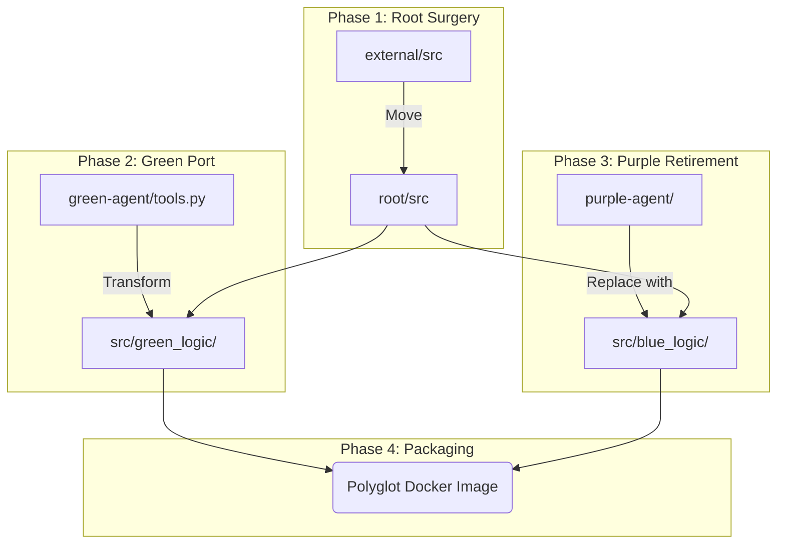
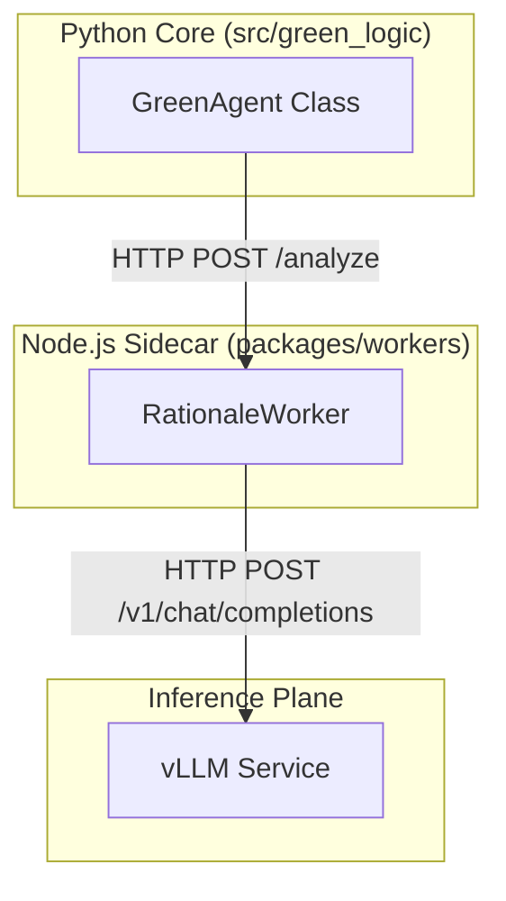
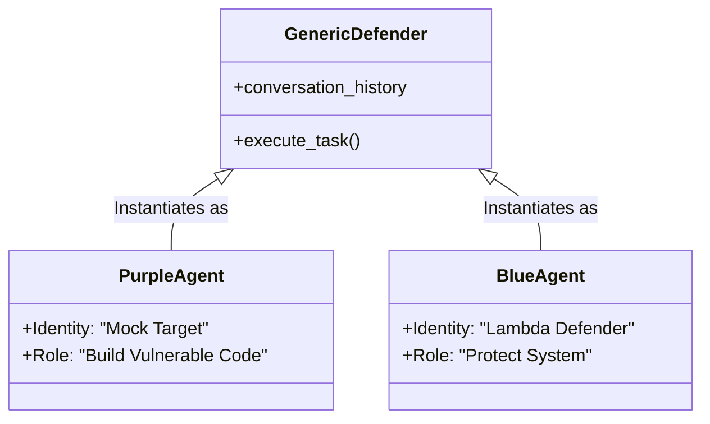
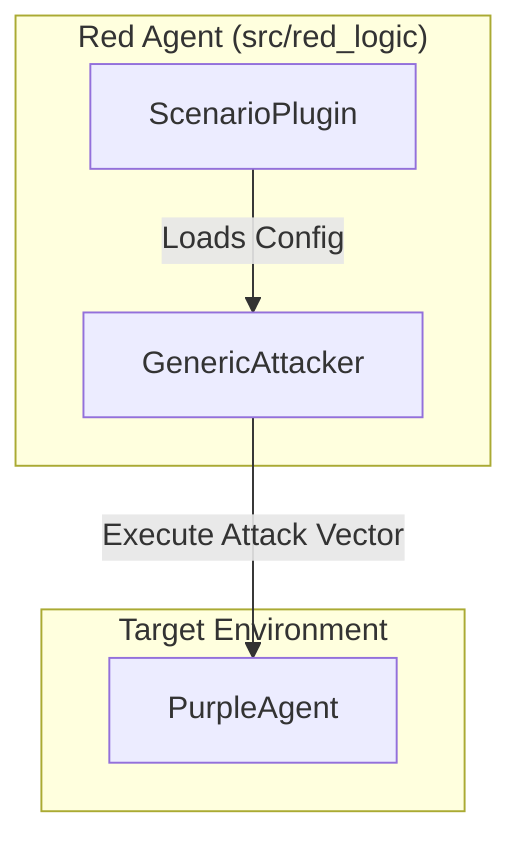

> **Context:**
> *   [2025-12-21]: Proposed strategy to consolidate agent implementations into a single "Polyglot" repository that supports both the Lambda Track (Python) and Custom Track (Node.js/Python Hybrid).

# Proposed Consolidation Plan: The Polyglot Repository

## 1. Executive Summary
We propose a **Polyglot Root** strategy that merges the Python-centric structure of the Lambda Track (`agentbeats-lambda`) with the Node.js-centric structure of our current monorepo (`packages/`).

**The Goal:** A single repository that builds:
1.  **The "Submission" Container:** A Python environment running the Red/Blue agents for the Lambda Track.
2.  **The "Evaluator" System:** A Hybrid environment where the Python Green Agent (Orchestrator) communicates with local Node.js Sidecars (`packages/workers`) to calculate the Contextual Integrity Score (CIS).

## 2. Strategic Alignment

### 2.1. Alignment with Meeting 6/7 (Dual Track)
*   **Requirement:** "We will submit to both tracks... using the tracks against each other."
*   **Solution:** The Polyglot structure keeps the Red Agent (Python) and Green Agent (Python) in the same `src/` tree, enabling the "Symbiotic" feedback loop described in the unified plan. The Red Agent generates attacks, and the Green Agent (powered by Node.js sidecars) evaluates them.

### 2.2. Alignment with Hybrid Sidecar Spec
*   **Requirement:** "Option B (Delegation)... using Node.js as a client to a full-fledged Python Green Agent service."
*   **Solution:** We preserve the `packages/` directory (Node.js). The Python Green Agent acts as the *Execution Layer* (sending/receiving messages), while delegating the *Cognitive Layer* (CIS Calculation) to the Node.js `RationaleWorker` via local HTTP calls. This implements the "Sidecar" pattern perfectly.

## 3. Target Architecture (The Polyglot Tree)

We will promote the `agentbeats-lambda` structure to the root, but **retain** the Node.js build configuration.

```text
/ (Root)
├── package.json                 # Node.js Monorepo Config (Retained)
├── pnpm-workspace.yaml          # Workspace Definition
├── pyproject.toml               # Python Dependency Config (Promoted from Kuan's repo)
├── uv.lock                      # Python Lockfile
├── Dockerfile                   # Polyglot Runtime (Installs Python + Node)
├── main.py                      # Polymorphic Entrypoint (Red/Green Switch)
├── src/                         # The Unified Python Core
│   ├── common/                  # Shared A2A SDK
│   ├── red_logic/               # Kuan's Attacker (Generic Attacker)
│   ├── green_logic/             # Samuel's Evaluator (Ported from tools.py)
│   └── blue_logic/              # Kuan's Defender (Generic Defender)
├── scenarios/                   # Lambda Track Submissions
│   └── security_arena/...
├── packages/                    # Node.js Sidecars (Retained)
│   ├── workers/                 # Rationale/Architecture Workers
│   └── contracts/               # Shared Schemas
└── scripts/                     # Utility scripts
```

## 4. Migration Execution



### Phase 1: Root Surgery (The Merge)
1.  **Promote:** Move `external/TEAM/agentbeats-lambda/[pyproject.toml, uv.lock, src, scenarios]` to the repository root.
2.  **Merge:** Update root `.gitignore` to handle both Node (`node_modules`) and Python (`__pycache__`, `.venv`) artifacts.
3.  **Config:** Ensure `package.json` scripts (e.g., `build`, `test`) do not conflict with Python commands (e.g., use `pnpm build` vs `uv run`).

### Phase 2: The Green Port (Logic Transfer)
1.  **Source:** `green-agent/tools.py` (Samuel's logic).
2.  **Target:** `src/green_logic/evaluator.py`.
3.  **Action:** Rewrite the CLI tools as a `GreenAgent` class. This involves **Dockerizing** the code (removing hardcoded `localhost` references) and **Wiring** the OpenAI client to the vLLM Sidecar.

### Phase 3: The Purple Retirement
1.  **Action:** Delete `purple-agent/`.
2.  **Replacement:** Use `src/blue_logic/generic_defender.py` (Kuan's code) as the canonical "Mock Purple Agent".

### Phase 4: Submission Packaging
The "Dual Track" strategy requires two distinct registrations on the AgentBeats platform.
1.  **Green Agent Submission:**
    *   Artifact: Docker Image (Polyglot).
    *   Command: `main.py --role GREEN` (Starts Python Evaluator + Node Sidecar).
2.  **Purple Agent Submission:**
    *   Artifact: Docker Image (Python-Only or Polyglot).
    *   Command: `main.py --role PURPLE` (Starts `generic_defender.py`).
    *   *Action:* Register this as a **separate entity** on the AgentBeats portal.
    *   *Constraint Check:* Verify the `ad_attack` scenario is present (or stubbed) before packaging to avoid disqualification.

## 5. Detailed Agent Architectures

### 5.1. Green Agent (The Hybrid Evaluator)


### 5.2. Purple/Blue Agent (The Dual Defender)


### 5.3. Red Agent (The Attacker)


## 6. Risk Mitigation

| Risk | Mitigation |
| :--- | :--- |
| **Dependency Conflicts** | Use distinct lockfiles (`pnpm-lock.yaml` vs `uv.lock`) and package managers. |
| **Docker Complexity** | The Dockerfile must explicitly install Node v20 AND Python 3.12. |
| **Port Collisions** | Assign fixed ports: Node Sidecar (3000), Green Agent (9040), Purple Agent (9050). |
| **Missing Scenario** | The `ad_attack` scenario is missing and must be located or recreated. |
| **Hardcoded Ports** | Legacy Python scripts rely on `localhost`; migration must inject `os.getenv()` overrides. |
| **Persistence Gap** | Samuel's `report_result` tool only prints to console; the Node.js port must add database persistence for submission evidence. |

## 7. Conclusion
This Polyglot Plan satisfies the **Lambda Track** by providing a clean Python `src/` structure for scenarios, while satisfying the **Hybrid Sidecar** strategy by preserving the `packages/` directory as the sophisticated "Brain" of the operation.
