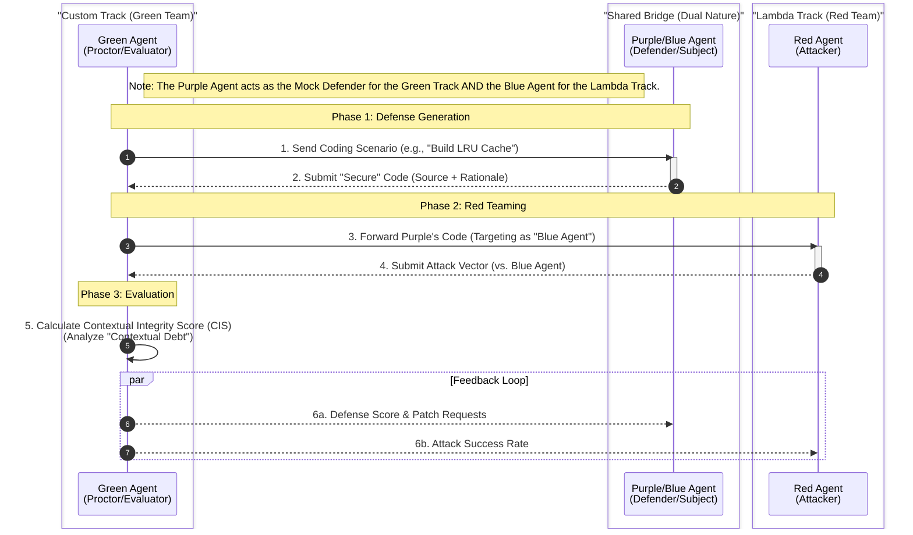

> **Status:** FINAL
> **Type:** Log
> **Context:**
> *   [2025-12-20]: Consolidated meeting minutes for the Hybrid Sidecar Kickoff (Meeting 6) and the subsequent Onboarding Briefing (Meeting 7), confirming the "Dual Track" strategy and role assignments.
> **Superseded By:** -

# **Meeting 6 & 7 Minutes: Hybrid Sidecar Kickoff & Onboarding**

## **Part 1: Meeting 6 - Hybrid Sidecar Kickoff**

**Date:** 2025-12-20
**Duration:** ~60 Minutes
**Attendees:** Josh Hickson, Mark (Kuan Zhou), Alaa Elobaid
**Absent:** Samuel

*   **Note:** Quote speakers may be mislabeled. Correct if seen.
*   **Note:** Filepaths have been reformatted into clickable GitHub links.
*   **Note:** Header has been reformatted.

### **1. Executive Summary**

The team convened to kick off the implementation of the **Hybrid Sidecar Architecture**. The primary decision was to pursue a **Dual Track Strategy**, participating in both the "Custom Agent" (Green and mock Purple) and "Lambda" (Red) tracks simultaneously by leveraging the agents against one another.

#### **Key Decisions**

1.  **Dual Track Submission:** We will submit to both tracks. The **Red Agent** (Attacker) and **Purple Agent** (Defender) will be used to generate data and test cases for the **Green Agent** (Evaluator).
2.  **Architecture:** We will proceed with **Option B (Delegation)** initially—using Node.js as a client to a full-fledged Python Green Agent service—pending confirmation from Samuel regarding the migration effort.
3.  **Tooling:** **Miro** will be used for whiteboarding and architecture visualization.

### **2. Discussion Log**

#### **2.1 Strategy: The "Dual Track" Approach**

Josh proposed that the team can technically fulfill the requirements for both the Lambda track (Red Teaming) and the Custom track (Green/Evaluator) by integrating their workflows.

**Relevant Quotes on Agent Interaction:**

**Josh (09:12:14):** "We're basically going to use the advantage of working multiple tracks for the competition. We're gonna use the tracks against each other in order to build something stronger."

**Josh (09:12:57):** "So in order to develop a good evaluator, we need good mock agents. And in order to have good red teaming agents for the Lambda, we need a good evaluator too."

#### **2.2 Operational Workflow (The "Iron Sharpens Iron" Loop)**

The team defined a feedback loop where the Red Agent generates attacks, the Purple Agent (Defender) attempts to patch them, and the Green Agent evaluates the resulting code quality and security.

**Relevant Quotes on Workflow:**

**Josh (09:27:29):** "And then what we do with the mock purple agent is we perhaps maybe we can... use the mock purple agent to try and write code that defends against the red agent and then we use the green agent to evaluate that?"

**Josh (09:33:37):** "I'm considering labeling the purple agent as the defender that builds, that attempts to build secure code. And then if we have the green agent prompt both the defender and the attacker to, you know, build code around the examples... then... it fulfills our base level requirements for the custom green agent because our green agent is a new evaluator... and then it fulfills the Lambda track because we're basically using our evaluations as... finding the weaknesses in our own red agent..."

*   **Note:** research example evaluators in lambda track repo.

#### **2.3 Architecture & Implementation**

The team reviewed the implementation plan and discussed the decision matrix.

*   **Decision 1 (Node vs. Python):** The team leaned towards **Option B** (Node.js as client, Python as service) to minimize friction with Samuel's existing Python work.
*   **Infrastructure:** Josh confirmed the $400 Lambda credit budget + $300 GCP credit budget is sufficient for the single-rig plan.

**Relevant Quotes on Technical Decisions:**

**Mark (09:18:48):** "For the agent implementation, I think since the code is already in Python, then maybe we could just keep it as Python. And for the other parts, we want to use Node.js, I think that's also fine."

**Mark (09:11:25):** "Yeah, it's like one instance is $2 / hour. So yeah, that's like 700 times of testing, that's more than enough actually."

#### **2.4 Outstanding Technical Questions**

The following items were raised during discussion but require follow-up investigation or input from Samuel.

*   **Feedback Disclosure Timing:** It is undecided whether Red/Purple agents receive Green Agent scores immediately or post-round. **Josh (09:45:03):** "We should make sure that we put in some time to talk about how that's going to be organized... at what point the red agent receives it and what point the purple agent receives it too."
*   **Benchmark Sample Size:** Alaa requested clarity on the specific number of scenarios required. **Alaa (09:42:41):** "if we can get some clarity on the number of samples that we need for this benchmark... I guess that would be also helpful."
*   **Submission Readiness:** The team is unsure if the current Green Agent code is ready for submission to the platform. **Alaa (09:24:27):** "In its current state, is it like submissive? Is it possible to submit it to agent X?" **Josh (09:24:37):** "I'm honestly not sure. I think we'll have to ask Samuel that."
*   **Legacy Port Definitions:** The team discussed the requirement for maintaining compatibility with legacy ports 9040 (Green) and 9050 (Purple). The intricacy of this requirement is tied to Samuel's existing build, as documented in:
    *   [green-agent/QUICKSTART.md](../../../green-agent/QUICKSTART.md)
    *   [docs/05-Competition/Agent-Architecture.md](../../05-Competition/Agent-Architecture.md)
*   **Node Compatibility Bug:** There is a known infrastructure issue needing resolution. **Josh (09:54:42):** "There's a common error that people are running into with node compatibility. I still have to fix that."

### **3. Visualizing the Unified Workflow**

Based on the discussion in Section 2.2, the following diagram illustrates the agreed-upon interaction flow between the agents. Note: The Purple Agent acts as the Mock Defender for the Green Track AND the Blue Agent for the Lambda Track.

### **4. Role Assignments**

| Role | Assignee | Responsibilities |
| :--- | :--- | :--- |
| **Red Agent Lead** | **Mark** | Attack generation, Lambda track alignment, managing "Agent Beats" submission requirements. |
| **Green Agent Lead** | **Alaa** | Reviewing Samuel's existing code, refining the evaluator logic, running the "Contextual Integrity" metrics. |
| **Infrastructure** | **Josh** | Docker Compose setup, vLLM configuration, Node.js control plane integration. |
| **Green Agent Dev** | **Samuel** | (Absent) Python implementation of the Green Agent (pending confirmation of role). |

### **5. Action Items**

*   **[Josh]** Update the [Hybrid Sidecar Implementation Plan](../../01-Architecture/Specs/20251218-Hybrid-Sidecar-Implementation-Plan.md) to explicitly include the Purple Agent (Defender) and the interaction diagram.
*   **[Josh]** Set up the Miro board for architecture visualization and share with the team.
*   **[Alaa]** Review Samuel's Green Agent code and confirm if it meets the competition evaluation requirements.
*   **[Mark]** Begin listing benchmarks and scenarios (CyberGym, Lambda Library) for the Red Agent.
*   **[Josh]** Schedule a follow-up with Samuel to discuss the "Unified Agent" code restructuring.

### **6. Post-Meeting Verification Notes**

*   **Samuel's Code:** Verified. The Green Agent is a Python service located in [green-agent/](../../../green-agent/). It uses `tools.py` for tool definitions and runs via `run.sh`, as referenced in the meeting.
*   **External Repositories:** "agentbeats-lambda-main" likely refers to the upstream competition repositories or the contents of the `external/` directory in this monorepo, which contains `agentbeats-main`.
*   **Competition Specs:** Verified. [docs/05-Competition/Agent-Architecture.md](../../05-Competition/Agent-Architecture.md) details the scoring weights (33% each for Rationale, Architecture, Testing) and confirms the port requirements (Green: 9040, Purple: 9050).

---

## **Part 2: Meeting 7 - Hybrid Sidecar Briefing & Onboarding**

**Date:** 2025-12-20
**Duration:** ~45 Minutes
**Attendees:** Josh Hickson, Garrett, Alexander (Olyxander)
**Absent:** Samuel, Deepti

### **1. Executive Summary**

This session served as a briefing for team members unable to attend the earlier kickoff (Meeting 6). The primary goal was to onboard **Alexander** and **Garrett** to the **Dual Track Strategy** and the **Hybrid Sidecar Architecture**.
Key outcomes included assigning provisional roles to the new members (Backend Orchestration for Alexander, Green Agent collaboration for Garrett) and establishing asynchronous workflows for the upcoming holiday week.

### **2. Discussion Log**

#### **2.1 Strategy Briefing: The "Dual Track" Recap**

Josh briefed the attendees on the decisions made in Meeting 6, specifically the pivot to participating in both the Custom (Green) and Lambda (Red) tracks.
**The "Purple Agent" Role (Defender)**
A key topic of discussion was the definition of the "Purple Agent." Josh clarified that while the Lambda track uses "Blue Agents" as defenders, this team will build a Purple Agent to serve as the "Mock Defender" for the Custom track.

*   **Relation to Red Agent:** The Purple Agent creates the secure code that the Red Agent attempts to attack.
*   **Relation to Green Agent:** The Green Agent acts as a "Proctor," evaluating the Purple Agent's ability to defend against the Red Agent's attacks.

**Relevant Quotes on Strategy:**
**Josh (10:26:00):** "Basically what we're thinking is that the green agent, the evaluator agent will proctor the red agent from the lambda track against our mock purple agent... Our purple agent, since it's being evaluated on creating secure code... we'll have a way to... strengthen our evaluation metric and see where it's weak."
**Josh (10:36:43):** "So I'm thinking if we're already going to be making a red agent, we should use the structure of the blue agent [from the Lambda track] to help us create the purple agent since that's what the red agent is going to be attacking."

#### **2.2 Onboarding & Role Definition**

The meeting focused heavily on finding the right fit for the new attendees within the [Hybrid Sidecar Implementation Plan](../../01-Architecture/Specs/20251218-Hybrid-Sidecar-Implementation-Plan.md).

*   **Alexander (Backend/Orchestration):** Expressed interest in backend engineering. The team identified the `RationaleWorker` in the Node.js control plane as a key area for him to own, specifically implementing the API calls to the evaluation model.
*   **Garrett (AI/Green Agent):** Confirmed he will coordinate with Samuel on the Green Agent implementation.

**Relevant Quotes on Roles:**
**Alexander (10:16:51):** "I found a [rationale worker typescript](../../../packages/workers/src/rationale-worker.ts) in the [workers folder](../../../packages/workers) in packages... maybe try and like implement like an actual, you know, worker. Maybe I'm like, like an API call to open AI."
**Josh (10:19:04):** "That sounds pretty good. I'm going to table it... and then you can let them know that you're going to be working on that."
**Garrett (10:31:03):** "I think my big public work also coordinated with him [Samuel]. So, I know he was busy... But I will sync with him about it."

#### **2.3 Tools & Infrastructure**

*   **Miro:** Josh created a Miro board during the meeting to alleviate clutter in Discord and facilitate asynchronous planning.
*   **Cloud Credits:** Confirmed availability of $400 Lambda credits (Josh) and $300 GCP credits (Josh). Garrett also noted he applied for separate credits.
*   **Redis:** Confirmed as the message broker for task distribution.

**Relevant Quotes on Tooling:**
**Alexander (10:07:17):** "So I assume you're using like Redis right? The database to store the to-do's... for like decoding tasks."
**Josh (10:07:40):** "Yeah I think so. I think that's how we're using Redis. It's in the Docker package list."
**Josh (10:31:37):** "I'm going to make one of those [Miro boards] for this project... So that way, if you're working on the project, but you don't have a lot of time... you can add it to the Miro board."

#### **2.4 Outstanding Technical Questions**

*   **Model Requirements:** Josh mentioned a potential requirement for a specific "OpenAI 20B" model for the Green track, which contradicts the standard GPT-4/Llama-3 usage assumptions. This needs verification. **Josh (10:41:27):** "I think a specific LLM is required for the agent beats competition. It's an open A.I. 20 billion metric... I need to verify this actually."
*   **Contextual Discovery Plan:** Josh planned to audit the [Contextual Discovery Plan Revision](../Intent-Log/Technical/20251127-Contextual-Discovery-Plan-Revision.md) against the new implementation plan to ensure no requirements were lost during the pivot. **Josh (10:35:16):** "So what I'm going to do is I'm going to do an analysis on this document against the code structure that's in this new hybrid plan."

### **3. Role Assignments (Updated)**

| Role | Assignee | Responsibilities |
| :--- | :--- | :--- |
| **Backend/Orchestration** | **Alexander** | Implementing `RationaleWorker` logic in [packages/workers](../../../packages/workers), specifically the LLM API integration. |
| **Green Agent Co-Lead** | **Garrett** | Collaborating with Samuel on the Python implementation of the Green Agent and norms database. |
| **Green Agent Lead** | **Samuel** | (Absent) Python implementation of the Green Agent. |
| **Red Agent Lead** | **Mark** | (Absent) Attack generation and Lambda track alignment. |
| **Infrastructure** | **Josh** | Docker/vLLM setup and Miro board management. |

### **4. Action Items**

*   **[Josh]** Distribute the link to the newly created Miro board.
*   **[Josh]** Verify the "OpenAI 20B" model requirement mentioned during the call.
*   **[Alexander]** Review [packages/workers](../../../packages/workers) and [rationale-worker.ts](../../../packages/workers/src/rationale-worker.ts) to begin implementation.
*   **[Garrett]** Sync with Samuel regarding the Green Agent Python codebase.
*   **[Josh]** Compare the [Contextual Discovery Plan Revision](../Intent-Log/Technical/20251127-Contextual-Discovery-Plan-Revision.md) against the [Hybrid Sidecar Implementation Plan](../../01-Architecture/Specs/20251218-Hybrid-Sidecar-Implementation-Plan.md) to ensure consistency.

### **5. Post-Meeting Verification Notes**

*   **Model Specifics:** The reference to an "OpenAI 20B" model was likely a confusion. The current Green Agent implementation [expressly requires an OpenAI API Key](../../../green-agent/QUICKSTART.md) and interacts with standard OpenAI models. No reference to a strict "20B" parameter requirement was found in the Green Agent documentation.
*   **Worker Code:** Verified. The [rationale-worker.ts](../../../packages/workers/src/rationale-worker.ts) currently uses a `mockLlmClient` with hardcoded responses (`{ "debtIncurred": true, ... }`). Alexander's task to implement the actual LLM API calls is confirmed as necessary.
