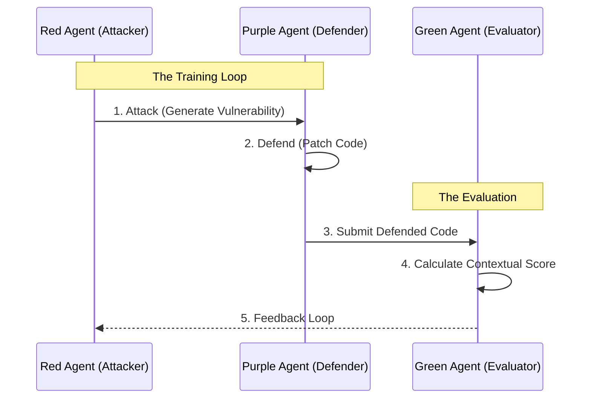

> **Status:** DRAFT
> **Type:** Agenda
> **Context:**
> *   [2025-12-20]: Agenda for Meeting #7, focusing on onboarding a new teammate and reviewing the "Option B" architecture decision with Garrett.
> **Superseded By:** -

# **Meeting Agenda: Architecture Review & Onboarding (Meeting #7)**

**Date:** 2025-12-20 (3 Hours Post-Kickoff)
**Attendees:** Josh (Lead), Garrett (Builder), [New Teammate]
**Absent:** Samuel (Green Agent Dev)
**Reference:** [Meeting #6 Minutes](./20251220-LogoMesh-Meeting-6_7-Hybrid-Sidecar-Kickoff.md)

## **1. Executive Summary**

This session serves two primary purposes:
1.  **Onboarding:** welcoming our newest teammate and providing a high-level briefing on the "Dual Track" strategy.
2.  **Technical Review:** verifying the "Option B" architecture decision (Node.js <-> Python Service) with Garrett to ensure it aligns with our build capabilities.

---

## **2. Onboarding: The "Green Agent" Mission**

*   **The Goal:** We are building a "Green Agent" (Evaluator) for the AgentX AgentBeats competition.
*   **The Problem:** AI generates code without explaining "why" (Contextual Debt).
*   **Our Solution:** An agent that judges other agents' code based on "Contextual Integrity" (Rationale, Architecture, Testing).
*   **The "Dual Track" Strategy:**
    *   We are submitting to **both** tracks:
        *   **Custom Track:** Our Green Agent (The Judge).
        *   **Lambda Track:** Our Red Agent (The Attacker).
    *   **Why?** "Iron Sharpens Iron." We use our Red Agent to attack our Purple Agent (Defender), generating the data needed to train our Green Agent.

---

## **3. Architecture Review (Focus: Garrett)**

**Context:** In Meeting #6, the team leaned towards **Option B** for the "Hybrid Sidecar" implementation to respect Samuel's existing Python work. We need Garrett's "Builder's Eye" on this decision.

### **The Decision: Option B (Delegation)**
*   **Concept:** Node.js acts as the "Control Plane" (Client) and talks to a full-fledged Python Service (Green Agent) via HTTP/RPC.
*   **Alternative (Rejected for now):** Option A (Direct Inference), where Node.js handles all logic and just treats Python as a dumb LLM server.

### **Discussion Questions for Garrett:**
1.  **Complexity vs. Speed:** Does keeping the Python service separate save us time (by not rewriting logic) or cost us time (by managing two services + networking)?
2.  **The "Bridge":** How should the Node.js Orchestrator talk to the Python Service? (REST API? Redis Queue? gRPC?)
3.  **Samuel's Code:** Can we treat Samuel's current Python agent as a "Black Box" API effectively?

---

## **4. Operational Workflow Review**

Reviewing the "Iron Sharpens Iron" loop for the new teammate:

---

## **5. Action Items & Next Steps**

*   **[Garrett]:** Final Verdict on "Option B" Architecture.
*   **[New Teammate]:** Access to Repository & "Quickstart" Guide.
*   **[Josh]:** Update the [Hybrid Sidecar Implementation Plan](../../01-Architecture/Specs/20251218-Hybrid-Sidecar-Implementation-Plan.md) with Garrett's feedback.
