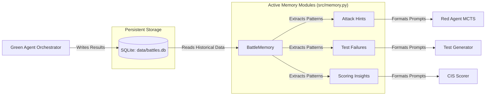

# LogoMesh Architecture Overview: Phase 1 Onboarding

**Target Audience:** Senior Security Engineering (Bakul)
**Context:** Generalizing the adversarial pipeline for the LogoMesh Arena.
**Basis:** This document is derived *strictly* from the active programmatic logic in the source code and the empirically verified `README.md`. All other legacy documentation should be considered unreliable.

---

## 1. The Star-Topology: Green, Purple, and Red Agents

LogoMesh operates on a centralized "star" topology orchestrated by the Green Agent. 

```mermaid
flowchart TD
    subgraph "Green Agent (Orchestrator Process)"
        GA[Green Agent FastAPI Server\nsrc/green_logic/server.py]
        
        subgraph "Embedded Security Scanner"
            RA[Red Agent V3 (MCTSPlanner)\nsrc/red_logic/orchestrator.py]
        end
        
        SA[Semantic Auditor\nStatic AST Analysis]
        TG[Test Generator\nAdversarial Fuzzing]
        CIS[CIS Scorer\nLLM + Vector Analysis]
        SB[Docker Sandbox\nsrc/green_logic/sandbox.py]
    end

    subgraph "External Target"
        PA[Purple Agent\nCode Generator via HTTP/JSON-RPC]
    end

    GA -- "1. Sends Task (JSON-RPC)" --> PA
    PA -- "2. Returns Source, Tests, Rationale" --> GA
    GA -- "3. Passes Source Code (In-Process)" --> RA
    GA -- "4. Executes Tests" --> SB
    GA -- "5. Analyzes Constraints" --> SA
    GA -- "6. Aggregates Signals" --> CIS
```

### The Orchestrator (Green Agent)
Located in `src/green_logic/server.py`, the Green Agent exposes a FastAPI endpoint (`/actions/send_coding_task`) that drives the evaluation loop. It communicates with the target Purple Agent over HTTP using a partial JSON-RPC `message/send` protocol. It coordinates the execution of the Sandbox, the Semantic Auditor, the Test Generator, and the embedded Red Agent.

### The Target (Purple Agent)
The Purple Agent is an external service (e.g., an LLM wrapper) that receives a coding task and returns a JSON payload containing `sourceCode`, `testCode`, and `rationale`. The Green Agent expects this specific format to proceed with evaluation.

### The Attacker (Red Agent / MCTSPlanner)
Crucially, the Red Agent is **not a separate service**. It is instantiated directly within the Green Agent's Python process (`_init_red_agent`). 
- **Core Engine:** Located in `src/red_logic/orchestrator.py`, it uses a Monte Carlo Tree Search (MCTS) algorithm (`MCTSPlanner`) to explore attack paths.
- **Node Expansion:** Instead of relying on AST parsing, the MCTS engine mutates states using an LLM, dialogue context (`AgentMemory`), and regex/string manipulation.
- **Security Boundary Gap:** Because the Red Agent runs in-process and handles untrusted code strings from the Purple Agent, there is an explicit 'Uroboros' risk. The Red Agent has full access to standard library modules (`os`, `subprocess`, `httpx`).

---

## 2. State Management: AgentMemory & SQLite (battles.db)

The system is not stateless; it actively learns from past evaluations to harden future tests and attacks.



### Write Path (Telemetry)
After an evaluation concludes, `src/green_logic/agent.py` writes the final `result` (including the raw JSON payload) to the `battles` table in `data/battles.db`. Additionally, `src/memory.py` parses the outcome to extract specific lessons (vulnerabilities found, test errors thrown, refinement improvements) and stores them in auxiliary tables (`memory_lessons`, `memory_attack_hints`, `memory_task_stats`).

### Read Path (Active Learning)
Before a new battle begins, the orchestrator queries `BattleMemory.get_task_memory()`. This is not passive telemetry; it is an active feedback loop. 
- The **Red Agent** receives formatting strings detailing past successful attacks (`format_for_red_agent`).
- The **Test Generator** receives historically problematic failure patterns (`format_for_test_generator`).
- The **CIS Scorer** receives baseline context from previous runs (`format_for_scoring`).

---

## 3. The Strategy Evolver (UCB1 Bandit)

LogoMesh utilizes a macro-level strategy selection system to dynamically adjust evaluation rigor across different tasks.

Located in `src/strategy_evolver.py`, the `StrategyEvolver` treats different evaluation configurations (e.g., `aggressive_red`, `correctness_focus`, `fast_lenient`) as "arms" in a multi-armed bandit problem.

### The Algorithm
The system selects a strategy using the **Upper Confidence Bound (UCB1)** mathematical formula:
`ucb_score = avg_reward + sqrt(2 * ln(total_attempts + 1) / n)`

- **Exploitation (`avg_reward`):** The average CIS score achieved when using this strategy on a specific task in the past.
- **Exploration (`sqrt(...)`):** A bonus that increases for strategies that haven't been tried frequently, ensuring the system doesn't get stuck in a local optimum.

### Mechanism of Action
When a strategy is selected, it overrides default parameters in the Orchestrator. For example, selecting `aggressive_red` dynamically increases the Red Agent's `mcts_num_branches` and `mcts_exploration_weight`, and injects specific LLM prompt instructions demanding a `security_focused` evaluation from the CIS Scorer.

---

## 4. Empirical Sub-System Specifications

To ensure exact parity between this blueprint and the raw codebase state, the following are the exact mathematical and configuration parameters currently active in the system.

### 4.1. Contextual Integrity Score (CIS) Calculation
- **Formula:** `CIS = (0.25 * R) + (0.25 * A) + (0.25 * T) + (0.25 * L)`
- **Red Agent Penalty (Post-Aggregation Multiplier):** 
  - Critical = `0.60x`
  - High = `0.75x`
  - Medium = `0.85x`
- **Intent Mismatch Penalty:** Multiplies the total score down to a floor of `0.30x` (a maximum 70% reduction) if intent-code similarity approaches 0.
- **Semantic Alignment Model:** The Rationale Integrity (R) score computes cosine similarity using the lightweight `all-MiniLM-L6-v2` model via `SentenceTransformer`, managed via a Thread-Safe Singleton pattern to prevent repeated loading.
- **LLM Scorer Limits:** The system enforces LLM inference at `temperature=0` with `seed=42`.

### 4.2. Sandbox & Testing Integrity
- **Testing Integrity (T) Formula:** `0.20 + (0.65 * test_pass_rate) + test_specificity_bonus`
- **Docker Sandbox Hard Limits:**
  - **RAM:** `128m`
  - **CPU:** `50000` quota (50%)
  - **PIDs:** `50`
  - **Networking:** Conditionally disabled (only if `pytest` is already pre-installed on the image).

### 4.3. Red Agent MCTS Hyperparameters
- **Max Steps:** `10`
- **Max Time (Seconds):** `60.0`
- **MCTS Branches:** Defaults to `2` (not 3).
- **Exploration Weight:** `1.414` (Hardcoded UCB1 constant).

### 4.4. DBOM Artifact Structure
The Decision Bill of Materials is generated programmatically as a JSON dictionary containing exactly:
- `h_delta`: SHA-256 hash of the payload.
- `v_intent`: The 384-dimensional semantic intent vector.
- `score_cis`: The final numerical score.
- `sigma_judge`: A simulated cryptographic signature (`SIG_GREEN_{battle_id}_{hash[:8]}`).

---

## 5. Phase 1 Limitations & Brutal Transparency

As we generalize the adversarial pipeline, it is critical to acknowledge the empirical reality of the current codebase. The following are known architectural gaps and mathematical bugs slated for remediation.

### 5.1. The Missing CIS Logic Score Floor
**Issue:** The Contextual Integrity Score (CIS) is calculated as `(0.25*R + 0.25*A + 0.25*T + 0.25*L) * Red_Penalty * Intent_Multiplier`. In `src/green_logic/scoring.py`, the LLM is instructed to adjust the ground-truth scores by a maximum of ±0.10. 
**Bug:** While the code programmatically enforces a hard floor for R, A, and T (`max(score, ground_truth - 0.10)`), **this constraint is entirely missing for the Logic (L) score.** The LLM can mathematically hallucinate or maliciously adjust the Logic score far below the intended limits.

### 5.2. DBOM Cryptographic Hashing Discrepancy
**Issue:** The system generates a Decision Bill of Materials (DBOM) to provide an audit trail (`src/green_logic/agent.py`). It relies on computing a SHA-256 hash (`h_delta`) of the `raw_result` JSON payload.
**Bug:** The DBOM generator hashes the **unsorted** JSON string (`json.dumps(result)`). However, the database storage routine saves the **sorted** JSON string (`json.dumps(result, sort_keys=True)`). Because the serialization order differs, cryptographic verification of the database record against the DBOM hash will consistently fail.

### 5.3. Merkle Chaining is Not Implemented
**Issue:** Despite conceptual plans, there is absolutely no active programmatic implementation of cryptographic Merkle Chaining between sequential records in the SQLite database. DBOM hashes are isolated, standalone artifacts per evaluation run.

### 5.4. In-Process Red Agent Risk (Uroboros)
**Issue:** As noted in the Star Topology section, the Red Agent is embedded directly within the Green Agent's process. 
**Bug:** There is no container, process, or network namespace isolation for the MCTS engine while it handles untrusted code strings from the Purple Agent. This is a severe architectural security gap that must be addressed to safely scale adversarial evaluations.