# LogoMesh Framework Architecture

## Current System Overview

```mermaid
graph TB
    subgraph "Frontend Layer (React)"
        UI[User Interface]
        Canvas[Canvas Component<br/>Cytoscape.js]
        Sidebar[Sidebar Component]
        Modal[Add Thought Modal]
        DetailPanel[Thought Detail Panel]
        DevPanel[Dev Assistant Panel]
        DbConfig[Database Config]
        
        UI --> Canvas
        UI --> Sidebar
        UI --> Modal
        UI --> DetailPanel
        UI --> DevPanel
        UI --> DbConfig
    end

    subgraph "Frontend Services"
        AuthSvc[Auth Service]
        GraphSvc[Graph Service]
        ApiSvc[API Service]
        MockApi[Mock API Service]
        
        Canvas --> GraphSvc
        UI --> AuthSvc
        UI --> ApiSvc
        UI --> MockApi
    end

    subgraph "Backend API Server (Express)"
        Server[Express Server<br/>Port 3001]
        
        subgraph "API Routes"
            ThoughtRoutes[Thought Routes<br/>/api/v1/thoughts]
            UserRoutes[User Routes<br/>/api/v1/user]
            LLMRoutes[LLM Routes<br/>/api/v1/llm]
            AdminRoutes[Admin Routes<br/>/api/v1/admin]
            TaskRoutes[Task Routes<br/>/api/v1/tasks]
            OrchestratorRoutes[Orchestrator Routes<br/>/api/v1/orchestrator]
            PortabilityRoutes[Portability Routes<br/>/api/v1/portability]
            PluginRoutes[Plugin Routes<br/>/api/v1/plugins]
        end
        
        Server --> ThoughtRoutes
        Server --> UserRoutes
        Server --> LLMRoutes
        Server --> AdminRoutes
        Server --> TaskRoutes
        Server --> OrchestratorRoutes
        Server --> PortabilityRoutes
        Server --> PluginRoutes
    end

    subgraph "Core Services Layer"
        IdeaManager[Idea Manager<br/>Core Business Logic]
        EventBus[Event Bus<br/>Pub/Sub System]
        TaskEngine[Task Engine<br/>Background Processing]
        PluginHost[Plugin Host<br/>Plugin Runtime]
        PortabilityService[Portability Service<br/>Import/Export]
        MeshGraphEngine[Mesh Graph Engine<br/>Graph Operations]
        
        ThoughtRoutes --> IdeaManager
        TaskRoutes --> TaskEngine
        PluginRoutes --> PluginHost
        PortabilityRoutes --> PortabilityService
        OrchestratorRoutes --> MeshGraphEngine
    end

    subgraph "Storage Layer"
        StorageAdapter[Storage Adapter Interface]
        SQLiteAdapter[SQLite Storage Adapter<br/>Core Implementation]
        PostgresAdapter[Postgres Adapter<br/>Alternative DB]
        
        IdeaManager --> StorageAdapter
        StorageAdapter --> SQLiteAdapter
        StorageAdapter --> PostgresAdapter
    end

    subgraph "Database"
        SQLiteDB[(SQLite Database<br/>thoughts.db)]
        PostgresDB[(PostgreSQL<br/>Alternative)]
        
        SQLiteAdapter --> SQLiteDB
        PostgresAdapter --> PostgresDB
    end

    subgraph "LLM Layer"
        LLMOrchestrator[LLM Orchestrator<br/>Multi-Model Conversations]
        LLMRegistry[LLM Registry<br/>Model Management]
        LLMTaskRunner[LLM Task Runner<br/>Execution Engine]
        OllamaExecutor[Ollama Executor<br/>Local LLM Interface]
        MermaidAuditor[Mermaid Auditor<br/>Visual Documentation]
        
        LLMRoutes --> LLMOrchestrator
        LLMOrchestrator --> LLMRegistry
        LLMOrchestrator --> LLMTaskRunner
        LLMTaskRunner --> OllamaExecutor
        LLMOrchestrator --> MermaidAuditor
    end

    subgraph "Context & Cognitive Layer (Phase 2 Ready)"
        CCE[Cognitive Context Engine<br/>Semantic Analysis]
        ContextGen[Context Generation<br/>LLM Prompt Assembly]
        
        LLMOrchestrator -.-> CCE
        CCE -.-> ContextGen
    end

    subgraph "Plugin System"
        PluginAPI[Plugin API Interface]
        PluginManifest[Plugin Manifest Schema]
        DevAssistant[Dev Assistant Plugin<br/>Built-in Plugin]
        
        PluginHost --> PluginAPI
        PluginAPI --> PluginManifest
        PluginHost --> DevAssistant
    end

    subgraph "Automation Layer (Node-RED)"
        NodeRED[Node-RED Server<br/>Workflow Automation]
        AutoTagging[Auto-Tagging Flow]
        EmbeddingWorkflow[Embedding Workflow]
        
        NodeRED --> AutoTagging
        NodeRED --> EmbeddingWorkflow
    end

    subgraph "Utilities & Infrastructure"
        Logger[Logger System<br/>Centralized Logging]
        IDUtils[ID Generation<br/>Unique Identifiers]
        ErrorLogger[Error Logger<br/>Frontend Errors]
        VoiceInput[Voice Input Manager<br/>Speech Recognition]
        
        IdeaManager --> Logger
        IdeaManager --> IDUtils
        UI --> ErrorLogger
        UI --> VoiceInput
    end

    subgraph "Data Contracts & Interfaces"
        Entities[Entity Definitions<br/>Thought, Segment, Tag]
        StorageContract[Storage Adapter Contract]
        LLMContract[LLM Executor Contract]
        PluginContract[Plugin API Contract]
        EmbeddingContract[Embedding Interface Contract]
        
        SQLiteAdapter -.-> StorageContract
        StorageContract -.-> Entities
        OllamaExecutor -.-> LLMContract
        PluginAPI -.-> PluginContract
    end

    subgraph "Testing & Development"
        TestSuite[Test Suite<br/>Vitest + Jest]
        MockServices[Mock Services<br/>Development Stubs]
        TestRunner[Test Runner Scripts<br/>Automated Testing]
        
        UI -.-> TestSuite
        MockServices -.-> TestSuite
        TestRunner -.-> TestSuite
    end

    %% External Connections
    ApiSvc --> Server
    NodeRED -.-> Server
    DevAssistant -.-> Server

    %% Event Flow
    EventBus -.-> TaskEngine
    EventBus -.-> LLMOrchestrator
    EventBus -.-> PluginHost

    %% Styling
    classDef frontend fill:#e1f5fe
    classDef backend fill:#f3e5f5
    classDef core fill:#e8f5e8
    classDef storage fill:#fff3e0
    classDef llm fill:#fce4ec
    classDef plugin fill:#f1f8e9
    classDef automation fill:#e0f2f1
    classDef phase2 fill:#fff9c4,stroke:#ff9800,stroke-dasharray: 5 5

    class UI,Canvas,Sidebar,Modal,DetailPanel,DevPanel,DbConfig frontend
    class Server,ThoughtRoutes,UserRoutes,LLMRoutes,AdminRoutes,TaskRoutes,OrchestratorRoutes,PortabilityRoutes,PluginRoutes backend
    class IdeaManager,EventBus,TaskEngine,PluginHost,PortabilityService,MeshGraphEngine core
    class StorageAdapter,SQLiteAdapter,PostgresAdapter,SQLiteDB,PostgresDB storage
    class LLMOrchestrator,LLMRegistry,LLMTaskRunner,OllamaExecutor,MermaidAuditor llm
    class PluginAPI,PluginManifest,DevAssistant plugin
    class NodeRED,AutoTagging,EmbeddingWorkflow automation
    class CCE,ContextGen phase2
```

## Architecture Analysis

### Current State (Phase 1 Complete)
- ✅ **Frontend**: React-based UI with Cytoscape.js visualization
- ✅ **Backend**: Express.js API server with comprehensive routing
- ✅ **Storage**: SQLite implementation with normalized schema
- ✅ **LLM Infrastructure**: Multi-model orchestration framework
- ✅ **Plugin System**: Runtime interface with manifest-based loading
- ✅ **Automation**: Node-RED integration for workflow automation

### Phase 2 Ready Components
- 🟡 **Cognitive Context Engine**: Interfaces defined, implementation planned
- 🟡 **Embedding System**: Contracts established, adapters ready
- 🟡 **Advanced Graph Operations**: Foundation in place for mesh networking

### Key Design Patterns
- **Adapter Pattern**: Storage and LLM execution abstraction
- **Event-Driven Architecture**: EventBus for loose coupling
- **Plugin Architecture**: Extensible system for custom functionality
- **Contract-First Design**: Interface definitions drive implementation

### Data Flow Summary
1. **User Interaction** → Frontend Components
2. **API Calls** → Backend Routes → Core Services
3. **Business Logic** → IdeaManager → Storage Adapter
4. **Persistence** → SQLite Database
5. **LLM Operations** → Orchestrator → Execution Engines
6. **Automation** → Node-RED → API Integration
