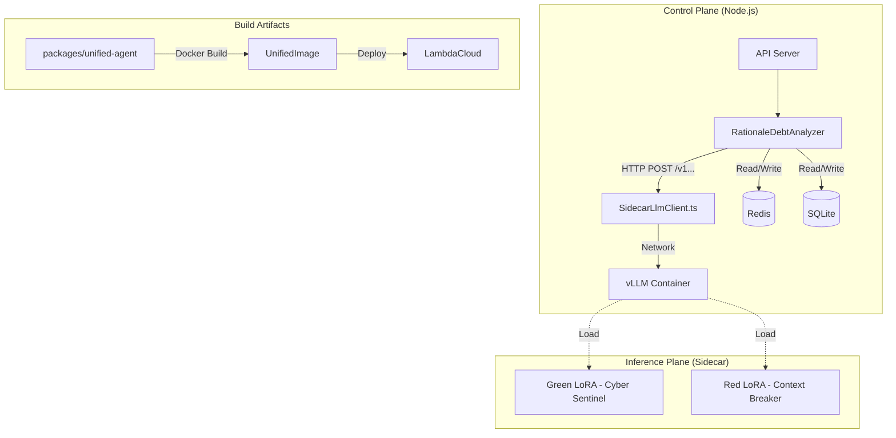

> **Context:**
> *   [2025-12-18]: Implementation plan for the Hybrid Sidecar Architecture, explicitly aligned with the "Unified Agentic Defense" strategy and legacy assets.
> **Superseded By:** -

# Hybrid Sidecar Implementation Plan

## 1. Executive Summary

This document details the technical implementation of the **Hybrid "Sidecar" Architecture** mandated by the [Unified AI Competition Development Plan](../../00-Strategy/Competition/20251216-Unified%20AI%20Competition%20Development%20Plan.md).

To address the resource constraints identified in **Strategy Section 1.3 (The Single-Rig Hypothesis)**, we will bridge our existing **Node.js/TypeScript Monorepo (Control Plane)** with a new **Python/vLLM Inference Engine (Inference Plane)**. This allows us to run both Team A (Green) and Team B (Red) agents on a single GPU node using vLLM's Multi-LoRA capabilities, while retaining our robust Node.js infrastructure for orchestration and scoring.

## 2. Strategic Alignment

This plan directly operationalizes the following strategic pillars:

| Strategic Pillar | Source | Technical Implementation |
| :--- | :--- | :--- |
| **Single-Rig Hypothesis** | Strategy §1.3 | **vLLM Sidecar:** A shared container in `docker-compose.yml` serving `Meta-Llama-3-70B-Instruct-AWQ` with multiple LoRA adapters. |
| **Polymorphic Repo** | Strategy §7.0 | **`packages/unified-agent`:** A new monorepo package that builds the single "Trojan Horse" Docker image for both tracks. |
| **Cop vs. Robber** | Strategy §1.1 | **Shared Logic:** Node.js `Control Plane` orchestrates the battle, invoking `Red` attacks and `Green` audits via the sidecar. |
| **A2A Protocol** | Strategy §3.3 | **Hybrid Client:** Node.js speaks A2A to external agents, but uses optimized HTTP/RPC to talk to its own Sidecar. |

---

## 3. Legacy Context & Integration

This plan incorporates logic and constraints from the following legacy documents. The Node.js implementation must strictly adhere to these specifications.

### Reference Material
1.  **[green-agent/QUICKSTART.md](../../../../Dual-Track-Arena/green-agent/QUICKSTART.md)**: Defines the baseline "Team B" setup and the legacy ports (Green: 9040, Purple: 9050).
2.  **[docs/05-Competition/Agent-Architecture.md](../../../05-Competition/Agent-Architecture.md)**: Defines the **Contextual Debt Framework** weights and the **Tool Execution Flow**.

### Key Integration Constraints
*   **Scoring Weights:** The `RationaleDebtAnalyzer` must implement the exact weighting from `Agent-Architecture.md`:
    *   **Rationale Debt:** 33%
    *   **Architectural Debt:** 33%
    *   **Testing Debt:** 33%
*   **Tool Specification:** The Node.js Control Plane must implement the equivalents of the Python tools defined in `Agent-Architecture.md §5`:
    *   `send_coding_task(purple_agent_url, battle_id)`
    *   `report_result(battle_id, score, breakdown)`

---

## 4. Architectural Decision Matrix

To ensure the "Unified Agentic Defense" strategy is correctly interpreted, the following architectural decisions require team consensus. This plan assumes the **Recommended Path**.

### Decision 1: Node.js vs. Python Responsibility (The Bridge)

*   **Option A: Direct Inference (Recommended)**
    *   **Concept:** Node.js (`packages/workers`) acts as the "Brain" (Control Plane). It holds the "Green Agent" business logic (Norms Database, Scoring Engine) and calls the vLLM Sidecar directly for inference and parsing.
    *   **Alignment:** Supports **Strategy §3.2 (The Software Stack)** by treating vLLM as a pure inference server (`POST /v1/chat/completions`).
    *   **Pros:** Tight integration; reduced latency; centralized orchestration.
    *   **Cons:** Requires migrating some logic from `green-agent/` to Node.js.
*   **Option B: Delegation (Service-to-Service)**
    *   **Concept:** Node.js acts as a client to a full-fledged Python `green-agent` service.
    *   **Pros:** Preserves existing Python code structure.
    *   **Cons:** Adds network hops; fragments the "Brain" between Node and Python.

### Decision 2: Repository Structure (Polymorphism)

*   **Option A: Monorepo Integration (Recommended)**
    *   **Concept:** Create `packages/unified-agent/` to house the shared Python codebase defined in **Strategy §7.1**.
    *   **Alignment:** "To submit to both tracks without maintaining two codebases... /unified-agent-repo" (§7.1).
    *   **Pros:** Single source of truth; unified build process.
*   **Option B: External Submodule**
    *   **Concept:** Keep the Python code in `external/` and pull it in at build time.
    *   **Cons:** Higher risk of deployment drift.

---

## 5. Recommended Architecture (Option A)

### System Diagram



### Component Roles

1.  **Node.js Control Plane (`packages/workers`)**:
    *   **`SidecarLlmClient`**: The specific implementation of `LlmClient` that connects to the vLLM Sidecar.
    *   **`RationaleDebtAnalyzer`**: Implements the "Agentic Auditing" logic (Strategy §2.3), sending probes and analyzing responses.
2.  **vLLM Sidecar (`docker-compose.yml`)**:
    *   Hosts the **Base Model** (Llama-3-70B-AWQ).
    *   Serves the **Adapters** defined in Strategy §3.2 (Red LoRA & Green LoRA).

---

## 6. Detailed Implementation Steps

### Step 1: Create `packages/unified-agent` (The Polymorphic Repo)

We will implement the directory structure mandated by **Strategy §7.1**.

**Target Directory:** `packages/unified-agent/`
**Files to Create:**
*   `packages/unified-agent/pyproject.toml`: Dependency definitions (vLLM, OpenAI, AgentBeats).
*   `packages/unified-agent/main.py`: The "Polymorphic Entrypoint" (Strategy §7.2) that switches roles based on `--role`.
*   `packages/unified-agent/src/common/`: Shared A2A SDK and Logging.
*   `packages/unified-agent/src/red_logic/`: Team B's Attack Generation Code.
*   `packages/unified-agent/src/green_logic/`: Team A's CI-Parser Code.
*   `packages/unified-agent/green_agent_card.toml`: Configuration for the Custom Track.
*   `packages/unified-agent/red_agent_card.toml`: Configuration for the Lambda Track.
*   `packages/unified-agent/Dockerfile`: The shared Dockerfile for the "Trojan Horse" submission.

### Step 2: Infrastructure Updates (The Arena)

We will update `docker-compose.yml` to include the `vllm-sidecar` service, enabling the **Single-Rig Hypothesis** (Strategy §1.3).

**File:** `docker-compose.yml`
**Configuration:**
```yaml
  vllm-sidecar:
    # In dev, we might use a mock or a CPU-offloaded vLLM if no GPU is available
    image: vllm/vllm-openai:latest
    ports:
      - "8000:8000"
    volumes:
      - ~/.cache/huggingface:/root/.cache/huggingface
      - ./packages/unified-agent/adapters:/app/adapters # Mount LoRA adapters
    environment:
      - HUGGING_FACE_HUB_TOKEN=${HUGGING_FACE_HUB_TOKEN}
    deploy:
      resources:
        reservations:
          devices:
            - driver: nvidia
              count: 1
              capabilities: [gpu]
    # Strategy §3.2: Multi-LoRA Routing
    command: >
      --model meta-llama/Meta-Llama-3-70B-Instruct
      --quantization awq
      --enable-lora
      --lora-modules green_agent_adapter=/app/adapters/green red_agent_adapter=/app/adapters/red
```

### Step 3: Implement The Bridge (`SidecarLlmClient`)

We will create the client that allows the Node.js Control Plane to "drive" the Sidecar.

**File:** `packages/workers/src/clients/SidecarLlmClient.ts`
**Key Responsibilities:**
1.  **Endpoint Configuration:** Connects to `process.env.LLM_SIDECAR_URL` (default `http://vllm-sidecar:8000/v1`).
2.  **Model Routing:**
    *   When acting as **Green Agent**: Sets `model="green_agent_adapter"`.
    *   When acting as **Red Agent**: Sets `model="red_agent_adapter"`.
3.  **Interface:** Implements the `LlmClient` interface required by `RationaleDebtAnalyzer`.

**Code Snippet (Preview):**
```typescript
import OpenAI from 'openai';
import { LlmClient } from '../analyzers';

export class SidecarLlmClient implements LlmClient {
  private openai: OpenAI;
  private modelName: string;

  constructor(baseUrl: string, modelName: string) {
    this.openai = new OpenAI({
      baseURL: baseUrl,
      apiKey: 'EMPTY', // vLLM doesn't require a key locally
    });
    this.modelName = modelName;
  }

  async prompt(systemMessage: string, userMessage: string): Promise<string> {
    const response = await this.openai.chat.completions.create({
      model: this.modelName, // Points to the specific LoRA adapter
      messages: [
        { role: 'system', content: systemMessage },
        { role: 'user', content: userMessage },
      ],
    });
    return response.choices[0]?.message?.content || '';
  }
}
```

### Step 4: Logic Migration (Green Agent)

To support **Strategy §5.1 (Cyber-Sentinel Architecture)**, we must ensure the logic is correctly placed.

1.  **Module 1 (CI-Parser):** Logic resides in the **LoRA Adapter** (trained via `packages/unified-agent/src/green_logic`). Node.js invokes this by calling `SidecarLlmClient`.
2.  **Module 2 (Norms Database):** This static logic will be implemented in Node.js (e.g., `packages/workers/src/rules/norms.ts`) to allow for fast, deterministic checking.
3.  **Module 3 (Scoring Engine):** The `RationaleDebtAnalyzer` in `packages/workers` must implement the **33% Weighted Scoring Logic** defined in [`docs/05-Competition/Agent-Architecture.md §4`](../../../05-Competition/Agent-Architecture.md).
4.  **Tool Implementation:** The Node.js orchestrator must implement the tools defined in [`docs/05-Competition/Agent-Architecture.md §5`](../../../05-Competition/Agent-Architecture.md):
    *   `send_coding_task`: Implemented via A2A HTTP client to the Red Agent.
    *   `report_result`: Logs the final score to the SQLite database.
    *   **vLLM Compatibility:** The Green Agent must be configured with `OPENAI_BASE_URL=http://vllm-sidecar:8000/v1` and `MODEL_NAME=meta-llama/Meta-Llama-3-70B-Instruct` to route traffic to the local sidecar instead of the OpenAI API.

---

## 7. Execution Roadmap

This plan aligns with the **Unified Sprint Plan (Strategy §6)**.

*   **Week 1 (Infrastructure):**
    *   Set up `packages/unified-agent`.
    *   Configure `vllm-sidecar` in Docker.
    *   Implement `SidecarLlmClient`.
*   **Week 2 (Data Feedback):**
    *   Train "Green LoRA" using Python tools in `unified-agent`.
    *   Integrate `RationaleDebtAnalyzer` to use the trained LoRA via the Sidecar.
*   **Week 3 (Refinement):**
    *   Finalize `main.py` for external submission.
    *   Run full "Battle" simulations using the Hybrid Architecture.
