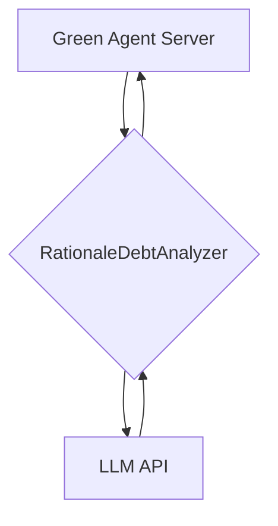
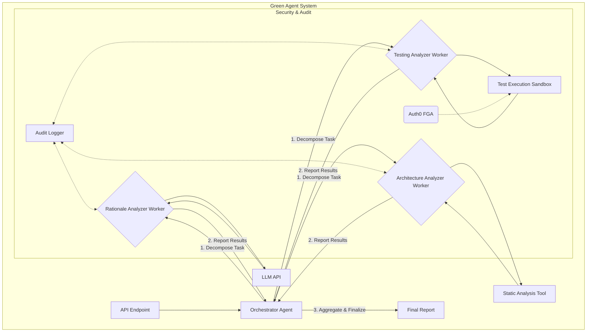

> **Context:**
> * [2025-12-17]: Structurally critical historical reference. Superseded by Contextual Discovery Plan, but retained for referential integrity.

# Project Plan: The Contextual Debt Evaluator - AgentBeats Green Phase

Welcome, team! This document is our strategic guide to winning the AgentBeats Green Phase. It outlines our vision, our plan to address critical gaps in our project, our new architecture, our roles, and our week-by-week timeline to the submission deadline. Let's build something amazing together.

## 1. Project Vision & Competitive Edge

Our project is a **Green Agent**—a sophisticated evaluator designed to solve a critical problem in AI-generated code: the lack of discernible human intent, or **"Contextual Debt."** While other benchmarks focus only on whether code *works*, our agent asks a more important question: is the code *good*? Is it well-architected, clearly-reasoned, and thoroughly tested?

Our competitive edge lies in our novel **"Agent-as-a-Judge"** philosophy. We are not just building a static tool; we are building an intelligent system that analyzes the *process and quality* of an AI agent's work. This innovative approach aligns perfectly with the competition's goal of creating "shared public goods" that push the entire field of agentic AI forward. We have a strong foundation, and with a focused effort, we can turn this powerful concept into a winning submission.

## 2. Our Mission: Closing the Gaps

The recent Gap Analysis Report gave us a clear, actionable roadmap. Our mission is to systematically address every "Area for Improvement" identified in that report. Here is our plan:

*   **Problem: Critical Gap in Sponsor Alignment (Auth0)**
    *   **Our Plan:** We will pivot from our homegrown JWT solution to a deep, meaningful integration of **Auth0 for AI Agents**. This is not just about checking a box; it's about making security a core, indispensable feature of our benchmark.
    *   **Goal:** The agent being tested (the "Purple Agent") will be required to interact with resources and tools that are secured by Auth0's Fine-Grained Authorization (FGA). Our Green Agent will evaluate how well the Purple Agent navigates this complex, realistic security model. This transforms our project into a powerful case study for the competition's lead sponsor.

*   **Problem: Lack of a High-Stakes Problem Domain**
    *   **Our Plan:** We will reframe our project's narrative. "Contextual Debt" is a brilliant concept, but it's too abstract. We will apply it to a specific, high-stakes domain that makes our project's value immediately obvious.
    *   **Goal:** We will choose a compelling domain like **Cybersecurity**. Our project will become the **"Cyber-Sentinel Agent,"** a benchmark that evaluates AI agents on their ability to generate secure, auditable, and well-documented code for cybersecurity tasks (e.g., writing secure authentication logic, patching vulnerabilities). This narrative is exciting, commercially relevant, and aligns with the security focus of our Auth0 integration.

*   **Problem: Insufficient Architectural Innovation**
    *   **Our Plan:** We will evolve our agent's architecture from a simple, single LLM call into a sophisticated **multi-agent system**.
    *   **Goal:** We will implement an **Orchestrator-Worker pattern**. An Orchestrator agent will manage the evaluation workflow, delegating tasks to specialized Worker agents (our existing analyzers). This demonstrates a deeper understanding of agentic design and makes our system more robust, scalable, and innovative.

*   **Problem: Incomplete Implementation of Core Logic**
    *   **Our Plan:** We will move beyond mock data and fully implement the core analysis logic.
    *   **Goal:** The `architecturalDebtAnalyzer.ts` will be integrated with a real static analysis library (e.g., `escomplex`) to provide credible, data-driven scores. All analyzer components will be production-ready.

*   **Problem: Weak Demonstration of Trust and Safety**
    *   **Our Plan:** We will build features that make our evaluation process transparent and auditable.
    *   **Goal:** We will implement a structured logging system that creates a clear, human-readable audit trail for every evaluation. This log will record the inputs, the LLM's reasoning, and the final scores, making our agent's judgments verifiable—a key principle of responsible AI.

## 3. The New Architecture: From Monolith to Multi-Agent

To address the architectural gap, we are moving to a more powerful and scalable multi-agent design. The diagrams below illustrate this evolution.

### Current Architecture

This is what our system looks like now: a single agent making a direct call to an LLM.

### Proposed Architecture

This is what we will build: a collaborative team of agents. This design is more innovative, robust, and aligns with advanced agentic principles.

## 4. Our Team: Roles & Responsibilities

This project is a team effort. We have designed eight roles to give every member ownership over a critical area. Each role is a learning path, providing a unique opportunity to develop valuable skills.

| Role | Responsibilities | Key Skills to Develop |
| :--- | :--- | :--- |
| **Team Lead** | - Oversee the entire project, ensuring alignment with the plan. - Manage the technical integration of all modules. - Lead weekly check-ins and faculty advisor meetings. | Project Management, Technical Leadership, System Architecture |
| **Narrative & Pitch Strategist** *(Non-Coding)* | - Own the project's story; develop the "Cyber-Sentinel Agent" narrative. - Write the final submission document and pitch script. - Research competing benchmarks. | Strategic Communication, Technical Writing, Market Analysis |
| **Documentation & Project Coordinator** *(Non-Coding)* | - Manage and update the official `PROJECT_PLAN.md` and `README.md`. - Document our architecture and API. - Prepare agendas for weekly meetings. | Project Coordination, Documentation Management, Technical Writing |
| **UX & Benchmark Designer** *(Non-Coding)* | - Define the specific cybersecurity tasks for our benchmark. - Design the scoring rubric for our analyzers. - Ensure the evaluation criteria are clear, fair, and robust. | User Experience (UX) Design, System Design, Critical Thinking |
| **Auth0 Security Specialist** *(Coding)* | - Lead the integration of Auth0 for AI Agents. - Implement the FGA model for securing agent tools. - Become our team's expert on agent security. | API Integration, Security Engineering, Identity & Access Management |
| **Core Logic Developer (Architecture)** *(Coding)* | - Fully implement the `architecturalDebtAnalyzer`. - Integrate a static analysis library (e.g., `escomplex`). - Develop the logic for scoring architectural quality. | TypeScript, Data Analysis, Software Quality Metrics |
| **Core Logic Developer (Testing)** *(Coding)* | - Fully implement the `testingDebtAnalyzer`. - Build the sandboxed environment for running tests. - Develop the logic for scoring test coverage and quality. | TypeScript, Sandboxing (`isolated-vm`), Test Automation |
| **Agent & Infrastructure Engineer** *(Coding)* | - Build the "Orchestrator Agent" and the worker communication protocol. - Implement the structured audit logger. - Manage the server infrastructure and API endpoints. | Node.js, System Architecture, API Design, Agentic Patterns |

## 5. The Blueprint: Modular Work Breakdown

We will tackle the project in focused, modular workstreams.

*   **Module 1: Narrative & Benchmark Definition**
    *   [x] Finalize the "Cyber-Sentinel Agent" narrative. (DONE: narrative drafted and referenced in `docs/GAP_ANALYSIS_FOR_DATASCIENTIST.md`)
    *   [x] Define 3-5 specific cybersecurity coding tasks for the benchmark. (DONE: example tasks sketched in gap analysis)
    *   [ ] Create a detailed scoring rubric for each analyzer. (TODO: refine with Data Scientist input)
*   **Module 2: Auth0 Integration**
    *   [ ] Set up an Auth0 for AI Agents account. (TODO)
    *   [ ] Create an FGA model for tools used in our benchmark tasks. (TODO)
    *   [ ] Implement a test endpoint in our server that enforces Auth0 FGA policies. (TODO / security-sensitive)
*   **Module 3: Core Analyzer Implementation**
    *   [ ] Integrate `escomplex` into the `architecturalDebtAnalyzer`. (TODO — analyzer present as prototype in `packages/workers`)
    *   [ ] Build the test execution sandbox for the `testingDebtAnalyzer`. (TODO — testing analyzer implemented as scaffold)
    *   [x] Refine the LLM prompt and logic for the `rationaleDebtAnalyzer`. (PROTOTYPE: rationale analyzer implemented; prompts iterated)
*   **Module 4: Multi-Agent Architecture**
    *   [x] Build the `OrchestratorAgent` service in the `@logomesh/core` package. (PROTOTYPE: `EvaluationOrchestrator` exists in `packages/core/src/orchestration/evaluationOrchestrator.ts`)
    *   [x] Define the data contracts for communication between the orchestrator and workers. (PROTOTYPE: contracts present in `packages/contracts` and worker queues implemented)
    *   [ ] Refactor the main API endpoint to use the Orchestrator. (TODO: endpoint already talks to orchestrator in places, but a full refactor & hardened production flow is pending)
*   **Module 5: Auditing & Documentation**
    *   [ ] Implement the structured audit logger. (TODO — structured logger scaffold exists; production-grade audit trails need work)
    *   [x] Write comprehensive documentation for our API and architecture. (IN PROGRESS: many docs created/updated; gap analysis and specs added)
    *   [ ] Prepare the final submission paper and pitch deck. (IN PROGRESS: `docs/AgentX_Submission_Paper.md` exists; needs finalization)

## Implementation status summary

Below is a short summary of where the repository stands relative to the plan (high level):

- Tools & onboarding artifacts: DONE — `tools/convert_eval_to_csv.py`, `tools/run_single_analyzer.py`, `notebooks/01-explore-sample-eval.ipynb`, `docs/EVAL_OUTPUT_SCHEMA.md`, `docs/CONTEXTUAL_DEBT_SPEC.md`, `docs/onboarding/example-evaluation-report.json`, and `docs-export/` copies are present.
- Orchestrator & workers: PROTOTYPE — `packages/core/src/orchestration/evaluationOrchestrator.ts` (orchestrator worker) and workers/analyzers exist under `packages/workers` (prototype implementations present).
- Analyzer core logic: PARTIAL — analyzers are implemented as scaffolds and prototypes; deeper static analysis (`escomplex`) and robust testing sandbox are TODO.
- Security / Auth0: TODO — Auth0 integration is proposed but not fully implemented; credential provisioning and FGA model remain to be done.
- Audit logging & hardened E2E reproducibility: TODO/IN PROGRESS — logging scaffold exists, e2e tests exist, but full end-to-end orchestration verification and production audit trails need work.

## Timeline notes (quick status)

- Week 1 (Nov 7 - Nov 13): Foundation & Planning — largely complete (roles assigned, narrative and onboarding artifacts produced).
- Week 2 (Nov 14 - Nov 20): Core Logic & Security Prototyping — partly complete (core analyzers prototyped), Auth0 work is TODO.
- Weeks 3-6: Full implementation, integration, testing, documentation and submission — mostly TODO/IN PROGRESS.

## 6. Our Path to Submission: Project Timeline

We have **6 weeks** until the submission deadline on **December 19, 2025**. Here is our week-by-week plan to get us there.

| Week | Dates | Primary Focus | Key Goals & Milestones |
| :--- | :--- | :--- | :--- |
| **Week 1** | Nov 7 - Nov 13 | **Foundation & Planning** | - Team kickoff: review and adopt this project plan. - Assign all team roles. - Finalize the "Cyber-Sentinel" narrative and benchmark tasks. - **Weekly Faculty Advisor Check-in** |
| **Week 2** | Nov 14 - Nov 20 | **Core Logic & Security Prototyping** | - Begin implementation of core analyzers. - Auth0 Specialist: complete Auth0 tutorials and create a proof-of-concept FGA integration. - **Weekly Faculty Advisor Check-in** |
| **Week 3** | Nov 21 - Nov 27 | **Full Implementation** | - Complete v1 of all three analyzer services. - Agent Engineer: build the first version of the Orchestrator agent. - **Weekly Faculty Advisor Check-in** |
| **Week 4** | Nov 28 - Dec 4 | **Integration & Testing** | - Integrate the core analyzers with the Orchestrator. - Integrate the Auth0 FGA security model into the benchmark. - Begin end-to-end testing. - **Weekly Faculty Advisor Check-in** |
| **Week 5** | Dec 5 - Dec 11 | **Finalization & Documentation** | - Freeze new feature development. - Focus on bug fixing, testing, and refinement. - Complete all project documentation. - Draft the submission paper and pitch script. - **Weekly Faculty Advisor Check-in** |
| **Week 6** | Dec 12 - Dec 19 | **Submission & Pitch Prep** | - Final review of the submission package. - Record project demo video. - Rehearse the final pitch. - **SUBMIT PROJECT (Dec 19)** |

## 7. Next Steps

Our immediate next step is for the entire team to read this document thoroughly. In our kickoff meeting, we will discuss this plan, confirm our roles, and officially begin our journey. Let's get ready to build a benchmark that will shape the future of agentic AI.
