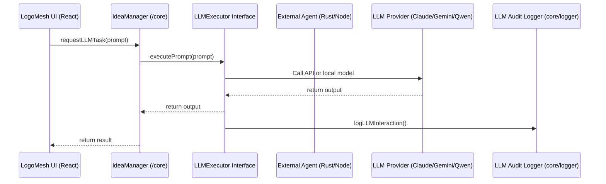

   # LogoMesh Development Plan: A Modular Framework for Thought Organization

---

## Tiered Approach to LogoMesh Development

This development plan is structured around two distinct tiers, reflecting LogoMesh's commitment to a local-first philosophy while ensuring future extensibility and scalability via cloud services. The goal is to provide a robust core accessible to all users, with optional advanced features that leverage cloud resources if desired.

### Tier #1: Local-First Full Immersion
This tier prioritizes minimal internet connectivity and aims for all core LogoMesh functionalities, including AI features, to run efficiently on local user hardware (e.g., Mac Mini). Development in early phases will primarily focus on achieving a stable and performant experience within this tier.

### Tier #2: Cloud-Enhanced Extensions (Optional/Future)
This tier outlines paths for leveraging cloud services (e.g., managed databases, powerful LLM APIs, specialized AI models) for enhanced features, scalability, or as alternatives for users without powerful local hardware. Development for this tier will focus on designing robust abstraction layers in early phases to allow seamless integration without major refactoring, with active implementation in later phases.

---

   # Developer Instructions for the Demo React Implementation of the LogoMesh Framework

This document provides instructions for organizing the demo React application that consumes the LogoMesh framework.  LogoMesh itself is a modular framework for building applications that structure and connect thoughts.

 * Add Section: "Framework/Core Usage"
   ## Framework/Core Usage

To use the LogoMesh framework in your own JavaScript or TypeScript project:

1.  (Installation instructions, e.g., `npm install logomesh-core` if you publish a core package, or instructions to link to the /core directory)
2.  Import the necessary modules from the LogoMesh core:

    ```typescript
    import { Thought, Segment, IdeaManager } from 'logomesh-core'; // Example
    ```

3.  Implement the required interface contracts (Thought, Segment, etc.) in your application.
4.  Choose or create adapters for your specific needs (e.g., a StorageAdapter for your chosen database).

Refer to the interface contracts in the `/contracts` directory for detailed schema definitions and the `/core` directory for the core logic.

   ## Demo React Implementation Setup

The following instructions are for setting up the demo React application. You can skip this section if you are implementing your own UI or CLI.

   **Disclaimer:** LogoMesh is designed as a modular framework. This demo UI is one of several possible front-ends and is provided as an example.


This document outlines the development plan for LogoMesh, a modular framework designed to facilitate the creation of applications for organizing, visualizing, and connecting thoughts in a structured manner.

 * Revise Phase Titles/Subtitles

 * Add Bullet Points:
   For each phase, add:
    **Framework Outcome:** (Describe the core logic deliverables)
	**Demo Implementation Outcome:** (Describe the React-specific deliverables)
**Demo Implementation Outcome:**
* Set up React Flow or ReGraph for initial graph visualization
* Create basic UI components for displaying and editing thoughts

   ### Phase 0: Framework-First Architecture Setup & Core Logic Decoupling [05.12.2025 WE ARE HERE]

**Goal:** Transition the existing React application towards a modular structure by separating core data management logic from the UI. This phase establishes the foundational directories (`/core`, `/contracts`), defines clear interfaces and responsibilities, implements basic data integrity checks and utilities, and scaffolds unit testing. This makes the codebase more maintainable and robustly prepares it for more advanced backend features in Phase 1. This revised structure is designed to be implemented with the assistance of an AI coding agent like Claude within a Replit environment.

**Key Outcomes for Phase 0:**
*   A new `/core` directory containing the application's business logic and data management abstractions, initially operating on in-memory data.
*   A new `/contracts` directory containing TypeScript interface definitions for all primary data entities.
*   The React application in `src/` refactored to consume logic and types from `/core` and `/contracts`, no longer managing primary data state or using `localStorage` directly for thoughts (beyond an initial load).
*   Core utilities for ID generation and logging established within `/core`.
*   Basic unit test stubs created for core logic in `/core`.
*   Clearer separation of concerns, making the system easier to reason about and extend.
*   Placeholders for future DevOps, UX, and data migration considerations noted.

**Tasks:**

1.  **Establish Foundational Directory Structure & Configure Path Aliases:**
    *   **Framework Outcome:** Project structure prepared for modular development with convenient import paths.
    *   **Demo Implementation Outcome:** The React application can resolve imports from new core directories using both relative paths and configured aliases.
    *   **Detailed Action (for AI Agent - Claude):**
        1.  **Create Directories:**
            *   In the root directory of the current Replit project, create a new directory named `contracts`.
                *   *Purpose:* This directory will store TypeScript files (`.ts`) defining the data structure interfaces.
            *   In the root directory of the current Replit project, create a new directory named `core`.
                *   *Purpose:* This directory will house the JavaScript/TypeScript modules containing the decoupled core application logic.
            *   *Verification:* Confirm these directories exist at the project root.

        2.  **Configure Path Aliases (Optional but Recommended for Cleaner Imports):**
            *   Create or modify the `jsconfig.json` file in the project's root directory.
            *   Ensure it contains the following configuration to allow imports relative to the `src` directory using `~/` and to alias `/core` and `/contracts` for easier access from `src/`:
                ```json
                {
                  "compilerOptions": {
                    "baseUrl": ".",
                    "paths": {
                      "~/*": ["src/*"],
                      "@core/*": ["core/*"],
                      "@contracts/*": ["contracts/*"]
                    }
                  },
                  "include": ["src", "core", "contracts"]
                }
                ```
            *   *Purpose:* This setup will allow cleaner import statements from within the `src/` directory, such as `import { Thought } from '@contracts/interfaces';` or `import { IdeaManager } from '@core/IdeaManager';`.
            *   *Verification:* After this change, a test import in a temporary file within `src/` (e.g., `src/App.jsx`) like `import Test from '@core/someFile';` (assuming `someFile.js` exists in `core`) should ideally be resolvable by Replit's tooling without errors.

        3.  **Note on Import Path Usage (for AI Agent - Claude):**
            *   **Priority:** When refactoring code in subsequent steps to import modules from `/core` or `/contracts` into files within `src/`, **first attempt to use the configured path aliases**:
                *   `import ... from '@contracts/your-interface-file';`
                *   `import ... from '@core/your-module-file';`
            *   **Fallback to Relative Paths:** If, for any reason, the path aliases do not work or cause issues during refactoring within the Replit environment, revert to using standard **relative paths** as a reliable fallback.

2.  **Define Core Data Structure Interface Contracts:**
    *   **Framework Outcome:** Clear, typed definitions for all primary data entities, promoting consistency and enabling type-safe development within the `/core` framework and for UI consumption. These interfaces will represent Data Transfer Objects (DTOs) suitable for application-layer logic.
    *   **Demo Implementation Outcome:** React components can be refactored to expect props and manage state conforming to these well-defined interfaces.
    *   **Detailed Actions (for AI Agent - Claude):**

        a.  **Initial Interface Extraction & Creation:**
            *   Analyze current data structures in `src/App.jsx` (`createThought` function), `src/utils/exportHandler.js` (`exportPayload.thoughts`), and `src/services/graphService.js`.
            *   Create `/contracts/entities.ts`.
            *   In `/contracts/entities.ts`, generate initial TypeScript `interface` definitions for `Tag`, `Segment`, and `Thought` based on the analysis.
            *   Export these interfaces.

        b.  **Refine Interfaces with Planned Schema Enhancements (DTO Focus):**
            *   Update interfaces in `/contracts/entities.ts` referencing Phase 1 SQLite schema plans.
            *   **Define base types for extensibility at the top of `/contracts/entities.ts`:**
                ```typescript
                export type PredefinedContentType = 'text' | 'image' | 'audio' | 'video' | 'link';
                export type CustomContentType = string & { _brand?: 'CustomContentType' };
                export type ContentType = PredefinedContentType | CustomContentType;

                export type PredefinedAbstractionLevel = 'Fact' | 'Idea' | 'Theme' | 'Goal';
                export type CustomAbstractionLevel = string & { _brand?: 'CustomAbstractionLevel' };
                export type AbstractionLevel = PredefinedAbstractionLevel | CustomAbstractionLevel;

                export type FieldValue = string | number | boolean | Date | string[] | number[]; // Expand as needed
                ```
            *   **Refine `Segment` interface:**
                ```typescript
                export interface Segment {
                  segment_id: string;
                  thought_bubble_id: string;
                  title: string;
                  content: string;
                  content_type: ContentType; // Default 'text'
                  asset_path?: string;
                  fields: Record<string, FieldValue>; // DTO representation
                  embedding_vector?: number[];
                  created_at: string; // ISO date string
                  updated_at: string; // ISO date string
                  abstraction_level: AbstractionLevel; // Default 'Fact'
                  local_priority: number; // Default 0.5
                  cluster_id: string; // Default 'uncategorized_cluster'
                }
                ```
            *   **Refine `Thought` interface:**
                ```typescript
                export interface Thought {
                  thought_bubble_id: string;
                  title: string;
                  description?: string;
                  created_at: string; // ISO date string
                  updated_at: string; // ISO date string
                  color?: string;
                  position?: { x: number; y: number };
                  tags?: Tag[]; // Optional DTO convenience
                  segments?: Segment[]; // Optional DTO convenience
                }
                ```
            *   *(Note for AI Agent): Other interfaces like `SegmentNeighbor` can be defined later if needed as DTOs.*
        b2. **Define LLMExecutor Interface for Future Multi-LLM Support:**
            * Add a new file: `/contracts/llmExecutor.ts`.
            * This interface defines a common structure for executing prompts via different LLM providers.
            * It will be used in Phase 1+ to plug in Claude, Gemini, Qwen, InternVL, or custom Ollama models without altering business logic.

                  ```typescript
                  // contracts/llmExecutor.ts
                  
                  export interface LLMExecutor {
                    name: string;
                    supportsStreaming: boolean;
                    executePrompt(prompt: string): Promise<string>;
                    streamPrompt?(prompt: string): AsyncGenerator<string>;
                    generateMermaid?(context: any): Promise<string>;
                  }
                  ```
        c.  **Add JSDoc Comments:**
            *   Add brief JSDoc comments to each interface and its properties explaining their purpose.

        *   **Verification Step (for AI Agent - Claude):**
            *   Confirm `/contracts/entities.ts` exists with exported `Thought`, `Segment`, `Tag`, `ContentType`, `AbstractionLevel`.
            *   Confirm `Segment` and `Thought` interfaces include all specified fields with correct typings.
            *   Confirm JSDoc comments are present.

3.  **Scaffold Core Logic Abstraction (`IdeaManager`) and Begin UI Decoupling:**
    *   **Framework Outcome:** A foundational `IdeaManager` class/module in `/core` that encapsulates data management logic (initially in-memory) and uses the defined `/contracts` interfaces.
    *   **Demo Implementation Outcome:** Key React components (`App.jsx`, `AddThoughtModal.jsx`, `ThoughtDetailPanel.jsx`) begin to delegate data operations to the `IdeaManager` instead of handling state and `localStorage` directly. The application remains functional using in-memory data management via `IdeaManager`.
    *   **Detailed Actions (for AI Agent - Claude):**

        a.  **Create Initial `IdeaManager` in `/core`:**
            *   Create `@core/IdeaManager.ts`.
            *   Define and export class `IdeaManager`.
            *   Import interfaces from `@contracts/entities.ts`.
            *   Internally manage `private thoughts: Thought[] = [];`.
            *   Constructor attempts one-time load from `localStorage` (key 'thought-web-data') into `this.thoughts`, similar to `App.jsx`'s original `useState` logic for `thoughts`. Log errors, default to empty array on failure.

        b.  **Implement Basic In-Memory CRUD Methods in `IdeaManager`:**
            *   Add public methods: `getThoughts(): Thought[]`, `getThoughtById(id: string): Thought | undefined`, `addThought(thoughtData: ...): Thought`, `updateThought(thoughtId: string, updates: ...): Thought | undefined`, `deleteThought(thoughtId: string): boolean`, `addSegment(thoughtId: string, segmentData: ...): Segment | undefined`, `updateSegment(thoughtId: string, segmentId: string, updates: ...): Segment | undefined`, `deleteSegment(thoughtId: string, segmentId: string): boolean`.
            *   Import and use ID generation utilities from `@core/utils/idUtils.ts` (to be created in Task 5a) for `addThought` and `addSegment`.
            *   These methods operate on the internal `this.thoughts` array.
            *   Ensure returned objects conform to interfaces.

        c.  **Refactor `src/App.jsx` to Use `IdeaManager` (Incremental Steps):**

            *   **3c-i: Instantiate `IdeaManager` and Load Initial `thoughts` State:**
                *   In `src/App.jsx`, import `IdeaManager`. Create an instance.
                *   Initialize `thoughts` state: `useState(() => ideaManager.getThoughts());`.
                *   Remove old `useEffect` that loaded from `localStorage`.
                *   *Verification:* App loads existing `localStorage` data via `IdeaManager`.

            *   **3c-ii: Refactor `createThought` (and `addThought` if distinct) in `src/App.jsx`:**
                *   Modify `createThought` to call `ideaManager.addThought(...)`.
                *   After adding, update React `thoughts` state: `setThoughts([...ideaManager.getThoughts()]);`.
                *   Remove direct `localStorage.setItem` calls from this function.
                *   *Verification:* New thoughts are added to `IdeaManager`'s store; UI updates. No direct `localStorage` writes from `App.jsx`.

            *   **3c-iii: Remove `localStorage` Persistence Logic from `src/App.jsx`:**
                *   Remove the `useEffect` hook that saved `thoughts` to `localStorage`.
                *   *(Developer Decision from previous discussion: `thought-web-dark-mode` `localStorage` handling remains in `App.jsx` for now).*
                *   *Verification:* App functions, but thought changes don't persist across refresh (expected for Phase 0).

        d.  **Refactor Data-Mutating Components to Use `IdeaManager` via Props:**
            *   Pass `ideaManager` instance and a refresh callback (e.g., `refreshThoughts = () => setThoughts([...ideaManager.getThoughts()]);`) from `App.jsx` as props to components like `src/components/ThoughtDetailPanel.jsx`, `src/components/Canvas.jsx` (for position updates), `src/components/Sidebar.jsx` (for batch edits).
            *   Modify these components to call methods on `props.ideaManager` and then `props.refreshThoughts()`.
            *   Remove direct `localStorage.setItem` calls from these components.
            *   *(Note for AI Agent): Refactor one component at a time.*
            *   *Verification:* Components use `ideaManager` prop and refresh callback. UI updates correctly. No direct `localStorage` writes from these components.

4.  **Define Abstraction Taxonomy & Initial Metadata Handling:**
    *   **Framework Outcome:** Core data structures (`Segment` interface) include fields for `abstraction_level` and `cluster_id`, enabling foundational semantic categorization.
    *   **Demo Implementation Outcome:** The UI for creating/editing segments can capture these new metadata fields.
    *   **Detailed Actions (for AI Agent - Claude):**
        a.  **Update `Segment` Interface (Confirm in `@contracts/entities.ts`):**
            *   Ensure `abstraction_level: AbstractionLevel;` and `cluster_id: string;` are present with JSDoc.
        b.  **Update `IdeaManager` Methods for Metadata:**
            *   Modify `IdeaManager.addSegment` and `IdeaManager.updateSegment` to accept and store `abstraction_level` and `cluster_id`. Apply defaults in `addSegment`.
        c.  **Update UI for Metadata (Basic Input):**
            *   In `src/components/AddThoughtModal.jsx` and `src/components/ThoughtDetailPanel.jsx`, enable input/display for `abstraction_level` and `cluster_id`.
        *   **Verification:** Segments can have `abstraction_level` and `cluster_id` managed.

5.  **Implement Core Data Integrity & Utility Foundations:**
    *   **Framework Outcome:** `IdeaManager` includes basic data validation. Core utilities for ID generation and logging are established.
    *   **Demo Implementation Outcome:** Increased robustness; foundational support for debugging.
    *   **Detailed Actions (for AI Agent - Claude):**
        a.  **ID Generation and Uniqueness:**
            *   **Relocate ID Utilities:** Create `@core/utils/idUtils.ts`. Move `newBubbleId` and `newSegmentId` functions from `src/utils/eventBus.js` into it. Export them. Update `IdeaManager` to use these.
            *   **In-Memory ID Uniqueness Check:** In `IdeaManager.addThought/addSegment`, before adding, check if the generated ID already exists in its internal store. If so, log an error/regenerate (simple console log for Phase 0 is fine).
        b.  **Basic Reference Validation:**
            *   In `IdeaManager.addSegment`, ensure the `thoughtId` exists before adding. Log error if not.
        c.  **Establish Basic Logging Utility:**
            *   Create `@core/utils/logger.ts`. Implement a simple `logger` object with `log`, `warn`, `error` methods (initially wrapping `console` methods with a prefix like `[LOGOMESH-CORE]`).
            *   Import and use this `logger` in `IdeaManager` for key operations.
        *   **Verification:** ID utils are in `@core/utils/`. `IdeaManager` uses logger. Basic validation checks are performed.
        d. **Scaffold LLM Audit Logger Stub:**
            * Create a new file: `/core/logger/llmAuditLogger.ts`.
            * This utility logs all prompt/response cycles with an LLM agent and will be extended in Phase 2 to store data in a structured format (e.g., SQLite or Postgres).
            * For now, it wraps `console.log()` with a consistent format for auditability.

            ```typescript
            // core/logger/llmAuditLogger.ts
            
            export function logLLMInteraction(
              agent: string,
              prompt: string,
              output: string,
              metadata?: Record<string, any>
            ): void {
              console.log(`[LLM ${agent}]`, {
                prompt,
                output,
                metadata,
                timestamp: new Date().toISOString(),
              });
            }
            ```

6.  **Scaffold Unit Testing for Core Logic:**
    *   **Framework Outcome:** Basic testing infrastructure set up for `/core` modules.
    *   **Detailed Actions (for AI Agent - Claude):**
        a.  **Confirm Jest Configuration for `/core`:**
            *   Ensure Jest (from `react-scripts`) can find and run tests in `/core` (e.g., `core/**/*.test.ts`).
        b.  **Create Initial Test Stubs for `IdeaManager`:**
            *   Create `@core/IdeaManager.test.ts`.
            *   Add basic test stubs (as previously discussed examples) for `addThought`, `getThoughtById`, `addSegment`, and ideally `updateThought` and `deleteThought`. Ensure tests clear `localStorage` in `beforeEach` for isolation if `IdeaManager` constructor reads from it.
        *   **Verification:** Test files can be created. Example tests pass against the in-memory `IdeaManager`.

7.  **Establish Initial DevOps & UX Documentation Stubs:**
	*   **Framework Outcome:** Basic project structure supports future, more formal DevOps and UX processes.
	*   **Detailed Actions (for AI Agent - Claude or Developer):**
    	a.  **DevOps - Documentation Stubs:**
        	*   Create `/docs/BUILD_PROCESS.md` (Note: "Phase 0: Core logic part of React app build. Phase 1 will introduce Docker for backend API and explore separate build/test for `/core` if it becomes a distinct package.")
        	*   Create `/docs/DATA_MIGRATION.md`. Add the following content:
            	```markdown
            	# Data Migration Strategy

            	## Phase 0 to Phase 1 (localStorage to SQLite)

            	The `IdeaManager` in Phase 0 loads initial data from `localStorage` (key: 'thought-web-data') into its in-memory store. Phase 1 will introduce SQLite as the primary persistent storage.

            	A data migration strategy will be required at the beginning of Phase 1 to ensure any data present in `localStorage` (from prior application use or data entered during Phase 0 development sessions if not persisted elsewhere) is correctly transferred to the new SQLite database structure.

            	**Potential Approaches for Phase 1 Migration:**
            	1.  **One-time Script:** A script (Node.js or directly within the application startup) that reads from `localStorage`, transforms the data to align with the new normalized SQLite schema, and inserts it into the SQLite database.
            	2.  **Enhanced `IdeaManager` (SQLite Adapter):** The SQLite storage adapter for the `IdeaManager` (to be built in Phase 1) could include logic on its first run to check for `localStorage` data and import it.

            	This migration will need to handle mapping from the potentially less structured `localStorage` format to the normalized tables defined for SQLite (e.g., `thoughts`, `segments`, `segment_fields`, `tags`, etc.).

            	## Future Consideration: SQLite to Postgres (Tier 2 / Advanced Scaling)

            	For future scalability, multi-user/multi-agent scenarios, and advanced features (as outlined in Tier 2 of the development plan), a transition from the local SQLite datastore to a more robust, server-based PostgreSQL database (potentially with `pgvector`) is envisioned.

            	This migration would involve:
            	*   Schema mapping from SQLite to PostgreSQL (largely similar but with RDBMS-specific optimizations).
            	*   Data transfer mechanisms.
            	*   Updating the backend API and `/core` persistence layer to target PostgreSQL.

            	This consideration is for long-term architectural evolution and will be addressed in later phases.
            	```
    	b.  **UX - Documentation Stubs:**
        	*   Create `/docs/STYLE_GUIDE.md` (Note: "Basic styling inherited... Formal guide in Phase 1...").
        	*   Create `/docs/ONBOARDING_TOUR.md` (Note: "Concept to be designed later...").
    	*   **Verification:** Markdown files are created with the specified content. The `DATA_MIGRATION.md` file should contain both subsections as described.

8.  **Phase 0 Final Cleanup & Summary:**
    *   **Framework Outcome:** Core logic significantly decoupled, project structured for Phase 1.
    *   **Demo Implementation Outcome:** React app functional with `IdeaManager`.
    *   **Detailed Actions (for AI Agent - Claude and/or Developer):**
        a.  **Review and Refactor Utility Usage:**
            *   Identify remaining utilities in `src/utils/`. Move any general-purpose, non-DOM-specific data logic utilities (if any beyond ID gen) to `@core/utils/`. Update imports.
        b.  **Code Cleanup and Linting:**
            *   Run linters (ESLint, Prettier) across `src/`, `/core/`, `/contracts/`. Fix issues. Remove dead code.
        c.  **Update Phase 0 Summary in Development Plan (This Document):**
            *   (Developer action after AI completes tasks) Replace this task with the "Phase 0 Outcome" statement below.

9.  **Integrate LLM Readiness & Document Hybrid Architecture Approach:**
	*   **Framework Outcome:** Core contracts include an abstraction for LLM execution. Logging for LLM interactions is scaffolded. The overall architecture acknowledges preparation for future hybrid data/agent systems.
	*   **Demo Implementation Outcome:** Foundational elements are in place for future AI feature integration without requiring immediate LLM functionality in the demo.
	*   **Detailed Actions (for AI Agent - Claude):**

    	a.  **Define LLMExecutor Interface:**
        	*   Create the file `/contracts/llmExecutor.ts`.
        	*   Add the `LLMExecutor` interface definition as specified in the `Schema Extension for Phase 0 (more context).txt` document (including `name`, `supportsStreaming`, `executePrompt`, optional `streamPrompt`, and optional `generateMermaid`).
        	*   Add JSDoc comments explaining the interface and its methods.
        	*   *Purpose:* This defines a shared contract for any future LLM provider, enabling modularity.
        	*   *Verification:* The file `/contracts/llmExecutor.ts` exists and correctly defines and exports the `LLMExecutor` interface with JSDoc.

    	b.  **Scaffold LLM Audit Logger:**
        	*   Create the file `/core/logger/llmAuditLogger.ts`.
        	*   Implement the `logLLMInteraction` function as specified in the `Schema Extension for Phase 0 (more context).txt` document, which currently logs to `console.log` with a structured format.
        	*   Add JSDoc comments explaining its purpose and future extension to persistent logging.
        	*   *Purpose:* Establishes a centralized point for logging all LLM prompt/response cycles for future audit and debugging.
        	*   *Verification:* The file `/core/logger/llmAuditLogger.ts` exists and correctly defines and exports the `logLLMInteraction` function.

    	c.  **Document Hybrid LLM Readiness & Future Agent Architecture:**
        	*   *(Developer Action or AI-assisted):* In a relevant section of the main project `README-dev.md` (e.g., a new subsection under "Core Architecture" or as an addendum to Phase 0's description), or in a dedicated `/docs/ARCHITECTURE_VISION.md` file, add a summary explaining these Phase 0 additions for LLM readiness.
        	*   This summary should include:
            	*   The purpose of the `LLMExecutor` interface (pluggable LLMs).
            	*   The role of the `llmAuditLogger.ts` stub (traceability).
            	*   A note that this scaffolding prepares for advanced features like AI-assisted diagramming/reasoning and future external agents (potentially Rust-based, interacting with a more complex backend like Postgres, as inspired by recent discussions).


        	*   *Purpose:* To clearly document the architectural intent behind these Phase 0 additions for future developers and AI agents.
        	*   *Verification:* The chosen documentation file contains a clear explanation of the LLM readiness features added in Phase 0 and their forward-looking implications.

These additions future-proof LogoMesh to become LLM-agnostic, introspective, and flexible.
> **Phase 0 Outcome:**
> The LogoMesh React application's core data management logic has been successfully decoupled from its UI components. A new `/core` directory houses an `IdeaManager` that manages application data (initially in-memory, with a one-time load from `localStorage` for data continuity) using well-defined TypeScript interfaces from `/contracts`. Core utilities for ID generation and application logging, basic data integrity checks, and unit test stubs are established within `/core`. **Furthermore, foundational contracts and stubs for future LLM integration (`LLMExecutor` interface, `llmAuditLogger`) have been created, preparing the architecture for LLM-agnostic operations and advanced AI agent interactions.** The React UI (`src/`) now interacts with the `IdeaManager` for all thought and segment data operations, removing direct `localStorage` persistence for these entities from the UI layer. The project structure is now robustly prepared for Phase 1, which will introduce a dedicated backend API, SQLite persistence, and further integrations. Documentation stubs, including notes on data migration and the hybrid architecture vision, have been established.

---
(End of Revised Phase 0 Section)
---

## PHASE 1: Backend Implementation, Data Persistence, and Core Integrations (Estimated Duration: 3-4 Weeks)

**Prerequisite:** Successful completion of all **Phase 0: Framework-First Architecture Setup & Core Logic Decoupling** tasks. This includes:
*   Decoupled React application (`src/`) using an in-memory `IdeaManager` (`@core/IdeaManager.ts`).
*   Defined data contracts in `@contracts/entities.ts`.
*   Established foundational utilities (`@core/utils/`), logging (`@core/utils/logger.ts`), and unit test stubs for `/core`.
*   Scaffolded LLM readiness contracts (`@contracts/llmExecutor.ts`) and logging stubs (`@core/logger/llmAuditLogger.ts`).
*   Path aliases (`@core`, `@contracts`) configured in `jsconfig.json`.

**Goal:**
This phase transitions LogoMesh from an in-memory prototype to a robust, local-first application with persistent data storage using SQLite. It involves building a lightweight backend API server (Node.js/Express.js), integrating SQLite into the core data management layer (`IdeaManager`) via a `StorageAdapter` pattern, and connecting the React frontend to this new backend. This phase also includes refining the graph visualization to meet design specifications, laying the groundwork for local automation with Node-RED, and giving the LLM execution layer its initial concrete implementation.

**Key Outcomes for Phase 1:**
*   A functional backend API server (Node.js/Express.js) serving data from an SQLite database.
*   The `/core/IdeaManager` refactored to use a persistent SQLite data store through a `StorageAdapter` pattern.
*   The React application (`src/`) fully communicates with the backend API for all core data operations.
*   An initial, simple implementation of the `LLMExecutor` interface (e.g., for Ollama or as a mock) and `LLMTaskRunner` integrated into the backend.
*   Node-RED instance set up with foundational API integrations to the backend for basic automation workflows.
*   Cytoscape.js graph visualization in the React app refined for compound nodes and `fcose` layout.
*   JSON import/export functionality available via the backend API.
*   The backend API and SQLite database containerized using Docker for consistent local development.
*   A defined process for migrating data from `localStorage` (used in Phase 0 for initial data) to the new SQLite database.

---

### Tier #1: Local-First Full Immersion

**Tasks:**

**1. Establish Backend API Server & SQLite Database Foundation:**
    *   **Framework Outcome:** A runnable Node.js/Express.js backend server capable of basic request handling. A defined SQLite database schema (`schema.sql`) and an initialization script (`initDb.ts`) to create the database structure.
    *   **Demo Implementation Outcome:** Provides the server infrastructure that the React frontend and Node-RED will connect to. The database will be ready to store application data.
    *   **Detailed Actions (for AI Agent - Claude):**

        a.  **Set Up Backend Server Project Structure (`server/`):**
            *   Create a new top-level directory named `server/` in the Replit project root.
            *   Inside `server/`, initialize a new Node.js project (e.g., `npm init -y`).
            *   Install necessary dependencies: `express`, `cors`, `sqlite3`.
            *   If using TypeScript for the server (recommended):
                *   Install dev dependencies: `typescript`, `@types/express`, `@types/cors`, `@types/node`, `ts-node`, `nodemon` (for development).
                *   Create `server/tsconfig.json` (e.g., `"module": "commonjs"`, `"target": "es2020"`, `"outDir": "./dist"`, `"rootDir": "./src"`, `"esModuleInterop": true`, `"resolveJsonModule": true`).
                *   Create `server/src/` directory and place server code (like `index.ts`) within it. Update `package.json` scripts for building and running.
            *   Create the main server entry point (e.g., `server/src/index.ts`).
            *   Implement a minimal Express application setup:
                *   Initialize Express app, use `cors()` and `express.json()` middleware.
                *   Define a `GET /api/v1/health` route returning `200 OK` with `{ status: "healthy", timestamp: new Date().toISOString() }`.
                *   Start the server listening on a configurable port (e.g., `process.env.PORT || 3001`).
            *   *Verification:* The Express server starts, and `GET /api/v1/health` returns the expected JSON response.

        b.  **Define and Create SQLite Database Schema (`@core/db/`):**
            *   **(Prerequisite Check for AI Agent):** Before proceeding, confirm that the `Merged Milestone-Based Development Plan v2.0.md` document (provided as context) contains a clearly defined "Phase 1 SQLite Schema" section detailing all tables, columns, SQLite-compatible data types, primary keys, foreign keys, and constraints. If this section is missing or incomplete, stop and request the complete schema definition.
            *   Create `@core/db/schema.sql`.
            *   Populate `@core/db/schema.sql` with the `CREATE TABLE` statements from the "Phase 1 SQLite Schema" section of the main plan.
            *   Create `@core/db/initDb.ts`. This script will:
                *   Import `sqlite3`.
                *   Define the database file path (e.g., `process.env.DB_PATH || './core/db/logomesh.sqlite3'`).
                *   Contain `initializeDatabase()` function that connects to SQLite, reads `schema.sql`, and executes `CREATE TABLE IF NOT EXISTS ...` for each table.
                *   Include error handling and use `@core/utils/logger.ts`.
                *   **(For AI Agent - Server Startup Logic):** Ensure the main server startup logic (e.g., in `server/src/index.ts`) calls `initializeDatabase()` *before* starting the Express server, particularly if the database file might not exist. It should check for the existence of the DB file, and if not present or empty, run the initialization. Example pseudo-logic:
                    ```typescript
                    // Conceptual logic for server/src/index.ts
                    // import fs from 'fs';
                    // const DB_PATH = process.env.DB_PATH || './core/db/logomesh.sqlite3';
                    // if (!fs.existsSync(DB_PATH)) { // Or a more robust check if DB is empty
                    //   logger.log(`Database not found at ${DB_PATH}, attempting to initialize...`);
                    //   await initializeDatabase(); // Assuming initializeDatabase is async
                    //   logger.log('Database initialized successfully.');
                    // }
                    ```
            *   *Verification:* Running `initDb.ts` creates/updates `logomesh.sqlite3` with the correct schema. The server startup correctly initializes the DB if needed.

        c.  **Data Migration from `localStorage` (Placeholder for Execution):**
            *   **(No coding action for this sub-task *yet*.)**
            *   Refer to `/docs/DATA_MIGRATION.md`. Migration will occur later in Phase 1.

        d.  **Integrate LLM Execution Layer Foundation (from Phase 0 Scaffolding):**
            *   **Framework Outcome:** The `/core` module includes a functional (though initially simple/mocked) LLM execution pipeline.
            *   **Demo Implementation Outcome:** A basic API endpoint can demonstrate invoking the LLM execution flow.
            *   **Detailed Actions (for AI Agent - Claude):**

                i.  **Create LLM Adapter Directory and Core Files:**
                    *   Create `@core/llm/`.
                    *   Create `@core/llm/OllamaExecutor.ts` (or `MockLLMExecutor.ts`) implementing `LLMExecutor` from `@contracts/llmExecutor.ts`. For the initial version, `executePrompt` should return a mocked response (e.g., `Promise.resolve(\`Mocked response to: \${prompt}\`)`). `supportsStreaming` can be `false`.
                    *   Create `@core/llm/LLMTaskRunner.ts` as previously defined, using an `LLMExecutor` instance and logging with `llmAuditLogger`. Include the `runPromptWithStreaming?` stub with fallback.
                    *   Create `@core/llm/utils/mermaidAuditor.ts` with the `isValidMermaid` stub function.
                    *   *Verification:* Files created. `OllamaExecutor` implements `LLMExecutor`. `LLMTaskRunner` defined. `mermaidAuditor` stub exists.

                ii. **Integrate `LLMTaskRunner` into Backend API (Stub Route):**
                    *   Create `server/src/routes/llmRoutes.ts`.
                    *   Implement an Express router with a `POST /api/v1/llm/prompt` endpoint using `LLMTaskRunner` and `OllamaExecutor` (or mock). Include basic request validation for the prompt.
                    *   In `server/src/index.ts`, import and use this router for `/api/v1/llm`.
                    *   *Verification:* `POST` to `/api/v1/llm/prompt` returns a mock LLM response. Interaction logged by `llmAuditLogger`.

**2. Refactor `IdeaManager` to Use SQLite via `StorageAdapter` Pattern:**
    *   **Framework Outcome:** `IdeaManager` is decoupled from direct data storage implementation, using a `StorageAdapter` interface. A `SQLiteStorageAdapter` implementation handles all database interactions. The system now persists data in SQLite.
    *   **Demo Implementation Outcome:** All data operations performed by the React application (via the backend API) are now persistent.
    *   **Detailed Actions (for AI Agent - Claude):**

        a.  **Define `StorageAdapter` Interface:**
            *   Create `@contracts/storageAdapter.ts`.
            *   Define and export the `StorageAdapter` interface with `async` CRUD methods for `Thought`, `Segment` (including `getAllThoughts`, `getThoughtById`, `createThought`, `updateThought`, `deleteThought`, `getSegmentsForThought`, `getSegmentById`, `createSegment`, `updateSegment`, `deleteSegment`).
            *   Define `NewThoughtData` and `NewSegmentData` input types.
            *   *(Note for AI Agent): Methods must return `Promise`s. Align method signatures with DTOs from `@contracts/entities.ts`.)*
            *   *Verification:* `@contracts/storageAdapter.ts` exists with the correctly defined interface.

        b.  **Implement `SQLiteStorageAdapter`:**
            *   Create `@core/storage/sqliteAdapter.ts`.
            *   Implement class `SQLiteStorageAdapter` implementing `StorageAdapter`.
            *   Use `sqlite3` to connect to `logomesh.sqlite3`.
            *   Implement all `StorageAdapter` methods with SQL queries against the normalized tables.
                *   `createThought` handles inserts into `thoughts`, `tags`, `thought_tags`, initial `segments`, `segment_fields`.
                *   `getAllThoughts` assembles full `Thought` DTOs including nested `segments` (with their `fields`) and `tags`.
                *   `updateSegment` (with `updates.fields`) handles `segment_fields` table modifications.
            *   Use parameterized queries and `@core/utils/logger.ts`.
            *   *(Note for AI Agent): Implement method-by-method. Pay close attention to DTO <-> DB normalized schema mapping. Unit tests are crucial here.)*
            *   *Verification:* (To be verified by unit tests in Task 8c). Manually inspect DB after operations.

        c.  **Refactor `IdeaManager` to Use `StorageAdapter`:**
            *   Modify `@core/IdeaManager.ts`.
            *   Constructor: `constructor(private storage: StorageAdapter) {}`.
            *   Remove in-memory `thoughts` array and `localStorage` loading.
            *   Rewrite public CRUD methods to be `async` and delegate to `this.storage`, ensuring ID generation for new entities (using `@core/utils/idUtils.ts`) happens before calling storage adapter create methods.
            *   *Verification:* `IdeaManager` uses the `storage` adapter. Unit tests (with a mock adapter) pass.

**3. Implement Backend API Endpoints for Core Entities:**
    *   **Framework Outcome:** Backend API server exposes RESTful CRUD endpoints for `Thoughts` and `Segments`, using the SQLite-backed `IdeaManager`.
    *   **Demo Implementation Outcome:** React frontend has functional API endpoints for data.
    *   **Detailed Actions (for AI Agent - Claude):**

        a.  **Instantiate `IdeaManager` with `SQLiteStorageAdapter` in Server:**
            *   In `server/src/index.ts`, ensure `IdeaManager` is instantiated with `SQLiteStorageAdapter`.
            *   This `ideaManager` instance will be used by route handlers.
            *   *Verification:* Server starts, `IdeaManager` uses `SQLiteStorageAdapter`.

        b.  **Create API Routes for `Thoughts` (`server/src/routes/thoughtRoutes.ts`):**
            *   Implement `GET /api/v1/thoughts`, `POST /api/v1/thoughts`, `GET /api/v1/thoughts/:thoughtId`, `PUT /api/v1/thoughts/:thoughtId`, `DELETE /api/v1/thoughts/:thoughtId`.
            *   Routes call corresponding `ideaManager` methods.
            *   Include request validation, error handling, and logging.
            *   Mount router in `server/src/index.ts` for `/api/v1/thoughts`.
            *   *Verification:* Endpoints testable (e.g., via Postman), data reflects in SQLite.

        c.  **Create API Routes for `Segments` (within `thoughtRoutes.ts` or new `segmentRoutes.ts`):**
            *   Implement `POST /api/v1/thoughts/:thoughtId/segments`, `PUT /api/v1/thoughts/:thoughtId/segments/:segmentId`, `DELETE /api/v1/thoughts/:thoughtId/segments/:segmentId`.
            *   Similar validation, error handling, logging.
            *   *Verification:* Segment CRUD via API works, data persists.

**4. Refactor React Frontend to Consume Backend API:**
    *   **Framework Outcome:** `/core` layer is primarily backend. React frontend is a pure API client.
    *   **Demo Implementation Outcome:** React app uses HTTP requests for all data operations.
    *   **Detailed Actions (for AI Agent - Claude):**

        a.  **Create an API Service Layer in React App (`src/services/apiService.ts`):**
            *   Module encapsulates `fetch`/`axios` calls to backend API (`http://localhost:3001/api/v1` or configurable).
            *   Export functions for all needed CRUD operations (e.g., `fetchThoughts()`, `createThoughtApi(data: NewThoughtData)` etc.).
            *   Basic error handling (check `response.ok`, parse JSON, throw generic error on 4xx/5xx).
            *   *Verification:* `apiService.ts` created with stubs/implementations.

        b.  **Refactor `App.jsx` to Use `apiService`:**
            *   Remove `IdeaManager` usage. Import from `apiService.ts`.
            *   `useEffect` on mount calls `apiService.fetchThoughts()` to `setThoughts`.
            *   `createThought` calls `apiService.createThoughtApi(...)`, then re-fetches all thoughts to update state (simpler initial strategy).
            *   `refreshThoughts` callback (passed to children) now calls `apiService.fetchThoughts()`.
            *   *Verification:* `App.jsx` loads from API. Creates thoughts via API.

        c.  **Refactor Child Components (`ThoughtDetailPanel`, `Canvas`, etc.) to Use `apiService` (via props/callbacks):**
            *   Remove `ideaManager` prop. Use callbacks from `App.jsx` that internally call `apiService` methods.
            *   Example: `ThoughtDetailPanel` gets `onUpdateSegmentApi(segmentId, updates)` prop.
            *   `Canvas.jsx` position updates call `apiService.updateThoughtApi(...)` via prop.
            *   *Verification:* UI interactions use `apiService`. Data persists across reloads.

**5. Refine Graph Visualization (Cytoscape.js - Compound Nodes & Layout):**
    *   **Demo Implementation Outcome:** Graph canvas correctly visualizes `Thoughts` as compound parents containing `Segment` children, using `fcose` layout.
    *   **Detailed Actions (for AI Agent - Claude):**

        a.  **Modify `Canvas.jsx` for Compound Node Structure:**
            *   Refactor `elements` generation in `src/components/Canvas.jsx`.
            *   Segment nodes' `data` object must include `parent: thought.thought_bubble_id`.
            *   Remove direct Thought-to-Segment edges if compound structure renders clearly. Edges should primarily be between Thought nodes or Segment nodes based on future `segment_neighbors` data.
            *   *Verification:* Segments appear nested in thought bubbles.

        b.  **Integrate and Configure `cytoscape-fcose` Layout:**
            *   Ensure `cytoscape.use(fcose);` is called.
            *   Update `layout` config in `Canvas.jsx` to use `name: 'fcose'`.
            *   Configure `fcose` parameters (e.g., `nodeRepulsion`, `idealEdgeLength`, `nestingFactor`, `quality`) for clear compound graph visualization.
            *   *Verification:* Graph uses `fcose`. Compound nodes/children are clearly arranged.

        c.  **Handle Node Position Updates (Compound Nodes):**
            *   `dragfree` event handler in `Canvas.jsx` saves positions of compound Thought nodes.
            *   Updates sent via `apiService.updateThoughtApi(...)`.
            *   *Verification:* Dragging thoughts updates position via API; layout re-renders correctly.

**6. Set Up Node-RED for Local Automation & Initial Integration:**
    *   **Framework Outcome:** Node-RED configured to interact with LogoMesh backend API.
    *   **Demo Implementation Outcome:** Basic Node-RED flows scaffolded.
    *   **Detailed Actions (for AI Agent - Claude or Developer):**

        a.  **Install and Configure Node-RED Locally:**
            *   (Standard Node-RED install). Install `node-red-node-http`, `node-red-contrib-fs-ops` (optional).
            *   *Verification:* Node-RED running. Nodes installed.

        b.  **(Decision from prior discussion):** Node-RED will primarily *call* LogoMesh API endpoints. No webhooks from backend *to* Node-RED in Phase 1.

        c.  **Confirm API Endpoints Suitability for Node-RED:**
            *   Review existing CRUD API endpoints for clarity for Node-RED consumption.
            *   *Verification:* Node-RED can make HTTP requests to LogoMesh API.

        d.  **Implement Backend Backup API Endpoint & Scaffold Node-RED Workflow:**
            *   Create `server/src/routes/adminRoutes.ts`. Implement `POST /api/v1/admin/backup`. This route uses Node.js `fs` to copy the database file (e.g., `logomesh.sqlite3`) to a timestamped backup file in a `server/backups/` directory (ensure this directory is writable).
            *   In `server/src/index.ts`, mount this router for `/api/v1/admin`.
            *   **Node-RED Workflow 1 (Backup):** Create a flow triggered by a timer (e.g., daily) that makes a `POST` request to `/api/v1/admin/backup`.
            *   *Verification:* Calling backup API creates a DB copy. Node-RED flow triggers backup.

        e.  **Scaffold Other Node-RED Workflows (Conceptual - API Calls):**
            *   **Workflow 2 (Auto-Tagging Prep Stub):** Flow calls `GET /api/v1/thoughts`, uses a "Function" node for basic keyword logic, then (conceptually) calls `PUT /api/v1/thoughts/:thoughtId/segments/:segmentId` to update tags/fields.
            *   **Workflow 3 (Embedding Prep Trigger Stub):** Flow fetches segments, then calls `POST /api/v1/llm/prompt` with segment content. (Mock LLM response logged).
            *   *Verification:* Flows make API calls. Embedding prep logs via `llmAuditLogger`.

**7. Implement JSON Import/Export via Backend API:**
    *   **Framework Outcome:** Core logic for data serialization/deserialization in `/core` exposed via backend.
    *   **Demo Implementation Outcome:** Users import/export graph via UI, mediated by backend API.
    *   **Detailed Actions (for AI Agent - Claude):**

        a.  **Create `@core/services/portabilityService.ts`:**
            *   This service uses the `StorageAdapter` (injected or passed) to:
                *   `exportData()`: Fetch all data, assemble into standard JSON export format (as per `README-dev.md`).
                *   `importData(jsonData: any)`: Parse, validate (against `/contracts`), and use `StorageAdapter` methods to insert/update data in normalized tables.
            *   *Verification:* Unit tests for `PortabilityService` pass.

        b.  **Create API Endpoints for Import/Export (`server/src/routes/portabilityRoutes.ts`):**
            *   `GET /api/v1/export/json`: Calls `portabilityService.exportData()`, streams JSON file as download.
            *   `POST /api/v1/import/json`: Accepts JSON file upload (e.g., using `multer`), passes to `portabilityService.importData()`.
            *   Mount router in `server/src/index.ts`.
            *   *Verification:* Endpoints provide valid export and process valid import.

        c.  **Update React UI to Use API for Import/Export:**
            *   Refactor `handleExportAll` in `src/components/Sidebar.jsx` to `GET /api/v1/export/json`.
            *   Refactor `handleImport` to `POST` file to `/api/v1/import/json`. Update UI on response.
            *   Remove direct use of old client-side utils.
            *   *Verification:* UI import/export uses backend API.

**8. DevOps & UX Foundations (Continued):**
    *   **Framework Outcome:** Backend is containerized. Basic UI/UX documented/implemented.
    *   **Demo Implementation Outcome:** Easier local setup. React app maintains usability.
    *   **Detailed Actions (for AI Agent - Claude or Developer):**

        a.  **Containerize Backend API Server & SQLite Database (Docker):**
            *   Create `Dockerfile` for `server/` (Node.js app, copy `/core`, `/contracts`, install deps, expose port, run server).
            *   Create `docker-compose.yml`:
                *   `logomesh-api` service: Uses `Dockerfile`. Map ports. Mount volume for SQLite DB (e.g., `./data:/app/core/db`) and backups (`./backups:/app/backups`).
                *   *(Optional for dev: separate services for React dev server and Node-RED, can be added later if primary focus is on API containerization first).*
            *   *(Note for AI Agent - Dockerfile for server): Ensure the `initializeDatabase()` logic (or equivalent) is called appropriately when the container starts, if the DB volume is empty.*
            *   *Verification:* `docker-compose up` starts API. API accessible. Data persists in volume.

        b.  **Database Migration/Initialization Documentation:**
            *   Update `/docs/BUILD_PROCESS.md` or `/docs/DB_MIGRATIONS.md` on how `@core/db/initDb.ts` is used (e.g., in Docker startup or manually for dev). Document localStorage-to-SQLite migration script execution step (to be implemented fully in a sub-task of 1c once API is ready).
            *   *Verification:* Initialization/migration process documented.

        c.  **Update and Expand Unit/Integration Tests:**
            *   **Backend API Tests (`server/src/routes/tests/`):** Use `supertest` for API endpoint integration tests (CRUD for thoughts, segments; LLM, admin, portability routes). Test against a test SQLite DB.
            *   **`SQLiteStorageAdapter` Tests (`@core/storage/sqliteAdapter.test.ts`):** Unit test each method against in-memory/temp SQLite.
            *   **`IdeaManager` Tests (`@core/IdeaManager.test.ts`):** Use mock `StorageAdapter`.
            *   **`PortabilityService` Tests (`@core/services/portabilityService.test.ts`):** Unit test import/export logic.
            *   *Verification:* Test coverage increased. Tests pass.

        d.  **UX Foundations - Documentation & Basic Interactions (Review & Refine):**
            *   Review `/docs/STYLE_GUIDE.md`, `/docs/ONBOARDING_TOUR.md`. Add minor updates if any.
            *   Ensure basic UI interactions remain functional.
            *   *Verification:* Docs reviewed. UI functional.

**9. Phase 1 Final Cleanup & Goal Articulation:**
    *   **Framework Outcome:** Core framework with SQLite persistence and API access is stable and tested.
    *   **Demo Implementation Outcome:** React app is a functional client to the backend.
    *   **Detailed Actions (for AI Agent - Claude and/or Developer):**

        a.  **Code Cleanup and Linting:**
            *   Run linters across all modified/new directories. Fix issues. Remove dead code.
        b.  **Documentation Review:**
            *   Review all Phase 0 & 1 docs for clarity, consistency, accuracy.
        c.  **State Snapshot:**
            *   Export graph via API: `state_snapshots/v0.1_phase1_complete.json`.
        d.  **Update Phase 1 Summary in Development Plan (This Document):**
            *   (Developer action) Replace this task with the "Phase 1 Outcome" statement below.

---

> **Phase 1 Outcome (Replace Task 9d with this statement upon completion):**
> LogoMesh has successfully transitioned to a client-server architecture with persistent data storage. A Node.js/Express.js backend API server now manages all data operations, utilizing an `IdeaManager` powered by an `SQLiteStorageAdapter` to interact with a normalized SQLite database. The React frontend has been fully refactored to consume this API for all thought, segment, and related data management, including JSON import/export. The Cytoscape.js graph visualization now correctly implements compound nodes for thoughts/segments with an `fcose` layout. An initial LLM execution layer (`LLMTaskRunner`, `LLMExecutor` interface with a mock/simple implementation) is integrated into the backend, along with an `llmAuditLogger`. Node-RED has been set up with foundational API integrations for basic automation workflows, including a backend-triggered database backup mechanism. The backend API and core data services have improved unit and integration test coverage. The backend API and database are containerized using Docker for local development. A process for migrating initial data from `localStorage` to SQLite is established. This architecture establishes LogoMesh as a modular, AI-ready framework suitable for rapid development of future applications. Its separation of storage logic, execution layers, and automation workflows ensures high adaptability across domains and deployment targets. The system is now robustly prepared for the introduction of more advanced AI features, embedding infrastructure, and refined user interactions in Phase 2.

---

---

## PHASE 2: Interaction, Filters & Embedding Infrastructure (Weeks 2–4)
*(Wiring in real embeddings + filters + cognitive prompts)*

### Tier #1: Local-First Full Immersion

-   **UI & Filters**
    -   **Tag/Color/Abstraction Filters**
        -   Sliders/dropdowns for levels; **drill-down** from Themes → Ideas → Facts
        -   **Progressive disclosure** (top-3 by default, “More…” expand)
    -   **Theme Clusters**
        -   Auto-cluster view, **Merge/Unmerge** controls
    -   **Memory Prompts**
        -   After 5 new bubbles: “What pattern do you observe?”
        -   After linking 3 clusters: “What higher-level theme emerges?”
    -   **Fuzzy Links**
        -   Dashed lines + tooltips (“Similarity: 0.xx”)
        -   Toggle to show/hide low-confidence links
    -   **Structured Entry Form**
        -   Placeholder hints (“Enter idea, date, reference…”)
        -   Inline validation + contextual microcopy

-   **Embedding & Vector Store (Local-First Implementation - Leveraging Phase 1 Foundations)**
    -   **Embed Micro-service** (FastAPI/Flask)
        -   `POST /v1/embed` (versioned) → float32[]
        -   Powered by highly optimized local models (e.g., Sentence Transformers via `llama.cpp` or Ollama).
        -   Health check `GET /healthz` + `/metrics` (Prometheus)
        -   In-memory LRU cache or Redis caching (for local performance)
    -   **Client Integration**
        -   Async embed on `addSegment()`/`updateSegment()` with loading state
        -   Timeout (200 ms) + retry logic. **Action:** Benchmark local embedding generation times (e.g., for typical segment lengths on a Mac Mini) with chosen models. Adjust timeout to a realistic, configurable value if 200ms is not consistently achievable. Implement robust progress indicators in UI during embedding.
    -   **Vector DB (Local)**
        -   Implement **SQLite + sqlite3_vector** as the primary local vector store, utilizing the schema designed in Phase 1 (including metadata fields for future AI processing).
        -   CI rebuild scripts + integration tests (insert→query→verify)
        -   Nightly snapshots & DB backups for local data safety.
        -   **Action:** Benchmark vector similarity search performance in SQLite with typical dataset sizes, focusing on efficient querying of embeddings and related metadata fields. Ensure proper indexing is configured for `sqlite3_vector` to achieve the 50ms target. Optimize query patterns if necessary.
    -   **Pathways for Multimodal Embedding (Universal Extensibility Follow-up):**
        -   **Action: Research & Design Pathways for Multimodal Processing Integration.** Based on the schema flexibility designed in Phase 1, research potential technical pathways for integrating future multimodal embedding models (image, audio, video) and their processing pipelines. This phase focuses on design, not implementation, preparing for later phases.

> **Checkpoint:** Segments hold real embeddings (primarily text initially), are filterable by concept level, with cognitive prompts to surface reflection, all running efficiently on local hardware, with foundational schema and design patterns for future extensibility and scalability.

### Tier #2: Cloud-Enhanced Extensions (Optional/Future)

-   **Vector DB (Cloud Readiness & Scalability - Leveraging Phase 1 Foundations)**
    -   Explore integrating with **PostgreSQL + pgvector** as a local scaling option that can also serve as a foundation for cloud-managed PostgreSQL instances, building on the schema design from Phase 1.
    -   Refine the API Abstraction Layer (from Phase 1) to easily swap the local vector DB with cloud-based services like **Pinecone** or **Weaviate** (e.g., for larger datasets or distributed access), ensuring the schema metadata is compatible or can be mapped.
    -   Implement automated indexing workflows to cloud vector DBs when new thought segments are created or edited, via n8n or direct service calls through the abstraction layer.
-   **Cloud-Based Embedding Alternatives:**
    -   Ensure the Embedding Service abstraction supports integration with cloud-based embedding APIs (e.g., OpenAI Embeddings) as an alternative if local performance is a bottleneck for some users or for specific use cases.

---

## PHASE 3: Proto-LCM & AI Hooks (Month 2–3)
*(Static NN + local LLM + UX & cognitive dialogues - Integrating Context Management)*

### Tier #1: Local-First Full Immersion

1.  **Related Thoughts**
    -   “Show Related” → top-5 by cosine(sim) under 50 ms (leveraging Phase 2 vector store).
    -   **Inline preview card** on hover (snippet + source tag)
    -   **Why this link?** CTA: AI explains connection in 1–2 sentences (powered by local LLM).

2.  **Metacognitive Dialogue**
    -   After suggestions: “Does this align with your goals?” (Yes/No + comment)
    -   Prompt “How does this change your current Theme?” on accept

3.  **Mock Diffusion & Blend**
    -   Blend two embeddings (e.g., via simple averaging or weighted interpolation) → decode via a small, quantized local LLM (e.g., ~1B parameter GGUF model) or specialized text generation model to produce a new segment text. This simulates a conceptual blend.
    -   Show in side panel with **Accept/Refine/Dismiss** actions.

4.  **LLM Micro-service (Local-First - Implementing Context Management)**
    -   Containerize highly optimized and quantized 7B–8B LLMs (e.g., 4-bit GGML/GGUF models run via `llama.cpp` or a similar engine) for local deployment using Torch-Serve/BentoML.
    -   `POST /v1/complete` { context[], plan } → new segment text
    -   Async queue (Celery + Redis), rate-limiting, circuit breaker for local performance.
    -   `/metrics`: request rate, errors, GPU memory (for local monitoring).
    -   **Action: Design and Implement Context Window Allocator / Chunking Strategy Middleware.** Create a component that utilizes the schema metadata from Phase 1 (`local_priority`, `graph_neighbors`, `cluster_id`, etc.) to intelligently select, rank, and chunk data from the local vector store and database for LLM calls. This middleware is critical for managing LLaMA 3's context window limits for large graphs.
        -   Design logic for prioritizing segments based on `local_priority` and `graph_neighbors`.
        -   Implement chunking based on token count limits (e.g., keeping chunks below 16k or 32k tokens).
        -   Incorporate the use of `cluster_id` for scoped queries.
        -   Design how `llm_pass_history` will be updated/utilized.
    -   **Action: Implement LLM-Powered Document Parsing (Text-Only Initial Focus).** Integrate the LLaMA 3 parsing pipeline (Text extraction → LLaMA 3 segmentation → LogoMesh JSON formatting → DB Injection) leveraging the new Context Window Allocator and the flexible schema. Initial focus is on text documents (PDF, Markdown, TXT).

5.  **AI UI Stubs & Co-Writing**
    -   Buttons: “What patterns repeat?”, “Any contradictions?” → overlay modal streaming suggestions (from local LLM).
    -   Co-writing pane stub: AI proposes bubbles/edits; **Accept/Refine/Dismiss**
    -   Explanatory footer: “Powered by LogoMesh AI—suggestions may vary.”
    -   **Action:** Design UI feedback mechanisms to inform the user when the AI is processing a large graph using the chunking strategy (e.g., "Analyzing cluster 'X'", "Processing neighborhood around 'Y'").

6.  **Auto-reflective Loop**
    -   Store AI proposals with `abstraction_level = ai_suggestion` + glow badge
    -   On accept: animate insertion, auto-link via NN query (using local embeddings/vector DB), ensuring new segments incorporate the necessary metadata (`local_priority`, `graph_neighbors`, `cluster_id`) based on context.

> **Checkpoint:** LogoMesh offers AI-driven ideas framed as reflective questions and transparent suggestions, primarily leveraging local LLM and embedding capabilities, supported by an intelligent context management layer.

### Tier #2: Cloud-Enhanced Extensions (Optional/Future)

-   **LLM Micro-service (Cloud Alternatives - Leveraging Abstraction)**
    -   Leverage the designed API abstraction layer to allow users to optionally integrate with cloud LLM APIs (e.g., OpenAI GPT models, Anthropic Claude) via their own API keys. This provides an alternative for users without powerful local hardware or who desire access to larger, more capable models, integrating these cloud models with the Context Window Allocator middleware.
-   **Cloud-Based RAG Integration:**
    -   For users leveraging cloud vector DBs (e.g., Pinecone), ensure the `Query Agent Workflow` in n8n (or directly in the application) can utilize these cloud services for retrieval, integrating with the Context Window Allocator for query context.

---

## PHASE 4: Emergence Engine & Concept-Diffusion (Month 3+)
*(Deep reasoning: GPU-powered diffusion + iterative reflection + UX polish + MLOps metrics - Advancing Cluster Runtime & Extensibility)*

### Tier #1: Local-First Full Immersion

-   **Heatmap & Timelines**
    -   Heatmap layer (hotness = access/timestamp) with legend + time-slider
    -   Timeline playback animating graph growth; snapshot prompts: “What changed today?”

-   **Recursive Queries (Local-First - Utilizing Chunking & Metadata)**
    -   `POST /v1/query`: vector → LLM → vector; log DAGs for audit (all leveraging local LLM and vector DB).
    -   UI: collapsible query-tree sidebar for backtracking & tweak. **Action:** Design control mechanisms for recursive queries (e.g., user-configurable recursion depth limit, a 'stop' button). Implement UI feedback for query progress and emergent insights, potentially visualizing the query DAG, underpinned by the Context Window Allocator's intelligent data selection. Focus on initial single-step or two-step recursive queries before deeper recursion. Explore implementing Recursive Attention Stitching (RAS) techniques facilitated by the schema metadata (`graph_neighbors`, `llm_pass_history`).

-   **Concept-Diffusion Endpoints (Local GPU)**
    -   Containerize one-tower/two-tower diffusion (HF Diffusers) **on local GPU**.
    -   `POST /v1/diffuse` { contextEmbeds[], params } → sample embeddings
    -   GPU via Docker NVIDIA runtime or K8s device plugin (for local orchestration).
    -   Benchmark throughput & latency; CI smoke tests.
    -   **Action:** Clearly communicate hardware requirements to users.

-   **Advanced Contradiction Analysis**
    -   Debate view: side-by-side bubble pairs + AI-generated pros/cons (powered by local LLM, leveraging chunking strategy for relevant context).
    -   Prompt “Which stance resonates most, and why?”

-   **Goal-Oriented Planning**
    -   Multi-step Plan nodes outlining steps to Goals
    -   Drag-and-drop reordering; journaling prompts at each step: “What’s your next action?”

-   **Weekly Knowledge Consolidation**
    -   Auto-summaries of Themes with bullet prompts: “How would you teach this?” (from local LLM, leveraging chunking strategy for relevant Theme context).

-   **Multimodal Processing (Pathway Implementation - Building on Phase 2 Design)**
    -   **Action: Begin Implementation of Multimodal Embedding Pathways.** Based on the research and design from Phase 2, start implementing the technical pathways for processing and embedding at least one additional modality (e.g., images via OCR/CLIP embeddings), integrating with the flexible schema and abstraction layers. This does not require full AI interpretation yet, but establishes the data pipeline.

> **Checkpoint:** Full emergence engine with MLOps observability, UX metaphors, and cognitive reflection baked in, leveraging local GPU capabilities for advanced AI and recursive processing, with initial pathways for multimodal data established.

### Tier #2: Cloud-Enhanced Extensions (Optional/Future)

-   **Concept-Diffusion (Cloud Alternatives)**
    -   Explore integrating with cloud-based diffusion services or larger, pre-trained diffusion models via API for users without local GPUs or for specialized, high-fidelity diffusion tasks, integrating via abstraction layers.
-   **Recursive Queries (Cloud Scaling)**
    -   Ensure the abstraction layer supports running recursive queries against cloud-based LLM APIs or vector databases for improved performance or scalability if chosen by the user, ensuring compatibility with the schema metadata and Context Window Allocator logic.

---

## PHASE 5: Full LCM Integration & Beyond (Month 4+)
*(Production-quality, collaborative, metacognitive partner - Advanced Cluster Runtime & Full Extensibility)*

### Tier #1: Local-First Full Immersion

-   **Unified Concept-Model Service (Local Orchestration)**
    -   Merge embed + diffusion + LLM into a single container for efficient local deployment, orchestrated by Docker Compose.
    -   `POST /v1/predict_sequence` & `/v1/coauthor`
    -   **Clarification:** This unified service focuses on efficient orchestration of models on a single machine, building on the Context Window Allocator and schema metadata for processing.

-   **Beam Search & Hybrid Ranking**
    -   Implement beam search; score by cosine + LLM log-prob (using local models).
    -   Present ranked paths as flowchart; hover-preview before insert.

-   **Multimodal & Multilingual (Full Implementation - Leveraging Pathways)**
    -   `/v1/embed_audio`, `/v1/generate_speech` (SONAR), `/v1/embed_image`, `/v1/process_video`.
    -   **Action:** Fully implement processing, embedding, and AI interpretation pipelines for multiple modalities based on pathways established in Phase 4, integrating with the flexible schema and using the Context Window Allocator to manage multimodal context for AI models. Prioritize highly optimized local models where feasible.
    -   Drag-drop images/audio → embed → thumbnails + language flags
    -   Language selector for SONAR decode target.

-   **User-AI Collaborative Authoring**
    -   **Split-view pane**: left draft, right AI suggestions in context (from local models, leveraging chunking strategy).
    -   **Change-tracking**: highlight AI edits, inline comments, version history.

-   **Socratic AI Dialogues**
    -   AI poses: “Why is this Theme significant?”; user replies refine graph (from local LLM, leveraging chunking strategy and schema metadata).

-   **Adaptive Learning Paths**
    -   Suggest micro-lessons (articles/videos) tied to active Themes.

-   **Narrative Coherence Checker**
    -   Analyze cluster/story flow; prompt “Where are the logical gaps?”

-   **Spaced Repetition & Recall**
    -   Interval triggers surface old bubbles: “Do you still agree? Add a note.”

-   **Accessibility & Usability**
    -   Keyboard nav, screen-reader labels, color-blind safe palette
    -   Usability test scripts for every major feature

> **Ultimate Vision (Local-First Focus):**
> A **local, inspectable, production-quality hybrid-consciousness engine**—a true cognitive partner that suggests, challenges, guides, and reinforces insights over time, all within a rich, navigable LogoMesh, requiring minimal external dependencies, built on a foundation of universal extensibility and designed with "Cluster Runtime" principles for future growth.

### Tier #2: Cloud-Enhanced Extensions (Optional/Future)

-   **Unified Concept-Model Service (Cloud Orchestration - Full Cluster Runtime)**
    -   Implement deployment using a K8s cluster for a distinct, self-hostable server version or cloud deployment option. This enables true "Cluster Runtime" for large-scale or multi-user scenarios, building on the schema, abstraction layers, and context management logic developed in Tier #1.
-   **Multimodal & Multilingual (Cloud Alternatives)**
    -   Explore cloud-based APIs for more extensive multimodal capabilities or higher-fidelity speech generation if local models prove insufficient, integrating via abstraction layers.
-   **Collaborative Workspaces (Cloud-Based Scaling - Full Cluster Runtime)**
    -   Implement Real-time multi-user graphs; shared Themes; role-based prompts (e.g. Devil’s Advocate).
    -   Develop Conflict resolution tests; merge strategies in CI.
    -   **Action:** This is a significant engineering effort often requiring cloud infrastructure for robust real-time sync and conflict resolution, leveraging the "Cluster Runtime" foundation. Prioritize making the single-user experience robust first.
-   **Deployment & Versioning (Cloud/Server-Side)**
    -   Helm/Terraform for infra-as-code (for cloud/server deployment, not for the default local user application).
    -   Docker images versioned semantically; model checkpoints tracked via MLflow/W&B.
    -   Canary strategy: shadow mode → incremental rollout.
    -   Security sandboxing, resource quotas, audit logs.

---
