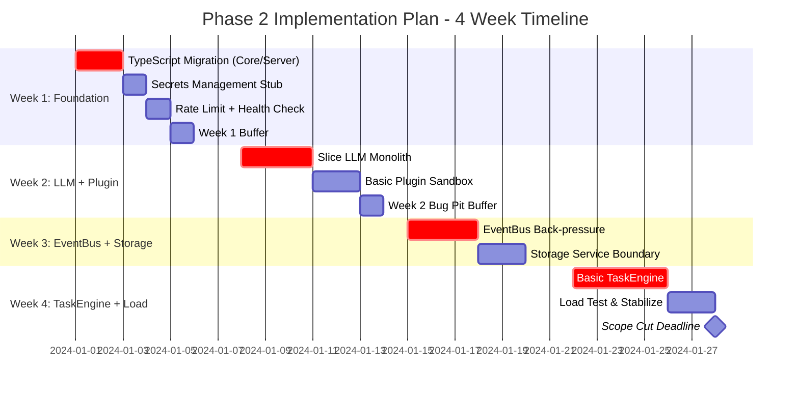
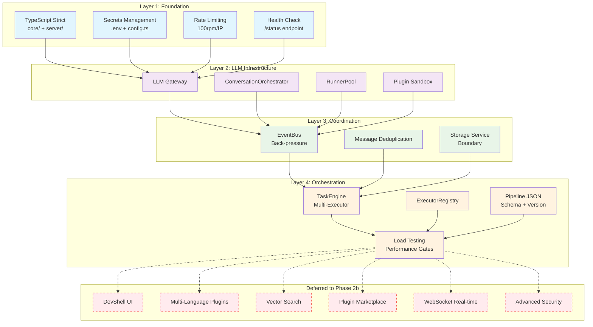
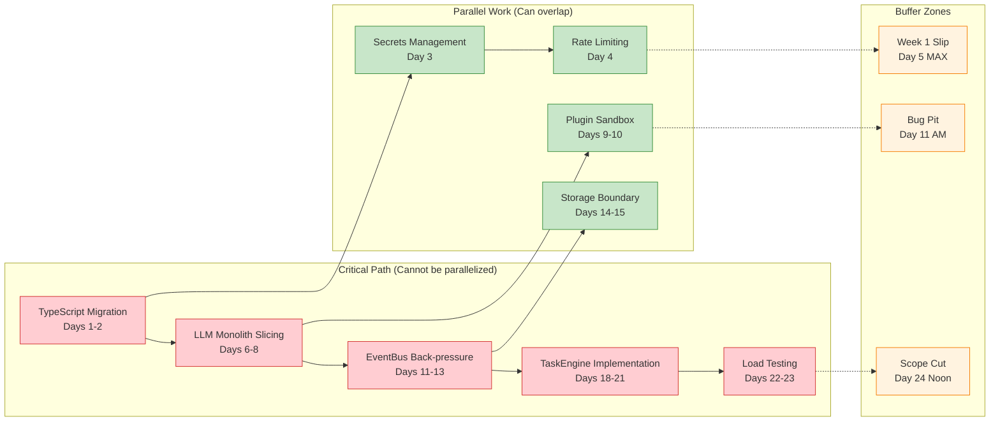
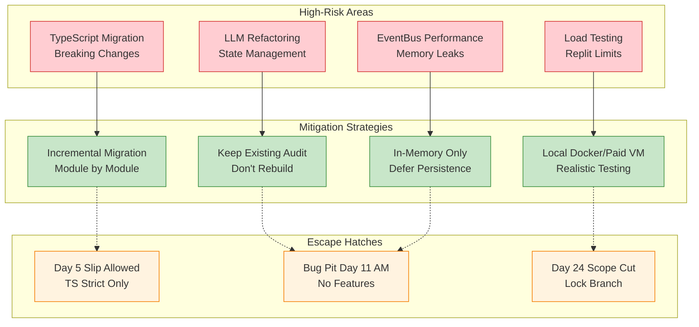

# Phase 2 Implementation Plan - Visual Chart

This document contains a Mermaid chart visualization of the Phase 2 Implementation Plan for the LogoMesh project.

## Implementation Timeline Chart

## Architecture Flow Chart

```mermaid
flowchart TB
    subgraph "Week 1: Foundation Reality Check"
        A1[TypeScript Migration<br/>Core & Server Only]
        A2[Secrets Management<br/>Basic JWT + .env]
        A3[Rate Limit + Health<br/>100rpm/IP + /status]
        A1 --> A2 --> A3
    end
    
    subgraph "Week 2: LLM Spine + Plugin Foundation"
        B1[LLM Gateway<br/>Rate Limit + Auth]
        B2[ConversationOrchestrator<br/>State Machine Only]
        B3[RunnerPool<br/>Per-Model Execution]
        B4[Plugin Sandbox<br/>vm2 + Node.js Only]
        B1 --> B2 --> B3 --> B4
    end
    
    subgraph "Week 3: EventBus Reliability + Storage"
        C1[EventBus Back-pressure<br/>In-Memory + Exponential Backoff]
        C2[Message Deduplication<br/>deliveryId + Dedupe Table]
        C3[DataAccessService<br/>Abstract Storage Coupling]
        C1 --> C2 --> C3
    end
    
    subgraph "Week 4: TaskEngine + Load Testing"
        D1[Multi-Executor Support<br/>Extend LLMTaskRunner]
        D2[ExecutorRegistry<br/>LLM + Plugin Only]
        D3[Pipeline Schema<br/>JSON Workflows + Version]
        D4[Load Testing<br/>250rpm + Performance]
        D1 --> D2 --> D3 --> D4
    end
    
    A3 --> B1
    B4 --> C1
    C3 --> D1
    
    subgraph "Verification Gates"
        VG1[✅ TS Strict + ESLint Pass]
        VG2[✅ JWT Auth + Rate Limits]
        VG3[✅ Plugin Isolation + Sandbox]
        VG4[✅ EventBus 5k Messages]
        VG5[✅ Artillery 250rpm Success]
    end
    
    A3 -.-> VG1
    B4 -.-> VG2
    B4 -.-> VG3
    C2 -.-> VG4
    D4 -.-> VG5
```

## Technical Dependencies Chart

## Critical Path Analysis

## Success Criteria Checklist

```mermaid
flowchart TD
    subgraph "Essential Gates (Binary Pass/Fail)"
        G1[✅ TS strict passes core, server]
        G2[✅ ESLint zero warnings core/server]
        G3[✅ JWT auth login round-trip]
        G4[✅ Rate-limit 100rpm tested]
        G5[✅ /status returns 200 + metrics]
        G6[✅ Plugin starvation test <5s]
        G7[✅ Plugin cannot read /etc/passwd]
        G8[✅ EventBus drains 5k messages]
        G9[✅ TaskEngine <5s median LLM→Plugin]
        G10[✅ Artillery 250rpm: no 5xx, ≤2% 429]
        G11[✅ p50 API ≤250ms, p95 ≤600ms]
        G12[✅ No any types in src/ stretch]
    end
    
    subgraph "Week Dependencies"
        W1[Week 1 Complete] --> G1
        W1 --> G2
        W1 --> G3
        W1 --> G4
        W1 --> G5
        
        W2[Week 2 Complete] --> G6
        W2 --> G7
        
        W3[Week 3 Complete] --> G8
        
        W4[Week 4 Complete] --> G9
        W4 --> G10
        W4 --> G11
        W4 --> G12
    end
    
    subgraph "Final Outcome"
        SUCCESS[🚀 Hardened Spine<br/>Ready for Phase 2b]
    end
    
    G1 --> SUCCESS
    G2 --> SUCCESS
    G3 --> SUCCESS
    G4 --> SUCCESS
    G5 --> SUCCESS
    G6 --> SUCCESS
    G7 --> SUCCESS
    G8 --> SUCCESS
    G9 --> SUCCESS
    G10 --> SUCCESS
    G11 --> SUCCESS
    G12 --> SUCCESS
    
    classDef gate fill:#e8f5e8,stroke:#2e7d32
    classDef week fill:#e3f2fd,stroke:#1976d2
    classDef success fill:#f3e5f5,stroke:#7b1fa2
    
    class G1,G2,G3,G4,G5,G6,G7,G8,G9,G10,G11,G12 gate
    class W1,W2,W3,W4 week
    class SUCCESS success
```

## Risk Mitigation Strategy

