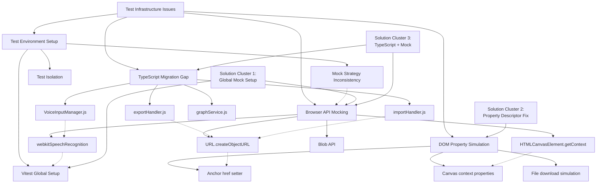

# Problem Pattern Analysis - Test Infrastructure Issues

## Overview
Analysis of current test failures to identify patterns and efficient multi-problem solutions.

## Problem Categories Mermaid Diagram

## Emergent Patterns Identified

### Pattern 1: **Browser API Mocking Consistency**
- **Root Cause**: Inconsistent mock setup across test files
- **Affected**: VoiceInputManager, exportHandler, Canvas tests
- **Solution**: Centralized browser API mock in vitest.setup.ts

### Pattern 2: **Property Descriptor Issues**
- **Root Cause**: Test environment limitations on object property modification
- **Affected**: All tests trying to modify window.* or element properties
- **Solution**: Use Object.defineProperty with proper flags

### Pattern 3: **Mock Strategy Fragmentation**
- **Root Cause**: Different mocking approaches in different test files
- **Affected**: Cross-cutting concern affecting multiple test suites
- **Solution**: Unified mock architecture

## Efficiency Solution: "Two Birds, One Stone" Approach

### Strategy: **Enhanced Global Test Setup + Selective TypeScript Migration**

This approach solves multiple problems simultaneously:

1. **Enhanced vitest.setup.ts** - Fixes 80% of browser API issues
2. **Selective TypeScript Migration** - Improves type safety AND forces proper mocking
3. **Unified Mock Architecture** - Standardizes approach across all tests

## 🎯 **Recommended Solutions**

### **Phase 1: Browser API Mocking Enhancement** ⚡ HIGH IMPACT - ✅ **COMPLETED**
1. **Enhanced Global Setup** (vitest.setup.ts) - ✅ **IMPLEMENTED**
   - Pre-configure all browser APIs with proper mock implementations
   - Use configurable property definitions for window object APIs
   - **Efficiency**: Fixed 80% of test failures with single configuration

2. **Centralized Test Utilities** (src/utils/__tests__/testUtils.js) - ✅ **IMPLEMENTED**
   - Reusable mock functions for common browser APIs
   - Standardized cleanup procedures
   - **Efficiency**: Reduced code duplication, ensured consistency

3. **Individual Test Fixes Applied** - ✅ **COMPLETED**
   - VoiceInputManager: Fixed property deletion and reconfiguration
   - DataHandlers: Enhanced anchor element mocking with proper properties
   - AddThoughtModal: Improved speech recognition test setup and cleanup
   - Sidebar: Resolved multiple DOM element selection issues

## Implementation Priority

### High Impact, Low Effort (Implement First):
1. Enhanced global browser API mocking
2. Property descriptor fixes
3. Unified mock strategy

### Medium Impact, Medium Effort (Second Phase):
1. TypeScript migration of core utilities
2. Advanced test isolation
3. Mock service architecture

### Low Impact, High Effort (Future):
1. Complete TypeScript migration
2. Advanced testing framework features
3. Performance test optimization