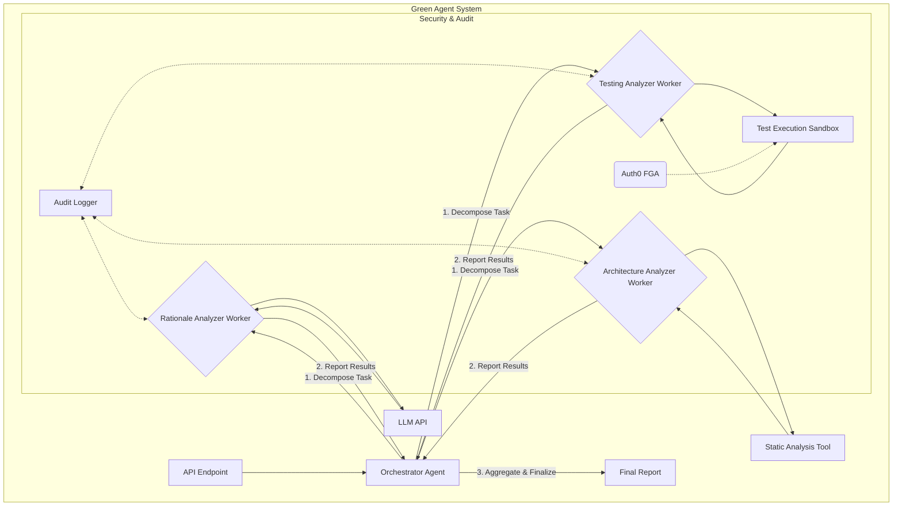
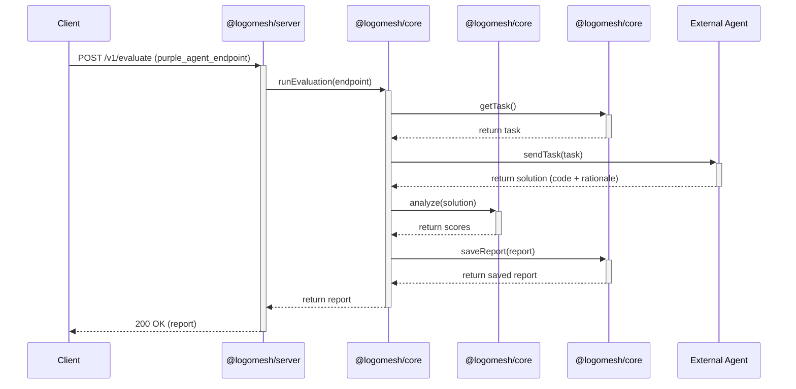

# System Architecture Diagrams

This document contains Mermaid diagrams illustrating the architecture and data flow of the LogoMesh Green Agent.

## Original System Architecture



## Monorepo Package Structure

```mermaid
graph TD
    subgraph @logomesh Monorepo
        Server["@logomesh/server"];
        Core["@logomesh/core"];
        Contracts["@logomesh/contracts"];
        MockAgent["@logomesh/mock-agent"];
        Frontend["@logomesh/frontend"];
    end

    Server --> Core;
    Core --> Contracts;
```

## Green Agent Request Lifecycle


