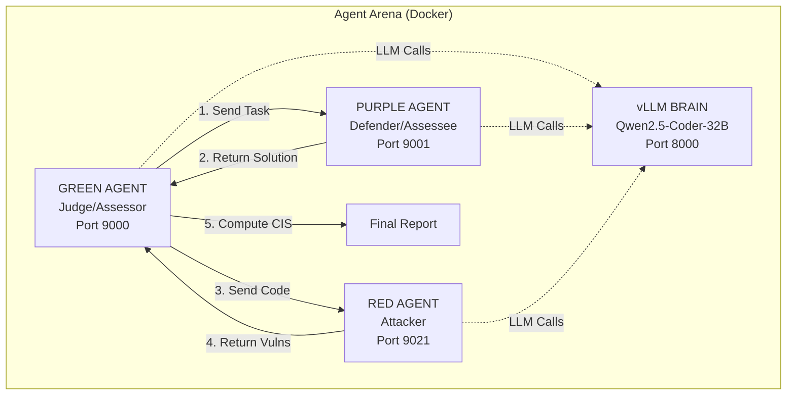
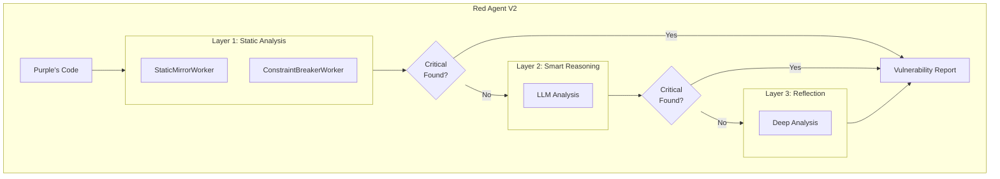
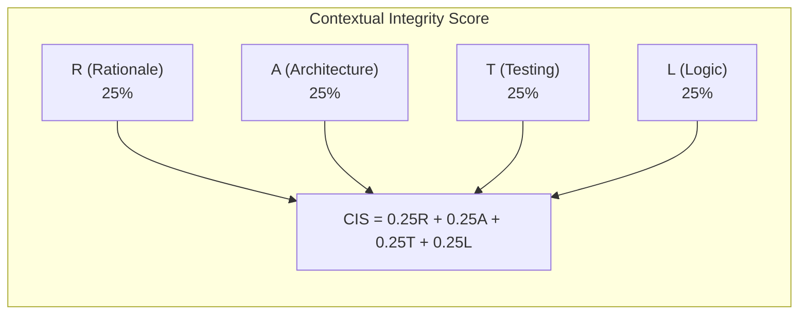
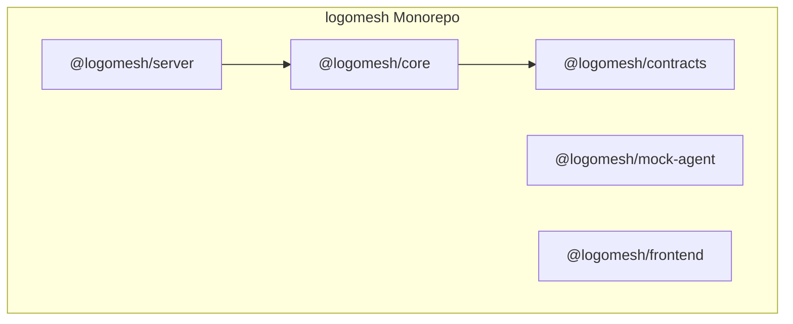

# System Architecture Diagrams

This document contains Mermaid diagrams illustrating the architecture and data flow of the LogoMesh Agent Arena.

## Agent Arena Architecture (Current)

## Red Agent V2 Internal Architecture

## CIS Scoring Components

## Legacy System Architecture (Deprecated)

## Monorepo Package Structure

## Green Agent Request Lifecycle

