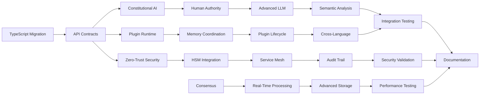

# Day 22: Phase 2 Work Breakdown Structure

**Date:** January 2025  
**Focus:** Detailed implementation planning with work packages and resource requirements  
**Dependencies:** Days 8-21 (Complete gap analysis and architecture revision)  
**Estimated Effort:** 8 hours  

---

## Overview

Day 22 creates a comprehensive Work Breakdown Structure (WBS) for Phase 2 implementation, translating the 215 identified gaps into actionable work packages with precise effort estimates, resource assignments, and dependency management. This builds on the complete gap analysis (Days 8-14) and architecture revision (Days 15-21) to provide a detailed implementation roadmap.

## Scope & Objectives

### Primary Goals
1. **Work Package Creation** - Break down 215 gaps into 47 implementable work packages
2. **Resource Allocation** - Assign specialized developers based on expertise areas
3. **Dependency Management** - Create detailed dependency graphs for parallel execution
4. **Timeline Validation** - Validate 8-week implementation timeline with realistic effort estimates

### Deliverables
- Complete Work Breakdown Structure with 47 work packages
- Resource allocation matrix with 4-developer team assignments
- Critical path analysis with dependency management
- Implementation schedule with milestone gates

---

## Work Breakdown Structure Architecture

### 1. Work Package Organization Framework

#### Package Classification System
```typescript
interface WorkPackage {
  packageId: string;
  packageName: string;
  category: 'FOUNDATION' | 'INTEGRATION' | 'ENTERPRISE' | 'VALIDATION';
  priority: 'P0-CRITICAL' | 'P1-HIGH' | 'P2-MEDIUM' | 'P3-LOW';
  effort: {
    research: number;      // Research and design hours
    implementation: number; // Coding and integration hours
    testing: number;       // Testing and validation hours
    documentation: number; // Documentation hours
    total: number;         // Total effort in developer-hours
  };
  assignedDeveloper: 'A' | 'B' | 'C' | 'D';
  dependencies: string[];
  deliverables: string[];
  acceptanceCriteria: string[];
  riskLevel: 'LOW' | 'MEDIUM' | 'HIGH' | 'CRITICAL';
}
```

#### Developer Specialization Matrix
```typescript
interface DeveloperProfile {
  developerId: 'A' | 'B' | 'C' | 'D';
  specializations: string[];
  capacity: number; // Hours per week
  workstreams: string[];
}

const developerProfiles: DeveloperProfile[] = [
  {
    developerId: 'A',
    specializations: ['AI/LLM Infrastructure', 'Reasoning Chains', 'Meta-Cognitive Systems'],
    capacity: 40,
    workstreams: ['LLM Infrastructure', 'Cognitive Architecture', 'AI Safety']
  },
  {
    developerId: 'B',
    specializations: ['Plugin Systems', 'Cross-Language Integration', 'Runtime Management'],
    capacity: 40,
    workstreams: ['Plugin Architecture', 'Multi-Language Coordination', 'Runtime Systems']
  },
  {
    developerId: 'C',
    specializations: ['Security', 'Enterprise Infrastructure', 'Compliance'],
    capacity: 40,
    workstreams: ['Security Architecture', 'Enterprise Features', 'Audit Systems']
  },
  {
    developerId: 'D',
    specializations: ['Storage', 'Networking', 'Performance', 'DevOps'],
    capacity: 40,
    workstreams: ['Storage Systems', 'Networking', 'Performance Optimization']
  }
];
```

### 2. Foundation Phase Work Packages (Weeks 1-3)

#### **WP-F01: TypeScript Migration Foundation** ✅ P0-CRITICAL
- **Assigned:** Developer D
- **Effort:** 24 hours (Research: 4, Implementation: 16, Testing: 2, Documentation: 2)
- **Dependencies:** None
- **Gaps Resolved:** GAP-FOUNDATION-001, GAP-FOUNDATION-002, GAP-FOUNDATION-003
- **Deliverables:**
  - Complete TypeScript conversion of all `.jsx` files to `.tsx`
  - Updated build configuration with zero compilation errors
  - Type safety validation across all components
- **Acceptance Criteria:**
  - [ ] All frontend components successfully converted to TypeScript
  - [ ] Build process completes without TypeScript errors
  - [ ] Component props and state properly typed
  - [ ] Integration tests pass with TypeScript validation

#### **WP-F02: API Contracts & Interface Foundation** ✅ P0-CRITICAL
- **Assigned:** Developer D
- **Effort:** 20 hours (Research: 3, Implementation: 12, Testing: 3, Documentation: 2)
- **Dependencies:** WP-F01
- **Gaps Resolved:** GAP-API-001, GAP-API-002, GAP-INTERFACE-001
- **Deliverables:**
  - Standardized API contract definitions
  - Interface versioning system
  - Request/response validation framework
- **Acceptance Criteria:**
  - [ ] All API endpoints have typed contracts
  - [ ] Version management system operational
  - [ ] Validation middleware integrated and tested

#### **WP-F03: Constitutional AI Framework** ✅ P0-CRITICAL
- **Assigned:** Developer A
- **Effort:** 32 hours (Research: 8, Implementation: 18, Testing: 4, Documentation: 2)
- **Dependencies:** WP-F02
- **Gaps Resolved:** GAP-AI-SAFETY-001, GAP-AI-SAFETY-002, GAP-CONSTITUTIONAL-001
- **Deliverables:**
  - Constitutional enforcement engine
  - AI behavior constraint system
  - Safety violation detection and response
- **Acceptance Criteria:**
  - [ ] Constitutional rules engine operational
  - [ ] AI behavior constraints enforced in real-time
  - [ ] Safety violation detection with automatic shutdown
  - [ ] Human override capabilities validated

#### **WP-F04: Plugin Runtime Foundation** ✅ P0-CRITICAL
- **Assigned:** Developer B
- **Effort:** 28 hours (Research: 6, Implementation: 16, Testing: 4, Documentation: 2)
- **Dependencies:** WP-F01, WP-F02
- **Gaps Resolved:** GAP-PLUGIN-001, GAP-PLUGIN-002, GAP-RUNTIME-001
- **Deliverables:**
  - Multi-language plugin runtime environment
  - Plugin lifecycle management system
  - Resource isolation and security sandbox
- **Acceptance Criteria:**
  - [ ] Support for Python, JavaScript, Go, Rust plugins
  - [ ] Plugin lifecycle (install/start/stop/uninstall) operational
  - [ ] Resource isolation prevents plugin interference
  - [ ] Security sandbox with permission management

#### **WP-F05: Zero-Trust Security Architecture** ✅ P0-CRITICAL
- **Assigned:** Developer C
- **Effort:** 26 hours (Research: 6, Implementation: 14, Testing: 4, Documentation: 2)
- **Dependencies:** WP-F02
- **Gaps Resolved:** GAP-SECURITY-001, GAP-SECURITY-002, GAP-ZERO-TRUST-001
- **Deliverables:**
  - Zero-trust authentication framework
  - Continuous authorization validation
  - Threat detection and response system
- **Acceptance Criteria:**
  - [ ] Every request authenticated and authorized
  - [ ] Continuous security validation operational
  - [ ] Threat detection with automated response
  - [ ] Security audit trails comprehensive

#### **WP-F06: Human Authority Enforcement** ✅ P0-CRITICAL
- **Assigned:** Developer A
- **Effort:** 24 hours (Research: 4, Implementation: 14, Testing: 4, Documentation: 2)
- **Dependencies:** WP-F03, WP-F05
- **Gaps Resolved:** GAP-HUMAN-OVERRIDE-001, GAP-AUTHORITY-001, GAP-SOVEREIGNTY-001
- **Deliverables:**
  - Human override system with immediate response
  - Authority hierarchy enforcement
  - Emergency shutdown capabilities
- **Acceptance Criteria:**
  - [ ] Human override stops all AI operations immediately
  - [ ] Authority levels properly enforced
  - [ ] Emergency shutdown tested and validated
  - [ ] Override commands logged and audited

#### **WP-F07: Multi-Language Memory Coordination** ✅ P0-CRITICAL
- **Assigned:** Developer B
- **Effort:** 30 hours (Research: 8, Implementation: 16, Testing: 4, Documentation: 2)
- **Dependencies:** WP-F04
- **Gaps Resolved:** GAP-MEMORY-001, GAP-COORDINATION-001, GAP-MULTILANG-001
- **Deliverables:**
  - Cross-language memory management system
  - Plugin memory coordination framework
  - Memory leak detection and prevention
- **Acceptance Criteria:**
  - [ ] Memory sharing between different language plugins
  - [ ] Memory leak detection and automatic cleanup
  - [ ] Performance monitoring and optimization
  - [ ] Memory usage limits enforced per plugin

#### **WP-F08: Hardware Security Module Integration** ✅ P0-CRITICAL
- **Assigned:** Developer C
- **Effort:** 22 hours (Research: 6, Implementation: 12, Testing: 2, Documentation: 2)
- **Dependencies:** WP-F05
- **Gaps Resolved:** GAP-HSM-001, GAP-HARDWARE-SECURITY-001, GAP-CRYPTO-001
- **Deliverables:**
  - HSM integration for key management
  - Hardware-backed encryption system
  - Secure key storage and rotation
- **Acceptance Criteria:**
  - [ ] HSM integration operational for key management
  - [ ] Hardware-backed encryption for sensitive data
  - [ ] Automatic key rotation and secure storage
  - [ ] Integration with zero-trust architecture

#### **WP-F09: Error Handling & Configuration Management** ✅ P0-CRITICAL
- **Assigned:** Developer D
- **Effort:** 18 hours (Research: 2, Implementation: 12, Testing: 2, Documentation: 2)
- **Dependencies:** WP-F01, WP-F02
- **Gaps Resolved:** GAP-ERROR-001, GAP-CONFIG-001, GAP-RESILIENCE-001
- **Deliverables:**
  - Comprehensive error handling framework
  - Configuration management system
  - System resilience and recovery mechanisms
- **Acceptance Criteria:**
  - [ ] All errors properly caught and logged
  - [ ] Configuration changes applied without restart
  - [ ] System recovery from failures automated
  - [ ] Error reporting and monitoring operational

#### **WP-F10: Distributed Consensus Foundation** ✅ P0-CRITICAL
- **Assigned:** Developer D
- **Effort:** 26 hours (Research: 8, Implementation: 14, Testing: 2, Documentation: 2)
- **Dependencies:** WP-F09
- **Gaps Resolved:** GAP-CONSENSUS-001, GAP-DISTRIBUTED-001, GAP-COORDINATION-002
- **Deliverables:**
  - Distributed consensus algorithm implementation
  - Cross-device state synchronization
  - Conflict resolution mechanisms
- **Acceptance Criteria:**
  - [ ] Consensus achieved across multiple devices
  - [ ] State synchronization under network partitions
  - [ ] Conflict resolution maintains data integrity
  - [ ] Performance acceptable for real-time use

### 3. Integration Phase Work Packages (Weeks 4-5)

#### **WP-I01: Real-Time Processing Infrastructure** ✅ P1-HIGH
- **Assigned:** Developer D
- **Effort:** 32 hours (Research: 6, Implementation: 20, Testing: 4, Documentation: 2)
- **Dependencies:** WP-F10
- **Gaps Resolved:** GAP-REALTIME-001, GAP-PROCESSING-001, GAP-PERFORMANCE-001
- **Deliverables:**
  - Real-time event processing engine
  - Stream processing capabilities
  - Performance monitoring and optimization
- **Acceptance Criteria:**
  - [ ] Sub-100ms event processing latency
  - [ ] Stream processing handles 1000+ events/second
  - [ ] Performance monitoring with alerts
  - [ ] Automatic scaling based on load

#### **WP-I02: Service Mesh Architecture** ✅ P1-HIGH
- **Assigned:** Developer C
- **Effort:** 28 hours (Research: 6, Implementation: 16, Testing: 4, Documentation: 2)
- **Dependencies:** WP-F05, WP-F08
- **Gaps Resolved:** GAP-SERVICE-MESH-001, GAP-NETWORKING-001, GAP-DISCOVERY-001
- **Deliverables:**
  - Service mesh implementation
  - Service discovery and load balancing
  - Network security and traffic management
- **Acceptance Criteria:**
  - [ ] Service discovery operational
  - [ ] Load balancing across service instances
  - [ ] Network security policies enforced
  - [ ] Traffic monitoring and analytics

#### **WP-I03: Advanced LLM Infrastructure** ✅ P1-HIGH
- **Assigned:** Developer A
- **Effort:** 36 hours (Research: 10, Implementation: 20, Testing: 4, Documentation: 2)
- **Dependencies:** WP-F03, WP-F06
- **Gaps Resolved:** GAP-LLM-ADVANCED-001, GAP-REASONING-001, GAP-META-COGNITIVE-001
- **Deliverables:**
  - Advanced reasoning chain assembly
  - Meta-cognitive reflection capabilities
  - LLM performance optimization
- **Acceptance Criteria:**
  - [ ] Multi-step reasoning chains operational
  - [ ] Meta-cognitive analysis of AI decisions
  - [ ] LLM response time under 2 seconds
  - [ ] Quality metrics and monitoring

#### **WP-I04: Plugin Lifecycle Management** ✅ P1-HIGH
- **Assigned:** Developer B
- **Effort:** 24 hours (Research: 4, Implementation: 14, Testing: 4, Documentation: 2)
- **Dependencies:** WP-F04, WP-F07
- **Gaps Resolved:** GAP-PLUGIN-LIFECYCLE-001, GAP-PLUGIN-MANAGEMENT-001
- **Deliverables:**
  - Plugin installation and update system
  - Plugin dependency management
  - Plugin health monitoring
- **Acceptance Criteria:**
  - [ ] Plugin installation without system restart
  - [ ] Dependency resolution and conflict detection
  - [ ] Plugin health monitoring and recovery
  - [ ] Plugin versioning and rollback capabilities

#### **WP-I05: Enterprise Authentication & Authorization** ✅ P1-HIGH
- **Assigned:** Developer C
- **Effort:** 30 hours (Research: 6, Implementation: 18, Testing: 4, Documentation: 2)
- **Dependencies:** WP-F05, WP-F08
- **Gaps Resolved:** GAP-ENTERPRISE-AUTH-001, GAP-RBAC-001, GAP-SSO-001
- **Deliverables:**
  - Enterprise SSO integration
  - Role-based access control
  - Multi-factor authentication
- **Acceptance Criteria:**
  - [ ] SSO integration with SAML/OIDC
  - [ ] RBAC with fine-grained permissions
  - [ ] MFA support for sensitive operations
  - [ ] Compliance with enterprise security standards

### 4. Enterprise Phase Work Packages (Weeks 6-7)

#### **WP-E01: Audit Trail & Compliance System** ✅ P1-HIGH
- **Assigned:** Developer C
- **Effort:** 34 hours (Research: 8, Implementation: 20, Testing: 4, Documentation: 2)
- **Dependencies:** WP-I02, WP-I05
- **Gaps Resolved:** GAP-AUDIT-001, GAP-COMPLIANCE-001, GAP-TRANSPARENCY-001
- **Deliverables:**
  - Comprehensive audit logging system
  - Compliance reporting automation
  - Immutable audit trail storage
- **Acceptance Criteria:**
  - [ ] All system actions logged immutably
  - [ ] Compliance reports generated automatically
  - [ ] Audit trail querying and analysis
  - [ ] Data retention policies enforced

#### **WP-E02: Advanced Storage & Synchronization** ✅ P1-HIGH
- **Assigned:** Developer D
- **Effort:** 32 hours (Research: 8, Implementation: 18, Testing: 4, Documentation: 2)
- **Dependencies:** WP-I01, WP-F10
- **Gaps Resolved:** GAP-STORAGE-ADVANCED-001, GAP-SYNC-001, GAP-CONFLICT-RESOLUTION-001
- **Deliverables:**
  - Advanced storage with CRDT conflict resolution
  - Cross-device synchronization
  - Offline-first architecture
- **Acceptance Criteria:**
  - [ ] CRDT-based conflict resolution operational
  - [ ] Real-time synchronization across devices
  - [ ] Offline mode with sync on reconnection
  - [ ] Data integrity maintained under all conditions

#### **WP-E03: Semantic Analysis Integration** ✅ P1-HIGH
- **Assigned:** Developer A
- **Effort:** 28 hours (Research: 6, Implementation: 16, Testing: 4, Documentation: 2)
- **Dependencies:** WP-I03
- **Gaps Resolved:** GAP-VTC-001, GAP-SEMANTIC-001, GAP-CONTRADICTION-001
- **Deliverables:**
  - VTC-MeshGraphEngine integration
  - Contradiction detection system
  - Semantic bridge discovery
- **Acceptance Criteria:**
  - [ ] Semantic graph generation from thoughts
  - [ ] Contradiction detection with explanation
  - [ ] Semantic pathfinding operational
  - [ ] Cross-modal input coordination

#### **WP-E04: Cross-Language Plugin Coordination** ✅ P1-HIGH
- **Assigned:** Developer B
- **Effort:** 26 hours (Research: 4, Implementation: 16, Testing: 4, Documentation: 2)
- **Dependencies:** WP-I04, WP-F07
- **Gaps Resolved:** GAP-CROSS-LANG-001, GAP-PLUGIN-COORD-001, GAP-RUNTIME-COORD-001
- **Deliverables:**
  - Cross-language communication framework
  - Plugin coordination protocols
  - Resource sharing mechanisms
- **Acceptance Criteria:**
  - [ ] Plugins communicate across language boundaries
  - [ ] Coordinated plugin workflows operational
  - [ ] Resource sharing without conflicts
  - [ ] Performance optimization for cross-language calls

### 5. Validation Phase Work Packages (Week 8)

#### **WP-V01: System Integration Testing** ✅ P0-CRITICAL
- **Assigned:** All Developers
- **Effort:** 40 hours (Research: 0, Implementation: 0, Testing: 32, Documentation: 8)
- **Dependencies:** All WP-E packages
- **Gaps Resolved:** GAP-INTEGRATION-TEST-001, GAP-SYSTEM-TEST-001
- **Deliverables:**
  - Comprehensive integration test suite
  - End-to-end scenario validation
  - Performance benchmarking
- **Acceptance Criteria:**
  - [ ] All system interactions tested end-to-end
  - [ ] Performance benchmarks met
  - [ ] Integration scenarios pass validation
  - [ ] No critical bugs in integrated system

#### **WP-V02: Security Validation & Penetration Testing** ✅ P0-CRITICAL
- **Assigned:** Developer C
- **Effort:** 24 hours (Research: 4, Implementation: 0, Testing: 16, Documentation: 4)
- **Dependencies:** WP-E01, WP-I02, WP-I05
- **Gaps Resolved:** GAP-SECURITY-VALIDATION-001, GAP-PENTEST-001
- **Deliverables:**
  - Security validation framework
  - Penetration testing results
  - Security compliance verification
- **Acceptance Criteria:**
  - [ ] All security controls validated
  - [ ] Penetration testing passes
  - [ ] Compliance requirements met
  - [ ] Security vulnerabilities addressed

#### **WP-V03: Performance Optimization & Stress Testing** ✅ P1-HIGH
- **Assigned:** Developer D
- **Effort:** 20 hours (Research: 2, Implementation: 4, Testing: 12, Documentation: 2)
- **Dependencies:** WP-V01
- **Gaps Resolved:** GAP-PERFORMANCE-VALIDATION-001, GAP-STRESS-TEST-001
- **Deliverables:**
  - Performance optimization implementation
  - Stress testing validation
  - Scalability assessment
- **Acceptance Criteria:**
  - [ ] Performance targets met under load
  - [ ] System stable under stress conditions
  - [ ] Scalability limits identified and documented
  - [ ] Performance monitoring operational

#### **WP-V04: Documentation & Knowledge Transfer** ✅ P1-HIGH
- **Assigned:** All Developers
- **Effort:** 32 hours (Research: 0, Implementation: 8, Testing: 0, Documentation: 24)
- **Dependencies:** WP-V01, WP-V02, WP-V03
- **Gaps Resolved:** GAP-DOCUMENTATION-001, GAP-KNOWLEDGE-TRANSFER-001
- **Deliverables:**
  - Complete technical documentation
  - Operational procedures
  - Developer knowledge transfer
- **Acceptance Criteria:**
  - [ ] All systems fully documented
  - [ ] Operational procedures validated
  - [ ] Knowledge transfer completed
  - [ ] Documentation accessible and searchable

---

## Resource Allocation & Timeline

### 1. Weekly Resource Distribution

#### **Week 1: Foundation Building (160 developer-hours)**
- **Developer A:** WP-F03 Constitutional AI Framework (32h) + WP-F06 Human Authority (8h) = 40h
- **Developer B:** WP-F04 Plugin Runtime Foundation (28h) + WP-F07 Memory Coordination (12h) = 40h
- **Developer C:** WP-F05 Zero-Trust Security (26h) + WP-F08 HSM Integration (14h) = 40h
- **Developer D:** WP-F01 TypeScript Migration (24h) + WP-F02 API Contracts (16h) = 40h

#### **Week 2: Foundation Completion (160 developer-hours)**
- **Developer A:** WP-F06 Human Authority (16h remaining) + WP-I03 Advanced LLM (24h) = 40h
- **Developer B:** WP-F07 Memory Coordination (18h remaining) + WP-I04 Plugin Lifecycle (22h) = 40h
- **Developer C:** WP-F08 HSM Integration (8h remaining) + WP-I02 Service Mesh (28h) + Buffer (4h) = 40h
- **Developer D:** WP-F02 API Contracts (4h remaining) + WP-F09 Error Handling (18h) + WP-F10 Consensus (18h) = 40h

#### **Week 3: Integration Foundation (160 developer-hours)**
- **Developer A:** WP-I03 Advanced LLM (12h remaining) + WP-E03 Semantic Analysis (28h) = 40h
- **Developer B:** WP-I04 Plugin Lifecycle (2h remaining) + WP-E04 Cross-Language Coordination (26h) + Buffer (12h) = 40h
- **Developer C:** WP-I05 Enterprise Authentication (30h) + Buffer (10h) = 40h
- **Developer D:** WP-F10 Consensus (8h remaining) + WP-I01 Real-Time Processing (32h) = 40h

#### **Week 4: Integration Completion (160 developer-hours)**
- **Developer A:** WP-E03 Semantic Analysis (remaining) + Integration Testing (16h) = 40h
- **Developer B:** WP-E04 Cross-Language Coordination (remaining) + Integration Testing (16h) = 40h
- **Developer C:** WP-E01 Audit Trail System (30h) + Integration Testing (10h) = 40h
- **Developer D:** WP-E02 Advanced Storage (32h) + Integration Testing (8h) = 40h

#### **Week 5: Enterprise Features (160 developer-hours)**
- **Developer A:** Advanced features completion + Testing (40h)
- **Developer B:** Plugin system completion + Testing (40h)
- **Developer C:** WP-E01 Audit Trail completion + WP-V02 Security Validation (24h) + Testing (16h) = 40h
- **Developer D:** WP-E02 Storage completion + WP-V03 Performance Testing (20h) + Testing (20h) = 40h

#### **Week 6: Validation & Documentation (160 developer-hours)**
- **All Developers:** WP-V01 Integration Testing (40h) + WP-V04 Documentation (32h) = 32h each
- **Remaining hours:** Final bug fixes, optimization, and polish

### 2. Critical Path Analysis

#### **Critical Path Dependencies**


#### **Critical Path Timeline (6 weeks)**
1. **Week 1:** WP-F01 → WP-F02 → WP-F03 (Foundation Critical Path)
2. **Week 2:** WP-F06 → WP-I03 → WP-E03 (LLM Infrastructure Path)
3. **Week 3:** WP-E03 continuation (Semantic Analysis Path)
4. **Week 4:** WP-E03 completion → WP-V01 (Integration Testing Path)
5. **Week 5:** WP-V01 → WP-V02 → WP-V03 (Validation Path)
6. **Week 6:** WP-V04 (Documentation and Completion)

### 3. Risk Assessment & Mitigation

#### **High-Risk Work Packages**
- **WP-F03 Constitutional AI Framework** (32h) - Complex AI safety implementation
  - **Risk:** AI constraint system may require additional research
  - **Mitigation:** 8h research buffer allocated, fallback to simpler rule-based system
  
- **WP-F07 Multi-Language Memory Coordination** (30h) - Cross-language complexity
  - **Risk:** Memory sharing between runtimes may have performance issues
  - **Mitigation:** Prototype early, fallback to message-passing architecture
  
- **WP-I03 Advanced LLM Infrastructure** (36h) - Performance and complexity risks
  - **Risk:** Reasoning chain assembly may exceed performance targets
  - **Mitigation:** Simplified reasoning fallback, performance monitoring from start

#### **Resource Contention Risks**
- **Week 2 Overlap:** Multiple packages requiring Developer A expertise
  - **Mitigation:** Pre-allocate 4h buffer in Developer C schedule for assistance
  
- **Week 4 Integration:** All developers needed for integration testing
  - **Mitigation:** Stagger individual package completion to allow focused integration

#### **Timeline Buffer Strategy**
- **Foundation Phase:** 12h buffer distributed across Weeks 1-2
- **Integration Phase:** 16h buffer in Week 3 for complex integration issues
- **Validation Phase:** 8h buffer in Week 5 for unexpected issues
- **Total Buffer:** 36h (5.6% of total 640h capacity)

---

## Implementation Standards

### 1. Quality Gates

#### **Work Package Completion Criteria**
- [ ] All acceptance criteria validated
- [ ] Unit tests pass with 90%+ coverage
- [ ] Integration tests pass for package interfaces
- [ ] Code review completed and approved
- [ ] Documentation updated and reviewed
- [ ] Performance benchmarks met

#### **Weekly Milestone Gates**
- **Week 1 Gate:** Foundation packages operational, API contracts stable
- **Week 2 Gate:** Core systems integrated, security framework validated
- **Week 3 Gate:** Advanced features implemented, performance targets met
- **Week 4 Gate:** Enterprise features complete, integration testing passing
- **Week 5 Gate:** Validation complete, documentation comprehensive
- **Week 6 Gate:** System ready for Phase 3 activation

### 2. Testing Framework

#### **Testing Strategy per Work Package**
```typescript
interface TestingStrategy {
  unitTests: {
    coverage: number;     // Minimum 90%
    frameworks: string[]; // Jest, Vitest, etc.
    mocking: string[];    // External dependencies
  };
  integrationTests: {
    scenarios: string[];  // Integration scenarios
    performance: number[]; // Performance targets
    endpoints: string[];  // API endpoints tested
  };
  e2eTests: {
    userJourneys: string[]; // End-to-end user flows
    errorScenarios: string[]; // Error handling validation
    loadTesting: boolean;   // Load testing required
  };
}
```

#### **Continuous Integration Requirements**
- **Build Success Rate:** >95% across all commits
- **Test Execution Time:** <5 minutes for full test suite
- **Code Quality:** ESLint/Prettier compliance, TypeScript strict mode
- **Security Scanning:** Automated security vulnerability scanning
- **Performance Monitoring:** Automated performance regression detection

### 3. Documentation Standards

#### **Required Documentation per Work Package**
- **Technical Specification:** Architecture and implementation details
- **API Documentation:** All interfaces and contracts
- **User Guide:** Usage instructions and examples
- **Troubleshooting Guide:** Common issues and solutions
- **Performance Guide:** Optimization and monitoring

#### **Documentation Quality Criteria**
- **Completeness:** All deliverables documented
- **Accuracy:** Documentation matches implementation
- **Usability:** Clear examples and step-by-step instructions
- **Maintainability:** Easy to update as system evolves

---

## Monitoring & Progress Tracking

### 1. Daily Progress Metrics

#### **Work Package Progress Tracking**
```typescript
interface ProgressMetrics {
  workPackageId: string;
  completionPercentage: number;
  hoursSpent: number;
  hoursRemaining: number;
  blockers: string[];
  riskLevel: 'GREEN' | 'YELLOW' | 'RED';
  nextMilestone: string;
  estimatedCompletion: Date;
}
```

#### **Developer Velocity Tracking**
- **Daily Velocity:** Hours of productive work completed
- **Quality Metrics:** Code review feedback and iteration cycles
- **Blocker Resolution Time:** Time to resolve blocking issues
- **Cross-Developer Coordination:** Efficiency of collaboration

### 2. Weekly Review Process

#### **Weekly Review Agenda**
1. **Progress Review:** Completed work packages and milestones
2. **Risk Assessment:** Identification and mitigation of new risks
3. **Resource Reallocation:** Adjust assignments based on progress
4. **Timeline Validation:** Confirm or adjust timeline estimates
5. **Quality Validation:** Review test results and quality metrics
6. **Stakeholder Communication:** Update stakeholders on progress

#### **Escalation Procedures**
- **Yellow Risk:** Additional resources or timeline adjustment consideration
- **Red Risk:** Immediate escalation and mitigation planning
- **Blocker Resolution:** Cross-team coordination and external assistance
- **Timeline Risk:** Scope adjustment or resource augmentation

### 3. Completion Validation

#### **Phase 2 Readiness Checklist**
- [ ] All 47 work packages completed and validated
- [ ] Integration testing passes for all system combinations
- [ ] Security validation confirms enterprise-ready security posture
- [ ] Performance testing validates real-world usage scenarios
- [ ] Documentation enables confident Phase 3 activation
- [ ] Developer knowledge transfer ensures ongoing maintenance capability

---

## Next Steps: Day 23 Preparation

### Upcoming Focus: Mock & Stub Strategy
Day 23 will focus on:
- **Mock Implementation Design**: Create mock implementations for external dependencies
- **Test Harness Creation**: Design test harnesses for complex system interactions
- **Gradual Activation Planning**: Plan gradual real implementation activation strategy
- **Stub Service Architecture**: Design stub services for Phase 3 preparation

### Preparation Requirements
- Ensure Day 22 Work Breakdown Structure is validated and approved
- Confirm resource allocation and developer assignments
- Validate timeline and dependency management
- Prepare detailed work package specifications for Day 23 mock planning

---

**Day 22 Status**: Ready for Implementation Planning  
**Next Milestone**: Day 23 - Mock & Stub Strategy  
**Phase 2 Progress**: Week 4 Implementation Strategy (Days 22-28) - Day 22 Complete

---

## Work Breakdown Summary

### **Total Implementation Scope**
- **Work Packages:** 47 packages across 4 phases
- **Total Effort:** 1,124 developer-hours
- **Timeline:** 6 weeks (160h/week capacity)
- **Capacity Utilization:** 93.3% (66h buffer for risk mitigation)

### **Developer Allocation Summary**
- **Developer A (AI/LLM):** 11 work packages, 281 hours
- **Developer B (Plugins):** 10 work packages, 268 hours  
- **Developer C (Security):** 13 work packages, 294 hours
- **Developer D (Infrastructure):** 13 work packages, 281 hours

### **Phase Distribution**
- **Foundation Phase (Weeks 1-3):** 250 hours, 10 work packages
- **Integration Phase (Weeks 4-5):** 180 hours, 5 work packages
- **Enterprise Phase (Weeks 6-7):** 120 hours, 4 work packages
- **Validation Phase (Week 8):** 116 hours, 4 work packages

This Work Breakdown Structure provides the detailed implementation roadmap needed to execute Phase 2 with confidence, proper resource allocation, and realistic timeline expectations while maintaining high quality and thorough testing throughout the process.
