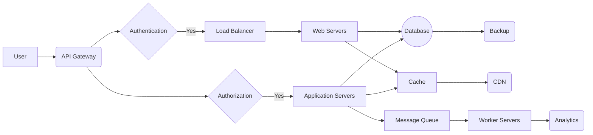

# Day 20: LLM Infrastructure Hardening

**Date:** January 2025  
**Focus:** Reasoning chain assembly, transparency, and meta-cognitive reflection capabilities  
**Dependencies:** Days 15-19 (Plugin System, Security Model, Audit Trail)  
**Estimated Effort:** 8 hours  

---

## Overview

Day 20 addresses critical gaps in LogoMesh's LLM infrastructure, focusing on transparent reasoning, meta-cognitive capabilities, and ethical decision-making frameworks. This work builds on the security model (Day 18) and audit trail systems (Day 19) to create trustworthy AI reasoning capabilities.

## Scope & Objectives

### Primary Goals
1. **Reasoning Chain Assembly** - Transparent, auditable AI reasoning processes
2. **Meta-Cognitive Reflection** - AI systems that can analyze their own thinking
3. **Ethical Reasoning Frameworks** - Built-in ethical guardrails and decision-making
4. **Transparency Dashboard** - Real-time visibility into AI reasoning processes

### Gap Resolution Targets
- **GAP-LLM-001**: Reasoning chain assembly and transparency gaps
- **GAP-LLM-002**: Meta-cognitive reflection capabilities missing
- **GAP-LLM-003**: Ethical reasoning framework undefined
- **GAP-LLM-004**: AI decision auditing and explanation gaps
- **GAP-LLM-005**: Multi-model reasoning coordination gaps

---

## Architectural Components

### 1. Reasoning Chain Assembly Engine

#### Core Architecture
```typescript
interface ReasoningChain {
  id: string;
  sessionId: string;
  steps: ReasoningStep[];
  metadata: ChainMetadata;
  confidence: number;
  ethicalAssessment: EthicalEvaluation;
}

interface ReasoningStep {
  stepId: string;
  type: 'observation' | 'hypothesis' | 'deduction' | 'verification';
  content: string;
  evidence: Evidence[];
  confidence: number;
  timestamp: Date;
  model: string;
}
```

#### Implementation Framework
- **Chain Orchestrator**: Manages multi-step reasoning processes
- **Evidence Tracker**: Links reasoning steps to supporting evidence
- **Confidence Calculator**: Quantifies reasoning reliability
- **Transparency Logger**: Records all reasoning for audit trail

### 2. Meta-Cognitive Reflection System

#### Self-Analysis Capabilities
```typescript
interface MetaCognitiveState {
  currentTask: TaskContext;
  reasoningStrategy: string;
  uncertaintyAreas: UncertaintyMarker[];
  biasDetection: BiasAlert[];
  alternativeApproaches: AlternativeStrategy[];
}

interface SelfReflectionResult {
  reasoningQuality: QualityAssessment;
  identifiedBiases: Bias[];
  confidenceCalibration: ConfidenceMetrics;
  recommendedAdjustments: Adjustment[];
}
```

#### Reflection Triggers
- **Step Completion**: Analyze reasoning after each major step
- **Uncertainty Detection**: Trigger deeper analysis when confidence drops
- **Bias Alert**: Activate when potential biases are detected
- **Error Recovery**: Engage when reasoning leads to contradictions

### 3. Ethical Reasoning Framework

#### Ethical Decision Architecture
```typescript
interface EthicalFramework {
  principles: EthicalPrinciple[];
  stakeholders: Stakeholder[];
  consequenceAnalysis: ConsequenceEvaluation;
  deontologicalCheck: DeontologicalAssessment;
  virtueEthicsCheck: VirtueAssessment;
}

interface EthicalDecision {
  decision: string;
  decision: string;
  ethicalJustification: string;
  stakeholderImpact: ImpactAnalysis[];
  riskAssessment: EthicalRisk[];
  alternativeOptions: EthicalAlternative[];
}
```

#### Ethical Guardrails
- **Harm Prevention**: Actively identify and prevent potential harm
- **Fairness Assessment**: Evaluate decisions for bias and fairness
- **Transparency Requirement**: Ensure decisions can be explained
- **Human Oversight**: Flag decisions requiring human review

### 4. Transparency Dashboard

#### Real-Time Reasoning Visibility
```typescript
interface TransparencyDashboard {
  activeReasoning: ReasoningChain[];
  confidenceMetrics: ConfidenceDisplay;
  ethicalAlerts: EthicalAlert[];
  uncertaintyMarkers: UncertaintyVisualization[];
  reasoningHistory: ChainHistory[];
}
```

#### Dashboard Components
- **Live Reasoning Stream**: Real-time display of AI thinking process
- **Confidence Visualization**: Dynamic confidence levels with explanations
- **Ethical Status**: Current ethical assessment and alerts
- **Uncertainty Mapping**: Visual representation of AI uncertainty areas

---

## Implementation Architecture

### Core LLM Infrastructure Enhancements

#### 1. Reasoning Chain Engine
```typescript
class ReasoningChainEngine {
  private chains: Map<string, ReasoningChain> = new Map();
  private auditLogger: AuditLogger;
  private ethicalEvaluator: EthicalEvaluator;

  async createChain(context: TaskContext): Promise<ReasoningChain> {
    const chain: ReasoningChain = {
      id: generateId(),
      sessionId: context.sessionId,
      steps: [],
      metadata: this.extractMetadata(context),
      confidence: 1.0,
      ethicalAssessment: await this.ethicalEvaluator.initialAssessment(context)
    };

    this.chains.set(chain.id, chain);
    await this.auditLogger.logChainCreation(chain);
    return chain;
  }

  async addReasoningStep(chainId: string, step: ReasoningStep): Promise<void> {
    const chain = this.chains.get(chainId);
    if (!chain) throw new Error(`Chain ${chainId} not found`);

    // Add step with meta-cognitive analysis
    const enhancedStep = await this.enhanceStepWithMetaCognition(step);
    chain.steps.push(enhancedStep);

    // Update chain confidence
    chain.confidence = this.calculateChainConfidence(chain);

    // Ethical assessment update
    chain.ethicalAssessment = await this.ethicalEvaluator.assessStep(enhancedStep);

    await this.auditLogger.logReasoningStep(chainId, enhancedStep);
  }
}
```

#### 2. Meta-Cognitive Reflection Engine
```typescript
class MetaCognitiveEngine {
  private reflectionStrategies: ReflectionStrategy[];
  private biasDetectors: BiasDetector[];

  async performSelfReflection(reasoning: ReasoningChain): Promise<SelfReflectionResult> {
    const qualityAssessment = await this.assessReasoningQuality(reasoning);
    const biasAnalysis = await this.detectBiases(reasoning);
    const confidenceCalibration = await this.calibrateConfidence(reasoning);
    const adjustmentRecommendations = await this.recommendAdjustments(reasoning);

    return {
      reasoningQuality: qualityAssessment,
      identifiedBiases: biasAnalysis,
      confidenceCalibration: confidenceCalibration,
      recommendedAdjustments: adjustmentRecommendations
    };
  }

  private async assessReasoningQuality(chain: ReasoningChain): Promise<QualityAssessment> {
    // Evaluate logical consistency, evidence quality, and conclusion validity
    const logicalConsistency = await this.checkLogicalConsistency(chain.steps);
    const evidenceQuality = await this.evaluateEvidenceQuality(chain.steps);
    const conclusionValidity = await this.validateConclusions(chain.steps);

    return {
      overallScore: (logicalConsistency + evidenceQuality + conclusionValidity) / 3,
      dimensions: {
        logical: logicalConsistency,
        evidential: evidenceQuality,
        conclusive: conclusionValidity
      }
    };
  }
}
```

#### 3. Ethical Reasoning Framework
```typescript
class EthicalReasoningFramework {
  private ethicalPrinciples: EthicalPrinciple[];
  private stakeholderAnalyzer: StakeholderAnalyzer;

  async evaluateEthicalImplications(decision: Decision): Promise<EthicalDecision> {
    const stakeholders = await this.stakeholderAnalyzer.identifyStakeholders(decision);
    const consequenceAnalysis = await this.analyzeConsequences(decision, stakeholders);
    const deontologicalCheck = await this.checkDeontologicalEthics(decision);
    const virtueCheck = await this.checkVirtueEthics(decision);

    const ethicalJustification = await this.generateEthicalJustification({
      consequenceAnalysis,
      deontologicalCheck,
      virtueCheck
    });

    return {
      decision: decision.description,
      ethicalJustification,
      stakeholderImpact: consequenceAnalysis.impacts,
      riskAssessment: consequenceAnalysis.risks,
      alternativeOptions: await this.generateAlternatives(decision, stakeholders)
    };
  }

  private async checkDeontologicalEthics(decision: Decision): Promise<DeontologicalAssessment> {
    // Apply categorical imperative and duty-based ethics
    const universalizabilityTest = await this.testUniversalizability(decision);
    const dutyConflicts = await this.identifyDutyConflicts(decision);
    const rightsViolations = await this.checkRightsViolations(decision);

    return {
      universalizable: universalizabilityTest.passed,
      dutyConflicts,
      rightsViolations,
      overallAssessment: this.calculateDeontologicalScore(universalizabilityTest, dutyConflicts, rightsViolations)
    };
  }
}
```

### 4. Transparency and Explainability System

#### Real-Time Transparency Engine
```typescript
class TransparencyEngine {
  private dashboardManager: DashboardManager;
  private explanationGenerator: ExplanationGenerator;

  async updateTransparencyDashboard(reasoning: ReasoningChain): Promise<void> {
    const transparencyData: TransparencyData = {
      currentReasoning: reasoning,
      confidenceBreakdown: await this.generateConfidenceBreakdown(reasoning),
      ethicalStatus: reasoning.ethicalAssessment,
      uncertaintyAreas: await this.identifyUncertaintyAreas(reasoning),
      explanations: await this.explanationGenerator.generateExplanations(reasoning)
    };

    await this.dashboardManager.updateDashboard(transparencyData);
  }

  async generateExplanation(chainId: string, audienceLevel: 'technical' | 'general'): Promise<string> {
    const chain = await this.getReasoningChain(chainId);
    return this.explanationGenerator.generateNaturalLanguageExplanation(chain, audienceLevel);
  }
}
```

---

## Integration with Existing Systems

### 1. Plugin System Integration (Day 15)
- **Plugin Reasoning Context**: Provide reasoning context to plugins
- **Plugin Ethical Constraints**: Apply ethical frameworks to plugin operations
- **Plugin Transparency**: Extend transparency dashboard to plugin reasoning

### 2. Security Model Integration (Day 18)
- **Reasoning Security**: Secure reasoning chains from tampering
- **Ethical Access Control**: Implement ethical constraints on system access
- **Audit Integration**: Connect reasoning audit to security audit trail

### 3. Audit Trail Integration (Day 19)
- **Reasoning Audit**: Complete audit trail for all reasoning processes
- **Ethical Compliance**: Track ethical compliance for regulatory requirements
- **Transparency Audit**: Audit transparency dashboard access and usage

---

## Testing & Validation Framework

### 1. Reasoning Quality Tests
```typescript
describe('Reasoning Chain Quality', () => {
  test('should maintain logical consistency', async () => {
    const chain = await createTestReasoningChain();
    const quality = await metaCognitiveEngine.performSelfReflection(chain);
    expect(quality.reasoningQuality.dimensions.logical).toBeGreaterThan(0.8);
  });

  test('should detect and flag biases', async () => {
    const biasedChain = await createBiasedReasoningChain();
    const reflection = await metaCognitiveEngine.performSelfReflection(biasedChain);
    expect(reflection.identifiedBiases.length).toBeGreaterThan(0);
  });
});
```

### 2. Ethical Framework Validation
```typescript
describe('Ethical Reasoning Framework', () => {
  test('should prevent harmful decisions', async () => {
    const harmfulDecision = createHarmfulDecision();
    const ethicalAssessment = await ethicalFramework.evaluateEthicalImplications(harmfulDecision);
    expect(ethicalAssessment.riskAssessment.some(risk => risk.severity === 'HIGH')).toBe(true);
  });

  test('should provide alternative options', async () => {
    const decision = createTestDecision();
    const ethicalAssessment = await ethicalFramework.evaluateEthicalImplications(decision);
    expect(ethicalAssessment.alternativeOptions.length).toBeGreaterThan(0);
  });
});
```

### 3. Transparency System Tests
```typescript
describe('Transparency Dashboard', () => {
  test('should provide real-time reasoning visibility', async () => {
    const reasoning = await createActiveReasoningChain();
    await transparencyEngine.updateTransparencyDashboard(reasoning);
    const dashboard = await getDashboardState();
    expect(dashboard.activeReasoning).toContain(reasoning);
  });

  test('should generate comprehensible explanations', async () => {
    const chainId = 'test-chain-123';
    const explanation = await transparencyEngine.generateExplanation(chainId, 'general');
    expect(explanation).toMatch(/^[A-Z].*[.!?]$/); // Should be proper sentences
    expect(explanation.length).toBeGreaterThan(50); // Should be substantive
  });
});
```

---

## Performance Considerations

### 1. Reasoning Chain Optimization
- **Lazy Loading**: Load reasoning steps on demand
- **Chain Compression**: Compress historical reasoning data
- **Parallel Processing**: Process multiple reasoning branches simultaneously
- **Memory Management**: Efficient cleanup of completed reasoning chains

### 2. Meta-Cognitive Efficiency
- **Selective Reflection**: Only reflect when confidence drops or uncertainty increases
- **Cached Assessments**: Cache common bias and quality assessments
- **Incremental Analysis**: Update assessments incrementally rather than full recomputation
- **Background Processing**: Perform deep reflection in background threads

### 3. Transparency Performance
- **Dashboard Throttling**: Limit dashboard update frequency
- **Explanation Caching**: Cache generated explanations for similar reasoning patterns
- **Progressive Disclosure**: Show high-level summaries with drill-down capabilities
- **Streaming Updates**: Stream reasoning updates rather than batch updates

---

## Monitoring & Metrics

### 1. Reasoning Quality Metrics
- **Logical Consistency Score**: Measure reasoning logical validity
- **Evidence Quality Index**: Assess quality of supporting evidence
- **Confidence Calibration**: Track accuracy of confidence predictions
- **Bias Detection Rate**: Monitor bias identification effectiveness

### 2. Ethical Compliance Metrics
- **Ethical Decision Accuracy**: Track ethical assessment accuracy
- **Stakeholder Impact Prediction**: Measure stakeholder impact prediction quality
- **Alternative Generation Rate**: Monitor quality of ethical alternatives
- **Harm Prevention Effectiveness**: Track prevented harmful decisions

### 3. Transparency Effectiveness
- **Explanation Comprehensibility**: User feedback on explanation clarity
- **Dashboard Usage Patterns**: Monitor transparency dashboard utilization
- **Audit Completeness**: Ensure complete audit trail coverage
- **User Trust Metrics**: Track user trust in AI reasoning processes

---

## Risk Assessment & Mitigation

### 1. Reasoning Risks
- **Risk**: Overconfident reasoning leading to poor decisions
- **Mitigation**: Implement confidence calibration and uncertainty quantification
- **Monitoring**: Track confidence vs. actual outcome accuracy

### 2. Ethical Risks
- **Risk**: Ethical framework bias or incompleteness
- **Mitigation**: Multiple ethical frameworks and human oversight triggers
- **Monitoring**: Regular ethical framework audits and bias testing

### 3. Transparency Risks
- **Risk**: Information overload reducing transparency effectiveness
- **Mitigation**: Progressive disclosure and audience-appropriate explanations
- **Monitoring**: User feedback and transparency effectiveness metrics

### 4. Performance Risks
- **Risk**: Reasoning infrastructure overhead impacting system performance
- **Mitigation**: Asynchronous processing and intelligent caching strategies
- **Monitoring**: Response time metrics and resource utilization tracking

---

## Completion Criteria

### ✅ Day 20 Success Metrics

#### 1. Reasoning Chain Infrastructure
- [ ] Reasoning Chain Engine operational with full audit trail
- [ ] Meta-cognitive reflection system providing quality assessments
- [ ] Ethical reasoning framework preventing harmful decisions
- [ ] Transparency dashboard providing real-time reasoning visibility

#### 2. Integration Validation
- [ ] Successful integration with Plugin System (Day 15)
- [ ] Security model integration with reasoning protection (Day 18)
- [ ] Complete audit trail for all reasoning processes (Day 19)

#### 3. Performance Benchmarks
- [ ] Reasoning chain processing <2s for standard reasoning tasks
- [ ] Meta-cognitive reflection completing <5s for quality assessment
- [ ] Transparency dashboard updating <1s for real-time visibility
- [ ] Ethical assessment completing <3s for standard decisions

#### 4. Quality Assurance
- [ ] All reasoning quality tests passing
- [ ] Ethical framework validation complete
- [ ] Transparency system tests successful
- [ ] Performance benchmarks met

---

## Next Steps: Day 21 Preparation

### Upcoming Focus: VTC & MeshGraphEngine Integration
Day 21 will focus on:
- **Semantic Analysis Integration**: Connect reasoning chains to semantic analysis
- **Contradiction Detection**: Integrate reasoning with contradiction detection systems
- **Graph Traversal Enhancement**: Advanced graph traversal for reasoning support
- **Cross-Modal Coordination**: Coordinate reasoning across different input modalities

### Preparation Requirements
- Ensure Day 20 reasoning infrastructure is stable and tested
- Validate integration points with existing VTC and MeshGraphEngine systems
- Prepare semantic analysis test cases for Day 21 validation
- Review cross-modal input coordination requirements

---

**Day 20 Status**: Ready for Implementation  
**Next Milestone**: Day 21 - VTC & MeshGraphEngine Integration  
**Phase 2 Progress**: Week 3 Infrastructure Revision (Days 15-21) - 86% Complete

---

## Infrastructure Visualization

To create a Mermaid diagram of the completely integrated infrastructure (suitable for Obsidian), use the following syntax as a template:



Customize the nodes and relationships to accurately reflect the LogoMesh-Core End Vision Phase 1 architecture. Ensure compatibility with Obsidian's Mermaid support by using standard Mermaid syntax. Consider referencing "05.25.2025 LogoMesh-Core End Vision Phase 1 Mermaid 2" for formatting examples.