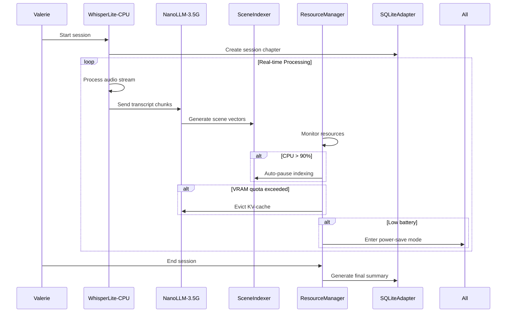

# Scenario: Dice, Dragons, and a Dead-Zone LAN

**Date:** January 28, 2025  
**Complexity:** High  
**Category:** Performance Extremes

## Scenario Description

Dungeon Master Valerie runs her weekly D&D campaign in a basement with no internet connectivity. Her laptop must handle real-time audio processing, AI summarization, and vector indexing entirely offline while managing strict resource constraints on a mid-range gaming laptop.

This scenario tests LogoMesh's ability to operate as a completely offline "paperless scribe" with intelligent resource management, quality-of-service controls, and power-aware operations.

## User Journey

### Step-by-Step Workflow
1. **18:02** - Start D&D session, initialize WhisperLite-CPU for real-time transcription
2. **18:05** - High player activity causes CPU spike, system auto-pauses non-critical tasks
3. **18:27** - NanoLLM needs extra VRAM, system evicts KV-cache while preserving weights
4. **19:00** - Loud table eruption causes ASR quality issues, system flags for later re-processing
5. **19:40** - Low battery triggers power-save mode with reduced processing cadence
6. **20:15** - Break time allows backlog processing during mic silence
7. **21:05** - Session ends, comprehensive session summary generated and saved locally

### Expected Outcomes
- Complete session transcription and summarization without internet
- No audio data loss despite resource constraints and quality issues
- Intelligent resource management prevents system crashes
- Power-aware operation extends battery life
- Comprehensive session artifacts generated for future reference

## System Requirements Analysis

### Phase 2 Systems Involved
- [x] **Plugin System** - Resource quotas, priority levels, dynamic throttling
- [x] **LLM Infrastructure** - NanoLLM-3.5G-Q4 with VRAM management and cache eviction
- [x] **VTC (Vector Translation Core)** - SceneIndexer with deferred processing capabilities
- [x] **Storage Layer** - Local SQLite with session chapter management
- [x] **Audit Trail System** - SessionAutoscribe orchestration and timeline tracking
- [x] **TaskEngine & CCE** - Deferred job queue and power-aware scheduling
- [x] **TTS Plugin Framework** - WhisperLite-CPU with quality assessment
- [x] **API & Backend** - Offline operation mode and resource monitoring

### Expected System Interactions

### Data Flow Requirements
- **Input:** Real-time 16kHz audio stream from microphone
- **Processing:** ASR → text → LLM summarization → vector indexing
- **Output:** Session transcript, scene summaries, NPC lists, plot hooks
- **Storage:** Local SQLite database with session chapters and vector snapshots

## Gap Analysis

### Discovered Gaps

**GAP-RESOURCE-001: Plugin Resource Quotas**
- **Priority:** Critical
- **Affected Systems:** Plugin System, LLM Infrastructure
- **Description:** No per-plugin VRAM quotas or CPU priority management. System can't prevent plugin resource conflicts or enforce quality-of-service levels.
- **Phase 2 Recommendation:** Implement plugin resource manifests with hard quotas and priority-based scheduling

**GAP-RESOURCE-002: Dynamic Cache Management**
- **Priority:** High
- **Affected Systems:** LLM Infrastructure
- **Description:** No intelligent cache eviction strategies. System can't free memory without full model reload.
- **Phase 2 Recommendation:** Add KV-cache eviction, precision downgrading, and partial model offloading capabilities

**GAP-OFFLINE-001: Connectivity-Independent Operation**
- **Priority:** High
- **Affected Systems:** All Systems
- **Description:** Many systems assume internet connectivity. No offline operation mode or local-only processing guarantees.
- **Phase 2 Recommendation:** Implement strict offline mode with local-only processing chains

**GAP-POWER-001: Power-Aware Resource Management**
- **Priority:** Medium
- **Affected Systems:** TaskEngine, Plugin System
- **Description:** No battery level monitoring or power-save mode. System can't adapt processing intensity to power constraints.
- **Phase 2 Recommendation:** Add power management hooks and adaptive processing cadence

**GAP-QUALITY-001: Audio Quality Assessment**
- **Priority:** Medium
- **Affected Systems:** TTS Plugin Framework
- **Description:** No audio quality assessment or confidence scoring. System can't identify segments needing re-processing.
- **Phase 2 Recommendation:** Add ASR confidence tracking and quality-based processing decisions

**GAP-QUEUE-001: Deferred Job Processing**
- **Priority:** Medium
- **Affected Systems:** TaskEngine
- **Description:** No job queue system for deferred or background processing. System can't handle backlog during idle periods.
- **Phase 2 Recommendation:** Implement deferred job queue with priority-based execution

### Missing Capabilities
- Per-plugin resource enforcement and monitoring
- Intelligent model cache management strategies
- Comprehensive offline operation guarantees
- Power-aware processing adaptation
- Audio quality assessment and flagging
- Background job queue with smart scheduling

### Integration Issues
- Plugin resource coordination lacks central management
- LLM infrastructure doesn't support partial cache eviction
- No system-wide offline mode coordination
- TaskEngine lacks power management integration
- Storage layer needs session-aware organization

## Phase 2 vs Reality Check

### What Works in Phase 2
- Basic plugin loading and execution framework
- SQLite storage with local data persistence
- Event-driven architecture supports real-time processing
- Plugin API allows resource monitoring hooks

### What's Missing/Mocked
- Resource quota enforcement mechanisms
- Advanced LLM cache management
- Power management integration
- Audio quality assessment algorithms
- Deferred processing queue system
- Offline operation validation

### Recommended Phase 2 Enhancements

**Priority 1: Resource Management Foundation**
- Add plugin resource manifest schema
- Implement CPU/VRAM quota tracking
- Create resource manager with enforcement

**Priority 2: LLM Cache Intelligence**
- Design cache eviction strategies
- Add memory pressure detection
- Implement partial model offloading

**Priority 3: Offline Operation Guarantees**
- Add strict offline mode toggle
- Validate all processing chains work locally
- Remove internet dependency assumptions

**Priority 4: Power Management Integration**
- Add battery level monitoring
- Implement adaptive processing modes
- Create power-save plugin configurations

## Validation Plan

### Test Scenarios
- [ ] Simulate 3-hour session with continuous audio processing
- [ ] Test resource quota enforcement under memory pressure
- [ ] Verify offline operation with all network disabled
- [ ] Test power-save mode transitions and performance
- [ ] Validate deferred processing during idle periods
- [ ] Test cache eviction without model reloading

### Success Criteria
- [ ] Complete 3-hour session without crashes or data loss
- [ ] Resource quotas prevent system OOM conditions
- [ ] All processing works with network completely disabled
- [ ] Power-save mode extends battery life by 30%+
- [ ] Audio quality assessment flags problematic segments
- [ ] Deferred jobs complete during break periods

### Failure Modes
- System crash from resource exhaustion (CRITICAL FAILURE)
- Data loss during cache eviction operations
- Internet dependency prevents offline operation
- High CPU usage drains battery too quickly
- Poor audio quality goes undetected
- Deferred jobs never execute or cause delays

## Phase 2 Gap Analysis

### Jargon Translation
- "WhisperLite-CPU" → ASR plugin implementing PluginRuntimeInterface
- "NanoLLM-3.5G-Q4" → Local LLM executor with resource constraints
- "SceneIndexer" → VTC plugin with vector generation and storage
- "SessionAutoscribe" → TaskEngine workflow orchestrating all plugins
- "Resource policy manifest" → Plugin configuration with quotas and priorities
- "Power-Save Mode" → System-wide performance adaptation based on power state

### What's Missing from Current Phase 2
- Plugin resource management and enforcement system
- Advanced LLM memory management capabilities
- Comprehensive offline operation mode
- Power management integration and adaptation
- Audio processing quality assessment
- Intelligent background job scheduling

---

**Analysis Status:** COMPLETE  
**Next Actions:** Update gap analysis, prioritize resource management implementation, design plugin quota system
