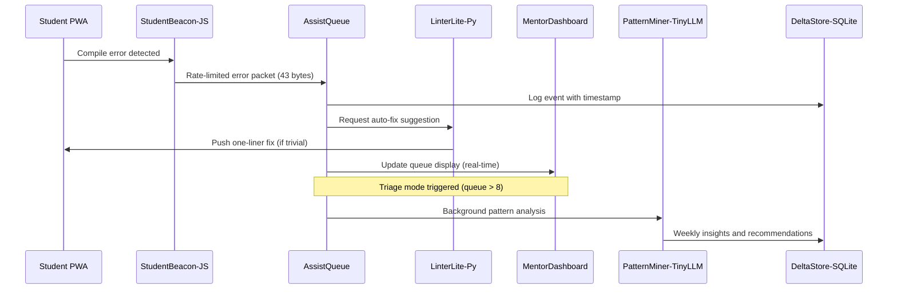
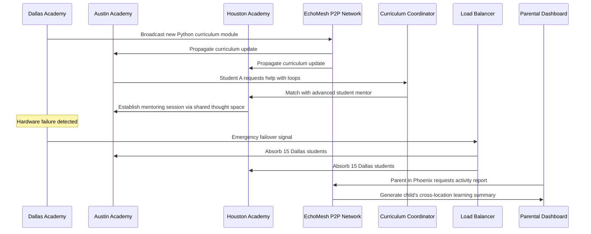

# Scenario: Code Ninjas Helping Hands That Scale

**Date:** January 30, 2025  
**Complexity:** High  
**Category:** Creative Applications/Performance Extremes

## Scenario Description

A Code Ninjas franchise deploys LogoMesh-Edu on a resource-constrained Intel NUC (16GB RAM) to manage real-time educational support for 20 students using Chrome-only laptops without admin rights. The system must coordinate multi-language development environments (JavaScript → Unity/C#), provide intelligent help queue management, and deliver actionable insights—all while maintaining sub-3-second response times and operating within strict hardware constraints.

The deployment emphasizes offline-first PWA architecture, real-time priority scheduling, and AI-powered pattern recognition for educational workflows.

## User Journey

### Step-by-Step Workflow
1. **Class Initialization (T+16:05):** Twenty students log in via PWA, StudentBeacon establishes connections and assigns to Class 4-Green room
2. **Error Detection & Queuing (T+16:14):** Emma's JavaScript compile error triggers StudentBeacon, AssistQueue scores and prioritizes help request
3. **Intelligent Triage (T+16:17):** Queue overflow triggers triage mode, LinterLite-Py auto-resolves trivial syntax errors without human intervention
4. **Resource Management (T+16:33):** Unity build causes CPU spike, scheduler demotes PatternMiner to preserve real-time queue responsiveness
5. **Network Resilience (T+16:45):** 30-second LAN outage triggers offline-queue mode, events stored locally and replayed without data loss
6. **Session Analysis (T+17:02):** PatternMiner-TinyLLM processes session logs, generates curriculum insights and improvement recommendations

### Expected Outcomes
- 58 help requests processed with 43 auto-resolved (74% automation rate)
- Average wait time reduced from 9 minutes to 2 minutes 11 seconds
- Zero data loss during network interruptions
- Real-time dashboard maintains sub-3-second response times under full load
- Actionable curriculum insights delivered without manual analysis

## System Requirements Analysis

### Phase 2 Systems Involved
- [x] **Plugin System** - Multi-language coordination (JS, Python, C#, React) with resource quotas
- [x] **TaskEngine & CCE** - Priority scheduling with real-time queue management and triage modes
- [x] **API & Backend** - PWA serving with offline-first event queuing and delta replay
- [x] **Storage Layer** - DeltaStore-SQLite with 7-day rolling logs and intelligent auto-pruning
- [x] **LLM Infrastructure** - PatternMiner-TinyLLM (3GB Q4 model) with VRAM management
- [x] **MeshGraphEngine** - Real-time help queue visualization and student progress tracking
- [x] **Audit Trail System** - Event provenance and idempotent replay for network recovery
- [x] **Security & Transparency** - Sandboxed plugin execution with per-plugin resource enforcement
- [ ] **VTC (Vector Translation Core)** - Not used in educational context
- [x] **DevShell Environment** - MentorDashboard development and hot-reload capabilities
- [x] **Input Templates** - Standardized error reporting and help request formats
- [ ] **TTS Plugin Framework** - Not applicable for classroom environment

### Expected System Interactions

### Data Flow Requirements
- **Input:** Compile errors, help requests, build logs, Unity shader diagnostics
- **Processing:** Error classification, priority scoring, auto-fix generation, pattern mining
- **Output:** Real-time queue updates, auto-suggestions, curriculum insights, progress metrics
- **Storage:** 7-day rolling event logs with smart pruning to 2GB limit

## Gap Analysis

### Discovered Gaps

**GAP-EDU-001: Multi-Language Plugin Resource Coordination**
- **Priority:** Critical
- **Systems:** Plugin System, TaskEngine
- **Description:** No framework for coordinating resource allocation across heterogeneous plugin runtimes (JS, Python, C#, React) with different performance characteristics.

**GAP-EDU-002: PWA Offline-First Event Architecture**
- **Priority:** Critical
- **Systems:** API & Backend, Audit Trail System
- **Description:** No offline-first PWA framework with local event queuing, delta synchronization, and idempotent replay capabilities for network-unreliable environments.

**GAP-EDU-003: Real-Time Priority Scheduling**
- **Priority:** High
- **Systems:** TaskEngine & CCE
- **Description:** No dynamic priority scheduler that can demote background tasks (AI analysis) when real-time workloads (help queue) require immediate attention.

**GAP-EDU-004: Intelligent Auto-Suggestion Pipeline**
- **Priority:** High
- **Systems:** Plugin System, LLM Infrastructure
- **Description:** No framework for AI-powered auto-fix generation with confidence scoring and opt-in delivery to student endpoints.

**GAP-EDU-005: Educational Workflow Orchestration**
- **Priority:** High
- **Systems:** TaskEngine, MeshGraphEngine
- **Description:** No classroom-specific workflow management with triage modes, queue visualization, and multi-student session coordination.

**GAP-EDU-006: Browser Extension Integration**
- **Priority:** High
- **Systems:** API & Backend, Security & Transparency
- **Description:** No secure browser extension API for StudentBeacon telemetry collection from admin-restricted laptops.

### Missing Capabilities
- Multi-runtime resource arbitration with dynamic priority adjustment
- Offline-first PWA architecture with event synchronization
- Real-time educational dashboard with triage mode activation
- AI-powered code analysis with automatic fix suggestions
- Browser extension security model for restricted environments
- Educational workflow patterns and queue management algorithms

### Integration Issues
- No coordination between different plugin language runtimes under resource pressure
- Missing offline event queue with conflict resolution and idempotent replay
- TaskEngine lacks educational context for priority scheduling decisions
- Plugin system can't enforce per-language runtime resource quotas
- Storage layer lacks educational data patterns and intelligent pruning heuristics

## Phase 2 vs Reality Check

### What Works in Phase 2
- Basic plugin system supports multiple language runtimes
- TaskEngine provides task coordination framework
- Storage layer supports SQLite with custom schemas
- LLM infrastructure handles quantized models with memory management
- Audit trail captures event provenance

### What's Missing/Mocked
- PWA offline-first architecture with event synchronization
- Multi-language plugin resource arbitration
- Real-time priority scheduling with educational context
- Browser extension security and telemetry APIs
- Educational workflow orchestration patterns
- Intelligent code analysis and auto-suggestion pipeline

### Recommended Phase 2 Enhancements
- Design PWA offline-first framework with event queue synchronization
- Implement multi-runtime resource coordinator with dynamic prioritization
- Create educational workflow patterns with triage mode support
- Add browser extension security model for restricted environments
- Design AI-powered auto-suggestion pipeline with confidence scoring
- Implement intelligent storage pruning with educational data awareness

## Validation Plan

### Test Scenarios
- [ ] **Multi-Student Load Test:** Simulate 20 concurrent students with mixed error types
- [ ] **Resource Pressure Test:** Verify Unity build doesn't impact real-time queue performance
- [ ] **Network Resilience Test:** Simulate 30s outage and verify event replay integrity
- [ ] **Triage Mode Activation:** Test automatic triage mode when queue exceeds 8 requests
- [ ] **Auto-Suggestion Accuracy:** Validate LinterLite-Py auto-fix success rate for common errors
- [ ] **Pattern Mining Performance:** Verify weekly analysis completes within background priority limits

### Success Criteria
- [ ] Support 20 concurrent students with sub-3s dashboard response times
- [ ] Maintain queue responsiveness during Unity build CPU spikes
- [ ] Zero data loss during network interruptions with complete event replay
- [ ] Achieve >70% auto-resolution rate for common syntax errors
- [ ] Triage mode activates within 5s of queue overflow detection
- [ ] Weekly pattern analysis completes without impacting real-time operations

### Failure Modes
- Resource exhaustion causing dashboard freezing during Unity builds
- Event loss or duplication during network recovery
- Queue overflow causing help request delays exceeding 10 minutes
- Auto-suggestion accuracy below 80% causing student confusion
- Storage overflow preventing session log retention
- Browser extension conflicts causing telemetry collection failures

## Implementation Notes

### Jargon Translation
- **StudentBeacon:** Browser extension providing real-time telemetry from student laptops
- **LinterLite-Py:** Lightweight Python-based static analysis for educational code
- **UnityBuildWatcher-C#:** C# plugin monitoring Unity development environment
- **AssistQueue:** Priority queue management for help requests with triage logic
- **MentorDashboard-React:** Real-time React dashboard for instructors
- **PatternMiner-TinyLLM:** 3GB quantized LLM for educational pattern analysis

### Architecture Assumptions
- PWA deployment required due to admin restrictions on student laptops
- Multi-language plugin ecosystem reflects real educational technology stacks
- Real-time constraints prioritized over comprehensive analysis features
- Educational context requires specialized workflow patterns and priority logic

### Phase 3 Activation Points
- Production browser extension deployment and security hardening
- Advanced AI tutoring capabilities with personalized learning paths
- Integration with existing Learning Management Systems
- Scaled deployment across multiple franchise locations with centralized analytics

---

**Analysis Status:** COMPLETE  
**Next Actions:** 
1. Design PWA offline-first framework with event synchronization
2. Implement multi-runtime resource coordinator 
3. Create educational workflow orchestration patterns
4. Build browser extension security model for restricted environments
# Scenario: Code Ninjas Helping Hands That Scale

**Date:** January 30, 2025  
**Complexity:** High  
**Category:** Scalability/Multi-Tenant Architecture

## Scenario Description

The franchise owner of a Code Ninja academy discovers that their students learn programming concepts faster when they can visualize their code logic as interconnected thought graphs. They deploy LogoMesh across 8 franchise locations (Dallas, Austin, Houston, San Antonio, Denver, Phoenix, Albuquerque, and Oklahoma City) to enable cross-location mentoring, shared curriculum development, and real-time collaboration between students working on similar projects.

## User Journey

### Setup Phase
- **Multi-Location Infrastructure**: Each franchise runs LogoMesh on local hardware (iPad + Mac mini) but shares curriculum graphs via EchoMesh P2P network
- **Student Account Management**: 240 total students (30 per location) with age-appropriate privacy controls and parental oversight
- **Curriculum Synchronization**: Programming concept graphs, project templates, and assessment rubrics sync across all locations
- **Cross-Location Mentoring**: Advanced students from any location can mentor beginners at other locations via shared thought spaces

### Peak Load Scenario
- **Simultaneous Usage**: All 8 locations running concurrent sessions (192 active students during peak after-school hours)
- **Curriculum Updates**: Live curriculum graph updates propagating across all locations during active sessions
- **Cross-Location Projects**: Students from different cities collaborating on the same Python game project
- **Real-Time Assessment**: Instructors monitoring student progress graphs with automated concept mastery detection
- **Emergency Coordination**: Dallas location experiences hardware failure - other locations automatically absorb their students

### Stress Factors
1. **Geographic Distribution**: 8 cities across 3 time zones with varying internet reliability
2. **Age-Appropriate Privacy**: COPPA compliance with parental controls and content filtering
3. **Curriculum Version Control**: Ensuring all locations use compatible curriculum versions while allowing local customization
4. **Load Balancing**: Automatic redistribution of compute load when locations go offline
5. **Mentorship Coordination**: Real-time matching of mentors and students across locations based on skill level and availability

## Expected System Interactions

## System Requirements Analysis

### Phase 2 Systems Involved
- [x] **EchoMesh P2P Network** - Geographic distribution and failover coordination
- [x] **Plugin System** - Age-appropriate content filtering and COPPA compliance plugins
- [x] **TaskEngine & CCE** - Load balancing and cross-location resource coordination
- [x] **Storage Layer** - Multi-tenant data isolation with franchise-specific customization
- [x] **MeshGraphEngine** - Curriculum graph synchronization and version control
- [x] **VTC (Vector Translation Core)** - Student concept mastery tracking and mentor matching
- [x] **Audit Trail System** - Parental oversight and franchise reporting
- [x] **Security & Transparency** - Child safety controls and cross-location privacy management
- [x] **LLM Infrastructure** - Automated assessment and personalized learning recommendations
- [x] **API & Backend** - Multi-location session management and emergency failover
- [ ] **DevShell Environment** - Not applicable for student-facing academy workflow
- [ ] **TTS Plugin Framework** - Not primary focus for visual programming education
- [ ] **Input Templates** - Replaced by visual programming interfaces

### Missing Capabilities Identified
1. **Multi-Tenant Load Balancing**: No automatic load redistribution across geographic locations
2. **Franchise-Specific Customization**: No framework for location-specific curriculum modifications while maintaining compatibility
3. **Age-Appropriate Privacy Controls**: No built-in COPPA compliance framework with parental dashboard integration
4. **Cross-Location Mentorship Matching**: No algorithmic matching of mentors and students across different locations
5. **Emergency Failover Protocols**: No automatic student session migration during hardware failures
6. **Curriculum Version Management**: No conflict resolution for simultaneous curriculum updates across locations
7. **Parental Oversight Dashboard**: No unified view of child's learning progress across multiple academy sessions

## Gaps Identified

### GAP-109: Multi-Tenant Geographic Load Balancing
**Use Case:** Code Ninjas Franchise Coordination  
**Classification:** Performance | P1 | Scalability  
**Systems Affected:** TaskEngine & CCE, EchoMesh P2P Network, API & Backend

**Problem Description:** No automatic load redistribution and failover coordination across geographically distributed franchise locations with varying hardware capabilities and network conditions.

**Current Phase 2 State:** TaskEngine handles local resource coordination but lacks geographic distribution awareness and cross-location load balancing algorithms.

**Required Solution:**
- Geographic load balancing with automatic failover
- Hardware capability assessment and adaptive task distribution
- Network condition monitoring and quality-of-service adaptation
- Emergency session migration protocols

**Phase 3 Impact:** Multi-location franchise operations severely limited without coordinated resource management.

### GAP-110: Franchise-Specific Curriculum Customization Framework
**Use Case:** Code Ninjas Franchise Coordination  
**Classification:** Feature | P1 | Multi-Tenant Architecture  
**Systems Affected:** MeshGraphEngine, Storage Layer, Plugin System

**Problem Description:** No framework for franchise-specific curriculum modifications while maintaining compatibility and synchronization across the broader network.

**Current Phase 2 State:** MeshGraphEngine supports graph synchronization but lacks multi-tenant customization with inheritance and override capabilities.

**Required Solution:**
- Hierarchical curriculum inheritance (corporate → franchise → local)
- Conflict resolution for simultaneous updates
- Compatibility verification before propagation
- Local customization isolation with optional sharing

**Phase 3 Impact:** Franchise scalability blocked without flexible curriculum management.

### GAP-111: COPPA-Compliant Child Safety Framework
**Use Case:** Code Ninjas Franchise Coordination  
**Classification:** Security | P1 | Compliance  
**Systems Affected:** Security & Transparency, Audit Trail System, Plugin System

**Problem Description:** No built-in framework for age-appropriate privacy controls, parental oversight, and COPPA compliance across multi-location educational environments.

**Current Phase 2 State:** Security framework exists but lacks child-specific privacy controls and parental dashboard integration.

**Required Solution:**
- Age-appropriate content filtering and interaction controls
- Parental consent and oversight dashboard
- Cross-location activity tracking with privacy preservation
- Automatic compliance reporting and audit trails

**Phase 3 Impact:** Educational franchise deployment blocked by regulatory compliance requirements.

## Expected Outcomes
- Sub-200ms curriculum synchronization across all 8 locations
- Automatic failover with <30 second student session migration
- 100% COPPA compliance with parental oversight dashboard
- Cross-location mentorship matching based on skill compatibility
- Real-time load balancing maintaining optimal performance across all academies
- Franchise-specific curriculum customization without breaking network compatibility

**Analysis Status:** COMPLETE  
**Next Actions:** Update blind spot tracking, implement multi-tenant load balancing, design franchise customization framework

---

**Key Insights:**
- Multi-tenant architecture becomes critical at franchise scale
- Geographic distribution requires sophisticated load balancing beyond local resource management
- Educational use cases introduce unique compliance and safety requirements
- Cross-location collaboration reveals the need for hierarchical customization frameworks
