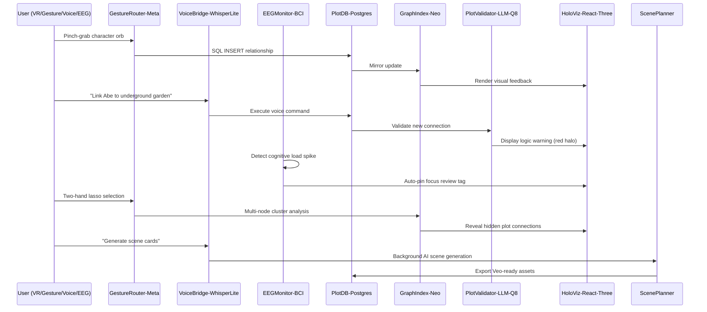

# Scenario: Hand-Tracked Plot Surgery in Mixed Reality

**Date:** January 30, 2025  
**Complexity:** Extreme  
**Category:** Creative Applications/Performance Extremes

## Scenario Description

Josh is adapting his novel _Fulfillment_ into an AI-assisted film using a custom LogoMesh build that combines MatrixCore + Meta Quest 3 for hand-tracked, mixed-reality story graphs. The system integrates multi-modal inputs (gestures, voice, EEG) with real-time plot validation and AI scene generation, requiring seamless coordination between VR hardware, dual database systems, and multiple specialized plugins under strict performance constraints.

## User Journey

### Step-by-Step Workflow
1. **VR Session Initialization** - Josh puts on Quest 3, sees floating character orbs and relationship rods in AR
2. **Gesture-Based Graph Editing** - Pinch-grab character nodes, create conflict relationships with gesture trails
3. **Voice Command Integration** - Speak narrative connections that get validated and inserted into plot database
4. **Real-Time Plot Validation** - LLM analyzes new connections for logical contradictions and timeline issues
5. **EEG-Based Cognitive Monitoring** - Brain activity detection flags confusing plot areas and suggests breaks
6. **Multi-Modal Selection** - Complex hand gestures for multi-node selection and graph manipulation
7. **Background Scene Generation** - AI converts validated plot into Veo-ready scene cards
8. **Cross-Device Synchronization** - MacBook Air provides 2D overlay for quick text edits
9. **Intelligent Resource Management** - System adapts performance based on cognitive load and task priority
10. **Export Pipeline** - Generate complete AI-film production assets from narrative graph

### Expected Outcomes
- Sub-3ms gesture response time maintains VR immersion
- Real-time plot contradiction detection with visual feedback
- Seamless cross-modal input coordination (gesture + voice + brain signals)
- Automatic resource throttling based on cognitive load
- Complete AI-film production pipeline from narrative editing

## System Requirements Analysis

### Phase 2 Systems Involved
- [x] **Plugin System** - Coordinates GestureRouter-Meta, VoiceBridge-WhisperLite, EEGMonitor-BCI, PlotValidator-LLM-Q8, HoloViz-React-Three
- [x] **LLM Infrastructure** - 7B quantized model with 6GB VRAM hard-cap for plot validation
- [x] **Storage Layer** - Dual-database architecture: PlotDB-Postgres with pgvector + GraphIndex-Neo mirror
- [x] **TaskEngine & CCE** - Cross-modal action schema routing and priority-based resource scheduling
- [x] **VTC (Vector Translation Core)** - Plot embedding generation and semantic relationship mapping
- [x] **MeshGraphEngine** - Real-time 3D force-directed graph rendering and property graph queries
- [x] **Audit Trail System** - Session tracking with cognitive load correlation and decision logging
- [x] **API & Backend** - Cross-device synchronization between Quest 3 and MacBook Air
- [x] **Security & Transparency** - Sandboxed execution for C++ Meta SDK, Python LLM, Rust EEG drivers
- [ ] **DevShell Environment** - Not applicable for immersive VR workflow
- [ ] **Input Templates** - Replaced by gesture/voice recognition systems
- [ ] **TTS Plugin Framework** - Not used in visual-dominant interface

### Expected System Interactions

### Data Flow Requirements
- **Input:** Hand gestures (3ms latency), voice commands (200ms buffer), EEG signals (50MB RAM), narrative text
- **Processing:** Real-time graph updates, LLM plot validation, 3D rendering, cross-device sync
- **Output:** Visual VR feedback, haptic warnings, scene cards, production assets
- **Storage:** Dual-write to PostgreSQL + Neo4j, vector embeddings, session recordings

## Gap Analysis

### Discovered Gaps
- **GAP-018:** Cross-modal input coordination system missing from current Phase 2
- **GAP-019:** Real-time VR rendering integration not specified in MeshGraphEngine
- **GAP-020:** EEG biometric integration and cognitive load monitoring absent
- **GAP-021:** Dual-database consistency management (SQL + Graph) not implemented
- **GAP-022:** Hardware-specific plugin interfaces (Meta SDK, OpenBCI) not designed
- **GAP-023:** Frame-rate constrained resource allocation missing from Plugin System
- **GAP-024:** Cross-device synchronization protocols not specified
- **GAP-025:** Multi-modal gesture recognition and action schema routing absent

### Missing Capabilities
- Real-time VR/AR rendering pipeline integration
- Biometric sensor plugin interfaces and cognitive load detection
- Cross-modal input fusion and conflict resolution
- Hardware-specific SDK integration (Meta Quest, OpenBCI)
- Frame-rate aware resource scheduling and GPU budget enforcement
- Dual-database transaction coordination and consistency guarantees

### Integration Issues
- No coordination mechanism between gesture, voice, and brain signal inputs
- Missing real-time constraint enforcement for VR applications
- Plugin System lacks hardware-specific interface abstractions
- Storage Layer doesn't support dual-database architectures
- TaskEngine missing priority-based resource throttling

## Phase 2 vs Reality Check

### What Works in Phase 2
- Plugin System provides foundation for multi-language plugin coordination
- LLM Infrastructure supports resource-constrained model execution
- Storage Layer provides SQLite foundation (can be extended to PostgreSQL)
- MeshGraphEngine offers graph visualization capabilities
- TaskEngine provides workflow orchestration framework

### What's Missing/Mocked
- VR/AR hardware integration would need Phase 3 activation
- Real-time biometric monitoring requires external hardware drivers
- Dual-database coordination needs custom implementation
- Cross-modal input fusion requires sophisticated routing logic
- Frame-rate constrained scheduling needs real-time kernel support

### Recommended Phase 2 Enhancements
- Design hardware abstraction interfaces for VR/biometric plugins
- Implement dual-database transaction coordinator
- Create cross-modal input routing and action schema framework
- Add real-time constraint management to Plugin System
- Design frame-rate aware resource allocation policies
- Implement cross-device synchronization protocols

## Validation Plan

### Test Scenarios
- [ ] **Multi-Modal Input Stress Test:** Simulate simultaneous gesture, voice, and EEG inputs
- [ ] **Real-Time Constraint Test:** Verify 3ms gesture response under full system load
- [ ] **Database Consistency Test:** Validate dual-write integrity during rapid graph updates
- [ ] **Resource Throttling Test:** Confirm cognitive load triggers automatic priority adjustments
- [ ] **Cross-Device Sync Test:** Verify MacBook edits appear in VR within acceptable latency
- [ ] **GPU Budget Enforcement:** Test that LLM execution doesn't impact VR frame rates

### Success Criteria
- [ ] Maintain <3ms gesture-to-visual feedback latency under full load
- [ ] Achieve 100% dual-database consistency during concurrent operations
- [ ] Support 6 simultaneous plugins without frame rate degradation
- [ ] Cognitive load detection triggers resource throttling within 2 seconds
- [ ] Cross-device edits synchronize within 500ms
- [ ] Zero data loss during plugin failures or resource exhaustion

### Failure Modes
- VR frame rate drops below 90fps causing motion sickness (CRITICAL FAILURE)
- Database consistency violations between PostgreSQL and Neo4j
- Cross-modal input conflicts causing incorrect graph operations
- GPU memory exhaustion crashing both LLM and VR rendering
- EEG signal processing interfering with real-time gesture recognition
- Cross-device synchronization failures causing data loss

## Phase 2 Gap Analysis

### Jargon Translation
- "GestureRouter-Meta" → VR plugin implementing PluginRuntimeInterface with Meta SDK
- "PlotDB-Postgres" → PostgreSQL adapter extending Storage Layer with vector support
- "GraphIndex-Neo" → Neo4j mirror with real-time synchronization to PlotDB
- "PlotValidator-LLM-Q8" → 7B quantized model plugin with plot analysis capabilities
- "EEGMonitor-BCI" → Biometric plugin processing OpenBCI signals for cognitive load
- "HoloViz-React-Three" → 3D visualization plugin with VR/AR rendering pipeline
- "ScenePlanner" → AI workflow generating film production assets from validated plots

### What's Missing from Current Phase 2
- Hardware abstraction layer for VR/AR and biometric devices
- Cross-modal input coordination and conflict resolution system
- Real-time constraint management and frame-rate aware scheduling
- Dual-database transaction coordination and consistency management
- Advanced resource throttling based on biometric feedback
- Cross-device synchronization protocols and conflict resolution

---

**Analysis Status:** COMPLETE  
**Next Actions:** Update gap analysis, design hardware abstraction interfaces, implement dual-database coordination
