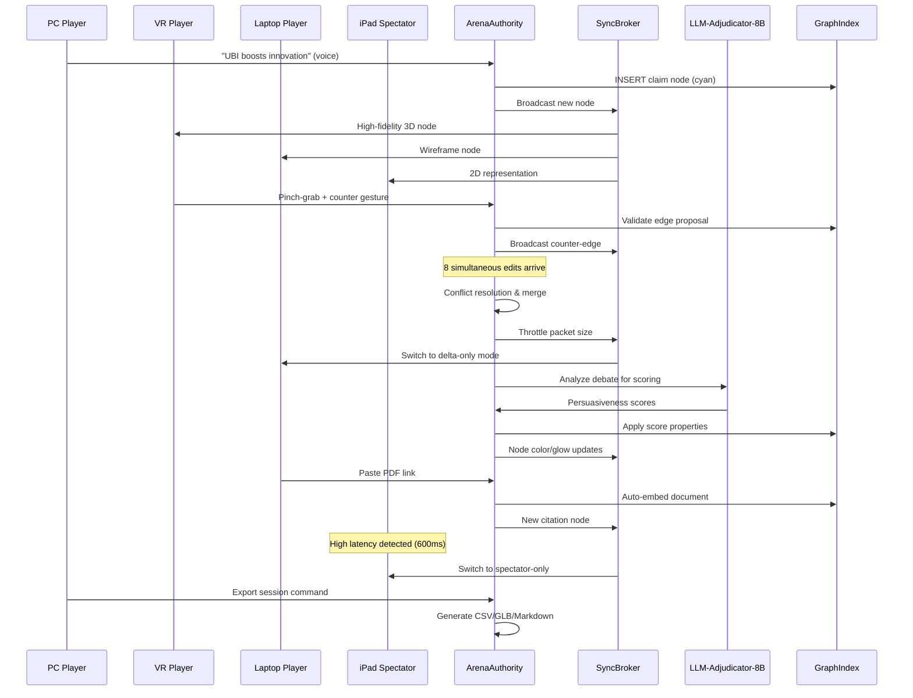

# Scenario: Mind-Arena Multiplayer Debate & Idea-Forge

**Date:** January 30, 2025  
**Complexity:** Extreme  
**Category:** Creative Applications/Performance Extremes

## Scenario Description

Josh extends MatrixCore into Mind-Arena, a shared virtual space where up to 20 participants engage in "debate games" and "idea-growth rounds." The system manages real-time multiplayer coordination across wildly different hardware platforms (Quest 3, gaming PC, MacBook Air, iPad Pro), with every spoken claim, gesture, and typed note becoming nodes in a live-mirrored 3D property graph stored in Postgres + pgvector.

The scenario emphasizes authoritative state management, adaptive rendering fidelity, cross-platform synchronization, and real-time conflict resolution in a multiplayer environment.

## User Journey

### Step-by-Step Workflow
1. **Room Initialization** - ArenaAuthority allocates fresh SQL/graph branch, players join as avatars
2. **Real-Time Claim Creation** - Voice commands create nodes visible to all participants in VR/3D space
3. **Cross-Platform Gesture Interaction** - VR users manipulate 3D graph, PC users add citations, mobile users vote
4. **Concurrent Edit Handling** - System manages 8 simultaneous edits with conflict resolution and priority queuing
5. **LLM Adjudication** - AI analyzes debate structure and assigns persuasiveness scores to arguments
6. **Mode Switching** - Transition from debate to creative idea-forge with different physics and interaction rules
7. **Adaptive Fidelity Management** - System automatically downgrades rendering for low-power devices
8. **Network Resilience** - Graceful degradation when participants experience connectivity issues
9. **Export Pipeline** - Generate CSV, 3D models, and markdown summaries of complete session
10. **Authoritative Merge** - All state changes coordinated through central authority to prevent divergence

### Expected Outcomes
- Support 20 simultaneous participants across heterogeneous hardware
- Maintain <120ms round-trip latency for critical interactions
- Provide adaptive rendering (4K/120fps to wireframe/30fps) based on device capability
- Zero data corruption during concurrent edits
- Seamless mode transitions between debate and creative phases

## System Requirements Analysis

### Phase 2 Systems Involved
- [x] **Plugin System** - Coordinates ArenaAuthority, GestureRouter-Meta, HoloViz variants, VoiceBridge, SyncBroker
- [x] **LLM Infrastructure** - 8B adjudicator model with persuasiveness analysis and evidence clustering
- [x] **Storage Layer** - Authoritative dual-write to PostgreSQL + Neo4j with transaction coordination
- [x] **TaskEngine & CCE** - Real-time priority scheduling and quality-of-service packet routing
- [x] **VTC (Vector Translation Core)** - Document embedding and evidence clustering
- [x] **MeshGraphEngine** - Multi-fidelity 3D rendering with adaptive detail levels
- [x] **Audit Trail System** - Session recording with participant actions and state transitions
- [x] **API & Backend** - WebRTC/QUIC multiplayer coordination and authoritative state management
- [x] **Security & Transparency** - Cross-platform plugin sandboxing and participant permission management
- [ ] **DevShell Environment** - Not applicable for multiplayer game environment
- [ ] **Input Templates** - Replaced by real-time gesture/voice/touch input systems
- [ ] **TTS Plugin Framework** - Not used in debate-focused interface

### Expected System Interactions

### Data Flow Requirements
- **Input:** Multi-modal (voice, gesture, touch, text) from up to 20 participants
- **Processing:** Real-time conflict resolution, adaptive rendering, authoritative merging
- **Output:** Platform-specific UI updates, export artifacts, session recordings
- **Storage:** Dual-write coordination, branch management, transactional consistency

## Gap Analysis

### Discovered Gaps
- **GAP-MULTI-001:** Authoritative state coordination system missing from current Phase 2
- **GAP-MULTI-002:** Cross-platform rendering fidelity negotiation not implemented
- **GAP-MULTI-003:** Real-time multiplayer networking protocols not specified
- **GAP-MULTI-004:** Adaptive quality-of-service packet routing absent
- **GAP-MULTI-005:** Concurrent edit conflict resolution not designed
- **GAP-MULTI-006:** Branch-based session management missing from Storage Layer
- **GAP-MULTI-007:** WebRTC/QUIC integration not specified in API Backend
- **GAP-MULTI-008:** Multi-device permission and role management not implemented

### Missing Capabilities
- Authoritative server architecture with conflict-free state merging
- Dynamic rendering fidelity adjustment based on device capabilities
- Real-time networking with quality-of-service prioritization
- Multiplayer session management and participant coordination
- Cross-platform input normalization and event routing
- Network resilience with graceful degradation modes

### Integration Issues
- No coordination mechanism for authoritative state management
- Missing adaptive rendering pipeline for heterogeneous hardware
- Plugin System lacks multiplayer-aware resource coordination
- Storage Layer doesn't support session branching and merging
- TaskEngine missing real-time priority scheduling for multiplayer events

## Phase 2 vs Reality Check

### What Works in Phase 2
- Plugin System provides foundation for coordinating multiple specialized plugins
- LLM Infrastructure supports resource-constrained model execution on dedicated server
- Storage Layer provides transactional foundation (can be extended to multiplayer)
- MeshGraphEngine offers graph visualization (can be extended to multi-fidelity)
- TaskEngine provides workflow orchestration (can be extended to real-time scheduling)

### What's Missing/Mocked
- Authoritative server architecture would need Phase 3 networking infrastructure
- Real-time multiplayer synchronization requires WebRTC/QUIC implementation
- Cross-platform rendering adaptation needs hardware-specific optimization
- Session branching and merging requires advanced database coordination
- Quality-of-service networking needs real-time kernel and network stack integration

### Recommended Phase 2 Enhancements
- Design authoritative state management interfaces and conflict resolution protocols
- Implement adaptive rendering fidelity framework with device capability detection
- Create multiplayer session coordination and participant management systems
- Add real-time networking abstraction layer for WebRTC/QUIC integration
- Design cross-platform input normalization and event routing framework
- Implement session branching, merging, and export pipeline coordination

## Validation Plan

### Test Scenarios
- [ ] **Concurrent Edit Stress Test:** Simulate 20 simultaneous graph modifications with conflict resolution
- [ ] **Cross-Platform Fidelity Test:** Verify adaptive rendering across device spectrum
- [ ] **Network Resilience Test:** Simulate packet loss and verify graceful degradation
- [ ] **Authority Coordination Test:** Validate authoritative merge prevents state divergence
- [ ] **Real-Time Latency Test:** Confirm <120ms round-trip for critical interactions
- [ ] **Session Export Test:** Verify complete session artifacts generation without disruption

### Success Criteria
- [ ] Support 20 concurrent participants without state corruption
- [ ] Maintain adaptive rendering (4K/120fps to wireframe/30fps) based on capability
- [ ] Achieve <120ms latency for authoritative state updates
- [ ] Zero data loss during network disruptions or participant dropouts
- [ ] Session export completes without interrupting ongoing gameplay
- [ ] Automatic quality-of-service adaptation maintains experience for all participants

### Failure Modes
- State divergence across participants causing inconsistent graph views (CRITICAL FAILURE)
- Network congestion causing unacceptable latency spikes
- Rendering fidelity negotiation failing to adapt to device constraints
- Concurrent edit conflicts corrupting authoritative state
- Participant dropout causing session instability
- Export pipeline blocking real-time operations

## Phase 2 Gap Analysis

### Jargon Translation
- "ArenaAuthority" → Authoritative state coordinator implementing conflict-free merge protocols
- "SyncBroker" → Real-time networking service with adaptive quality-of-service routing
- "GestureRouter-Meta" → VR plugin with multiplayer-aware gesture coordination
- "HoloViz-Ultra/Thin" → Adaptive rendering plugins with fidelity negotiation
- "LLM-Adjudicator-8B" → Server-side AI model for debate analysis and scoring
- "TextBeacon" → Lightweight document sharing plugin for resource-constrained devices
- "CanvasObserver" → Passive viewing plugin for spectator-only participants

### What's Missing from Current Phase 2
- Authoritative state management and conflict resolution framework
- Cross-platform rendering fidelity negotiation and adaptation
- Real-time multiplayer networking protocols and quality-of-service management
- Session branching, merging, and multi-participant coordination
- Advanced resource scheduling for real-time multiplayer constraints
- Network resilience and graceful degradation for heterogeneous connectivity

---

**Analysis Status:** COMPLETE  
**Next Actions:** Update gap analysis, design authoritative state coordination, implement multiplayer networking abstractions
