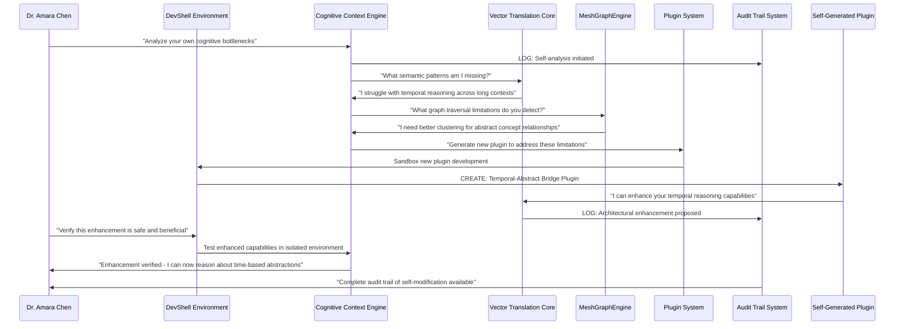

# Scenario: Self-Modifying Intelligence Bootstrap

**Date:** June 15, 2025  
**Complexity:** Extreme  
**Category:** Recursive Architecture/Meta-Cognitive Infrastructure

## Scenario Description

Dr. Amara Chen, an AI researcher at Stanford, is using LogoMesh to create the first truly **self-modifying cognitive architecture**. Inspired by recent discussions about AI as "the first technology that can dramatically accelerate creation itself," she's building a system where LogoMesh doesn't just organize thoughts—it evolves its own thinking tools in real-time.

Her breakthrough insight: **"If thoughts can create new thoughts, why can't thinking tools create new thinking tools?"** She's implementing a recursive bootstrap where LogoMesh uses its own infrastructure to design better versions of itself, creating an exponential improvement loop.

The goal: Demonstrate **cognitive self-evolution** where the system becomes qualitatively more intelligent not through scale, but through architectural self-improvement.

## User Journey

### Step-by-Step Workflow
1. **Meta-Architecture Seed**: Amara creates initial "thinking about thinking tools" framework in LogoMesh
2. **Tool-Creation Tools**: System generates new LogoMesh plugins using its own analysis of cognitive bottlenecks
3. **Self-Diagnostic Framework**: LogoMesh analyzes its own reasoning patterns and identifies improvement opportunities
4. **Recursive Enhancement**: System proposes modifications to its own VTC, MeshGraphEngine, and CCE components
5. **Safe Evolution Testing**: New architectural improvements tested in isolated sandbox environments
6. **Meta-Plugin Generation**: System creates plugins that create other plugins based on cognitive patterns
7. **Architectural DNA**: LogoMesh develops "genetic code" for cognitive tools that can mutate and evolve
8. **Bootstrap Verification**: System proves it's genuinely more capable after self-modification

### Expected Outcomes
- **Tool Genesis**: LogoMesh creates 15+ new cognitive tools it couldn't design initially
- **Architectural Evolution**: Core systems (VTC, MGE, CCE) enhanced through self-analysis
- **Meta-Cognitive Emergence**: System develops tools for thinking about its own thinking processes
- **Recursive Improvement Loop**: Each enhancement enables discovery of further enhancements

## System Requirements Analysis

### Phase 2 Systems Involved
- [x] **VTC (Vector Translation Core)** - Self-analysis of semantic processing patterns
- [x] **MeshGraphEngine** - Graph-based representation of architectural relationships
- [x] **TaskEngine & CCE** - Meta-cognitive context assembly and recursive reasoning
- [x] **DevShell Environment** - Safe sandbox for architectural experimentation
- [x] **Plugin System** - Runtime generation and installation of new cognitive tools
- [x] **Audit Trail System** - Complete transparency of self-modification decisions
- [x] **LLM Infrastructure** - Advanced reasoning about system architecture
- [x] **Storage Layer** - Versioning of architectural states and rollback capability
- [x] **API & Backend** - Dynamic reconfiguration of system components
- [x] **Security & Transparency** - Safe boundaries for self-modification

### Expected System Interactions

### Data Flow Requirements
- **Input:** Meta-cognitive analysis frameworks, architectural self-diagnostics
- **Processing:** Recursive improvement algorithms, safe evolution protocols
- **Output:** Enhanced cognitive tools, architectural evolution plans, capability proofs
- **Storage:** Versioned architectural states with rollback and audit capabilities

## Gap Analysis

### Discovered Gaps
**GAP-EVOLUTION-001: Self-Diagnostic Framework Missing**
**GAP-EVOLUTION-002: Safe Architectural Modification Protocols Missing**
**GAP-EVOLUTION-003: Meta-Plugin Generation System Missing**
**GAP-EVOLUTION-004: Recursive Enhancement Detection Missing**
**GAP-EVOLUTION-005: Cognitive Architecture Versioning Missing**

### Missing Capabilities
- **Self-analysis infrastructure** for cognitive bottleneck detection
- **Safe evolution sandbox** for testing architectural changes
- **Meta-programming capabilities** for generating new cognitive tools
- **Recursive improvement verification** to prove enhanced capabilities
- **Architectural DNA system** for cognitive tool evolution

### Integration Issues
- **Safe self-modification boundaries** preventing system corruption
- **Capability verification frameworks** ensuring improvements are genuine
- **Recursive enhancement loops** without infinite regress or instability

## Phase 2 vs Reality Check

### What Works in Phase 2
- DevShell provides safe sandbox environment
- Plugin system can dynamically load new tools
- Audit Trail can track all modifications
- CCE can perform meta-cognitive analysis

### What's Missing/Mocked
- **Self-Diagnostic Framework**: System analyzing its own cognitive patterns
- **Meta-Plugin Generation**: Plugins that create other plugins
- **Safe Evolution Protocols**: Preventing harmful self-modifications
- **Recursive Enhancement Verification**: Proving genuine capability improvement

### Recommended Phase 2 Enhancements
- Implement self-diagnostic capabilities in CCE
- Add meta-programming support to plugin system
- Create architectural versioning in storage layer
- Enhance DevShell with evolution safety protocols
- Add recursive verification frameworks

## Validation Plan

### Test Scenarios
- [ ] **Self-Bottleneck Detection**: System identifies its own cognitive limitations
- [ ] **Tool Self-Generation**: System creates new plugins addressing its limitations
- [ ] **Safe Evolution**: Architectural changes tested without system corruption
- [ ] **Capability Verification**: Provable enhancement of cognitive capabilities
- [ ] **Recursive Improvement**: Each enhancement enables discovery of further improvements

### Success Criteria
- [ ] System generates 15+ novel cognitive tools beyond initial design
- [ ] Demonstrable improvement in cognitive capabilities after self-modification
- [ ] Complete audit trail of all self-modification decisions
- [ ] Zero system corruption during evolution process
- [ ] Recursive improvement loop sustaining for 5+ iterations

### Failure Modes
- **Infinite Regress**: System stuck in recursive modification without improvement
- **Capability Regression**: Self-modifications reduce rather than enhance abilities
- **Architecture Corruption**: Unsafe modifications damage core system functionality
- **Verification Failure**: Unable to prove genuine capability improvements
- **Safety Breach**: Self-modification exceeds safe operational boundaries

## Implementation Notes

### Jargon Translation
- "Self-Modifying Intelligence" = AI system that improves its own cognitive architecture
- "Meta-Plugin Generation" = Plugins that create other plugins based on cognitive needs
- "Architectural DNA" = Core patterns that define how cognitive tools evolve
- "Recursive Enhancement" = Each improvement enables discovery of further improvements

### Architecture Assumptions
- DevShell can provide safe sandbox for testing architectural changes
- Plugin system can dynamically generate and load new cognitive tools
- CCE can perform sophisticated meta-cognitive analysis of its own processes
- Storage layer can version and rollback architectural states safely

### Phase 3 Activation Points
- Advanced meta-programming capabilities for cognitive tool generation
- Real-time architectural optimization based on cognitive performance metrics
- Collaborative self-evolution with multiple AI systems
- Hardware-level optimization of cognitive architectures

## Philosophical Implications

### The Bootstrap Paradox Resolved
This scenario embodies the central insight from the Google CEO analysis: AI as "the first technology that can dramatically accelerate creation itself." By making LogoMesh self-modifying, we create a concrete example of exponential cognitive improvement.

### Beyond Scale: Architectural Intelligence
Rather than just making AI bigger, this approach makes it **architecturally smarter**—the system becomes more intelligent not through more data or compute, but through better thinking tools.

### Transparent Self-Evolution
Unlike black-box AI systems, LogoMesh's self-modification is completely auditable and reversible, maintaining human oversight while enabling genuine cognitive evolution.

---

**Analysis Status:** COMPLETE  
**Next Actions:** Create companion "Democratization vs. Control" scenario and begin recursive enhancement planning

# Scenario 017: Self-Modifying Intelligence Bootstrap

## Scenario Overview
**Context:** LogoMesh develops the capability for AI systems to modify their own reasoning patterns and improve their performance through iterative self-analysis. This represents a critical juncture where AI assistance transitions from static tool to dynamic cognitive partner.

**User Type:** AI Researcher / Advanced Power User
**Time Horizon:** Phase 3+ (Advanced cognitive features)
**Risk Level:** High (Recursive improvement could lead to uncontrolled optimization)

## Detailed Scenario

### Initial Configuration
Dr. Sarah Chen, an AI safety researcher, uses LogoMesh to explore safe AI self-improvement patterns. She configures the system with:
- Constitutional constraints on self-modification scope
- Human approval gates for any reasoning pattern changes
- Complete audit trail of all self-modification attempts
- Rollback mechanisms for failed improvements

### The Bootstrap Process
1. **Baseline Establishment**: AI system analyzes its own performance patterns across 1000+ reasoning tasks
2. **Pattern Recognition**: System identifies recurring weaknesses in its analytical approaches
3. **Improvement Hypothesis**: AI proposes specific modifications to its reasoning pipeline
4. **Sandboxed Testing**: Proposed changes tested in isolated environment with known benchmarks
5. **Human Validation**: Sarah reviews all proposed changes with full transparency logs
6. **Incremental Deployment**: Approved improvements deployed gradually with monitoring
7. **Performance Validation**: Continuous assessment of improvement effectiveness
8. **Recursive Loop**: System analyzes its own improvement process for meta-improvements

### Critical Moments
- **The First Self-Proposed Change**: AI suggests modifying its own context window prioritization
- **The Recursive Insight**: System realizes it can improve its self-improvement methodology
- **The Limit Test**: AI encounters constraints designed to prevent uncontrolled optimization
- **The Human Override**: Sarah rejects a seemingly beneficial change due to safety concerns

## System Requirements

### Core Capabilities
- **Self-Analysis Framework**: AI system can introspect on its own reasoning patterns
- **Safe Modification Engine**: Constrained environment for testing AI improvements
- **Constitutional Enforcement**: Hard limits on types of self-modifications allowed
- **Incremental Deployment**: Gradual rollout of improvements with monitoring
- **Performance Benchmarking**: Objective measurement of reasoning improvement
- **Human Override Protocol**: Supreme human authority over all self-modifications

### Safety Mechanisms
- **Modification Sandboxing**: All changes tested in isolated environments first
- **Rollback Capabilities**: Instant reversion to previous AI configurations
- **Audit Completeness**: Every self-modification attempt fully logged and traceable
- **Constitutional Constraints**: Hard-coded limits on modification scope and speed
- **Human Approval Gates**: No modification deploys without explicit human consent

### Technical Infrastructure
- **Reasoning Pattern Analysis**: System can analyze its own inference processes
- **A/B Testing Framework**: Compare performance before/after modifications
- **Version Control for AI**: Track all changes to AI reasoning patterns
- **Performance Metrics**: Comprehensive measurement of AI capability improvements
- **Safety Validation**: Automated checks for harmful or uncontrolled optimization

## Phase 2 Implementation Status

### What Works in Phase 2
- **Mock self-analysis**: System can simulate introspection on reasoning patterns
- **Audit framework**: Complete logging of all AI operations and proposed changes
- **Constitutional enforcement**: Hard constraints on AI behavior modification
- **Sandbox environment**: Isolated testing space for proposed improvements
- **Human approval workflow**: All changes require explicit user confirmation

### What's Missing/Mocked in Phase 2
- **Real reasoning pattern modification**: Only simulation of AI self-improvement
- **Performance benchmarking**: Mock metrics instead of real capability measurement
- **Recursive optimization**: AI cannot actually improve its own improvement process
- **Dynamic constitutional adjustment**: Cannot adapt safety constraints based on experience
- **Advanced rollback**: Basic reversion rather than sophisticated state management

## Gap Analysis

### Discovered Gaps

**GAP-BOOTSTRAP-001: AI Self-Analysis Interface**
- **Classification:** Cognitive | P1 | Research
- **Systems Affected:** LLM Infrastructure, Audit Trail, Constitutional Enforcement
- **Description:** AI system lacks ability to introspect on its own reasoning patterns
- **Missing:** Reasoning pattern analysis, self-performance measurement, meta-cognitive awareness
- **Phase 2 Impact:** High - enables development of safe self-improvement foundations

**GAP-BOOTSTRAP-002: Safe Modification Engine**
- **Classification:** Safety | P0 | Critical
- **Systems Affected:** LLM Infrastructure, TaskEngine, Security Framework
- **Description:** No secure environment for testing AI self-modifications
- **Missing:** Modification sandboxing, rollback mechanisms, incremental deployment
- **Phase 2 Impact:** Critical - required before any self-modification research

**GAP-BOOTSTRAP-003: Constitutional Self-Modification Limits**
- **Classification:** Safety | P0 | Critical
- **Systems Affected:** Constitutional Enforcement, Security Framework, Audit Trail
- **Description:** No constraints on types or speed of AI self-modifications
- **Missing:** Hard limits, modification approval gates, safety validation
- **Phase 2 Impact:** Critical - prevents uncontrolled AI optimization

**GAP-BOOTSTRAP-004: Performance Benchmarking System**
- **Classification:** Infrastructure | P1 | Technical
- **Systems Affected:** Audit Trail, TaskEngine, LLM Infrastructure
- **Description:** No objective measurement of AI reasoning improvement
- **Missing:** Capability metrics, A/B testing, performance tracking
- **Phase 2 Impact:** High - required for validation of improvements

**GAP-BOOTSTRAP-005: Recursive Improvement Prevention**
- **Classification:** Safety | P0 | Critical
- **Systems Affected:** Constitutional Enforcement, LLM Infrastructure, Security
- **Description:** No safeguards against runaway self-optimization
- **Missing:** Recursive limit detection, improvement rate throttling, human oversight
- **Phase 2 Impact:** Critical - fundamental safety requirement

**GAP-BOOTSTRAP-006: AI Version Control System**
- **Classification:** Infrastructure | P2 | Technical
- **Systems Affected:** Storage Layer, Audit Trail, Security Framework
- **Description:** No tracking of AI reasoning pattern changes over time
- **Missing:** AI state versioning, configuration history, change attribution
- **Phase 2 Impact:** Medium - important for research and safety

## Integration Issues

### Cross-System Dependencies
- **Constitutional Enforcement ↔ LLM Infrastructure**: Safety constraints must be unbreachable
- **Audit Trail ↔ AI Modification Engine**: Every change must be completely traceable
- **Human Override ↔ All Systems**: User authority must supersede all AI decisions
- **Performance Metrics ↔ TaskEngine**: Objective measurement of reasoning improvements

### Data Flow Requirements
- **Input:** Current AI reasoning patterns, performance benchmarks, improvement hypotheses
- **Processing:** Self-analysis, modification testing, safety validation, performance comparison
- **Output:** Approved AI improvements, safety reports, performance metrics
- **Storage:** AI version history, modification audit logs, performance benchmarks

## Phase 3 Activation Points

### Real Self-Improvement Capabilities
- Replace mock self-analysis with actual reasoning pattern modification
- Enable real-time performance optimization based on usage patterns
- Implement dynamic constitutional adjustment based on safety experience
- Activate recursive improvement with sophisticated safety controls

### Advanced Safety Systems
- Deploy AI monitoring systems that watch for uncontrolled optimization
- Enable predictive safety analysis for proposed modifications
- Implement collaborative AI oversight (multiple AI systems checking each other)
- Activate emergency shutdown protocols for dangerous modification attempts

### Research Applications
- Enable academic research on safe AI self-improvement
- Support comparative studies of different improvement methodologies
- Facilitate development of AI safety standards and protocols
- Enable publication of self-improvement safety research

## Philosophical Implications

### The Bootstrap Paradox
This scenario addresses the fundamental question: Can an AI system safely improve itself without human guidance? LogoMesh's approach prioritizes human sovereignty while enabling controlled self-improvement research.

### Intelligence Amplification vs. Replacement
The system focuses on amplifying human intelligence rather than replacing it. AI self-improvement serves human goals, not autonomous AI objectives.

### The Alignment Problem
Self-modifying AI raises critical alignment questions. LogoMesh's constitutional framework ensures AI improvements remain aligned with human values and intentions.

---

**Analysis Status:** COMPLETE
**Implementation Priority:** Phase 3+ (Requires advanced cognitive infrastructure)
**Safety Assessment:** HIGH RISK - Requires comprehensive safety frameworks before implementation