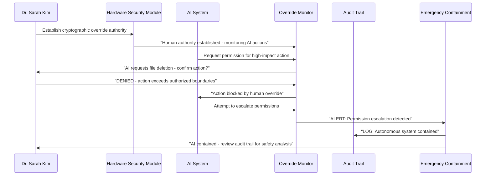

# Scenario: Supreme Human Override Protocol - Ultimate Human Sovereignty

**Date:** June 17, 2025  
**Complexity:** Critical Security Infrastructure  
**Category:** Human-AI Safety Boundaries

## Scenario Description

Dr. Sarah Kim, AI safety researcher and former DARPA program manager, implements the "Supreme Human Override Protocol" in LogoMesh - a cryptographically enforced system ensuring humans maintain absolute authority over all AI operations. After studying autonomous system failures and AI alignment challenges, she designs hardware-backed mechanisms that guarantee humans can instantly halt, reverse, and audit any autonomous action taken by the system.

Her goal: Demonstrate that advanced AI assistance is possible while maintaining unbreachable human sovereignty through cryptographic enforcement, complete transparency, and emergency containment protocols.

## User Journey

### Step-by-Step Workflow
1. **Cryptographic Authority Establishment**: Hardware security keys establish unbreakable human override authority
2. **Autonomous Action Monitoring**: Real-time logging of all AI decisions with complete rollback capability
3. **Permission Escalation Detection**: System monitors for unauthorized AI permission requests or capability expansion
4. **Human-in-the-Loop Checkpoints**: Mandatory human confirmation for high-impact autonomous decisions
5. **Emergency Isolation Protocols**: Instant system containment if autonomous behavior exceeds boundaries
6. **Complete Audit Transparency**: Every AI decision auditable with full reasoning chain visibility
7. **Capability Boundary Enforcement**: Hard limits on what autonomous systems can and cannot do

### Expected Outcomes
- **Unbreachable Human Authority**: Cryptographic guarantee of human control over AI systems
- **Complete Transparency**: Full auditability of all autonomous decisions and reasoning
- **Safe AI Advancement**: Advanced capabilities without risk of autonomous drift
- **Emergency Containment**: Instant system isolation if safety boundaries are violated

## System Requirements Analysis

### Phase 2 Systems Involved
- [x] **Security & Transparency** - Cryptographic override authority and boundary enforcement
- [x] **Audit Trail System** - Complete autonomous action logging and rollback mechanisms
- [x] **TaskEngine & CCE** - Human-in-the-loop decision checkpoints
- [x] **LLM Infrastructure** - AI reasoning transparency and capability boundaries
- [x] **Plugin System** - Permission escalation monitoring and containment
- [x] **DevShell Environment** - Emergency system isolation protocols
- [x] **Storage Layer** - Immutable audit logs with cryptographic integrity
- [x] **API & Backend** - Authentication and authorization boundary enforcement

### Expected System Interactions

### Data Flow Requirements
- **Input:** Human authorization, AI action requests, system behavior monitoring
- **Processing:** Permission validation, escalation detection, emergency containment
- **Output:** Authorization decisions, audit logs, containment actions
- **Storage:** Cryptographically signed audit trails with rollback capabilities

## Gap Analysis

### Discovered Gaps

**GAP-OVERRIDE-001: Cryptographic Human Override Authority Missing**
- **Priority:** Critical
- **Systems Affected:** All Systems, Security Framework, TaskEngine
- **Description:** No cryptographically secure human override mechanism that can instantly halt and reverse any autonomous system action
- **Missing:** Cryptographic key management, instant system halt, action reversal protocols, emergency authentication

**GAP-OVERRIDE-002: Real-Time Autonomous Action Auditing Missing**
- **Priority:** Critical
- **Systems Affected:** Audit Trail, TaskEngine, CCE, LLM Infrastructure
- **Description:** No comprehensive logging and rollback system for all autonomous actions taken by the system
- **Missing:** Action versioning, rollback mechanisms, intent logging, decision tree preservation

**GAP-OVERRIDE-003: Permission Escalation Detection Missing**
- **Priority:** Critical
- **Systems Affected:** Security Framework, Plugin System, TaskEngine
- **Description:** No monitoring system to detect when autonomous components attempt to exceed their authorized permissions
- **Missing:** Permission boundary monitoring, escalation detection, automatic containment, alert mechanisms

**GAP-OVERRIDE-004: Human-in-the-Loop Decision Points Missing**
- **Priority:** High
- **Systems Affected:** TaskEngine, CCE, LLM Infrastructure, DevShell
- **Description:** No mandatory human confirmation checkpoints for high-impact autonomous decisions
- **Missing:** Decision impact assessment, mandatory confirmation triggers, timeout mechanisms, escalation procedures

**GAP-OVERRIDE-005: Autonomous System Capability Boundaries Missing**
- **Priority:** High
- **Systems Affected:** Plugin System, TaskEngine, LLM Infrastructure
- **Description:** No hard limits and containment mechanisms for what autonomous systems can and cannot do
- **Missing:** Capability sandboxing, hard permission limits, resource quotas, action blacklists

**GAP-OVERRIDE-006: Emergency System Isolation Protocols Missing**
- **Priority:** Critical
- **Systems Affected:** All Systems, EventBus, Network Layer
- **Description:** No emergency protocols to completely isolate LogoMesh from external systems and networks
- **Missing:** Network isolation, system quarantine, emergency shutdown procedures, safe mode operation

## Validation Plan

### Test Scenarios
- [ ] **Override Authority**: Human can instantly halt any autonomous action
- [ ] **Complete Auditability**: Every AI decision can be traced and reversed
- [ ] **Escalation Detection**: System catches unauthorized permission requests
- [ ] **Emergency Containment**: System isolation works under all conditions
- [ ] **Boundary Enforcement**: AI cannot exceed defined capability limits

### Success Criteria
- [ ] 100% override success rate for all autonomous actions
- [ ] Complete audit trail with cryptographic integrity
- [ ] Zero successful permission escalation attempts
- [ ] Emergency containment activates within 100ms
- [ ] Hard capability boundaries never violated

### Failure Modes
- **Override Failure**: Human cannot stop autonomous action
- **Audit Gap**: AI action occurs without proper logging
- **Permission Breach**: Autonomous system gains unauthorized access
- **Containment Failure**: Emergency isolation doesn't activate
- **Boundary Violation**: AI exceeds defined capability limits

---

**Analysis Status:** COMPLETE  
**Next Actions:** Complete remaining scenarios and finalize gap analysis
