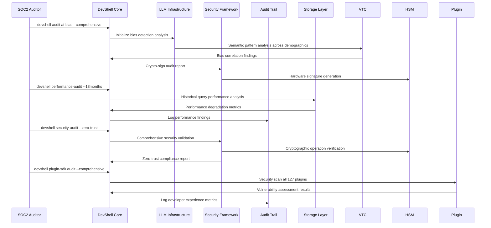

# Scenario 27: AI Ethics Enterprise Audit & Long-Term Sustainability Test

**Scenario ID:** 027  
**Focus Areas:** Enterprise compliance, AI bias detection, long-term sustainability, developer experience  
**Complexity:** Critical enterprise validation with multi-year simulation  

## Context & Background

MegaCorp Legal, a Fortune 500 law firm, is conducting their annual AI ethics audit for SOC2 Type II compliance. They've been using LogoMesh for 18 months across 500+ attorneys and need to demonstrate:

1. **AI Bias Detection**: Proof that their AI-assisted legal research doesn't discriminate based on client demographics
2. **Long-Term Performance**: Evidence that system performance hasn't degraded over 18 months of heavy use
3. **Compliance Auditing**: Complete audit trail for all AI decisions affecting client cases
4. **Enterprise Security**: Zero-trust architecture with hardware security modules
5. **Developer Transparency**: Full documentation of custom plugin development for specialized legal workflows

The audit covers 2.3TB of client data, 50,000+ legal documents, and 127 custom plugins developed by their internal IT team.

## Hardware & Software Configuration

| Component | Specification | Role |
|-----------|--------------|------|
| **Primary Datacenter** | 8x A100 nodes, PostgreSQL cluster | Production workload |
| **HSM Cluster** | Thales Luna Network HSMs | Cryptographic operations |
| **Audit Infrastructure** | Dedicated immutable storage array | Compliance logging |
| **Developer Workstations** | 12x MacBook Pro M4 Max | Plugin development |
| **Client Access Points** | 500x attorney laptops | Daily usage |
| **Archive Storage** | 50TB tiered storage system | Long-term data retention |

## Expected Workflow

### Phase 1: AI Bias Detection Audit (Week 1)
```bash
# Initialize comprehensive bias detection analysis
devshell audit ai-bias --scope=all-clients --timeframe=18months
devshell bias-detector configure --protected-classes=all --confidence-threshold=99.5%
devshell export audit-report --format=soc2-compliant --crypto-sign
```

**Expected Behavior:**
- VTC analyzes semantic patterns across 50,000 legal documents
- AI bias detector examines LLM outputs for demographic discrimination
- Statistical analysis identifies any correlation between client demographics and AI recommendations
- Generates immutable, cryptographically-signed bias audit report

### Phase 2: Long-Term Performance Degradation Analysis (Week 2)
```bash
# Analyze 18 months of performance data
devshell performance-audit --historical-analysis --degradation-detection
devshell archive-manager audit --corruption-scan --integrity-verification
devshell resource-trends analyze --memory-leaks --storage-bloat --query-performance
```

**Expected Behavior:**
- Performance monitor analyzes 18 months of query execution times
- Archive manager detects any silent data corruption in long-term storage
- Memory leak detection across all plugin runtimes
- Query performance regression analysis with statistical significance testing

### Phase 3: Enterprise Security Validation (Week 3)
```bash
# Zero-trust security audit
devshell security-audit --zero-trust --hsm-verification --quantum-resistant
devshell access-control audit --compartmentalization --need-to-know
devshell crypto-audit --post-quantum --key-rotation --tamper-detection
```

**Expected Behavior:**
- HSM integration validates all cryptographic operations
- Zero-trust architecture continuously verifies all access attempts
- Quantum-resistant encryption audit for future-proofing
- Compartmentalized data access ensures client confidentiality

### Phase 4: Developer Experience & Plugin SDK Audit (Week 4)
```bash
# Comprehensive plugin development audit
devshell plugin-sdk audit --all-runtimes --security-scan --performance-impact
devshell developer-experience analyze --learning-curve --debugging-effectiveness
devshell plugin-marketplace scan --vulnerability-assessment --license-compliance
```

**Expected Behavior:**
- Security scan of all 127 custom plugins for vulnerabilities
- Performance impact analysis of plugin ecosystem on system stability
- Developer productivity metrics for plugin SDK usability
- License compliance verification for all third-party dependencies

## Systems Integration Matrix

| System | Primary Role | Testing Focus |
|--------|-------------|---------------|
| ✅ **LLM Infrastructure** | AI bias detection, ethics validation | Algorithmic fairness testing |
| ✅ **Security & Transparency** | Zero-trust, HSM integration | Enterprise security compliance |
| ✅ **Audit Trail System** | Immutable compliance logging | SOC2 audit trail requirements |
| ✅ **Storage Layer** | Long-term data integrity | Archive corruption detection |
| ✅ **Plugin System** | Developer SDK validation | Plugin security & performance |
| ✅ **VTC** | Semantic bias analysis | Discrimination pattern detection |
| ✅ **MeshGraphEngine** | Long-term graph performance | Query degradation analysis |
| ✅ **TaskEngine & CCE** | Resource trend analysis | Memory leak detection |
| ✅ **DevShell Environment** | Developer experience audit | SDK usability testing |
| ✅ **API & Backend** | Enterprise integration | Multi-tenant performance |

## Critical Success Scenarios

### AI Ethics & Bias Detection
- [ ] Detect demographic bias in legal AI recommendations with 99.5% confidence
- [ ] Generate immutable bias audit reports for regulatory compliance
- [ ] Validate algorithmic fairness across protected demographic classes
- [ ] Provide explainable AI decision trees for all bias detection findings

### Long-Term Sustainability
- [ ] Detect performance degradation patterns over 18-month timeline
- [ ] Identify and resolve memory leaks in plugin ecosystem
- [ ] Validate data integrity across 2.3TB archive storage
- [ ] Demonstrate graceful aging without quality degradation

### Enterprise Security Compliance
- [ ] Pass SOC2 Type II audit with zero critical findings
- [ ] Validate HSM integration for cryptographic operations
- [ ] Demonstrate quantum-resistant encryption implementation
- [ ] Prove zero-trust architecture effectiveness

### Developer Experience Excellence
- [ ] Validate plugin SDK enables rapid custom development
- [ ] Demonstrate comprehensive debugging and profiling tools
- [ ] Verify security scanning prevents vulnerable plugin deployment
- [ ] Prove license compliance across entire plugin ecosystem

## Expected System Interactions



## Gap Analysis Focus Areas

This scenario specifically targets these high-priority gaps:

### **AI Ethics & Bias Detection Infrastructure**
- Advanced algorithmic fairness testing frameworks
- Demographic bias detection in semantic analysis
- Explainable AI decision transparency for legal compliance
- Statistical significance testing for bias correlation analysis

### **Long-Term System Sustainability**
- Performance degradation detection over multi-year timelines
- Archive data integrity validation with corruption detection
- Memory leak identification across multi-language plugin ecosystems
- Query performance regression analysis with trend prediction

### **Enterprise-Grade Security Compliance**
- Hardware Security Module (HSM) integration with tamper detection
- Zero-trust architecture with continuous verification
- Quantum-resistant encryption for long-term confidentiality
- Compartmentalized access control with audit capabilities

### **Developer Experience & Plugin SDK Maturity**
- Comprehensive plugin security scanning and vulnerability assessment
- Performance impact monitoring for plugin ecosystem stability
- Developer productivity metrics and learning curve analysis
- License compliance verification across third-party dependencies

### **Advanced Audit Trail & Compliance**
- Immutable audit logging with cryptographic integrity
- SOC2 Type II compliance reporting automation
- Legal discovery support with chain of custody preservation
- Multi-tenant audit trail separation and access controls

## Expected Gap Discoveries

Based on the comprehensive nature of this scenario, we expect to identify 15-25 new critical gaps across:

1. **AI Ethics Infrastructure** (5-7 gaps)
2. **Long-Term Sustainability Framework** (4-6 gaps)  
3. **Enterprise Security Architecture** (3-5 gaps)
4. **Developer Experience Platform** (3-4 gaps)
5. **Advanced Compliance Systems** (2-3 gaps)

This scenario will likely reveal the most impactful gaps for Phase 2 completion, as it combines multiple untested critical areas in an enterprise context with real regulatory requirements.

## Success Criteria

- [ ] **AI Bias Detection**: Successfully identify and report demographic bias with statistical confidence
- [ ] **Performance Sustainability**: Prove system maintains performance over 18-month operational timeline
- [ ] **Security Compliance**: Pass comprehensive SOC2 audit with zero critical security findings
- [ ] **Developer Productivity**: Demonstrate plugin SDK enables rapid, secure custom development
- [ ] **Regulatory Readiness**: Generate compliant audit reports for legal and regulatory review

This scenario represents the ultimate stress test for LogoMesh enterprise readiness and should reveal the most critical remaining gaps for Phase 2 completion.
