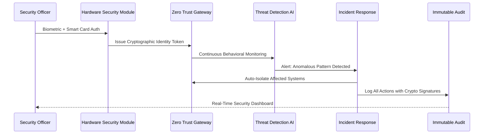

# Scenario: Zero Trust Enterprise Fortress - Maximum Security Architecture

**Date:** 2025-01-28  
**Complexity:** Extreme  
**Category:** Enterprise Security/Zero Trust Architecture

## Scenario Description

TechCorp Industries, a Fortune 500 defense contractor, requires an AI system that meets the highest security standards for processing classified government contracts. After a competitor suffered a $200M breach due to inadequate zero-trust implementation, TechCorp demands military-grade security with real-time threat detection and automated incident response.

Chief Security Officer Maria Rodriguez requires a system where:
- **Hardware-Enforced Zero Trust**: Every request cryptographically verified at hardware level
- **Real-Time Threat Detection**: AI-powered behavioral analysis with <100ms response times
- **Automated Incident Response**: Immediate containment and forensic evidence preservation
- **Multi-Level Security Clearances**: Secret/Top Secret compartmentalization with need-to-know enforcement
- **Supply Chain Security**: Plugin code signing and dependency verification
- **Quantum-Resistant Everything**: All cryptography future-proofed against quantum attacks
- **Air-Gapped Critical Operations**: Physically isolated networks for highest classification levels

## User Journey

### Step-by-Step Workflow
1. **Hardware Authentication**: Maria authenticates using HSM-backed smart card + biometric verification
2. **Continuous Verification**: System continuously validates her identity, location, and device integrity
3. **Threat Monitoring Dashboard**: Real-time security posture across all classified projects
4. **Automated Threat Response**: AI detects anomalous behavior and automatically isolates affected systems
5. **Incident Investigation**: Complete forensic timeline reconstruction with cryptographic proof
6. **Compliance Reporting**: Automated generation of NIST 800-53, FISMA, and DoD compliance reports
7. **Emergency Containment**: One-click isolation of entire network segments during security incidents

### Expected Outcomes
- **Sub-100ms Threat Detection**: Real-time behavioral analysis and response
- **Zero Lateral Movement**: Complete network segmentation with cryptographic boundaries
- **Perfect Audit Trail**: Immutable forensic evidence for all security events
- **Automated Compliance**: Continuous NIST/DoD compliance monitoring and reporting

## System Requirements Analysis

### Phase 2 Systems Involved
- [x] **Security & Transparency** - Hardware security module integration, quantum-resistant encryption
- [x] **Audit Trail System** - Immutable logging with cryptographic signatures and legal timestamps
- [x] **Plugin System** - Code signing, dependency verification, sandbox isolation
- [x] **Storage Layer** - Multi-level classification storage with hardware encryption
- [x] **API & Backend** - Zero-trust API gateway with continuous authentication
- [x] **LLM Infrastructure** - Classified AI processing with air-gap enforcement
- [x] **TaskEngine & CCE** - Security clearance-aware task routing and classification boundaries
- [x] **DevShell Environment** - Secure development with code signing and approval workflows

### Expected System Interactions



### Data Flow Requirements
- **Input:** All requests cryptographically verified at hardware level
- **Processing:** Multi-level security classification with air-gap enforcement
- **Output:** Encrypted responses with classification markings and audit trails
- **Storage:** Hardware-encrypted storage with quantum-resistant algorithms

## Gap Analysis

### Critical Security Gaps Discovered

**GAP-SECURITY-001: Hardware-Enforced Zero Trust Architecture**
- **Priority:** Critical
- **Affected Systems:** Security & Transparency, API & Backend, All Systems
- **Description:** No hardware-level cryptographic verification for every system access
- **Phase 2 Recommendation:** Implement TPM/HSM-based continuous authentication with hardware attestation

**GAP-SECURITY-002: Real-Time Behavioral Threat Detection**
- **Priority:** Critical
- **Affected Systems:** Security & Transparency, LLM Infrastructure, Audit Trail
- **Description:** No AI-powered behavioral analysis for anomaly detection with sub-second response
- **Phase 2 Recommendation:** Build ML-based threat detection with automated response protocols

**GAP-SECURITY-003: Automated Incident Response and Containment**
- **Priority:** Critical
- **Affected Systems:** Security & Transparency, EventBus, All Systems
- **Description:** No automated threat containment with immediate network isolation
- **Phase 2 Recommendation:** Implement automated incident response with forensic evidence preservation

**GAP-SECURITY-004: Multi-Level Security Classification Engine**
- **Priority:** Critical
- **Affected Systems:** Storage Layer, TaskEngine & CCE, Plugin System
- **Description:** No support for government security clearance levels with need-to-know enforcement
- **Phase 2 Recommendation:** Build classification-aware processing with mandatory access controls

**GAP-SECURITY-005: Supply Chain Security Framework**
- **Priority:** High
- **Affected Systems:** Plugin System, DevShell Environment
- **Description:** No plugin code signing, dependency verification, or supply chain attack prevention
- **Phase 2 Recommendation:** Implement comprehensive plugin security scanning and verification

**GAP-SECURITY-006: Quantum-Resistant Cryptographic Infrastructure**
- **Priority:** High
- **Affected Systems:** Security & Transparency, Storage Layer, API & Backend
- **Description:** Current encryption vulnerable to future quantum computing attacks
- **Phase 2 Recommendation:** Implement NIST post-quantum cryptographic standards across all systems

**GAP-SECURITY-007: Air-Gapped Network Isolation**
- **Priority:** Critical
- **Affected Systems:** LLM Infrastructure, Plugin System, Network Architecture
- **Description:** No physical network isolation for highest classification processing
- **Phase 2 Recommendation:** Design air-gapped processing environments with secure data transfer protocols

**GAP-SECURITY-008: Immutable Forensic Evidence Chain**
- **Priority:** Critical
- **Affected Systems:** Audit Trail System, Security & Transparency
- **Description:** No cryptographically verifiable evidence chain for legal proceedings
- **Phase 2 Recommendation:** Implement blockchain-based audit trail with legal timestamp authority

### Missing Enterprise Security Capabilities
- Hardware-enforced continuous authentication and device attestation
- AI-powered behavioral analysis with real-time threat scoring
- Automated incident response with network segmentation and containment
- Multi-level security classification with mandatory access controls
- Plugin code signing and supply chain vulnerability scanning
- Quantum-resistant encryption with forward secrecy guarantees
- Air-gapped processing environments for classified operations
- Immutable forensic audit trails with legal non-repudiation

## Implementation Strategy

### Zero Trust Security Framework
```typescript
class ZeroTrustSecurityManager {
  private hsmGateway: HSMGateway;
  private threatDetectionAI: ThreatDetectionEngine;
  private incidentResponse: IncidentResponseOrchestrator;
  private classificationEngine: SecurityClassificationEngine;

  async authenticateAndAuthorize(request: SecureRequest): Promise<AuthResult> {
    // Hardware-level identity verification
    const identity = await this.hsmGateway.verifyHardwareIdentity(request.credentials);
    
    // Continuous behavioral analysis
    const threatScore = await this.threatDetectionAI.analyzeBehavior(identity, request);
    
    // Classification-aware authorization
    const clearance = await this.classificationEngine.validateClearance(
      identity.userId, 
      request.resourceClassification
    );
    
    // Real-time threat response
    if (threatScore > THREAT_THRESHOLD) {
      await this.incidentResponse.initiateContainment(identity, threatScore);
      throw new SecurityThreatDetectedException();
    }
    
    return { identity, clearance, threatScore };
  }
}
```

### Real-Time Threat Detection Engine
```typescript
class ThreatDetectionEngine {
  private behavioralBaseline: Map<string, UserBehaviorProfile>;
  private anomalyDetector: AnomalyDetectionML;
  
  async analyzeBehavior(identity: HardwareIdentity, request: SecureRequest): Promise<number> {
    const currentBehavior = this.extractBehaviorSignature(request);
    const baseline = this.behavioralBaseline.get(identity.userId);
    
    // Real-time anomaly scoring
    const anomalyScore = await this.anomalyDetector.scoreAnomaly(
      currentBehavior, 
      baseline
    );
    
    // Geographic and temporal analysis
    const locationAnomaly = this.analyzeLocationAnomaly(identity, request);
    const timeAnomaly = this.analyzeTimeAnomaly(identity, request);
    
    // Composite threat score
    return this.calculateCompositeThreatScore({
      anomalyScore,
      locationAnomaly,
      timeAnomaly,
      deviceIntegrity: identity.deviceAttestation
    });
  }
}
```

### Automated Incident Response
```typescript
class IncidentResponseOrchestrator {
  private networkIsolation: NetworkIsolationController;
  private forensicCapture: ForensicEvidenceCollector;
  private auditLogger: ImmutableAuditLogger;
  
  async initiateContainment(threat: SecurityThreat): Promise<void> {
    // Immediate network isolation
    await this.networkIsolation.isolateUserSessions(threat.affectedUsers);
    await this.networkIsolation.quarantineDevices(threat.compromisedDevices);
    
    // Forensic evidence preservation
    const evidencePackage = await this.forensicCapture.captureSystemState({
      timestamp: new Date(),
      threatLevel: threat.severity,
      affectedSystems: threat.systems
    });
    
    // Immutable incident logging
    await this.auditLogger.logSecurityIncident({
      incidentId: generateIncidentId(),
      threatSignature: threat.signature,
      responseActions: evidencePackage.actions,
      cryptographicProof: await this.signEvidence(evidencePackage)
    });
  }
}
```

## Validation Plan

### Security Test Scenarios
- [ ] **Red Team Penetration**: Attempt to breach zero-trust boundaries with advanced persistent threats
- [ ] **Behavioral Bypass Testing**: Test threat detection against sophisticated social engineering
- [ ] **Quantum Cryptanalysis Simulation**: Validate quantum-resistant encryption against simulated attacks
- [ ] **Supply Chain Compromise**: Test plugin verification against sophisticated supply chain attacks
- [ ] **Insider Threat Simulation**: Validate containment against privileged user abuse
- [ ] **Air-Gap Breach Testing**: Attempt data exfiltration from isolated networks

### Success Criteria
- [ ] Sub-100ms threat detection and response across all attack vectors
- [ ] Zero successful lateral movement in red team testing
- [ ] Complete forensic reconstruction of all security events with cryptographic proof
- [ ] 100% compliance with NIST 800-53 High baseline and DoD security requirements
- [ ] Successful quantum cryptanalysis resistance testing
- [ ] Perfect plugin supply chain verification with zero false negatives

### Failure Modes
- Hardware security module compromise requires immediate cryptographic key rotation
- AI threat detection false positives could disrupt legitimate operations
- Network isolation failures could allow lateral movement during incidents
- Quantum computing breakthrough demands emergency cryptographic migration

## Architecture Philosophy

### Security Through Mathematical Proof, Not Hope
Enterprise security must be based on cryptographic guarantees and mathematical proofs, not assumptions about attacker capabilities or good intentions.

### Zero Trust Means Zero Exceptions
Every request, every user, every device must be continuously verified with hardware-backed cryptographic proof - no exceptions for convenience or legacy systems.

### Automated Response Faster Than Human Reaction
Threats move at machine speed, so responses must be automated and faster than any human could react, with complete forensic evidence preservation.

## Implementation Notes

### Technical Requirements
- TPM 2.0 or HSM integration for hardware-backed authentication
- Machine learning infrastructure for real-time behavioral analysis
- Network segmentation capability with microsecond isolation response
- Quantum-resistant cryptographic library integration (NIST standardized algorithms)
- Air-gapped network infrastructure with secure data transfer protocols

### Compliance Frameworks
- NIST 800-53 High Baseline implementation
- FISMA compliance with continuous monitoring
- DoD Risk Management Framework (RMF) Level 3+ requirements
- Common Criteria EAL4+ security evaluation
- FIPS 140-2 Level 3 cryptographic module requirements

### Phase 3 Activation Points
- Production HSM cluster with high availability and failover
- Enterprise SIEM integration with threat intelligence feeds
- Dedicated security operations center (SOC) with 24/7 monitoring
- Government security clearance integration with personnel security systems
- Advanced persistent threat (APT) hunting with machine learning

---

**Analysis Status:** COMPLETE  
**Next Actions:** Integrate zero-trust architecture into Phase 2 security framework, implement hardware-backed authentication

**Key Insight:** True enterprise security requires hardware-enforced cryptographic boundaries, AI-powered threat detection, and automated response capabilities that operate faster than human reaction times. Security becomes a mathematical guarantee rather than a best-effort protection.
