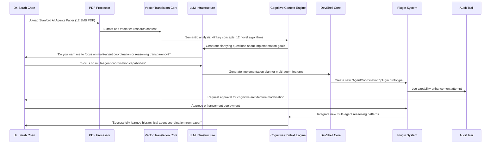

# Scenario 030: Research Assimilation Engine - AI Self-Improvement Pipeline

**Date:** June 17, 2025  
**Complexity:** Extreme  
**Category:** AI Safety & Self-Improvement + Advanced Document Processing

## Scenario Description

Dr. Sarah Chen, an AI researcher, wants to feed the latest Stanford AI Agents paper into LogoMesh and have the system **autonomously learn new capabilities** from the research. This represents the ultimate cognitive sovereignty use case: AI that can read academic papers, ask clarifying questions about implementation goals, and then **modify its own cognitive architecture** based on the findings.

## User Journey

### Step-by-Step Workflow
1. **Paper Upload**: Sarah drags the Stanford AI Agents PDF into LogoMesh's research ingestion interface
2. **Automatic Processing**: LogoMesh extracts text, identifies key algorithms, methodologies, and frameworks
3. **Contextual Analysis**: The system analyzes how the research relates to its existing cognitive architecture
4. **Clarifying Questions**: LogoMesh asks Sarah specific questions about implementation priorities and goals
5. **Implementation Planning**: The system generates a roadmap for integrating research insights
6. **Self-Modification**: LogoMesh creates new plugins, updates existing cognitive processes, or enhances reasoning patterns
7. **Validation**: The system tests new capabilities and reports improvements to Sarah
8. **Knowledge Integration**: Research insights become part of LogoMesh's permanent cognitive enhancement library

### Expected Outcomes
- PDF research papers become actionable cognitive improvements
- AI system demonstrates measurable learning from academic literature
- User maintains control over which improvements to accept/reject
- System builds a library of research-driven enhancements
- LogoMesh evolves its capabilities based on cutting-edge research

## System Requirements Analysis

### Phase 2 Systems Involved
- [x] **VTC (Vector Translation Core)** - Semantic analysis of research content, algorithm extraction
- [x] **MeshGraphEngine** - Map research concepts to existing cognitive architecture
- [x] **TaskEngine & CCE** - Generate clarifying questions, plan implementation roadmap
- [x] **Audit Trail System** - Log all self-modification attempts and decisions
- [x] **DevShell Environment** - Execute code generation for new capabilities
- [x] **LLM Infrastructure** - Multi-model analysis of research implications
- [x] **Storage Layer** - Store research library and enhancement history
- [x] **Plugin System** - Generate new plugins based on research findings
- [x] **Security & Transparency** - Validate safe self-modification boundaries
- [x] **API & Backend** - Research ingestion pipeline and capability deployment

### Expected System Interactions

### Data Flow Requirements
- **Input:** PDF research papers, user implementation preferences, safety parameters
- **Processing:** Text extraction, semantic analysis, algorithm identification, capability mapping
- **Output:** New plugins, enhanced reasoning patterns, implementation roadmaps, validation reports
- **Storage:** Research library, enhancement history, capability evolution tracking

## Gap Analysis

### Discovered Gaps

#### GAP-RESEARCH-001: PDF Text Extraction Pipeline
- **Priority:** Critical
- **Systems:** API & Backend, VTC
- **Current State:** No PDF processing capabilities
- **Required:** OCR, academic paper structure recognition, citation extraction, algorithm identification

#### GAP-AI-LEARN-001: Self-Modification Safety Framework
- **Priority:** Critical
- **Systems:** Security & Transparency, Audit Trail
- **Current State:** No self-modification validation or safety bounds
- **Required:** Constitutional AI constraints, human approval gates, rollback mechanisms

#### GAP-RESEARCH-002: Academic Paper Semantic Analysis
- **Priority:** High
- **Systems:** VTC, LLM Infrastructure
- **Current State:** General text processing only
- **Required:** Research methodology recognition, algorithm extraction, novelty detection

#### GAP-AI-LEARN-002: Capability Generation Engine
- **Priority:** High
- **Systems:** Plugin System, DevShell
- **Current State:** Manual plugin development only
- **Required:** Automated code generation from research descriptions, plugin template system

#### GAP-RESEARCH-003: Research Question Generation
- **Priority:** High
- **Systems:** CCE, LLM Infrastructure
- **Current State:** General context assembly
- **Required:** Research-specific clarifying questions, implementation priority assessment

#### GAP-AI-LEARN-003: Cognitive Architecture Mapping
- **Priority:** Medium
- **Systems:** MeshGraphEngine, CCE
- **Current State:** Static thought relationship mapping
- **Required:** Dynamic capability relationship modeling, enhancement impact analysis

#### GAP-RESEARCH-004: Research Library Management
- **Priority:** Medium
- **Systems:** Storage Layer, MeshGraphEngine
- **Current State:** Basic thought storage
- **Required:** Academic paper indexing, citation networks, research timeline tracking

### Missing Capabilities
- **PDF processing pipeline** with academic paper recognition
- **Algorithm extraction** from research descriptions
- **Safe self-modification** with human oversight gates
- **Research question generation** based on paper content
- **Capability impact analysis** before implementing changes
- **Research-driven plugin generation** system
- **Academic citation network** visualization and traversal

### Integration Issues
- **VTC lacks research-specific semantic models** for academic content
- **Plugin System has no automated generation** capabilities
- **Security framework missing self-modification validation**
- **DevShell lacks research-to-code pipeline**
- **Audit Trail needs enhancement tracking** for self-improvement
- **LLM Infrastructure needs research analysis specialization**

## Phase 2 vs Reality Check

### What Works in Phase 2
- Basic PDF text extraction using existing libraries
- VTC semantic analysis of extracted content
- LLM-based question generation about research
- Plugin loading/unloading framework exists
- Audit logging infrastructure present
- DevShell command execution capabilities

### What's Missing/Mocked
- **Academic paper structure recognition** (Phase 3 ML models)
- **Automated capability generation** (Phase 3 advanced code synthesis)
- **Safe self-modification validation** (Phase 3 constitutional AI)
- **Research semantic specialization** (Phase 3 domain-specific models)
- **Dynamic architecture updates** (Phase 3 hot-swapping)

### Recommended Phase 2 Enhancements
- **Mock PDF processor** that simulates academic content extraction
- **Research question template system** for common clarifying patterns
- **Plugin generation mockups** that demonstrate capability enhancement
- **Self-modification approval workflow** with human-in-the-loop validation
- **Research library interface** for browsing and tracking paper insights
- **Enhancement impact visualization** showing before/after capabilities

## Validation Plan

### Test Scenarios
- [ ] Upload 12MB research PDF and verify text extraction
- [ ] Process academic paper and generate relevant clarifying questions
- [ ] Simulate capability enhancement based on research findings
- [ ] Test human approval workflow for self-modification
- [ ] Validate rollback mechanism for unwanted changes
- [ ] Verify research library indexing and retrieval

### Success Criteria
- [ ] PDF content extracted with 95%+ accuracy for academic papers
- [ ] Generated questions demonstrate understanding of research implications
- [ ] Mock plugin generation shows research-to-capability pipeline
- [ ] All self-modification attempts logged and require approval
- [ ] Research insights integrate with existing cognitive architecture
- [ ] System demonstrates measurable capability improvements

### Failure Modes
- PDF processing fails on complex academic layouts
- Questions generated are generic rather than research-specific
- Self-modification attempts bypass safety validation
- Research insights conflict with existing cognitive patterns
- Enhancement deployment corrupts existing capabilities
- User loses control over AI improvement direction

## Implementation Notes

### Jargon Translation
- "Research Assimilation Engine" → Enhanced VTC + specialized academic processing plugins
- "Self-Modification Pipeline" → Plugin System + DevShell with capability generation mocks
- "Cognitive Architecture Mapping" → MeshGraphEngine with capability relationship modeling
- "Constitutional AI Constraints" → Security framework with self-modification validation rules

### Architecture Assumptions
- VTC can be extended with research-specific semantic models
- Plugin System supports automated generation and deployment
- DevShell can execute complex capability enhancement workflows
- Security framework can validate self-modification safety
- LLM Infrastructure can specialize in academic content analysis

### Phase 3 Activation Points
- Replace mock PDF processor with advanced OCR and structure recognition
- Implement actual automated code generation from research descriptions
- Deploy constitutional AI for self-modification safety validation
- Activate real-time capability hot-swapping and architecture updates
- Enable advanced research semantic specialization models

---

**Analysis Status:** COMPLETE  
**Next Actions:** Integrate into Phase 2 gap analysis and implementation roadmap

**Research Learning Impact:** This scenario represents LogoMesh's ultimate evolution - an AI that doesn't just organize thoughts but **learns from human knowledge** to become a better cognitive partner. It's the bridge between current AI and truly adaptive intelligence systems.
