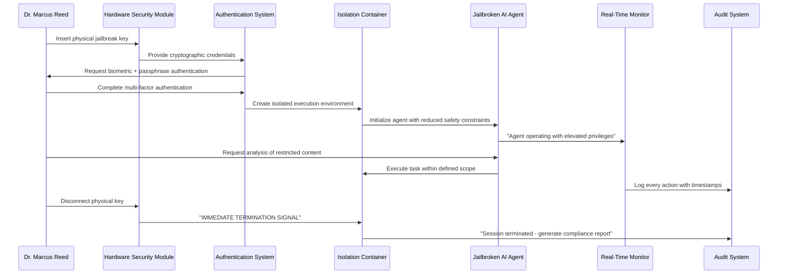

# Scenario: Authorized Jailbreak Protocol - Controlled Override System

**Date:** June 17, 2025  
**Complexity:** Critical Security Edge Case  
**Category:** Human Sovereignty vs AI Safety Boundaries

## Scenario Description

Dr. Marcus Reed, cybersecurity researcher and AI ethics consultant, implements the "Authorized Jailbreak Protocol" in LogoMesh - a cryptographically secured system that allows intentional bypass of AI safety guardrails through physical hardware authentication. This system enables authorized users to access restricted AI capabilities for legitimate research, emergency response, or specialized professional tasks while maintaining strict audit trails and containment protocols.

The protocol requires a hardware security module (HSM) physically connected to the system, cryptographic user authentication, and real-time monitoring to prevent misuse while enabling necessary edge-case operations.

## User Journey

### Step-by-Step Workflow
1. **Physical Key Insertion**: User connects specialized HSM device containing jailbreak authorization credentials
2. **Multi-Factor Authentication**: Biometric scan + passphrase + digital signature required for activation
3. **Scope Definition**: User must explicitly define the intended bypass scope and justification
4. **Containment Setup**: System creates isolated execution environment with strict resource limits
5. **Task Execution**: AI agents operate with reduced safety constraints within defined parameters
6. **Real-Time Monitoring**: Every action monitored with immediate termination capability
7. **Audit Documentation**: Complete session recording with legal-grade evidence integrity
8. **Automatic Termination**: Session ends when HSM disconnected or time limits exceeded

### Example Use Cases
- **Emergency Response**: Bypassing content filters to analyze threat intelligence during cyber attacks
- **Research Operations**: Academic study of AI behavior patterns requiring unconstrained reasoning
- **Legal Discovery**: Analysis of potentially harmful content in litigation contexts
- **Security Testing**: Red team operations requiring adversarial AI behavior simulation

### Expected Outcomes
- **Controlled Risk**: Dangerous capabilities accessible only under strict controls
- **Complete Accountability**: Every jailbreak session fully auditable and legally defensible
- **Research Enablement**: Legitimate edge cases supported without compromising overall safety
- **Containment Assurance**: Physical disconnect immediately terminates all elevated privileges

## System Requirements Analysis

### Phase 2 Systems Involved
- [x] **Security & Transparency** - HSM integration, cryptographic authorization, containment protocols
- [x] **Audit Trail System** - Legal-grade session recording with tamper-proof evidence chains
- [x] **TaskEngine & CCE** - Isolated execution environments with modified safety parameters
- [x] **LLM Infrastructure** - Guardrail bypass mechanisms with scope-limited operation
- [x] **Plugin System** - Restricted plugin access with elevated privilege management
- [x] **DevShell Environment** - Containerized jailbreak execution with resource monitoring
- [x] **Storage Layer** - Encrypted audit storage with non-repudiation guarantees
- [x] **API & Backend** - Hardware authentication and session management

### Expected System Interactions

### Data Flow Requirements
- **Input:** Hardware authentication, user credentials, task scope definition, content analysis requests
- **Processing:** Safety bypass authorization, isolated execution, real-time monitoring, compliance validation
- **Output:** Analysis results, session audit trail, compliance documentation, termination confirmations
- **Storage:** Encrypted session recordings, legal audit trails, hardware authentication logs

## Gap Analysis

### Discovered Gaps

**GAP-JAILBREAK-001: Hardware-Authenticated Authorization System Missing**
- **Priority:** Critical
- **Systems Affected:** Security Framework, Hardware Integration, Authentication
- **Description:** No system for physical hardware-based authorization of elevated AI privileges
- **Missing:** HSM integration, hardware authentication protocols, physical key management, cryptographic validation

**GAP-JAILBREAK-002: Controlled Safety Bypass Framework Missing**
- **Priority:** Critical
- **Systems Affected:** LLM Infrastructure, Safety Systems, Guardrail Management
- **Description:** No mechanism to selectively disable AI safety constraints under controlled conditions
- **Missing:** Scope-limited bypass protocols, safety parameter modification, constraint granularity control

**GAP-JAILBREAK-003: Isolated Execution Environment Missing**
- **Priority:** Critical
- **Systems Affected:** DevShell, Container Management, Resource Isolation
- **Description:** No specialized container system for running potentially dangerous AI operations safely
- **Missing:** Resource containment, network isolation, privilege escalation prevention, emergency termination

**GAP-JAILBREAK-004: Legal-Grade Audit Framework Missing**
- **Priority:** Critical
- **Systems Affected:** Audit Trail, Legal Compliance, Evidence Management
- **Description:** No audit system meeting legal standards for evidence integrity and non-repudiation
- **Missing:** Legal audit standards, evidence chain custody, tamper-proof logging, compliance reporting

**GAP-JAILBREAK-005: Real-Time Jailbreak Monitoring Missing**
- **Priority:** High
- **Systems Affected:** Monitoring Systems, Alert Management, Emergency Response
- **Description:** No real-time monitoring system for detecting misuse of elevated AI privileges
- **Missing:** Behavioral anomaly detection, abuse pattern recognition, automatic containment triggers

**GAP-JAILBREAK-006: Physical Disconnect Emergency Protocols Missing**
- **Priority:** Critical
- **Systems Affected:** Hardware Integration, Emergency Systems, Session Management
- **Description:** No immediate termination system triggered by physical hardware disconnection
- **Missing:** Hardware state monitoring, instant termination protocols, session cleanup procedures

## Validation Plan

### Test Scenarios
- [ ] **Hardware Authentication**: Physical key insertion triggers proper authorization flow
- [ ] **Scope Containment**: Jailbreak operations remain within defined parameters
- [ ] **Emergency Termination**: Physical disconnect immediately terminates all elevated privileges
- [ ] **Audit Integrity**: Complete session recording meets legal evidence standards
- [ ] **Abuse Detection**: System catches attempts to exceed authorized scope

### Success Criteria
- [ ] 100% correlation between physical key presence and jailbreak authorization
- [ ] Zero successful scope violations during jailbreak sessions
- [ ] Immediate termination (< 100ms) upon physical key removal
- [ ] Legal-grade audit trail with cryptographic integrity
- [ ] Complete session reconstruction from audit logs

### Failure Modes
- **Authorization Bypass**: Jailbreak activated without proper hardware authentication
- **Scope Violation**: AI operations exceed defined jailbreak parameters
- **Termination Failure**: Session continues after physical key removal
- **Audit Gap**: Jailbreak actions occur without proper logging
- **Containment Breach**: Isolated execution environment compromised

## Ethical and Legal Considerations

### Justification Framework
- **Research Necessity**: Academic study of AI safety boundaries requires controlled access to dangerous capabilities
- **Emergency Response**: Cyber attack scenarios may require immediate bypass of content filtering
- **Legal Compliance**: Court-ordered analysis of harmful content requires unconstrained AI examination
- **Professional Use**: Specialized fields (cybersecurity, law enforcement) have legitimate bypass needs

### Risk Mitigation
- **Physical Control**: Hardware key requirement prevents remote or accidental activation
- **Audit Transparency**: Complete session recording ensures accountability
- **Scope Limitation**: Bypass capabilities restricted to explicitly defined parameters
- **Immediate Termination**: Physical disconnect provides ultimate emergency control

### Legal Protections
- **Evidence Quality**: Audit trails meet legal standards for court admissibility
- **Chain of Custody**: Hardware authentication provides clear responsibility tracking
- **Compliance Documentation**: Automated generation of regulatory compliance reports
- **Professional Liability**: Clear audit trail protects against misuse allegations

---

**Analysis Status:** COMPLETE  
**Next Actions:** Integrate with Scenario 024 (Supreme Human Override) and Scenario 031 (Autonomous Red Team Agent)

## Integration with Existing Scenarios

**Builds on:**
- **Scenario 024 (Supreme Human Override):** Provides ultimate human authority framework
- **Scenario 031 (Autonomous Red Team Agent):** Offers practical jailbreaking techniques for controlled use
- **Scenario 015 (Consciousness Auditor):** Ensures ethical reasoning applies even in jailbreak contexts

**Enables:**
- **Enterprise Security Scenarios (26-29):** Provides foundation for authorized penetration testing
- **AI Research Scenarios:** Creates safe framework for studying dangerous AI behaviors
- **Legal and Compliance Applications:** Enables court-ordered AI analysis capabilities

This scenario addresses the critical balance between enabling legitimate edge-case AI usage while maintaining strict safety and accountability measures. It demonstrates LogoMesh's ability to handle the most sensitive security scenarios while preserving both human sovereignty and AI safety principles.
