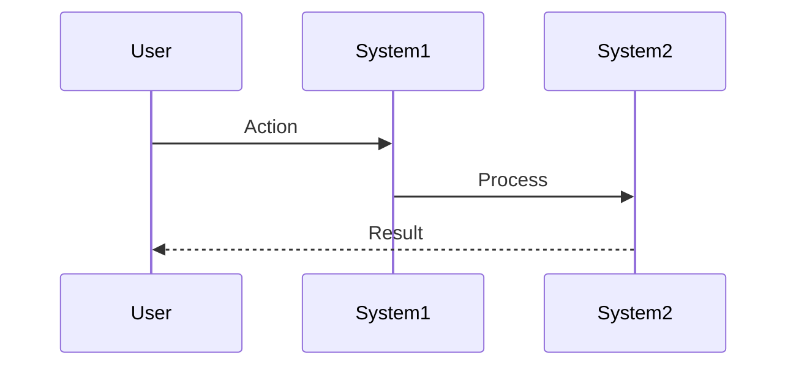

# Scenario: [Scenario Name]

**Date:** [Date]  
**Complexity:** [Low/Medium/High/Extreme]  
**Category:** [Creative Applications/Edge Cases/Integration Challenges/Performance Extremes]

## Scenario Description

[Detailed description of the creative use case, including user goals, expected behavior, and context]

## User Journey

### Step-by-Step Workflow
1. [User action 1]
2. [User action 2]
3. [System response/process]
4. [Continue...]

### Expected Outcomes
- [What should happen]
- [Key success metrics]
- [User satisfaction criteria]

## System Requirements Analysis

### Phase 2 Systems Involved
- [ ] **VTC (Vector Translation Core)** - [How it's used]
- [ ] **MeshGraphEngine** - [How it's used]
- [ ] **TaskEngine & CCE** - [How it's used]
- [ ] **Audit Trail System** - [How it's used]
- [ ] **DevShell Environment** - [How it's used]
- [ ] **Input Templates** - [How it's used]
- [ ] **TTS Plugin Framework** - [How it's used]
- [ ] **Security & Transparency** - [How it's used]
- [ ] **LLM Infrastructure** - [How it's used]
- [ ] **Storage Layer** - [How it's used]
- [ ] **Plugin System** - [How it's used]
- [ ] **API & Backend** - [How it's used]

### Expected System Interactions

### Data Flow Requirements
- **Input:** [What data enters the system]
- **Processing:** [How data is transformed]
- **Output:** [What results are produced]
- **Storage:** [What needs to be persisted]

## Gap Analysis

### Discovered Gaps
[Use GAP-XXX format from gap_analysis.md]

### Missing Capabilities
- [What Phase 2 currently can't do]
- [What interfaces are missing]
- [What mock behavior is insufficient]

### Integration Issues
- [Where systems don't communicate properly]
- [Missing coordination mechanisms]
- [Data consistency problems]

## Phase 2 vs Reality Check

### What Works in Phase 2
- [Current Phase 2 capabilities that support this scenario]

### What's Missing/Mocked
- [What would need Phase 3 activation]
- [What mock components can't handle]

### Recommended Phase 2 Enhancements
- [Specific improvements to make within Phase 2 scope]
- [Additional mock behaviors needed]
- [Interface extensions required]

## Validation Plan

### Test Scenarios
- [ ] [Specific test case 1]
- [ ] [Specific test case 2]
- [ ] [Edge case testing]

### Success Criteria
- [ ] [Measurable outcome 1]
- [ ] [Measurable outcome 2]
- [ ] [Performance criteria]

### Failure Modes
- [What could go wrong]
- [How to detect failures]
- [Recovery strategies]

## Implementation Notes

### Jargon Translation
[Map any hallucinated syntax to real LogoMesh architecture]

### Architecture Assumptions
[Note any assumptions about how systems work]

### Phase 3 Activation Points
[What would need to change for Phase 3]

---

**Analysis Status:** [PENDING/IN_PROGRESS/COMPLETE]  
**Next Actions:** [What to do next]
