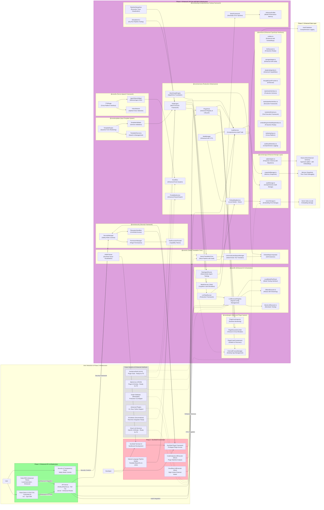

```mermaid
graph LR
  %% === Top Level Grouping ===
  %% Phase 2 Infrastructure Foundations with Mock Systems and Security Framework

  subgraph UserAndExternalSystems ["User Interaction & Phase 2 Infrastructure"]
    direction TB
    User["User"]
    Developer["Developer"]

    subgraph LM_API_P2 ["Phase 2: Enhanced API & Infrastructure"]
      direction TB
      style LM_API_P2 fill:#98FB98,stroke:#228B22
      BackendAPI_P2["API Server (Node.js/Express.js - Full TS)\nserver/ - Enhanced Routes"]
      ReactDemoUI_P2["React Demo UI (Full TSX, Cytoscape.js)\nsrc/ - Type-Safe"]
      NodeRED_P2["Node-RED (Advanced Flows)\nLocal Automation - Enhanced"]
      SecurityPanel["Security & Transparency Panel\nSafety Mode Controls"]
    end

    subgraph LM_DEVSHELL ["Phase 2: DevShell Environment"]
      direction TB
      style LM_DEVSHELL fill:#FFB6C1,stroke:#DC143C
      DevShellTerminal["DevShell Terminal UI\nSandboxed Development"]
      DevShellPlugin["DevShell Plugin Framework\nPrivileged Plugin Access"]
      NaturalLanguageBuilder["Natural Language Pipeline Builder\nTemplate-Based NL-to-JSON"]
      CodeAnalysisLLM["CodeAnalysisLLMExecutor (Mock)\nPlugin Manifest Analysis"]
      CloudDevLLM["CloudDevLLMExecutor (Stub)\nHigh-Context External Model"]
    end

    subgraph LM_EXTERNAL_P2 ["Future Systems & Enhanced Interfaces"]
      direction TB
      style LM_EXTERNAL_P2 fill:#E0E0E0,stroke:#808080
      SentienceShell_Ext_P2["SentienceShell (LM-HI)\nPlugin Suite - Ready for P3"]
      MatrixCore_Ext_P2["MatrixCore (VR/AR)\nPlugin (C#/Unity) - Ready for P3"]
      GraphDB_Ext_P2["Graph Database (Memgraph)\nProduction via Adapter"]
      OtherPlugins_Ext_P2["Advanced Plugins\nC#, Rust, Python Support"]
      EchoMesh_Ext_P2["EchoMesh (Decentralized)\nReal-time Integration Ready"]
      CloudLLMServices["Cloud LLM Services\nOpenAI, Anthropic - Ready for P3"]
    end
  end

  subgraph LMCoreP2Complex ["Phase 2: Enhanced LM-Core with Mock Infrastructure"]
    direction TB
    style LMCoreP2Complex fill:#DDA0DD,stroke:#8B008B

    subgraph CONTRACTS_P2 ["@contracts (Enhanced TypeScript Interfaces)"]
      direction LR
      Entities_P2["entities.ts\n(Enhanced with Embeddings)"]
      LLMExecutorInterface_P2["llmExecutor.ts\n(Production-Ready)"]
      StorageAdapterInterface_P2["storageAdapter.ts\n(Enhanced with Audit)"]
      PluginAPIInterface_P2["plugins/pluginApi.ts\n(Advanced Capabilities)"]
      ThoughtExportProviderInterface_P2["thoughtExportProvider.ts\n(Enhanced)"]
      TaskInterface_P2["tasks/taskInterface.ts\n(Production Schema)"]
      PipelineInterface_P2["tasks/pipelineInterface.ts\n(Execution Framework)"]
      ToolInterface_P2["tools/toolSchema.ts\n(Tool Execution Framework)"]
      EmbeddingInterface_P2["embeddings/embeddingInterface.ts\n(Production-Ready)"]
      TTSInterface_P2["tts/ttsInterface.ts\n(Cross-Platform)"]
      AuditInterface_P2["audit/auditInterface.ts\n(Comprehensive Logging)"]
    end

    subgraph CORE_SERVICES_P2 ["@core/services (Production Infrastructure)"]
      direction TB
      IdeaMgr_P2["IdeaManager\n(Enhanced with VTC)"]
      MeshGraphEngine_P2["MeshGraphEngine\n(Algorithmic Foundation)"]
      TaskEngine_P2["TaskEngine\n(Mock Executor Framework)"]
      PluginHost_P2["PluginHost\n(Advanced Registry & Lifecycle)"]
      EventBus_P2["EventBus\n(Enhanced Event System)"]
      PortabilitySvc_P2["PortabilityService\n(Enhanced Export/Import)"]
      EmbeddingService_P2["EmbeddingService\n(Local Models + Mock)"]
      AuditService_P2["AuditService\n(Comprehensive Audit Trail)"]
    end

    subgraph CORE_AI_ORCH_P2 ["@core/llm (Enhanced AI Orchestration)"]
      direction TB
      LLMTaskRunner_P2["LLMTaskRunner\n(Production Framework)"]
      LLMExecutorRegistry_P2["LLMExecutorRegistry\n(Signed Config Management)"]
      MockLLMExecutor_P2["MockLLMExecutor.ts\n(Stochastic Testing)"]
      OllamaExecutor_P2["OllamaExecutor.ts\n(Robust with Streaming)"]
      FakeAgentRunner_P2["FakeAgentRunner\n(Deterministic Agent Testing)"]
      MetaExecutor_P2["MetaExecutor (Stub)\n(Cognitive Load Simulation)"]
      LocalModelTestPanel_P2["LocalModelTestPanel\n(Model Testing Interface)"]
    end

    subgraph CORE_VTC_P2 ["@core/vtc (Vector Translation Core)"]
      direction TB
      VectorTranslationCore_P2["VectorTranslationCore\n(Mock Pipeline with Audit)"]
      UniversalLatentSpaceManager_P2["UniversalLatentSpaceManager\n(Deterministic Test Translator)"]
      EmbeddingComparator_P2["EmbeddingComparator\n(Drift Detection)"]
      UMAPViewer_P2["UMAPViewer\n(DevShell Vector Visualization)"]
    end

    subgraph CORE_STORAGE_P2 ["@core/storage (Enhanced Storage Layer)"]
      direction TB
      SQLiteAdapter_P2["sqliteAdapter.ts\n(Production Schema with Migrations)"]
      VectorStorage_P2["vectorStorage.ts\n(Embedding-First Storage)"]
      AuditStorage_P2["auditStorage.ts\n(Comprehensive Audit Storage)"]
      SnapshotManager_P2["snapshotManager.ts\n(Memory Snapshots)"]
    end

    subgraph CORE_SECURITY_P2 ["@core/security (Security Framework)"]
      direction TB
      SecurityManager_P2["SecurityManager\n(Safety Mode Controls)"]
      PermissionManager_P2["PermissionManager\n(Plugin Permissions)"]
      FilesystemSandbox_P2["FilesystemSandbox\n(Controlled Access)"]
      ToolExecutionFirewall_P2["ToolExecutionFirewall\n(Capability Tokens)"]
    end

    subgraph CORE_PLUGINS_P2 ["@core/plugins (Advanced Plugin System)"]
      direction TB
      PluginExecutionLimiter_P2["PluginExecutionLimiter\n(Timeout & Circuit Breaker)"]
      PluginLiveInspector_P2["PluginLiveInspector\n(Runtime Monitoring)"]
      PluginCrashContainment_P2["PluginCrashContainment\n(Isolation & Recovery)"]
      ExternalProcessManager_P2["ExternalProcessManager\n(Desktop App Management)"]
    end

    subgraph CORE_TEMPLATES_P2 ["@core/templates (Input Template System)"]
      direction TB
      TemplateEngine_P2["TemplateEngine\n(Dynamic Form Rendering)"]
      TemplateDiscovery_P2["TemplateDiscovery\n(Search & Management)"]
      TemplateValidator_P2["TemplateValidator\n(Schema Validation)"]
    end

    subgraph CORE_TTS_P2 ["@core/tts (Text-to-Speech Framework)"]
      direction TB
      TTSPlugin_P2["TTSPlugin\n(Cross-Platform Interface)"]
      VoiceSelector_P2["VoiceSelector\n(Optimal Voice Selection)"]
      AgentStatusWidget_P2["AgentStatusWidget\n(Minimal Agent HUD)"]
    end

    subgraph CORE_TESTING_P2 ["@core/testing (Comprehensive Testing Framework)"]
      direction TB
      MockFramework_P2["MockFramework\n(Stochastic Error Injection)"]
      InferenceProfiler_P2["InferenceProfiler\n(Model Performance Metrics)"]
      PipelineDebugView_P2["PipelineDebugView\n(Execution Trace Visualization)"]
      SimulationCLI_P2["SimulationCLI\n(Dry-Run Pipeline Testing)"]
    end
  end

  %% Enhanced Data Store
  subgraph DATA_LAYER_P2 ["Phase 2: Enhanced Data Layer"]
    direction TB
    SQLite_DB_P2["SQLite DB (Enhanced Schema)\nlogomesh.sqlite3 - with Embeddings"]
    AuditDB_P2["Audit Database\nComprehensive Logging"]
    SnapshotStore_P2["Memory Snapshots\nTime-Travel Debugging"]
    VectorIndex_P2["Vector Index (Local)\nEmbedding Storage"]
  end
  style DATA_LAYER_P2 fill:#FFFFE0,stroke:#BDB76B

  %% === Connections ===

  %% User Interactions
  User --> ReactDemoUI_P2
  User --> SecurityPanel
  Developer --> DevShellTerminal
  Developer --> DevShellPlugin

  %% API/Demo Enhanced Interactions
  BackendAPI_P2 -- Enhanced Services --> CORE_SERVICES_P2
  BackendAPI_P2 -- VTC Integration --> CORE_VTC_P2
  BackendAPI_P2 -- Security Framework --> CORE_SECURITY_P2
  BackendAPI_P2 -- Audit Integration --> AuditService_P2
  ReactDemoUI_P2 -- Enhanced HTTP API --> BackendAPI_P2
  NodeRED_P2 -- Advanced Integration --> BackendAPI_P2
  SecurityPanel -- Security Controls --> SecurityManager_P2

  %% DevShell Integration
  DevShellTerminal --> DevShellPlugin
  DevShellPlugin --> PluginHost_P2
  DevShellPlugin --> SecurityManager_P2
  NaturalLanguageBuilder --> TaskEngine_P2
  CodeAnalysisLLM --> LLMExecutorRegistry_P2
  CloudDevLLM --> LLMExecutorRegistry_P2
  UMAPViewer_P2 --> DevShellTerminal

  %% Core Service Enhancements
  IdeaMgr_P2 --> EmbeddingService_P2
  IdeaMgr_P2 --> AuditService_P2
  MeshGraphEngine_P2 --> VectorTranslationCore_P2
  MeshGraphEngine_P2 --> EmbeddingComparator_P2
  TaskEngine_P2 --> LLMTaskRunner_P2
  TaskEngine_P2 --> MetaExecutor_P2
  TaskEngine_P2 --> FakeAgentRunner_P2
  PluginHost_P2 --> PluginExecutionLimiter_P2
  PluginHost_P2 --> PluginLiveInspector_P2
  PluginHost_P2 --> ExternalProcessManager_P2

  %% VTC Integration
  VectorTranslationCore_P2 --> EmbeddingService_P2
  VectorTranslationCore_P2 --> UniversalLatentSpaceManager_P2
  UniversalLatentSpaceManager_P2 --> EmbeddingComparator_P2
  EmbeddingService_P2 --> VectorStorage_P2

  %% LLM Orchestration
  LLMTaskRunner_P2 --> LLMExecutorRegistry_P2
  LLMExecutorRegistry_P2 --> MockLLMExecutor_P2
  LLMExecutorRegistry_P2 --> OllamaExecutor_P2
  LLMExecutorRegistry_P2 --> LocalModelTestPanel_P2
  FakeAgentRunner_P2 --> MockFramework_P2

  %% Security Integration
  SecurityManager_P2 --> PermissionManager_P2
  SecurityManager_P2 --> FilesystemSandbox_P2
  PermissionManager_P2 --> ToolExecutionFirewall_P2
  FilesystemSandbox_P2 --> DevShellPlugin

  %% Storage Layer Connections
  SQLiteAdapter_P2 --> SQLite_DB_P2
  VectorStorage_P2 --> VectorIndex_P2
  AuditService_P2 --> AuditDB_P2
  SnapshotManager_P2 --> SnapshotStore_P2

  %% Template System
  TemplateEngine_P2 --> TemplateDiscovery_P2
  TemplateEngine_P2 --> TemplateValidator_P2
  TemplateValidator_P2 --> TaskEngine_P2

  %% TTS Integration
  TTSPlugin_P2 --> VoiceSelector_P2
  TTSPlugin_P2 --> AgentStatusWidget_P2
  AgentStatusWidget_P2 --> EventBus_P2

  %% Testing Framework
  MockFramework_P2 --> InferenceProfiler_P2
  PipelineDebugView_P2 --> TaskEngine_P2
  SimulationCLI_P2 --> TaskEngine_P2

  %% Audit Trail Integration
  AuditService_P2 --> AuditStorage_P2
  AuditService_P2 --> SnapshotManager_P2
  LLMTaskRunner_P2 --> AuditService_P2
  TaskEngine_P2 --> AuditService_P2
  PluginHost_P2 --> AuditService_P2

  %% Future System Readiness (Phase 3 Activation Points)
  SentienceShell_Ext_P2 -.-> EventBus_P2
  SentienceShell_Ext_P2 -.-> TaskEngine_P2
  SentienceShell_Ext_P2 -.-> VectorTranslationCore_P2
  MatrixCore_Ext_P2 -.-> ExternalProcessManager_P2
  MatrixCore_Ext_P2 -.-> VectorTranslationCore_P2
  GraphDB_Ext_P2 -.-> VectorStorage_P2
  OtherPlugins_Ext_P2 -.-> PluginHost_P2
  EchoMesh_Ext_P2 -.-> PortabilitySvc_P2
  CloudLLMServices -.-> LLMExecutorRegistry_P2

  %% Styling
  classDef LMCoreP2Style fill:#DDA0DD,stroke:#8B008B,color:#000000
  classDef LMAPIP2Style fill:#98FB98,stroke:#228B22,color:#000000
  classDef LMDevShellStyle fill:#FFB6C1,stroke:#DC143C,color:#000000
  classDef LMFutureP2Style fill:#E0E0E0,stroke:#808080,color:#333333
  classDef DataLayerStyle fill:#FFFFE0,stroke:#BDB76B,color:#000000

  class LMCoreP2Complex LMCoreP2Style
  class LM_API_P2 LMAPIP2Style
  class LM_DEVSHELL LMDevShellStyle
  class LM_EXTERNAL_P2 LMFutureP2Style
  class DATA_LAYER_P2 DataLayerStyle
```
