# LogoMesh Phase 2 End Vision Architecture

**Version:** 1.0  
**Created:** January 28, 2025  
**Purpose:** Comprehensive architectural diagram for LogoMesh Phase 2 complete infrastructure

## Phase 2 Complete Infrastructure Diagram

```mermaid
graph TB
  %% === User Interaction Layer ===
  subgraph UserLayer ["User Interaction & External Systems"]
    direction TB
    User["User/Developer"]
    
    subgraph DevTools ["Development & Admin Tools"]
      DevShell["DevShell Command Interface\n(Natural Language + CLI)"]
      AdminAPI["Admin API\n(System Control)"]
      IntrospectionDash["Introspection Dashboard\n(System Transparency)"]
      DebugTools["Debug & Monitoring Tools"]
    end
    
    subgraph UIApps ["User Applications"]
      ReactUI["React Demo UI\n(Enhanced Canvas)"]
      VRInterface["VR/AR Interface\n(Future Plugin)"]
      MobileApp["Mobile PWA\n(Offline-First)"]
    end
  end

  %% === Phase 2 Core Infrastructure ===
  subgraph Phase2Core ["Phase 2: Advanced Infrastructure"]
    direction TB
    style Phase2Core fill:#E6F3FF,stroke:#0066CC
    
    subgraph ConstitutionalLayer ["Constitutional & Sovereignty Layer"]
      ConstitutionalEngine["Constitutional Enforcement Engine\n(Governance Rules)"]
      SovereigntyMgr["Digital Sovereignty Manager\n(User Control)"]
      ConsentBeacon["Consent Beacon System\n(Hardware Indicators)"]
      DataSanctuary["Sovereign Data Sanctuary\n(Privacy Protection)"]
    end
    
    subgraph SecurityInfra ["Zero-Trust Security Infrastructure"]
      SecurityOrch["Security Orchestrator"]
      GuardrailBus["Guardrail Bus\n(Layered Filtering)"]
      AuditEngine["Comprehensive Audit Engine"]
      ZeroTrustGateway["Zero-Trust API Gateway"]
      EncryptionMgr["Hardware Encryption Manager"]
    end
    
    subgraph PluginSystem ["Multi-Language Plugin System"]
      PluginOrch["Plugin Orchestrator"]
      RuntimeMgr["Multi-Runtime Manager\n(Node.js/Python/Go/Rust)"]
      HotReloader["Hot Reload System"]
      ResourceMgr["Resource Management"]
      PluginRegistry["Plugin Registry & Marketplace"]
      PluginSandbox["Security Sandbox"]
    end
    
    subgraph TaskOrchestration ["Task Engine & Orchestration"]
      TaskEngine["Advanced Task Engine"]
      WorkflowOrch["Workflow Orchestrator"]
      PipelineMgr["Processing Pipeline Manager"]
      SchedulerSvc["Advanced Scheduler"]
      DeadlineEnforcer["Real-Time Deadline Enforcer"]
    end
    
    subgraph AIInfrastructure ["AI & LLM Infrastructure"]
      LLMOrchestrator["LLM Orchestrator\n(Multi-Model)"]
      ModelRegistry["Model Registry\n(Local/Cloud)"]
      QuantizationPipeline["Quantization Pipeline\n(2-bit/4-bit)"]
      AIEthicsEngine["AI Ethics & Safety Engine"]
      ReflectiveAgents["Reflective Agents\n(Self-Modifying)"]
      ContradictionDetector["Contradiction Detection Engine"]
    end
    
    subgraph VTCSystem ["Vector Translation Core (VTC)"]
      VTCCore["Vector Translation Core"]
      EmbeddingPipeline["Embedding Pipeline"]
      SemanticSearchEngine["Semantic Search Engine"]
      VectorDatabase["Vector Database"]
      LatentManipulator["Latent Space Manipulator"]
      ConceptBlender["Conceptual Blending Engine"]
    end
    
    subgraph MeshGraph ["Enhanced Mesh Graph Engine"]
      GraphEngine["Mesh Graph Engine"]
      SemanticTraversal["Semantic Traversal System"]
      ClusteringEngine["Dynamic Clustering"]
      GraphAnalytics["Graph Analytics Engine"]
      RelationshipMining["Relationship Mining"]
    end
    
    subgraph CognitiveServices ["Cognitive Context Engine"]
      CCE["Cognitive Context Engine"]
      ContextBuilder["Context Builder"]
      ReasoningChains["Reasoning Chain Generator"]
      MetaCognition["Meta-Cognitive Reflection"]
      ConsciousnessAuditor["Consciousness Auditor"]
    end
  end

  %% === Storage & Networking Layer ===
  subgraph StorageNetwork ["Storage & Networking Infrastructure"]
    direction TB
    style StorageNetwork fill:#F0F8E6,stroke:#4CAF50
    
    subgraph StorageSystem ["Advanced Storage System"]
      SQLiteCore["SQLite Core\n(Enhanced Schema)"]
      VectorStore["Vector Storage"]
      GraphDB["Graph Database\n(Future: Memgraph)"]
      DistributedStorage["Distributed Storage\n(P2P)"]
      BackupSystem["Automated Backup System"]
    end
    
    subgraph NetworkingLayer ["Networking & Coordination"]
      EchoMesh["EchoMesh P2P Network"]
      MeshCoordinator["Mesh Network Coordinator"]
      SyncEngine["Cross-Device Sync Engine"]
      ConflictResolver["Conflict Resolution"]
      OfflineFirst["Offline-First Architecture"]
    end
    
    subgraph RealTimeProcessing ["Real-Time Processing"]
      StreamProcessor["Stream Processor"]
      EventBus["Enhanced Event Bus"]
      MessageQueue["Message Queue System"]
      RealtimeAPI["Real-Time API Gateway"]
      DeadlineManager["Deadline Management"]
    end
  end

  %% === Foundation Services ===
  subgraph FoundationServices ["Foundation Services (Enhanced Phase 1)"]
    direction TB
    style FoundationServices fill:#FFF8E1,stroke:#FF9800
    
    subgraph CoreServices ["Enhanced Core Services"]
      IdeaManager["Idea Manager\n(Enhanced)"]
      PortabilityService["Portability Service\n(Enhanced)"]
      StateManager["State Management"]
      ConfigManager["Configuration Manager"]
      LoggingSystem["Advanced Logging System"]
    end
    
    subgraph LegacyInterfaces ["Phase 1 Compatibility"]
      LegacyAPI["Legacy API Support"]
      MigrationTools["Migration Tools"]
      BackwardCompat["Backward Compatibility"]
    end
  end

  %% === External Systems & Future Integrations ===
  subgraph ExternalSystems ["External Systems & Future Integrations"]
    direction TB
    style ExternalSystems fill:#F3E5F5,stroke:#9C27B0
    
    subgraph CloudServices ["Optional Cloud Services"]
      CloudLLM["Cloud LLM Services\n(Optional)"]
      CloudBackup["Cloud Backup\n(Encrypted)"]
      CollabServices["Collaboration Services"]
    end
    
    subgraph HardwareIntegration ["Hardware Integration"]
      LocalGPU["Local GPU Integration"]
      HardwareSecurity["Hardware Security Modules"]
      IoTDevices["IoT Device Integration"]
      BiometricAuth["Biometric Authentication"]
    end
    
    subgraph DeveloperEcosystem ["Developer Ecosystem"]
      VSCodeExtension["VS Code Extension"]
      GitHubIntegration["GitHub Plugin"]
      CIDevOps["CI/DevOps Integration"]
      ThirdPartyApis["Third-Party API Bridges"]
    end
  end

  %% === Data Stores ===
  SQLiteDB["SQLite Database\n(Enhanced Schema)"]
  VectorDB["Vector Database\n(Embeddings)"]
  AuditDB["Audit Trail Database\n(Immutable)"]
  ConfigDB["Configuration Database"]
  
  style SQLiteDB fill:#E8F5E8,stroke:#4CAF50
  style VectorDB fill:#E3F2FD,stroke:#2196F3
  style AuditDB fill:#FFF3E0,stroke:#FF9800
  style ConfigDB fill:#F3E5F5,stroke:#9C27B0

  %% === Core Connections (Primary Flow) ===
  
  %% User to Interfaces
  User --> DevShell
  User --> ReactUI
  User --> AdminAPI
  
  %% DevShell to Core Systems
  DevShell --> TaskEngine
  DevShell --> PluginOrch
  DevShell --> SecurityOrch
  DevShell --> CCE
  
  %% UI to Backend
  ReactUI --> ZeroTrustGateway
  ZeroTrustGateway --> LLMOrchestrator
  ZeroTrustGateway --> GraphEngine
  ZeroTrustGateway --> IdeaManager
  
  %% Constitutional Layer Controls
  ConstitutionalEngine --> SecurityOrch
  ConstitutionalEngine --> PluginOrch
  ConstitutionalEngine --> LLMOrchestrator
  SovereigntyMgr --> DataSanctuary
  SovereigntyMgr --> EncryptionMgr
  
  %% Plugin System Flow
  PluginOrch --> RuntimeMgr
  PluginOrch --> PluginSandbox
  PluginOrch --> ResourceMgr
  RuntimeMgr --> HotReloader
  PluginSandbox --> GuardrailBus
  
  %% AI Infrastructure Flow
  LLMOrchestrator --> ModelRegistry
  LLMOrchestrator --> AIEthicsEngine
  LLMOrchestrator --> QuantizationPipeline
  AIEthicsEngine --> GuardrailBus
  ReflectiveAgents --> CCE
  ContradictionDetector --> GraphEngine
  
  %% VTC System Flow
  VTCCore --> EmbeddingPipeline
  VTCCore --> VectorDatabase
  VTCCore --> SemanticSearchEngine
  LatentManipulator --> ConceptBlender
  ConceptBlender --> CCE
  
  %% Cognitive Services Flow
  CCE --> ContextBuilder
  CCE --> ReasoningChains
  CCE --> MetaCognition
  ConsciousnessAuditor --> AuditEngine
  ReasoningChains --> ContradictionDetector
  
  %% Graph Engine Connections
  GraphEngine --> SemanticTraversal
  GraphEngine --> ClusteringEngine
  SemanticTraversal --> VTCCore
  ClusteringEngine --> GraphAnalytics
  
  %% Task Engine Orchestration
  TaskEngine --> WorkflowOrch
  TaskEngine --> PipelineMgr
  WorkflowOrch --> SchedulerSvc
  PipelineMgr --> DeadlineEnforcer
  
  %% Storage Connections
  IdeaManager --> SQLiteDB
  VTCCore --> VectorDB
  AuditEngine --> AuditDB
  ConfigManager --> ConfigDB
  GraphEngine --> GraphDB
  
  %% Real-Time Processing
  EventBus --> StreamProcessor
  StreamProcessor --> MessageQueue
  MessageQueue --> RealtimeAPI
  DeadlineEnforcer --> DeadlineManager
  
  %% Networking & Sync
  EchoMesh --> MeshCoordinator
  MeshCoordinator --> SyncEngine
  SyncEngine --> ConflictResolver
  OfflineFirst --> DistributedStorage
  
  %% Security Flow
  SecurityOrch --> GuardrailBus
  SecurityOrch --> AuditEngine
  GuardrailBus --> ZeroTrustGateway
  AuditEngine --> AuditDB
  
  %% External Integrations (Dashed - Optional/Future)
  DevShell -.-> VSCodeExtension
  PluginOrch -.-> GitHubIntegration
  LLMOrchestrator -.-> CloudLLM
  EncryptionMgr -.-> HardwareSecurity
  VTCCore -.-> LocalGPU
  
  %% === Styling ===
  classDef phase2Style fill:#E6F3FF,stroke:#0066CC,color:#000000
  classDef securityStyle fill:#FFE6E6,stroke:#CC0000,color:#000000
  classDef aiStyle fill:#E6FFE6,stroke:#00CC00,color:#000000
  classDef storageStyle fill:#F0F8E6,stroke:#4CAF50,color:#000000
  classDef foundationStyle fill:#FFF8E1,stroke:#FF9800,color:#000000
  classDef externalStyle fill:#F3E5F5,stroke:#9C27B0,color:#000000
  
  class ConstitutionalLayer,SecurityInfra securityStyle
  class AIInfrastructure,VTCSystem,CognitiveServices aiStyle
  class StorageNetwork storageStyle
  class FoundationServices foundationStyle
  class ExternalSystems externalStyle
```

## Key Phase 2 Architectural Principles

### 1. Constitutional Sovereignty
- **User Control**: Every system operation governed by user-defined constitutional principles
- **Transparency**: Complete audit trails and system introspection capabilities
- **Privacy**: Hardware-enforced encryption and consent management

### 2. Multi-Language Plugin Ecosystem
- **Runtime Support**: Node.js, Python, Go, Rust plugin execution
- **Hot Reload**: Dynamic plugin updates without system restart
- **Security Sandbox**: Isolated execution environments with resource limits

### 3. Advanced AI Infrastructure
- **Local-First**: Primary AI processing on user hardware
- **Ethics Engine**: Built-in AI safety and alignment mechanisms
- **Reflective Capabilities**: Self-modifying and meta-cognitive systems

### 4. Vector Translation Core (VTC)
- **Semantic Processing**: Advanced embedding and similarity systems
- **Latent Manipulation**: Direct vector space operations
- **Conceptual Blending**: AI-assisted idea synthesis

### 5. Real-Time Coordination
- **Sub-500ms Processing**: Real-time cognitive assistance
- **Cross-Device Sync**: Seamless multi-device operation
- **Offline-First**: Full functionality without network connectivity

This architecture represents the complete Phase 2 vision while maintaining the local-first, user-sovereign principles that define LogoMesh's mission.
