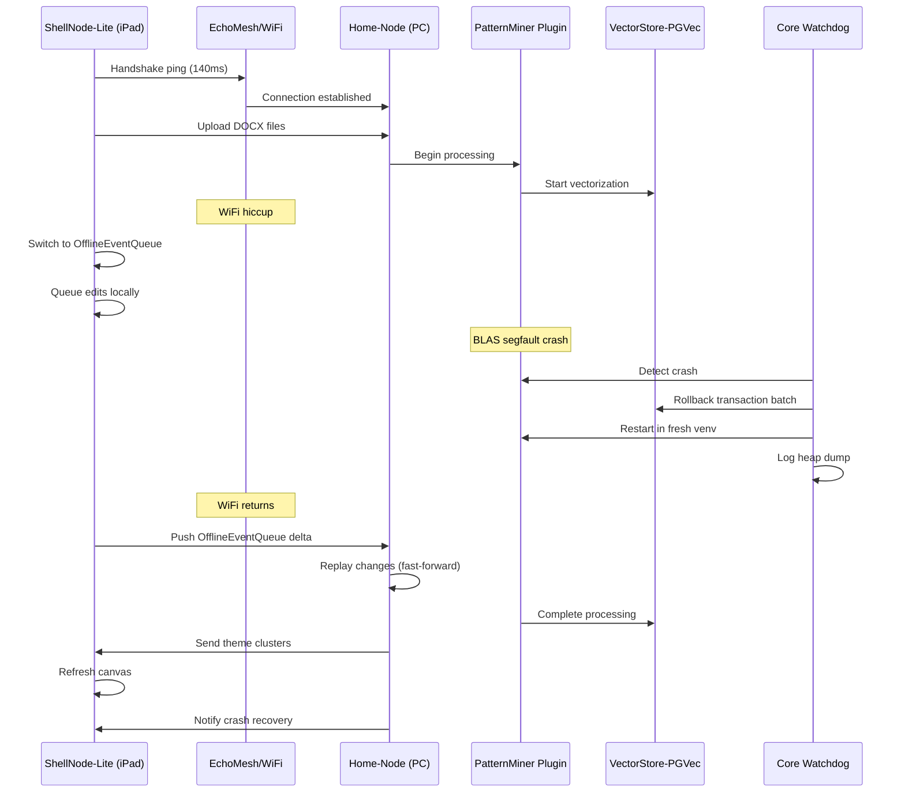

# Scenario: Library-Latency Tango

**Date:** January 27, 2025  
**Complexity:** Extreme  
**Category:** Integration Challenges / Performance Extremes

## Scenario Description

Liam creates a distributed LogoMesh setup with his high-performance PC as a "Home-Node" running heavy computational plugins, while using an iPad with lightweight canvas UI in a public library with unreliable WiFi. The system must handle network disruptions, plugin crashes, and seamless state synchronization across devices.

## User Journey

### Step-by-Step Workflow
1. **12:05** - Liam connects iPad to library WiFi, opens ShellNode-Lite, handshake-pings Home-Node (140ms latency)
2. **12:07** - Uploads three DOCX files; PatternMiner begins processing on PC with GPU acceleration
3. **12:10** - Network hiccup; ShellNode-Lite switches to OfflineEventQueue mode, shows "Sync paused" badge
4. **12:12** - PatternMiner crashes (NumPy BLAS segfault); Core watchdog handles recovery automatically
5. **12:14** - WiFi returns; OfflineEventQueue pushes accumulated changes; fast-forward merge succeeds
6. **12:16** - PatternMiner completes processing; canvas refreshes with theme clusters and thesis outline
7. **12:25** - User receives notification about recovered crash but workflow continues seamlessly

### Expected Outcomes
- Seamless distributed computing experience despite network issues and plugin failures
- No data loss during network disruptions or plugin crashes
- Automatic recovery and synchronization without user intervention
- Real-time collaborative editing capabilities across device boundaries

## System Requirements Analysis

### Phase 2 Systems Involved
- [x] **Plugin System** - Distributed plugin manifest, per-plugin watchdogs, scoped rollbacks
- [x] **Storage Layer** - Atomic multi-stage pipelines, PostgreSQL integration with pgvector
- [x] **API & Backend** - EchoMesh peer tunneling, cross-device plugin coordination
- [x] **Audit Trail System** - Rolling snapshot daemon, state delta tracking
- [x] **LLM Infrastructure** - OllamaExecutor-GPU integration, heavy compute orchestration
- [x] **VTC (Vector Translation Core)** - GPU-accelerated vectorization pipeline
- [x] **MeshGraphEngine** - Distributed graph state synchronization
- [x] **TaskEngine & CCE** - Cross-device task coordination and context management

### Expected System Interactions

### Data Flow Requirements
- **Input:** DOCX files, user edits, tag renames during offline periods
- **Processing:** GPU-accelerated vectorization, NLP clustering, thesis generation
- **Output:** Theme clusters with confidence scores, auto-generated thesis outlines
- **Storage:** PostgreSQL with pgvector, rolling ZFS snapshots, offline event queues

## Gap Analysis

### **CRITICAL GAPS:**

#### GAP-DIST-003: EchoMesh Peer Tunneling
- **Priority:** Critical
- **Systems:** Plugin Communication, API Backend
- **Current State:** EventBus is local-only, no peer-to-peer plugin coordination
- **Required:** WireGuard-style peer tunneling, transparent API call routing across devices

#### GAP-DIST-004: Distributed Plugin Manifest
- **Priority:** Critical
- **Systems:** PluginHost, Plugin System
- **Current State:** Plugins assume local execution
- **Required:** Plugin capability declarations (local/remote), distributed execution coordination

#### GAP-PERF-004: Offline Event Journaling
- **Priority:** Critical
- **Systems:** EventBus, UI Layer
- **Current State:** No offline capability, no event queuing
- **Required:** Idempotent event replay, conflict resolution, offline-first architecture

#### GAP-PERF-005: Multi-Stage Pipeline Atomicity
- **Priority:** High
- **Systems:** VTC, PluginAPI, SQLiteAdapter
- **Current State:** No transaction coordination across processing stages
- **Required:** Upload → vectorize → cluster as atomic unit, clean rollback boundaries

#### GAP-MONITOR-003: Rolling Snapshot System
- **Priority:** High
- **Systems:** Storage Layer, Audit Trail
- **Current State:** No state snapshotting or delta tracking
- **Required:** Automated state snapshots, delta-based synchronization, power-cycle recovery

#### GAP-DIST-005: Cross-Device State Synchronization
- **Priority:** High
- **Systems:** MeshGraphEngine, EventBus
- **Current State:** No distributed graph state management
- **Required:** Real-time graph synchronization, conflict-free replicated data types (CRDTs)

### Integration Issues
- No distributed plugin execution framework
- SQLiteAdapter can't coordinate with external databases (PostgreSQL + pgvector)
- EventBus lacks offline queuing and cross-device messaging
- Plugin crashes can cascade to dependent systems
- No network resilience or graceful degradation mechanisms
- Missing heavy compute orchestration (GPU resource management)

## Recommended Phase 2 Enhancements

**Priority 1: Distributed Architecture Foundation**
- Design EchoMesh peer tunneling protocol
- Add distributed plugin manifest system
- Implement cross-device EventBus extension
- Create offline-first event journaling

**Priority 2: Advanced Fault Tolerance**
- Add multi-stage transaction coordination
- Implement rolling snapshot daemon
- Create cross-device state synchronization
- Add network resilience mechanisms

**Priority 3: Heavy Compute Integration**
- Design GPU resource coordination
- Add external database adapter (PostgreSQL + pgvector)
- Implement compute-intensive plugin isolation
- Create resource-aware plugin scheduling

**Priority 4: User Experience**
- Add network status indicators
- Implement seamless offline/online transitions
- Create crash recovery notifications
- Design distributed collaboration UI

## Validation Strategy

### Unit Tests
- [ ] Offline event queue persistence and replay
- [ ] Plugin crash detection and isolated restart
- [ ] Cross-device message routing and delivery
- [ ] Multi-stage transaction rollback mechanisms
- [ ] Rolling snapshot creation and restoration

### Integration Tests
- [ ] Full distributed setup simulation
- [ ] Network disruption and recovery scenarios
- [ ] Plugin failure cascade prevention
- [ ] Large file processing under network stress
- [ ] Cross-device real-time collaboration

### Performance Tests
- [ ] High-latency network performance (140ms+)
- [ ] GPU resource utilization efficiency
- [ ] Large dataset vectorization pipelines
- [ ] Concurrent multi-device operations
- [ ] Memory usage under heavy compute loads

## Implementation Notes

### Jargon Translation
- **EchoMesh** → Enhanced EventBus with peer-to-peer capabilities
- **Home-Node** → Primary computational instance with heavy plugins
- **ShellNode-Lite** → Lightweight client with UI-focused plugins
- **OfflineEventQueue** → Event journaling system for network resilience
- **PatternMiner** → Advanced NLP plugin with GPU acceleration
- **RollingSnapshotDaemon** → Automated state backup and recovery system

### Architecture Assumptions
- PluginHost can coordinate execution across network boundaries
- EventBus supports message queuing and cross-device routing
- Storage layer can integrate with external databases (PostgreSQL)
- Plugin crashes can be isolated without affecting other plugins
- Network layer provides reliable peer-to-peer tunneling
- GPU resources can be shared across distributed plugin instances
