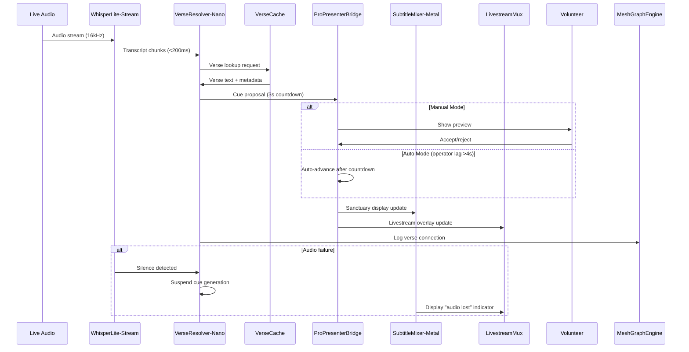

# Scenario: Verse Velocity - Keeping Up With Citation-Heavy Sermon

**Date:** January 28, 2025  
**Complexity:** Extreme  
**Category:** Performance Extremes

## Scenario Description

A Mac mini M4 with 16GB unified RAM orchestrates a complex multimedia worship service with real-time scripture detection, multi-display coordination, and live streaming. The system must handle rapid biblical citations, provide instant visual cues across multiple displays, and maintain perfect A/V sync while processing live audio streams.

This scenario tests LogoMesh's ability to handle real-time multimedia processing with strict latency requirements, intelligent resource allocation across competing video/audio workloads, and graceful degradation during technical failures.

## User Journey

### Step-by-Step Workflow
1. **09:55** - System warm-up, VerseCache pre-loads sermon outline verses into RAM
2. **10:02** - Worship begins with manual slide advancement, minimal system load
3. **10:27** - Sermon starts, VerseResolver begins detecting scripture references
4. **10:33** - Citation burst overwhelms manual operator, system switches to auto-advance
5. **10:48** - Greek word study triggers specialized interlinear display mode
6. **11:05** - Q&A session with fuzzy verse matching for audience questions
7. **11:20** - Mic failure triggers graceful degradation and visual indicators
8. **11:52** - Service ends, comprehensive study materials auto-generated

### Expected Outcomes
- Sub-second latency from speech to visual display across all screens
- Perfect synchronization between sanctuary displays and livestream overlays
- Intelligent fallback from manual to automatic operation during high-speed citations
- Graceful handling of audio failures without disrupting visual flow
- Rich post-service study materials with cross-reference graphs and searchable transcripts

## System Requirements Analysis

### Phase 2 Systems Involved
- [x] **TTS Plugin Framework** - WhisperLite-Stream with <200ms real-time processing
- [x] **LLM Infrastructure** - VerseResolver-Nano (0.5GB quantized model) with pattern matching
- [x] **VTC (Vector Translation Core)** - VerseCache semantic lookups and fuzzy matching
- [x] **Storage Layer** - SQLite with ESV/NIV/Greek interlinear database and embeddings
- [x] **Plugin System** - Complex resource coordination across 7 simultaneous plugins
- [x] **MeshGraphEngine** - Real-time ContextGraph building and cross-reference tracking
- [x] **TaskEngine & CCE** - Multi-display cue coordination and operator override management
- [x] **Audit Trail System** - VectorArchive with time-aligned transcripts and decision logs

### Expected System Interactions

### Data Flow Requirements
- **Input:** Real-time 16kHz audio from mixing board, operator commands, slide transitions
- **Processing:** ASR → verse detection → fuzzy matching → multi-layout rendering
- **Output:** Sanctuary displays, livestream overlays, cross-reference graphs, searchable archives
- **Storage:** Local Bible database with vector embeddings, session transcripts, operator decisions

## Gap Analysis

### Discovered Gaps

**GAP-REALTIME-001: Sub-Second Audio-to-Visual Pipeline**
- **Priority:** Critical
- **Affected Systems:** TTS Plugin Framework, TaskEngine, Plugin System
- **Description:** No guaranteed latency bounds for real-time audio processing chains. System can't ensure <1s end-to-end from speech to visual display.
- **Phase 2 Recommendation:** Implement real-time processing guarantees with priority scheduling and deadline-aware task queues

**GAP-MULTIMEDIA-001: Multi-Display Coordination**
- **Priority:** Critical
- **Affected Systems:** Plugin System, TaskEngine
- **Description:** No coordination mechanism for synchronized updates across multiple display outputs with different layouts and timing requirements.
- **Phase 2 Recommendation:** Create display coordination service with layout-specific rendering and synchronized update dispatching

**GAP-RESOURCE-003: Unified Memory Management**
- **Priority:** Critical
- **Affected Systems:** Plugin System, LLM Infrastructure
- **Description:** No unified memory pressure management across GPU/CPU/RAM on Apple Silicon. System can't coordinate between video processing and LLM workloads.
- **Phase 2 Recommendation:** Implement unified memory manager with cross-workload coordination and Apple Silicon optimizations

**GAP-FALLBACK-001: Intelligent Auto-Advance**
- **Priority:** High
- **Affected Systems:** TaskEngine, Plugin System
- **Description:** No operator performance monitoring or intelligent fallback mechanisms. System can't detect when manual operation is failing and switch modes.
- **Phase 2 Recommendation:** Add operator performance tracking with configurable fallback triggers and mode switching

**GAP-FUZZY-001: Semantic Verse Matching**
- **Priority:** High
- **Affected Systems:** VTC, LLM Infrastructure
- **Description:** No fuzzy matching capabilities for imprecise biblical references. System can't handle "that passage where Jesus says..." style queries.
- **Phase 2 Recommendation:** Implement semantic similarity search with confidence scoring and candidate ranking

**GAP-DEGRADATION-001: Partial System Failure Handling**
- **Priority:** High
- **Affected Systems:** All Systems
- **Description:** No graceful degradation strategy when individual components fail. System can't maintain partial functionality during mic dropouts or plugin crashes.
- **Phase 2 Recommendation:** Design failure isolation with graceful degradation and user notification systems

**GAP-EXPORT-001: Knowledge Graph Generation**
- **Priority:** Medium
- **Affected Systems:** MeshGraphEngine, Audit Trail System
- **Description:** No automated knowledge graph export with visual rendering. System can't generate study materials from session data.
- **Phase 2 Recommendation:** Add graph export functionality with PNG/JSON generation and cross-reference visualization

### Missing Capabilities
- Real-time processing pipeline with latency guarantees
- Multi-display synchronization and layout coordination
- Unified memory management for mixed workloads
- Operator performance monitoring and auto-fallback
- Semantic biblical reference matching and ranking
- Component failure isolation and graceful degradation
- Automated knowledge graph export and visualization

### Integration Issues
- No coordination between video processing and LLM memory usage
- Plugin system lacks real-time scheduling and priority management
- TTS framework doesn't support deadline-aware processing
- Storage layer needs semantic search capabilities for biblical text
- TaskEngine lacks multi-output coordination mechanisms
- Audit system needs rich session reconstruction capabilities

## Phase 2 vs Reality Check

### What Works in Phase 2
- Basic plugin loading and SQLite storage for biblical text
- Event-driven architecture supports real-time message passing
- Plugin API allows resource monitoring and coordination hooks
- LLM infrastructure supports quantized model loading

### What's Missing/Mocked
- Real-time processing guarantees and deadline scheduling
- Multi-display coordination and synchronized updates
- Unified memory management for mixed GPU/CPU workloads
- Semantic search capabilities for biblical references
- Graceful degradation and failure isolation mechanisms
- Knowledge graph generation and export functionality

### Recommended Phase 2 Enhancements

**Priority 1: Real-Time Processing Foundation**
- Add deadline-aware task scheduling to TaskEngine
- Implement real-time processing mode with latency guarantees
- Create priority-based plugin execution framework

**Priority 2: Multi-Display Coordination**
- Design display output coordination service
- Add layout-specific rendering pipeline
- Implement synchronized update dispatching

**Priority 3: Unified Resource Management**
- Create Apple Silicon unified memory manager
- Add cross-workload coordination between video and LLM
- Implement memory pressure detection and adaptation

**Priority 4: Semantic Search Infrastructure**
- Add vector similarity search to VTC
- Implement confidence scoring for fuzzy matches
- Create biblical reference pattern recognition

## Validation Plan

### Test Scenarios
- [ ] Simulate 45-minute sermon with 50+ scripture references
- [ ] Test sub-second latency under full system load (all 7 plugins active)
- [ ] Verify multi-display synchronization with different layouts
- [ ] Test operator fallback during rapid citation bursts (6 refs/40s)
- [ ] Validate graceful degradation during audio input failure
- [ ] Test fuzzy matching accuracy for imprecise biblical references

### Success Criteria
- [ ] <1s end-to-end latency from speech to visual display
- [ ] Perfect sync between sanctuary displays and livestream overlays
- [ ] Auto-advance triggers correctly when operator lag >4s
- [ ] Fuzzy verse matching achieves >85% accuracy on test set
- [ ] System maintains core functionality during single component failures
- [ ] Post-service materials generated automatically with cross-references

### Failure Modes
- Latency spikes causing visual lag behind audio (CRITICAL FAILURE)
- Memory pressure crashes from competing video/LLM workloads
- Display desynchronization during rapid citation sequences
- False positive verse detections disrupting service flow
- Complete system failure from single plugin crash
- Poor fuzzy matching leading to wrong verses displayed

## Phase 2 Gap Analysis

### Jargon Translation
- "ProPresenterBridge" → Plugin implementing PluginRuntimeInterface for display control
- "WhisperLite-Stream" → Real-time ASR plugin with <200ms processing guarantee
- "VerseResolver-Nano" → Quantized LLM plugin with biblical pattern recognition
- "VerseCache" → SQLite adapter with vector embeddings for semantic search
- "SubtitleMixer-Metal" → GPU-accelerated video plugin for overlay rendering
- "LivestreamMux" → Video processing plugin combining multiple sources
- "Auto-advance mode" → TaskEngine workflow with operator performance monitoring

### What's Missing from Current Phase 2
- Real-time processing guarantees and deadline scheduling
- Multi-display output coordination and synchronization
- Unified memory management for Apple Silicon architecture
- Semantic search infrastructure for biblical references
- Graceful degradation and component failure isolation
- Knowledge graph generation and visual export capabilities

---

**Analysis Status:** COMPLETE  
**Next Actions:** Update gap analysis, prioritize real-time processing infrastructure, design multi-display coordination system
