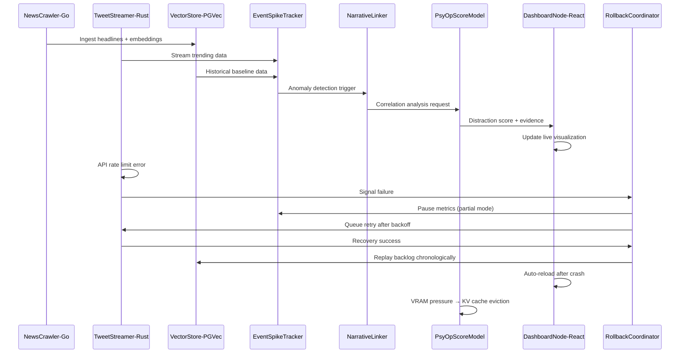

# Scenario: The Distraction Detector Goes Live

**Date:** January 28, 2025  
**Complexity:** Extreme  
**Category:** Performance Extremes

## Scenario Description

An investigative journalism collective deploys LogoMesh-PsyOps on a high-performance server to create a real-time "narrative radar" system. The system continuously monitors news sources and social media to detect potential distraction campaigns by correlating suspicious timing patterns between major political events and trending topics.

This scenario tests LogoMesh's ability to handle multi-language plugin ecosystems, real-time data ingestion at scale, sophisticated anomaly detection pipelines, and graceful recovery from individual component failures while maintaining data integrity across complex workflows.

## User Journey

### Step-by-Step Workflow
1. **12:00** - System initialization, NewsCrawler pulls baseline data, constructs spike matrix
2. **14:17** - High-impact legal event detected (Executive clemency announcement)
3. **14:22** - Simultaneous trending spike in unrelated topic (drone sightings)
4. **14:25** - EventSpikeTracker flags dual anomalies in different domains
5. **14:26** - PsyOpScoreModel analyzes correlation, returns 82% distraction likelihood
6. **14:27** - DashboardNode visualizes correlation with confidence metrics
7. **14:31** - API rate limiting causes TweetStreamer failure
8. **14:33** - RollbackCoordinator orchestrates recovery without data loss
9. **15:05** - System correctly identifies low-suspicion event (celebrity death)
10. **23:59** - Daily snapshot and data archival with integrity verification

### Expected Outcomes
- Real-time detection of suspicious narrative timing patterns
- Accurate correlation scoring between political events and media trends
- Graceful handling of individual plugin failures without system-wide impact
- Complete data integrity maintenance during partial system failures
- Transparent public dashboard with confidence metrics and disclaimers

## System Requirements Analysis

### Phase 2 Systems Involved
- [x] **Plugin System** - Multi-language plugin coordination (Go, Rust, Python, React)
- [x] **Storage Layer** - pgvector database with atomic multi-row commits
- [x] **VTC (Vector Translation Core)** - Real-time embedding generation for headlines/content
- [x] **LLM Infrastructure** - 7B quantized model with KV-cache eviction management
- [x] **TaskEngine & CCE** - Time-aligned pipeline coordination and anomaly detection
- [x] **Audit Trail System** - RollbackCoordinator with plugin-scoped recovery
- [x] **API & Backend** - DashboardNode with auto-reload and hot-swap capabilities
- [x] **MeshGraphEngine** - Real-time correlation graph generation and visualization
- [x] **Security & Transparency** - Sandboxed plugin execution with fault isolation

### Expected System Interactions

### Data Flow Requirements
- **Input:** RSS feeds (~2000 articles/5min), Twitter firehose, political calendar data
- **Processing:** Real-time embedding, anomaly detection, correlation analysis, distraction scoring
- **Output:** Live dashboard visualizations, confidence metrics, archived snapshots
- **Storage:** Vector database, time-series anomaly data, model outputs, integrity checksums

## Gap Analysis

### Discovered Gaps

**GAP-MULTILANG-001: Multi-Language Plugin Coordination**
- **Priority:** Critical
- **Affected Systems:** Plugin System, Security & Transparency
- **Description:** No support for mixed-language plugin ecosystems with fault isolation. System can't coordinate Go/Rust/Python plugins with independent crash recovery.
- **Phase 2 Recommendation:** Implement multi-language plugin runtime with sandboxed execution and cross-language communication protocols

**GAP-ATOMIC-001: Atomic Vector Operations**
- **Priority:** Critical
- **Affected Systems:** Storage Layer, VTC
- **Description:** No atomic multi-row vector operations with rollback capabilities. System can't ensure data consistency during large batch ingests.
- **Phase 2 Recommendation:** Add transactional vector operations with partial rollback and integrity verification

**GAP-TIMESERIES-001: Time-Aligned Pipeline Coordination**
- **Priority:** Critical
- **Affected Systems:** TaskEngine, Plugin System
- **Description:** No synchronized time-window coordination across multiple plugins. System can't ensure correlation analysis uses aligned temporal data.
- **Phase 2 Recommendation:** Implement time-aligned data buffers with synchronized window management across plugins

**GAP-KVEVICTION-001: Intelligent KV Cache Management**
- **Priority:** High
- **Affected Systems:** LLM Infrastructure
- **Description:** No intelligent KV cache eviction with fast reload capabilities. System can't handle VRAM pressure gracefully in production workloads.
- **Phase 2 Recommendation:** Add KV cache pressure monitoring with selective eviction and sub-second weight reloading

**GAP-HOTRELOAD-001: Component Hot-Reload**
- **Priority:** High
- **Affected Systems:** API & Backend, Plugin System
- **Description:** No hot-reload capabilities for crashed frontend components. System can't maintain service availability during individual component failures.
- **Phase 2 Recommendation:** Implement component isolation with automatic restart and state preservation

**GAP-BACKOFF-001: Intelligent API Retry**
- **Priority:** High
- **Affected Systems:** Plugin System, API & Backend
- **Description:** No intelligent backoff and replay mechanisms for API rate limiting. System can't handle external service throttling gracefully.
- **Phase 2 Recommendation:** Add adaptive backoff with chronological replay and gap detection

**GAP-CORRELATION-001: Temporal Correlation Analysis**
- **Priority:** High
- **Affected Systems:** MeshGraphEngine, TaskEngine
- **Description:** No sophisticated temporal correlation detection with confidence scoring. System can't provide reliable distraction likelihood assessments.
- **Phase 2 Recommendation:** Implement statistical correlation analysis with confidence intervals and evidence tracking

### Missing Capabilities
- Multi-language plugin runtime with sandboxed execution
- Atomic vector database operations with selective rollback
- Time-synchronized data pipelines across heterogeneous plugins
- Intelligent memory management for large language models
- Component-level hot-reload and automatic recovery
- Adaptive API throttling with intelligent replay
- Statistical correlation analysis with confidence scoring

### Integration Issues
- No coordination mechanism between Go/Rust/Python plugin runtimes
- Plugin system lacks transaction boundary management across languages
- Storage layer doesn't support partial rollback of vector operations
- LLM infrastructure lacks memory pressure handling
- TaskEngine can't coordinate time-aligned processing windows
- Audit system lacks plugin-scoped recovery capabilities

## Phase 2 vs Reality Check

### What Works in Phase 2
- Basic plugin loading framework supports multiple plugin types
- SQLite storage provides transactional capabilities for structured data
- Event-driven architecture supports real-time data processing
- LLM infrastructure supports quantized model loading

### What's Missing/Mocked
- Multi-language plugin runtime with sandboxed execution
- Vector database with atomic multi-row operations
- Time-aligned pipeline coordination mechanisms
- Intelligent memory management for production LLM workloads
- Component hot-reload and automatic recovery systems
- Sophisticated correlation analysis with statistical confidence

### Recommended Phase 2 Enhancements

**Priority 1: Multi-Language Plugin Foundation**
- Design plugin runtime supporting Go/Rust/Python execution
- Implement sandboxed plugin execution with fault isolation
- Add cross-language communication protocols and data marshaling

**Priority 2: Advanced Storage Operations**
- Extend storage layer with atomic vector operations
- Add selective rollback capabilities for partial transaction failure
- Implement integrity verification and checksum validation

**Priority 3: Time-Synchronized Processing**
- Create time-aligned data buffer management system
- Add synchronized window coordination across plugins
- Implement temporal correlation analysis framework

**Priority 4: Production LLM Management**
- Add intelligent KV cache eviction with pressure monitoring
- Implement fast weight reloading capabilities
- Create memory usage prediction and adaptation

## Validation Plan

### Test Scenarios
- [ ] Simulate 2000 articles/5min ingestion with concurrent social media streams
- [ ] Test multi-language plugin coordination under load (Go + Rust + Python)
- [ ] Verify atomic vector operations during simulated network failures
- [ ] Test time-aligned correlation detection with synthetic event data
- [ ] Validate graceful KV cache eviction under VRAM pressure
- [ ] Test component recovery during individual plugin crashes

### Success Criteria
- [ ] Process 2000+ articles every 5 minutes without data loss
- [ ] Maintain <3s latency for anomaly detection and correlation scoring
- [ ] Achieve 99.9% data integrity during partial system failures
- [ ] Correctly identify correlation patterns with >85% accuracy
- [ ] Recover from individual plugin crashes within 60 seconds
- [ ] Maintain dashboard availability during component failures

### Failure Modes
- Multi-language plugin crash cascades affecting entire system (CRITICAL FAILURE)
- Vector database corruption during atomic operations
- Time misalignment causing false correlation positives
- VRAM exhaustion crashing LLM inference
- Data loss during API rate limiting recovery
- Dashboard downtime affecting public transparency

## Phase 2 Gap Analysis

### Jargon Translation
- "NewsCrawler-Go" → Go-based plugin implementing PluginRuntimeInterface
- "TweetStreamer-Rust" → Rust plugin with EventBus integration for social media
- "VectorStore-PGVec" → PostgreSQL vector extension adapter for Storage Layer
- "EventSpikeTracker" → PyTorch plugin using TaskEngine for anomaly detection
- "PsyOpScoreModel" → Quantized LLM plugin with correlation analysis capabilities
- "RollbackCoordinator" → Audit Trail orchestrator with plugin-scoped recovery
- "LogoMesh-PsyOps" → Specialized deployment configuration for journalism use case

### What's Missing from Current Phase 2
- Multi-language plugin runtime with cross-language coordination
- Advanced vector database operations with atomic guarantees
- Time-synchronized processing pipelines for correlation analysis
- Production-grade LLM memory management and cache optimization
- Component-level isolation and automatic recovery mechanisms
- Statistical correlation analysis with confidence scoring capabilities

---

**Analysis Status:** COMPLETE  
**Next Actions:** Update gap analysis, prioritize multi-language plugin runtime, design atomic vector operations system
