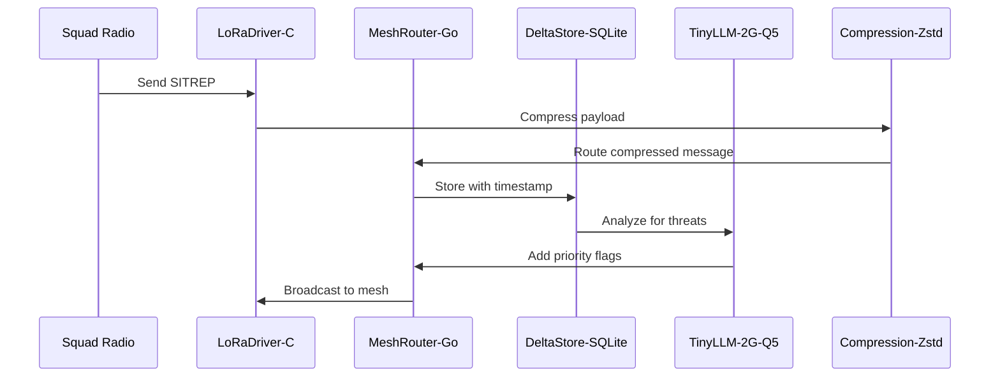

# Scenario: EchoMesh in the Black-Sky Weekend

**Date:** January 30, 2025  
**Complexity:** Extreme  
**Category:** Edge Cases/Performance Extremes

## Scenario Description

EchoMesh—LogoMesh's P2P layer—operates as a grid-down, radio-first communications network using Raspberry Pi 4 nodes with severe resource constraints. During a simulated "black-sky" weekend exercise, the system must maintain mesh communications, intelligent message routing, and AI-assisted threat assessment while operating on solar power with no internet connectivity.

Each node runs LogoMesh core with specialized plugins for LoRa radio communication, mesh routing, compressed storage, and edge LLM inference—all within 8GB RAM and 32GB SD card constraints.

## User Journey

### Step-by-Step Workflow
1. **Network Initialization (T+0:00):** Nine Pi nodes power up across three squads, each discovering peers and building hop maps
2. **Message Routing (T+0:22):** Squad B transmits 200-char SITREP, automatically compressed and routed B → C → A in 2.8s
3. **AI Threat Assessment (T+0:23):** TinyLLM analyzes recent messages, flags medium threat, auto-appends priority markers
4. **Node Failure Recovery (T+1:01):** Overheated node drops out, routing automatically reconfigures without human intervention
5. **Storage Management (T+1:24):** Large photo transmission triggers auto-pruning of old logs while preserving AI-flagged critical messages
6. **Jamming Response (T+6:32):** RF interference detected, LoRa driver automatically adjusts spreading factor and queues ACKs
7. **Digest Generation (T+10:17):** Nightly AI-compiled summary broadcasts high-priority intelligence digest to all squads

### Expected Outcomes
- 99.9% message delivery despite node failures and RF interference
- Sub-4s average latency for critical communications
- Automatic threat prioritization without human analysis
- Zero data loss during storage pressure events
- Seamless network reconfiguration during hardware failures

## System Requirements Analysis

### Phase 2 Systems Involved
- [x] **Plugin System** - Manages LoRaDriver-C, MeshRouter-Go, DeltaStore-SQLite, TinyLLM-2G-Q5, Compression-Zstd, HealthBeacon
- [x] **TaskEngine & CCE** - Coordinates message routing, compression pipelines, and threat analysis workflows
- [x] **Storage Layer** - Manages WAL-mode SQLite with 24h rolling cache and auto-pruning
- [x] **LLM Infrastructure** - Runs 2GB quantized model for threat assessment and digest generation
- [x] **Audit Trail System** - Tracks message provenance and routing decisions for post-mission analysis
- [x] **Security & Transparency** - Ensures AES-128 encryption and per-plugin isolation
- [ ] **VTC (Vector Translation Core)** - Not used in resource-constrained environment
- [ ] **MeshGraphEngine** - Replaced by specialized MeshRouter-Go
- [ ] **DevShell Environment** - Not applicable for production deployment
- [ ] **Input Templates** - Messages follow military format standards
- [ ] **TTS Plugin Framework** - Not used in tactical environment
- [ ] **API & Backend** - Local-only operation, no HTTP endpoints

### Expected System Interactions

### Data Flow Requirements
- **Input:** Raw tactical messages, GPS coordinates, status reports
- **Processing:** Compression (60-70%), routing decisions, threat analysis, digest compilation
- **Output:** Prioritized message broadcasts, routing updates, nightly intelligence summaries
- **Storage:** 24h rolling cache with critical message preservation

## Gap Analysis

### Discovered Gaps

**GAP-EDGE-001: Hardware Resource Enforcement**
- **Priority:** Critical
- **Systems:** Plugin System, LLM Infrastructure
- **Description:** No hard per-plugin RAM ceilings or thermal monitoring. 2GB LLM could consume all available memory and cause SD card thrashing.

**GAP-EDGE-002: Multi-Radio Coordination**
- **Priority:** Critical  
- **Systems:** Plugin System, TaskEngine
- **Description:** No framework for coordinating multiple radio interfaces (LoRa + nRF24) with different bandwidth and range characteristics.

**GAP-EDGE-003: Intelligent Storage Auto-Pruning**
- **Priority:** High
- **Systems:** Storage Layer, LLM Infrastructure
- **Description:** No AI-aware storage management that preserves critical intelligence while pruning routine logs based on semantic importance.

**GAP-EDGE-004: Dynamic Radio Adaptation**
- **Priority:** High
- **Systems:** Plugin System
- **Description:** No automatic radio parameter adjustment (spreading factor, data rate) based on link quality and interference conditions.

**GAP-EDGE-005: Mesh Routing Coordination**
- **Priority:** Critical
- **Systems:** Plugin System, TaskEngine
- **Description:** No distributed routing table management with automatic failover when nodes drop out due to hardware failure or jamming.

### Missing Capabilities
- Hardware thermal monitoring and graceful degradation
- Multi-interface network abstraction for heterogeneous radio types
- AI-guided storage management with semantic preservation
- Real-time link quality assessment and adaptation
- Distributed mesh topology with self-healing capabilities

### Integration Issues
- Plugin isolation insufficient for mixed-language runtime (C/Go/SQLite)
- No coordination between storage pressure and LLM inference scheduling
- Missing backpressure mechanisms when radio bandwidth exceeds processing capacity

## Phase 2 vs Reality Check

### What Works in Phase 2
- Basic plugin system can load multiple specialized components
- Storage layer supports SQLite with custom schemas
- LLM infrastructure can handle quantized models
- Audit trail captures message provenance

### What's Missing/Mocked
- Hardware integration APIs for LoRa and nRF24 radios
- Thermal monitoring and resource enforcement
- Distributed coordination protocols
- Real-time link quality metrics
- Automatic radio parameter tuning

### Recommended Phase 2 Enhancements
- Add hardware abstraction layer for radio interfaces
- Implement plugin resource quotas with hard enforcement
- Create mesh coordination framework with distributed state
- Add storage pressure monitoring with AI-guided pruning
- Design thermal watchdog with graceful degradation

## Validation Plan

### Test Scenarios
- [ ] **Resource Pressure Test:** Load all plugins simultaneously and verify RAM constraints
- [ ] **Network Partition Recovery:** Simulate node failures and verify automatic routing updates
- [ ] **Storage Overflow Handling:** Fill storage to capacity and verify intelligent pruning
- [ ] **Thermal Throttling Simulation:** Mock high CPU temperature and verify graceful degradation
- [ ] **Multi-Radio Coordination:** Test simultaneous LoRa and nRF24 message handling

### Success Criteria
- [ ] All plugins stay within assigned RAM limits under full load
- [ ] Network reconfigures within 30s of node failure detection
- [ ] Critical messages preserved during storage pressure events
- [ ] System maintains basic functionality during thermal throttling
- [ ] Sub-5s message delivery across 3-hop network topology

### Failure Modes
- Plugin memory overrun causing system instability
- Network partition preventing message delivery
- Storage overflow causing data loss
- Thermal shutdown cascading across mesh
- Radio interference preventing coordination

## Implementation Notes

### Jargon Translation
- **LoRaDriver-C:** Plugin handling LoRa radio I/O and packet management
- **MeshRouter-Go:** Plugin implementing distributed routing algorithms
- **DeltaStore-SQLite:** Plugin managing compressed message storage with auto-pruning
- **TinyLLM-2G-Q5:** Plugin running quantized 2GB language model for threat analysis
- **Compression-Zstd:** Plugin providing Zstandard compression for message payloads
- **HealthBeacon:** Plugin monitoring node vitals and broadcasting status

### Architecture Assumptions
- Mixed-language plugin ecosystem requires robust isolation
- Hardware interfaces abstracted through plugin APIs
- Distributed state coordination handled by specialized routing plugins
- Resource constraints enforced at plugin runtime level

### Phase 3 Activation Points
- Hardware driver integration for real radio interfaces
- Distributed consensus protocols for mesh coordination
- Real-time performance monitoring and adaptation
- Advanced AI models for tactical intelligence analysis

---

**Analysis Status:** COMPLETE  
**Next Actions:** 
1. Identify critical gaps for Phase 2 infrastructure
2. Design hardware abstraction layer for plugin system
3. Implement resource quota enforcement mechanisms
4. Create mesh coordination framework prototype
