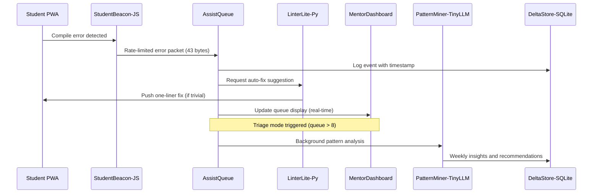

# Scenario: Code Ninjas Helping Hands That Scale

**Date:** January 30, 2025  
**Complexity:** High  
**Category:** Creative Applications/Performance Extremes

## Scenario Description

A Code Ninjas franchise deploys LogoMesh-Edu on a resource-constrained Intel NUC (16GB RAM) to manage real-time educational support for 20 students using Chrome-only laptops without admin rights. The system must coordinate multi-language development environments (JavaScript → Unity/C#), provide intelligent help queue management, and deliver actionable insights—all while maintaining sub-3-second response times and operating within strict hardware constraints.

The deployment emphasizes offline-first PWA architecture, real-time priority scheduling, and AI-powered pattern recognition for educational workflows.

## User Journey

### Step-by-Step Workflow
1. **Class Initialization (T+16:05):** Twenty students log in via PWA, StudentBeacon establishes connections and assigns to Class 4-Green room
2. **Error Detection & Queuing (T+16:14):** Emma's JavaScript compile error triggers StudentBeacon, AssistQueue scores and prioritizes help request
3. **Intelligent Triage (T+16:17):** Queue overflow triggers triage mode, LinterLite-Py auto-resolves trivial syntax errors without human intervention
4. **Resource Management (T+16:33):** Unity build causes CPU spike, scheduler demotes PatternMiner to preserve real-time queue responsiveness
5. **Network Resilience (T+16:45):** 30-second LAN outage triggers offline-queue mode, events stored locally and replayed without data loss
6. **Session Analysis (T+17:02):** PatternMiner-TinyLLM processes session logs, generates curriculum insights and improvement recommendations

### Expected Outcomes
- 58 help requests processed with 43 auto-resolved (74% automation rate)
- Average wait time reduced from 9 minutes to 2 minutes 11 seconds
- Zero data loss during network interruptions
- Real-time dashboard maintains sub-3-second response times under full load
- Actionable curriculum insights delivered without manual analysis

## System Requirements Analysis

### Phase 2 Systems Involved
- [x] **Plugin System** - Multi-language coordination (JS, Python, C#, React) with resource quotas
- [x] **TaskEngine & CCE** - Priority scheduling with real-time queue management and triage modes
- [x] **API & Backend** - PWA serving with offline-first event queuing and delta replay
- [x] **Storage Layer** - DeltaStore-SQLite with 7-day rolling logs and intelligent auto-pruning
- [x] **LLM Infrastructure** - PatternMiner-TinyLLM (3GB Q4 model) with VRAM management
- [x] **MeshGraphEngine** - Real-time help queue visualization and student progress tracking
- [x] **Audit Trail System** - Event provenance and idempotent replay for network recovery
- [x] **Security & Transparency** - Sandboxed plugin execution with per-plugin resource enforcement
- [ ] **VTC (Vector Translation Core)** - Not used in educational context
- [x] **DevShell Environment** - MentorDashboard development and hot-reload capabilities
- [x] **Input Templates** - Standardized error reporting and help request formats
- [ ] **TTS Plugin Framework** - Not applicable for classroom environment

### Expected System Interactions

### Data Flow Requirements
- **Input:** Compile errors, help requests, build logs, Unity shader diagnostics
- **Processing:** Error classification, priority scoring, auto-fix generation, pattern mining
- **Output:** Real-time queue updates, auto-suggestions, curriculum insights, progress metrics
- **Storage:** 7-day rolling event logs with smart pruning to 2GB limit

## Gap Analysis

### Discovered Gaps

**GAP-EDU-001: Multi-Language Plugin Resource Coordination**
- **Priority:** Critical
- **Systems:** Plugin System, TaskEngine
- **Description:** No framework for coordinating resource allocation across heterogeneous plugin runtimes (JS, Python, C#, React) with different performance characteristics.

**GAP-EDU-002: PWA Offline-First Event Architecture**
- **Priority:** Critical
- **Systems:** API & Backend, Audit Trail System
- **Description:** No offline-first PWA framework with local event queuing, delta synchronization, and idempotent replay capabilities for network-unreliable environments.

**GAP-EDU-003: Real-Time Priority Scheduling**
- **Priority:** High
- **Systems:** TaskEngine & CCE
- **Description:** No dynamic priority scheduler that can demote background tasks (AI analysis) when real-time workloads (help queue) require immediate attention.

**GAP-EDU-004: Intelligent Auto-Suggestion Pipeline**
- **Priority:** High
- **Systems:** Plugin System, LLM Infrastructure
- **Description:** No framework for AI-powered auto-fix generation with confidence scoring and opt-in delivery to student endpoints.

**GAP-EDU-005: Educational Workflow Orchestration**
- **Priority:** High
- **Systems:** TaskEngine, MeshGraphEngine
- **Description:** No classroom-specific workflow management with triage modes, queue visualization, and multi-student session coordination.

**GAP-EDU-006: Browser Extension Integration**
- **Priority:** High
- **Systems:** API & Backend, Security & Transparency
- **Description:** No secure browser extension API for StudentBeacon telemetry collection from admin-restricted laptops.

### Missing Capabilities
- Multi-runtime resource arbitration with dynamic priority adjustment
- Offline-first PWA architecture with event synchronization
- Real-time educational dashboard with triage mode activation
- AI-powered code analysis with automatic fix suggestions
- Browser extension security model for restricted environments
- Educational workflow patterns and queue management algorithms

### Integration Issues
- No coordination between different plugin language runtimes under resource pressure
- Missing offline event queue with conflict resolution and idempotent replay
- TaskEngine lacks educational context for priority scheduling decisions
- Plugin system can't enforce per-language runtime resource quotas
- Storage layer lacks educational data patterns and intelligent pruning heuristics

## Phase 2 vs Reality Check

### What Works in Phase 2
- Basic plugin system supports multiple language runtimes
- TaskEngine provides task coordination framework
- Storage layer supports SQLite with custom schemas
- LLM infrastructure handles quantized models with memory management
- Audit trail captures event provenance

### What's Missing/Mocked
- PWA offline-first architecture with event synchronization
- Multi-language plugin resource arbitration
- Real-time priority scheduling with educational context
- Browser extension security and telemetry APIs
- Educational workflow orchestration patterns
- Intelligent code analysis and auto-suggestion pipeline

### Recommended Phase 2 Enhancements
- Design PWA offline-first framework with event queue synchronization
- Implement multi-runtime resource coordinator with dynamic prioritization
- Create educational workflow patterns with triage mode support
- Add browser extension security model for restricted environments
- Design AI-powered auto-suggestion pipeline with confidence scoring
- Implement intelligent storage pruning with educational data awareness

## Validation Plan

### Test Scenarios
- [ ] **Multi-Student Load Test:** Simulate 20 concurrent students with mixed error types
- [ ] **Resource Pressure Test:** Verify Unity build doesn't impact real-time queue performance
- [ ] **Network Resilience Test:** Simulate 30s outage and verify event replay integrity
- [ ] **Triage Mode Activation:** Test automatic triage mode when queue exceeds 8 requests
- [ ] **Auto-Suggestion Accuracy:** Validate LinterLite-Py auto-fix success rate for common errors
- [ ] **Pattern Mining Performance:** Verify weekly analysis completes within background priority limits

### Success Criteria
- [ ] Support 20 concurrent students with sub-3s dashboard response times
- [ ] Maintain queue responsiveness during Unity build CPU spikes
- [ ] Zero data loss during network interruptions with complete event replay
- [ ] Achieve >70% auto-resolution rate for common syntax errors
- [ ] Triage mode activates within 5s of queue overflow detection
- [ ] Weekly pattern analysis completes without impacting real-time operations

### Failure Modes
- Resource exhaustion causing dashboard freezing during Unity builds
- Event loss or duplication during network recovery
- Queue overflow causing help request delays exceeding 10 minutes
- Auto-suggestion accuracy below 80% causing student confusion
- Storage overflow preventing session log retention
- Browser extension conflicts causing telemetry collection failures

## Implementation Notes

### Jargon Translation
- **StudentBeacon:** Browser extension providing real-time telemetry from student laptops
- **LinterLite-Py:** Lightweight Python-based static analysis for educational code
- **UnityBuildWatcher-C#:** C# plugin monitoring Unity development environment
- **AssistQueue:** Priority queue management for help requests with triage logic
- **MentorDashboard-React:** Real-time React dashboard for instructors
- **PatternMiner-TinyLLM:** 3GB quantized LLM for educational pattern analysis

### Architecture Assumptions
- PWA deployment required due to admin restrictions on student laptops
- Multi-language plugin ecosystem reflects real educational technology stacks
- Real-time constraints prioritized over comprehensive analysis features
- Educational context requires specialized workflow patterns and priority logic

### Phase 3 Activation Points
- Production browser extension deployment and security hardening
- Advanced AI tutoring capabilities with personalized learning paths
- Integration with existing Learning Management Systems
- Scaled deployment across multiple franchise locations with centralized analytics

---

**Analysis Status:** COMPLETE  
**Next Actions:** 
1. Design PWA offline-first framework with event synchronization
2. Implement multi-runtime resource coordinator 
3. Create educational workflow orchestration patterns
4. Build browser extension security model for restricted environments
