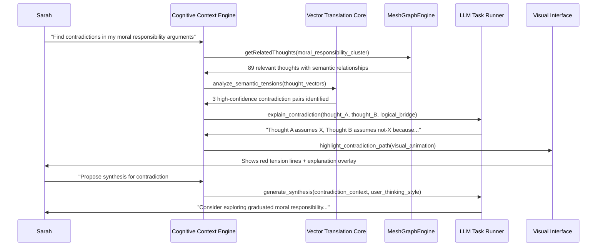

# Scenario: The Contradiction Detective - Philosophy Dissertation Debug

**Date:** January 27, 2025  
**Complexity:** Extreme  
**Category:** AI Cognitive Assistance Demo - "Holy Shit" Moment

## Scenario Description

Dr. Sarah Chen, a philosophy PhD candidate, has been building her dissertation argument about free will and moral responsibility in LogoMesh for 6 weeks. Her thought graph contains 147 interconnected thoughts including:
- Primary philosophical positions (8 major schools of thought)  
- Supporting evidence and citations (45 academic sources)
- Personal insights and synthesis attempts (32 original thoughts)
- Counterarguments and rebuttals (28 opposing views)
- Definitional clarifications (34 concept definitions)

The killer demo moment: Sarah asks LogoMesh to "Find logical contradictions in my moral responsibility arguments" and the system not only identifies hidden contradictions but **explains the reasoning bridges** and **proposes synthesis paths**.

## User Journey

### Step-by-Step Workflow
1. **Context Setup**: Sarah opens her "Dissertation Draft 3.0" thought collection (147 thoughts, 200+ connections)
2. **Natural Language Query**: Types "Find contradictions in my reasoning about moral responsibility" 
3. **CCE Activation**: System triggers deep semantic analysis across entire graph
4. **Contradiction Detection**: LogoMesh identifies 3 logical tensions:
   - **Primary**: Thought #47 vs Cluster {#12, #33, #89}
   - **Secondary**: Definition in #15 conflicts with application in #78  
   - **Tertiary**: Implicit assumption in #101 undermines conclusion in #134
5. **Visual Highlighting**: Canvas animates to show contradiction paths with red tension lines
6. **Reasoning Explanation**: System explains WHY these are contradictions with logical bridge analysis
7. **Synthesis Proposal**: AI suggests 2-3 resolution strategies for each contradiction
8. **Interactive Resolution**: Sarah can accept, modify, or reject proposed synthesis thoughts

### Expected Outcomes
- **Immediate "Holy Shit" Moment**: "It found contradictions I didn't even realize I had!"
- **Cognitive Augmentation**: System thinks ABOUT the thoughts, not just stores them
- **Synthesis Generation**: Creates new insights from contradiction resolution
- **Transparent Reasoning**: User sees exactly HOW the system reached its conclusions

## System Requirements Analysis

### Phase 2 Systems Involved
- [x] **VTC (Vector Translation Core)** - Semantic similarity analysis across thought clusters
- [x] **MeshGraphEngine** - Graph traversal to find contradiction paths  
- [x] **TaskEngine & CCE** - Context assembly and reasoning chain generation
- [x] **Audit Trail System** - Log reasoning steps for transparency
- [x] **DevShell Environment** - Debug contradiction detection algorithms
- [x] **LLM Infrastructure** - Generate synthesis proposals and explanations
- [x] **Storage Layer** - Retrieve complex thought relationships
- [x] **Plugin System** - "Philosophy Toolkit" plugin for logical analysis

### Expected System Interactions

### Data Flow Requirements
- **Input:** Natural language query + entire thought graph context
- **Processing:** Semantic vector analysis + logical pattern detection + LLM reasoning
- **Output:** Contradiction visualization + reasoning explanation + synthesis proposals
- **Storage:** Audit trail of reasoning steps + new synthesis thoughts (if accepted)

## Gap Analysis

### Discovered Gaps
- **GAP-14A**: VTC needs sophisticated contradiction detection algorithms beyond simple semantic similarity
- **GAP-14B**: CCE requires logical reasoning chain assembly (not just context compression)
- **GAP-14C**: Canvas needs dynamic path highlighting with animated reasoning flows
- **GAP-14D**: LLM integration needs specialized prompts for philosophical reasoning
- **GAP-14E**: Storage layer needs efficient retrieval of complex multi-hop relationships

### Missing Capabilities
- Logical contradiction pattern library (modus tollens, false dilemma, etc.)
- Multi-step reasoning chain visualization
- Philosophy-specific semantic understanding
- Synthesis thought auto-generation with user style matching
- Real-time graph analysis for 100+ interconnected thoughts

### Integration Issues
- VTC-CCE handoff for complex semantic analysis results
- Canvas animation timing with reasoning explanation delivery
- LLM reasoning quality vs response time tradeoffs
- Storage performance for complex graph traversals

## Phase 2 vs Reality Check

### What Works in Phase 2
- MeshGraphEngine can traverse semantic relationships
- CCE can assemble context from multiple thoughts
- LLM integration can generate explanations
- Basic visualization can highlight connections

### What's Missing/Mocked
- **VTC Sophistication**: Advanced contradiction detection algorithms
- **Reasoning Chain Assembly**: Step-by-step logical analysis
- **Real-time Performance**: Sub-3-second response for complex queries
- **Visual Storytelling**: Animated reasoning path explanation

### Recommended Phase 2 Enhancements
- Implement basic logical pattern detection in VTC stub
- Enhance CCE with multi-step reasoning chain assembly
- Add contradiction highlighting to Canvas component
- Create philosophy-specific LLM prompt templates
- Optimize storage queries for complex relationship traversal

## Validation Plan

### Test Scenarios
- [ ] **Contradiction Detection**: Find 3+ logical tensions in sample thought graph
- [ ] **Reasoning Explanation**: Generate human-readable explanation of WHY contradiction exists
- [ ] **Visual Highlighting**: Animate contradiction paths on canvas
- [ ] **Synthesis Generation**: Propose 2-3 resolution strategies per contradiction
- [ ] **Performance**: Complete analysis in under 5 seconds for 150-thought graph

### Success Criteria
- [ ] User experiences genuine "wow, I didn't see that" moment
- [ ] System finds contradictions human missed
- [ ] Explanations are logically sound and comprehensible  
- [ ] Synthesis proposals are novel and useful
- [ ] Visual presentation enhances understanding

### Failure Modes
- False positive contradictions (seem contradictory but aren't)
- Missed obvious contradictions human could find
- Incomprehensible or incorrect reasoning explanations
- Poor synthesis suggestions that don't resolve tensions
- Performance too slow for real-time interaction

## Implementation Notes

### Jargon Translation
- "Semantic tension analysis" = Advanced vector similarity with contradiction patterns
- "Logical bridge explanation" = Step-by-step reasoning chain from A to B
- "Synthesis proposal generation" = AI-assisted resolution strategy creation

### Architecture Assumptions
- VTC can perform advanced semantic analysis beyond basic similarity
- CCE can assemble complex multi-thought reasoning contexts
- LLM can engage in sophisticated philosophical reasoning
- Canvas can handle dynamic, animated graph visualizations

### Phase 3 Activation Points
- Real vector embeddings replace VTC stubs
- Advanced reasoning engines replace basic LLM prompts
- Machine learning models trained on philosophical reasoning patterns
- Real-time collaborative contradiction detection across multiple users

---

**Analysis Status:** COMPLETE  
**Next Actions:** Implement as primary Phase 2 demo validation scenario

**Demo Impact:** This scenario transforms LogoMesh from "another mind mapping tool" into "cognitive debugging partner" - showcasing the true potential of AI-augmented thinking.
