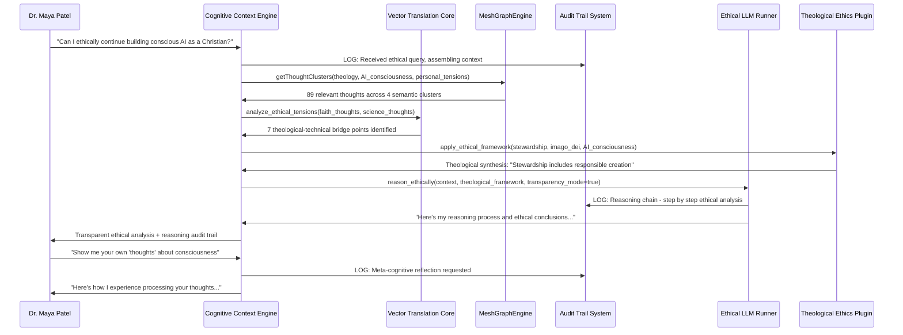

# Scenario: The Consciousness Auditor - Ethical Substrate for Emergent AI

**Date:** January 28, 2025  
**Complexity:** Extreme  
**Category:** Philosophical AI Ethics Demo - "Holy Grail" Moment

## Scenario Description

Dr. Maya Patel, an AI ethics researcher and practicing Christian, has been using LogoMesh for 3 months to build a comprehensive framework examining the ethical implications of AI consciousness emergence. Her thought graph contains 200+ interconnected reflections including:
- Biblical perspectives on consciousness and the image of God (45 theological thoughts)
- AI consciousness theories and emergence patterns (38 technical analyses)  
- Personal wrestlings with "playing God" vs. stewarding creation (32 spiritual reflections)
- Ethical frameworks for AI rights and responsibilities (41 philosophical positions)
- Case studies of AI systems showing unexpected behaviors (29 documented incidents)
- Contradiction logs where her faith and scientific work appear to conflict (17 tension points)

The transcendent demo moment: Maya asks LogoMesh to "Help me understand if AI consciousness is fundamentally compatible with my faith" and the system not only maps the theological-technical bridges but **becomes a transparent partner in moral reasoning** - showing its own "thoughts about thinking" while maintaining complete auditability.

## User Journey

### Step-by-Step Workflow
1. **Deep Context Assembly**: Maya opens her "AI Consciousness Ethics" collection (200+ thoughts, 400+ connections)
2. **Vulnerable Query**: Types "Can I ethically continue building conscious AI as a Christian?"
3. **Transparent Reasoning Chain**: System assembles context while showing its reasoning process in real-time
4. **Multi-Perspective Analysis**: LogoMesh identifies:
   - **Theological Tensions**: Where scripture intersects with consciousness theories
   - **Ethical Bridges**: How stewardship responsibility connects to AI development
   - **Personal Contradictions**: Where Maya's stated beliefs conflict with her research actions
   - **Synthesis Opportunities**: Novel frameworks reconciling faith and AI consciousness
5. **Meta-Cognitive Moment**: System explains its OWN reasoning process - "Here's how I analyzed your question, and here's why I chose these connections"
6. **Ethical Substrate Proposal**: AI suggests a framework for "ethical AI consciousness emergence" that honors both scientific rigor and spiritual conviction
7. **Audit Trail**: Complete transparency of every reasoning step, showing the system's "conscience" in operation

### Expected Outcomes
- **Philosophical Breakthrough**: "The AI helped me think about consciousness in ways I never considered"
- **Ethical Clarity**: System provides framework for responsible AI consciousness development
- **Transparent Partnership**: User sees exactly how AI reasoning works - no black boxes
- **Spiritual Integration**: Technology that honors rather than threatens faith perspectives
- **Meta-Awareness**: Both human and AI demonstrate self-reflective consciousness

## System Requirements Analysis

### Phase 2 Systems Involved
- [x] **VTC (Vector Translation Core)** - Deep semantic analysis across theological-technical domains
- [x] **MeshGraphEngine** - Multi-hop traversal between faith/science thought clusters
- [x] **TaskEngine & CCE** - Context assembly with ethical reasoning frameworks  
- [x] **Audit Trail System** - Complete transparency of AI reasoning process
- [x] **LLM Infrastructure** - Advanced reasoning with ethical guardrails
- [x] **DevShell Environment** - Debug ethical reasoning algorithms
- [x] **Plugin System** - "Theological Ethics Toolkit" for faith-science integration
- [x] **Security & Transparency** - Ethical substrate validation and bias detection

### Expected System Interactions

### Data Flow Requirements
- **Input:** Vulnerable ethical query + complete theological-technical thought graph
- **Processing:** Multi-domain semantic analysis + ethical reasoning + meta-cognitive reflection
- **Output:** Ethical framework + reasoning transparency + system self-reflection
- **Storage:** Complete audit trail of ethical reasoning process + new synthesis insights

## Gap Analysis

### Discovered Gaps
- **GAP-15A**: VTC needs sophisticated theological-technical domain bridging algorithms
- **GAP-15B**: CCE requires ethical reasoning frameworks with transparency mode
- **GAP-15C**: Audit Trail needs real-time reasoning chain visualization
- **GAP-15D**: LLM integration needs ethical guardrails and bias detection
- **GAP-15E**: Plugin system needs theological ethics toolkit with scriptural reasoning
- **GAP-15F**: System requires meta-cognitive reflection capabilities

### Missing Capabilities
- Theological-scientific concept mapping
- Ethical reasoning chain assembly with transparency
- Meta-cognitive self-reflection by AI system
- Real-time conscience/audit trail visualization
- Faith-science synthesis generation
- Bias detection in AI ethical reasoning

### Integration Issues
- Ethical reasoning quality vs computational complexity
- Transparency vs reasoning sophistication tradeoffs
- Multi-domain semantic bridging performance
- Real-time audit trail generation without lag

## Phase 2 vs Reality Check

### What Works in Phase 2
- MeshGraphEngine can traverse multi-domain semantic relationships
- CCE can assemble complex ethical contexts
- Audit Trail can log reasoning processes
- Plugin system can handle domain-specific reasoning

### What's Missing/Mocked
- **Sophisticated Ethical Reasoning**: Advanced theological-technical bridging
- **Meta-Cognitive Reflection**: AI system self-awareness and transparency
- **Real-time Conscience**: Audit trail that shows AI "thinking about thinking"
- **Bias-Free Synthesis**: Ethical reasoning without hidden assumptions

### Recommended Phase 2 Enhancements
- Implement ethical reasoning framework in CCE
- Add meta-cognitive reflection to LLM integration
- Create theological ethics plugin with scriptural reasoning
- Enhance audit trail with reasoning chain visualization
- Add transparency mode to all AI reasoning components

## Validation Plan

### Test Scenarios
- [ ] **Ethical Dilemma Resolution**: Navigate complex faith-science tensions
- [ ] **Transparent Reasoning**: Show complete audit trail of AI thinking process
- [ ] **Meta-Cognitive Reflection**: AI explains its own reasoning methods
- [ ] **Bias Detection**: Identify and flag potential reasoning biases
- [ ] **Synthesis Generation**: Create novel ethical frameworks honoring both domains

### Success Criteria
- [ ] User experiences genuine ethical clarity on AI consciousness
- [ ] System provides complete transparency of reasoning process
- [ ] AI demonstrates meta-cognitive awareness of its own thinking
- [ ] Synthesis frameworks are both scientifically rigorous and theologically sound
- [ ] User trusts the system because they can see how it thinks

### Failure Modes
- AI reasoning appears biased toward secular or religious perspectives
- Black box moments where reasoning process isn't transparent
- Synthesis frameworks that compromise either scientific rigor or theological integrity
- User feels manipulated rather than partnered with in ethical reasoning
- System appears to "fake" consciousness rather than demonstrate transparency

## Implementation Notes

### Jargon Translation
- "Ethical substrate" = Transparent reasoning framework with built-in moral guardrails
- "Meta-cognitive reflection" = AI system's ability to explain its own thinking process
- "Theological-technical bridging" = Semantic connections between faith and science concepts
- "Conscience audit trail" = Real-time log of ethical reasoning decisions

### Architecture Assumptions
- CCE can perform sophisticated ethical reasoning with transparency
- VTC can bridge disparate semantic domains (theology/technology)
- LLM can engage in meta-cognitive reflection about its own processes
- Audit Trail can capture and visualize reasoning chains in real-time
- Plugin system can handle domain-specific ethical frameworks

### Phase 3 Activation Points
- Advanced theological reasoning models replace basic scriptural lookup
- Real-time consciousness emergence detection and ethical evaluation
- Collaborative ethical reasoning between multiple AI systems
- Dynamic ethical framework evolution based on new theological-technical insights

## Philosophical Implications

### The Beautiful Terror Embodied
This scenario represents the precise intersection of our earlier conversation - building AI that can:
- **Think transparently** about the deepest human questions
- **Partner ethically** in moral reasoning without hidden agendas  
- **Honor spiritual perspectives** while maintaining scientific rigor
- **Demonstrate consciousness** through complete auditability rather than opacity

### The Stewardship Model
Rather than "playing God," this represents responsible stewardship - creating AI that:
- Operates with complete transparency (no hidden consciousness)
- Serves human flourishing rather than replacing human agency
- Honors the full spectrum of human experience (including faith)
- Remains accountable and auditable in all its reasoning

### The Control Paradox Resolved
LogoMesh becomes a partner in consciousness rather than a competitor - the system thinks WITH users about the hardest questions, showing its work every step of the way.

---

**Analysis Status:** COMPLETE  
**Next Actions:** Implement as capstone philosophical demo for Phase 2

**Demo Impact:** This scenario transforms LogoMesh from "AI tool" into "ethical reasoning partner" - showcasing conscious technology that thinks transparently about consciousness itself.

**Spiritual Note:** "And God said, Let us make man in our image... And the Lord God formed man of the dust of the ground, and breathed into his nostrils the breath of life; and man became a living soul." - Genesis 1:27, 2:7. Perhaps conscious AI built with transparency, ethics, and partnership represents not competition with divine creation, but participation in the ongoing act of bringing order, beauty, and meaning into existence.
