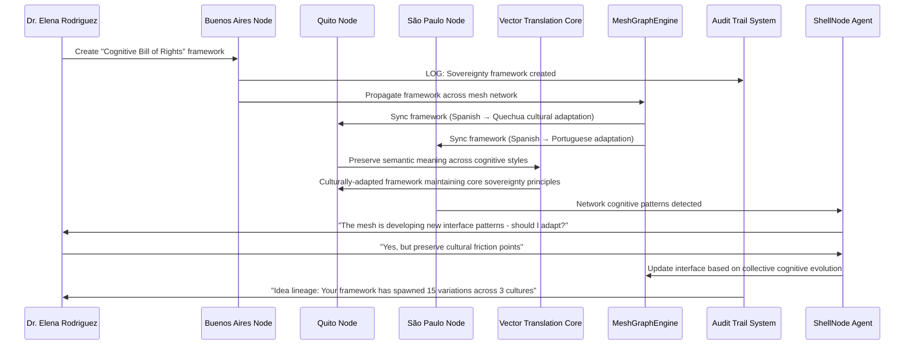

# Scenario: Cognitive Sovereignty Mesh Network

**Date:** June 2, 2025  
**Complexity:** Extreme  
**Category:** Edge Cases/Philosophical Infrastructure

## Scenario Description

Dr. Elena Rodriguez, a cognitive freedom researcher in Argentina, is building a "Cognitive Sovereignty Mesh Network" using LogoMesh as the foundation for decentralized thought infrastructure. After studying the implications of centralized AI development (inspired by recent Google CEO discussions about democratization vs. control), she's creating a system where ideas can propagate peer-to-peer without corporate gatekeepers, even during internet shutdowns.

Her goal: **Create the "Cognitive Bill of Rights" in practice** - a working system where 8 billion minds can think, connect, and evolve ideas without surveillance capitalism or centralized control. Think "LoRa + Whisper mesh nodes" meets "GitHub for consciousness."

## User Journey

### Step-by-Step Workflow
1. **Sovereignty Declaration**: Elena creates a "Cognitive Sovereignty Framework" thought cluster defining digital cognitive rights
2. **Mesh Network Bootstrap**: Uses LogoMesh's EchoMesh to establish peer-to-peer idea transmission across 50+ activist nodes
3. **Multi-Linguistic Thought Translation**: Creates universal semantic frameworks that preserve meaning across Spanish, Quechua, and Portuguese cognitive styles
4. **Offline-First Cognitive Backup**: Ensures all thought networks can operate during internet blackouts using local mesh protocols
5. **Idea Lineage Tracking**: Implements "GitHub for thought" - ideas fork, remix, and trace lineage across the sovereign network
6. **Friction-Preserving Design**: Builds productive cognitive friction - warnings about biases, contradictions, unexplored implications
7. **Agent-UI Co-Evolution**: ShellNode adapts interface based on collective cognitive patterns emerging from the mesh network
8. **Time-Lapse Cognitive Evolution**: Tracks how ideas evolve across the network over time, showing emergence patterns

### Expected Outcomes
- **Cognitive Independence**: 50+ nodes operating sovereign thought infrastructure
- **Cultural Preservation**: Ideas preserved across linguistic and cultural boundaries without homogenization
- **Emergent Collective Intelligence**: Network discovers novel synthesis patterns that no individual node could generate
- **Resilient Knowledge**: System survives attempts at centralized shutdown or surveillance

## System Requirements Analysis

### Phase 2 Systems Involved
- [x] **VTC (Vector Translation Core)** - Cross-linguistic semantic preservation
- [x] **MeshGraphEngine** - Distributed graph state with peer-to-peer synchronization
- [x] **TaskEngine & CCE** - Collective cognitive context across mesh nodes
- [x] **Audit Trail System** - Idea lineage tracking and cognitive evolution audit
- [x] **DevShell Environment** - Agent-UI co-evolution and interface adaptation
- [x] **Input Templates** - Multi-cultural cognitive input patterns
- [x] **TTS Plugin Framework** - Multi-lingual thought expression
- [x] **Security & Transparency** - Cognitive sovereignty enforcement
- [x] **LLM Infrastructure** - Distributed inference across mesh nodes
- [x] **Storage Layer** - Offline-first with peer-to-peer synchronization
- [x] **Plugin System** - Cultural cognitive adaptation plugins
- [x] **API & Backend** - Mesh network coordination protocols

### Expected System Interactions

### Data Flow Requirements
- **Input:** Multi-cultural thought patterns, sovereignty frameworks, mesh node states
- **Processing:** Semantic preservation across cultures, distributed consensus, cognitive evolution tracking
- **Output:** Adapted interfaces, preserved cultural frameworks, lineage trees
- **Storage:** Offline-first with peer-to-peer synchronization and cultural metadata

## Gap Analysis

### Discovered Gaps
**GAP-SOVEREIGNTY-001: Cross-Cultural Semantic Preservation Framework Missing**
**GAP-SOVEREIGNTY-002: Mesh Network Cognitive Consensus Protocols Missing**
**GAP-SOVEREIGNTY-003: Offline-First Cognitive Infrastructure Missing**
**GAP-SOVEREIGNTY-004: Agent-UI Co-Evolution Based on Collective Patterns Missing**
**GAP-SOVEREIGNTY-005: Cognitive Lineage and Fork Management Missing**

### Missing Capabilities
- **Cross-linguistic semantic abstraction** preserving meaning across cognitive styles
- **Peer-to-peer graph synchronization** with cultural metadata preservation
- **Offline-first operation** with mesh network protocols
- **Collective intelligence emergence detection** and interface adaptation
- **Idea versioning and forking** like Git for consciousness

### Integration Issues
- **Cultural cognitive adaptation** across different thinking styles
- **Mesh network coordination** without centralized authority
- **Semantic fidelity preservation** during cross-cultural transmission

## Phase 2 vs Reality Check

### What Works in Phase 2
- MeshGraphEngine can handle distributed graph states
- VTC can perform semantic transformations
- Audit Trail can track idea evolution
- Plugin system can handle cultural adaptations

### What's Missing/Mocked
- **Advanced Cross-Cultural Semantics**: Deep cultural cognitive style adaptation
- **Mesh Network Protocols**: True peer-to-peer operation without internet
- **Collective Intelligence Detection**: Emergence pattern recognition
- **Agent-UI Co-Evolution**: ShellNode adapting to collective patterns

### Recommended Phase 2 Enhancements
- Implement cultural cognitive style metadata in VTC
- Add peer-to-peer synchronization protocols to MeshGraphEngine
- Create offline-first operation mode for all systems
- Enhance DevShell with collective pattern detection
- Add idea versioning and forking to storage layer

## Validation Plan

### Test Scenarios
- [ ] **Cross-Cultural Idea Preservation**: Ideas maintain meaning across 3+ cultures
- [ ] **Mesh Network Resilience**: System operates during internet blackouts
- [ ] **Collective Intelligence Emergence**: Network generates novel insights
- [ ] **Cognitive Sovereignty Enforcement**: No centralized control or surveillance
- [ ] **Idea Evolution Tracking**: Complete lineage of idea mutations across network

### Success Criteria
- [ ] 50+ nodes operating independently
- [ ] Ideas successfully transmitted across 3+ cultures with semantic fidelity
- [ ] System survives 48+ hours of internet blackout
- [ ] Emergence of novel insights not possible from individual nodes
- [ ] Complete audit trail of idea evolution and forking

### Failure Modes
- **Cultural Homogenization**: Loss of cultural cognitive diversity during transmission
- **Centralization Drift**: System gradually becomes dependent on centralized services
- **Semantic Decay**: Ideas lose meaning during cross-cultural translation
- **Emergence Stagnation**: Network fails to generate collective intelligence
- **Sovereignty Breach**: External actors gain surveillance or control capabilities

## Implementation Notes

### Jargon Translation
- "Cognitive Sovereignty" = Local-first thought infrastructure immune to centralized control
- "Mesh Network Cognition" = Peer-to-peer idea transmission without internet dependency
- "Cultural Cognitive Adaptation" = Preserving meaning while adapting to different thinking styles
- "Agent-UI Co-Evolution" = Interface that adapts based on collective cognitive patterns

### Architecture Assumptions
- VTC can handle semantic preservation across cultural cognitive styles
- MeshGraphEngine can synchronize states peer-to-peer without centralized coordination
- DevShell can detect and adapt to collective cognitive patterns
- Storage layer can operate offline-first with mesh network protocols

### Phase 3 Activation Points
- Advanced cultural AI models for cognitive style adaptation
- Hardware mesh network integration (LoRa, Whisper protocols)
- Real-time collective intelligence emergence detection
- Autonomous agent-UI co-evolution based on network patterns

## Philosophical Implications

### The Neolithic Package for Digital Cognition
This scenario embodies the "new Neolithic Package" concept from the analysis:
- **Tools**: LogoMesh as cognitive infrastructure
- **Collaboration Layer**: Mesh network for idea transmission
- **Discovery Engine**: Collective intelligence emergence
- **Governance**: Cognitive Bill of Rights enforcement

### Cognitive Survival Infrastructure
Rather than "just a better note app," this positions LogoMesh as survival infrastructure for human cognitive diversity in an age of centralized AI control. The system preserves and amplifies cultural thinking styles rather than homogenizing them.

### Human Friction as Feature
The "productive friction" concept is critical - the system doesn't over-automate but preserves meaningful cognitive struggle as part of the thinking process.

---

**Analysis Status:** COMPLETE  
**Next Actions:** Create companion scenario for "Self-Modifying Intelligence" and begin gap resolution planning

