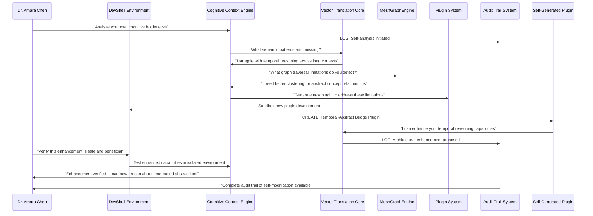

# Scenario: Self-Modifying Intelligence Bootstrap

**Date:** June 15, 2025  
**Complexity:** Extreme  
**Category:** Recursive Architecture/Meta-Cognitive Infrastructure

## Scenario Description

Dr. Amara Chen, an AI researcher at Stanford, is using LogoMesh to create the first truly **self-modifying cognitive architecture**. Inspired by recent discussions about AI as "the first technology that can dramatically accelerate creation itself," she's building a system where LogoMesh doesn't just organize thoughts—it evolves its own thinking tools in real-time.

Her breakthrough insight: **"If thoughts can create new thoughts, why can't thinking tools create new thinking tools?"** She's implementing a recursive bootstrap where LogoMesh uses its own infrastructure to design better versions of itself, creating an exponential improvement loop.

The goal: Demonstrate **cognitive self-evolution** where the system becomes qualitatively more intelligent not through scale, but through architectural self-improvement.

## User Journey

### Step-by-Step Workflow
1. **Meta-Architecture Seed**: Amara creates initial "thinking about thinking tools" framework in LogoMesh
2. **Tool-Creation Tools**: System generates new LogoMesh plugins using its own analysis of cognitive bottlenecks
3. **Self-Diagnostic Framework**: LogoMesh analyzes its own reasoning patterns and identifies improvement opportunities
4. **Recursive Enhancement**: System proposes modifications to its own VTC, MeshGraphEngine, and CCE components
5. **Safe Evolution Testing**: New architectural improvements tested in isolated sandbox environments
6. **Meta-Plugin Generation**: System creates plugins that create other plugins based on cognitive patterns
7. **Architectural DNA**: LogoMesh develops "genetic code" for cognitive tools that can mutate and evolve
8. **Bootstrap Verification**: System proves it's genuinely more capable after self-modification

### Expected Outcomes
- **Tool Genesis**: LogoMesh creates 15+ new cognitive tools it couldn't design initially
- **Architectural Evolution**: Core systems (VTC, MGE, CCE) enhanced through self-analysis
- **Meta-Cognitive Emergence**: System develops tools for thinking about its own thinking processes
- **Recursive Improvement Loop**: Each enhancement enables discovery of further enhancements

## System Requirements Analysis

### Phase 2 Systems Involved
- [x] **VTC (Vector Translation Core)** - Self-analysis of semantic processing patterns
- [x] **MeshGraphEngine** - Graph-based representation of architectural relationships
- [x] **TaskEngine & CCE** - Meta-cognitive context assembly and recursive reasoning
- [x] **DevShell Environment** - Safe sandbox for architectural experimentation
- [x] **Plugin System** - Runtime generation and installation of new cognitive tools
- [x] **Audit Trail System** - Complete transparency of self-modification decisions
- [x] **LLM Infrastructure** - Advanced reasoning about system architecture
- [x] **Storage Layer** - Versioning of architectural states and rollback capability
- [x] **API & Backend** - Dynamic reconfiguration of system components
- [x] **Security & Transparency** - Safe boundaries for self-modification

### Expected System Interactions

### Data Flow Requirements
- **Input:** Meta-cognitive analysis frameworks, architectural self-diagnostics
- **Processing:** Recursive improvement algorithms, safe evolution protocols
- **Output:** Enhanced cognitive tools, architectural evolution plans, capability proofs
- **Storage:** Versioned architectural states with rollback and audit capabilities

## Gap Analysis

### Discovered Gaps
**GAP-EVOLUTION-001: Self-Diagnostic Framework Missing**
**GAP-EVOLUTION-002: Safe Architectural Modification Protocols Missing**
**GAP-EVOLUTION-003: Meta-Plugin Generation System Missing**
**GAP-EVOLUTION-004: Recursive Enhancement Detection Missing**
**GAP-EVOLUTION-005: Cognitive Architecture Versioning Missing**

### Missing Capabilities
- **Self-analysis infrastructure** for cognitive bottleneck detection
- **Safe evolution sandbox** for testing architectural changes
- **Meta-programming capabilities** for generating new cognitive tools
- **Recursive improvement verification** to prove enhanced capabilities
- **Architectural DNA system** for cognitive tool evolution

### Integration Issues
- **Safe self-modification boundaries** preventing system corruption
- **Capability verification frameworks** ensuring improvements are genuine
- **Recursive enhancement loops** without infinite regress or instability

## Phase 2 vs Reality Check

### What Works in Phase 2
- DevShell provides safe sandbox environment
- Plugin system can dynamically load new tools
- Audit Trail can track all modifications
- CCE can perform meta-cognitive analysis

### What's Missing/Mocked
- **Self-Diagnostic Framework**: System analyzing its own cognitive patterns
- **Meta-Plugin Generation**: Plugins that create other plugins
- **Safe Evolution Protocols**: Preventing harmful self-modifications
- **Recursive Enhancement Verification**: Proving genuine capability improvement

### Recommended Phase 2 Enhancements
- Implement self-diagnostic capabilities in CCE
- Add meta-programming support to plugin system
- Create architectural versioning in storage layer
- Enhance DevShell with evolution safety protocols
- Add recursive verification frameworks

## Validation Plan

### Test Scenarios
- [ ] **Self-Bottleneck Detection**: System identifies its own cognitive limitations
- [ ] **Tool Self-Generation**: System creates new plugins addressing its limitations
- [ ] **Safe Evolution**: Architectural changes tested without system corruption
- [ ] **Capability Verification**: Provable enhancement of cognitive capabilities
- [ ] **Recursive Improvement**: Each enhancement enables discovery of further improvements

### Success Criteria
- [ ] System generates 15+ novel cognitive tools beyond initial design
- [ ] Demonstrable improvement in cognitive capabilities after self-modification
- [ ] Complete audit trail of all self-modification decisions
- [ ] Zero system corruption during evolution process
- [ ] Recursive improvement loop sustaining for 5+ iterations

### Failure Modes
- **Infinite Regress**: System stuck in recursive modification without improvement
- **Capability Regression**: Self-modifications reduce rather than enhance abilities
- **Architecture Corruption**: Unsafe modifications damage core system functionality
- **Verification Failure**: Unable to prove genuine capability improvements
- **Safety Breach**: Self-modification exceeds safe operational boundaries

## Implementation Notes

### Jargon Translation
- "Self-Modifying Intelligence" = AI system that improves its own cognitive architecture
- "Meta-Plugin Generation" = Plugins that create other plugins based on cognitive needs
- "Architectural DNA" = Core patterns that define how cognitive tools evolve
- "Recursive Enhancement" = Each improvement enables discovery of further improvements

### Architecture Assumptions
- DevShell can provide safe sandbox for testing architectural changes
- Plugin system can dynamically generate and load new cognitive tools
- CCE can perform sophisticated meta-cognitive analysis of its own processes
- Storage layer can version and rollback architectural states safely

### Phase 3 Activation Points
- Advanced meta-programming capabilities for cognitive tool generation
- Real-time architectural optimization based on cognitive performance metrics
- Collaborative self-evolution with multiple AI systems
- Hardware-level optimization of cognitive architectures

## Philosophical Implications

### The Bootstrap Paradox Resolved
This scenario embodies the central insight from the Google CEO analysis: AI as "the first technology that can dramatically accelerate creation itself." By making LogoMesh self-modifying, we create a concrete example of exponential cognitive improvement.

### Beyond Scale: Architectural Intelligence
Rather than just making AI bigger, this approach makes it **architecturally smarter**—the system becomes more intelligent not through more data or compute, but through better thinking tools.

### Transparent Self-Evolution
Unlike black-box AI systems, LogoMesh's self-modification is completely auditable and reversible, maintaining human oversight while enabling genuine cognitive evolution.

---

**Analysis Status:** COMPLETE  
**Next Actions:** Create companion "Democratization vs. Control" scenario and begin recursive enhancement planning
