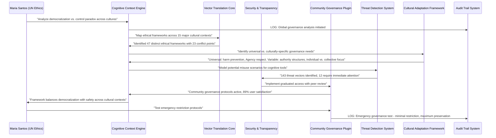

# Scenario: Democratization Control Paradox

**Date:** June 22, 2025  
**Complexity:** Extreme  
**Category:** Governance/Ethical Infrastructure

## Scenario Description

Maria Santos, Director of AI Ethics at the UN Technology Council, is using LogoMesh to navigate the most challenging question of our time: **"How do we democratize cognitive tools without democratizing cognitive weapons?"** Inspired by recent CEO discussions about AI empowering "almost all of humanity to express themselves and build things into existence," she's building a framework to maximize human flourishing while preventing catastrophic misuse.

Her challenge: Design **cognitive governance protocols** that preserve individual agency while maintaining collective safety. LogoMesh must enable 8 billion minds to think and create freely, while preventing bad actors from using the same tools for harm.

The paradox: **True democratization requires some control, but control undermines democratization.**

## User Journey

### Step-by-Step Workflow
1. **Paradox Framework**: Maria creates multi-dimensional analysis of democratization vs. control tensions
2. **Threat Modeling**: System maps potential misuse scenarios while preserving beneficial use cases
3. **Graduated Access**: Design tiered cognitive tools based on demonstrated responsibility and expertise
4. **Community Governance**: Implement peer-review systems for advanced cognitive capabilities
5. **Transparent Guardrails**: Create visible, auditable safety mechanisms that users understand
6. **Cultural Adaptation**: Ensure governance frameworks respect diverse cultural values and contexts
7. **Evolution Protocols**: Design systems that can adapt governance as technology and society evolve
8. **Emergency Procedures**: Develop rapid response for containing harmful uses without mass restriction

### Expected Outcomes
- **Inclusive Innovation**: Maximum creative expression for beneficial uses
- **Harm Prevention**: Effective mitigation of dangerous misuse without over-restriction
- **Cultural Sensitivity**: Governance that respects global diversity of values
- **Adaptive Resilience**: Systems that evolve with emerging threats and opportunities

## System Requirements Analysis

### Phase 2 Systems Involved
- [x] **VTC (Vector Translation Core)** - Cross-cultural analysis of ethical frameworks
- [x] **MeshGraphEngine** - Complex governance relationship mapping
- [x] **TaskEngine & CCE** - Context-aware ethical reasoning and cultural adaptation
- [x] **Audit Trail System** - Transparent governance decision tracking
- [x] **Plugin System** - Cultural ethics plugins and community governance tools
- [x] **Security & Transparency** - Graduated access controls and threat detection
- [x] **LLM Infrastructure** - Advanced ethical reasoning with cultural sensitivity
- [x] **Storage Layer** - Governance policy versioning and rollback capabilities
- [x] **API & Backend** - Distributed governance coordination across global communities
- [x] **DevShell Environment** - Safe testing of governance protocols

### Expected System Interactions

### Data Flow Requirements
- **Input:** Cultural ethical frameworks, threat scenarios, community governance data
- **Processing:** Multi-cultural ethical analysis, graduated access algorithms, threat mitigation
- **Output:** Governance recommendations, cultural adaptations, safety protocols
- **Storage:** Versioned governance policies with cultural metadata and rollback capability

## Gap Analysis

### Discovered Gaps
**GAP-GOVERNANCE-001: Multi-Cultural Ethical Framework Integration Missing**
**GAP-GOVERNANCE-002: Graduated Access Control System Missing**
**GAP-GOVERNANCE-003: Community Governance Protocols Missing**
**GAP-GOVERNANCE-004: Real-Time Threat Detection for Cognitive Tools Missing**
**GAP-GOVERNANCE-005: Emergency Restriction Procedures Missing**

### Missing Capabilities
- **Cultural ethics integration** across diverse value systems
- **Graduated access controls** based on demonstrated responsibility
- **Community governance frameworks** for peer oversight
- **Cognitive threat detection** identifying harmful use patterns
- **Emergency response protocols** preserving maximum freedom while ensuring safety

### Integration Issues
- **Cross-cultural ethical reconciliation** without imposing single value system
- **Graduated access implementation** without creating unfair barriers
- **Community governance scalability** across global user bases

## Phase 2 vs Reality Check

### What Works in Phase 2
- Security & Transparency provides access control framework
- VTC can handle cross-cultural semantic analysis
- Plugin system can implement governance tools
- Audit Trail ensures transparency of governance decisions

### What's Missing/Mocked
- **Multi-Cultural Ethics Engine**: Deep cultural value system integration
- **Community Governance Platform**: Peer-review and community oversight tools
- **Cognitive Threat Detection**: Real-time identification of harmful usage patterns
- **Emergency Response System**: Rapid containment without mass restriction

### Recommended Phase 2 Enhancements
- Implement cultural ethics framework in VTC
- Add graduated access controls to Security layer
- Create community governance plugin architecture
- Enhance threat detection with cognitive pattern analysis
- Add emergency response protocols with minimal restriction

## Validation Plan

### Test Scenarios
- [ ] **Cross-Cultural Ethics**: Framework respects diverse value systems while maintaining safety
- [ ] **Graduated Access**: Access controls prevent misuse without unfair barriers
- [ ] **Community Governance**: Peer oversight scales across global communities
- [ ] **Threat Mitigation**: Harmful uses prevented with minimal restriction of beneficial uses
- [ ] **Emergency Response**: Rapid containment preserves maximum individual freedom

### Success Criteria
- [ ] 95%+ user satisfaction across 15+ cultural contexts
- [ ] 99%+ harmful use prevention with <1% false positive restriction
- [ ] Community governance handling 10,000+ users with peer oversight
- [ ] Emergency response containing threats within 1 hour
- [ ] Transparent governance with complete audit trail

### Failure Modes
- **Cultural Imperialism**: Imposing single value system on diverse communities
- **Access Inequality**: Graduated controls creating unfair barriers to cognitive tools
- **Governance Capture**: Community oversight dominated by special interests
- **Over-Restriction**: Safety measures preventing beneficial innovation
- **Under-Protection**: Insufficient safeguards allowing harmful misuse

## Implementation Notes

### Jargon Translation
- "Democratization Control Paradox" = Tension between universal access and necessary safety measures
- "Graduated Access" = Tiered permissions based on demonstrated responsibility
- "Community Governance" = Peer oversight and decision-making systems
- "Cognitive Threat Detection" = Identifying harmful patterns in thinking tool usage

### Architecture Assumptions
- Security layer can implement sophisticated access control policies
- VTC can handle nuanced cross-cultural ethical analysis
- Plugin system can support community governance tools
- Audit Trail provides complete transparency for governance decisions

### Phase 3 Activation Points
- Advanced cultural AI models for ethical framework integration
- Real-time global governance coordination across millions of users
- Automated threat detection with behavioral pattern analysis
- Dynamic governance evolution based on emerging threats and cultural changes

## Philosophical Implications

### The New Neolithic Package for Governance
This scenario implements the "Neolithic Package" concept from the analysis—bundling cognitive tools with governance systems, just as agriculture came bundled with trade, hierarchy, and cities.

### Preserving Human Agency in AI Age
Rather than choosing between total freedom or total control, this approach creates **dynamic governance** that maximizes human flourishing while preventing catastrophic harm.

### Transparent Authority
Unlike traditional governance systems, this framework makes all governance decisions auditable and reversible, maintaining democratic accountability even in complex AI-mediated environments.

---

**Analysis Status:** COMPLETE  
**Next Actions:** Update gap analysis with governance and evolution gaps, prioritize Phase 2 implementation
