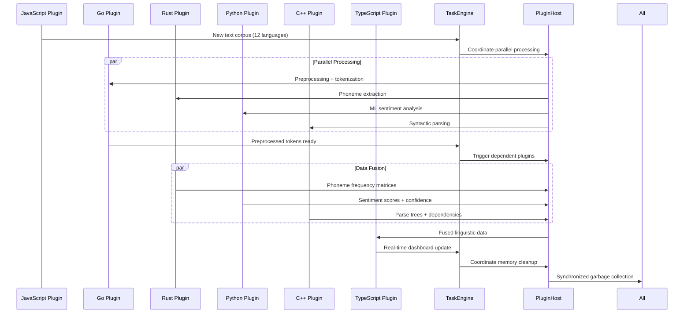

# Scenario: Polyglot Plugin Symphony - Cross-Language Runtime Orchestration

**Date:** 06.10.2025  
**Complexity:** Extreme  
**Category:** Integration Challenges/Performance Extremes

## Scenario Description

Dr. Elena Rodriguez is building a computational linguistics research platform using LogoMesh to analyze patterns across 12 different languages. Her workflow requires real-time coordination between plugins written in different languages, each optimized for specific linguistic tasks:

- **Rust plugin:** Ultra-fast phoneme extraction and frequency analysis
- **Python plugin:** Machine learning sentiment classification using scikit-learn
- **Go plugin:** Concurrent text preprocessing and tokenization
- **C++ plugin:** High-performance syntactic parsing with custom grammars
- **JavaScript/Node.js plugin:** Real-time web scraping and data ingestion
- **TypeScript plugin:** Frontend visualization and interactive linguistic trees

The challenge: All plugins must process the same text corpus simultaneously, share intermediate results, coordinate memory usage, and maintain sub-200ms response times for real-time analysis.

## User Journey

### Step-by-Step Workflow
1. **Data Ingestion (T+0:00)** - JavaScript plugin scrapes multilingual news articles in real-time
2. **Preprocessing Fork (T+0:05)** - Go plugin splits text into sentences, triggers parallel processing
3. **Parallel Analysis (T+0:10)**:
   - Rust: Phoneme extraction + frequency matrices
   - Python: Sentiment scoring + emotion classification  
   - C++: Syntactic parsing + dependency trees
   - TypeScript: Real-time visualization updates
4. **Cross-Language Data Fusion (T+0:15)** - All plugins contribute to unified linguistic analysis
5. **Real-Time Dashboard Update (T+0:20)** - TypeScript plugin renders combined results
6. **Memory Cleanup Coordination (T+0:25)** - All plugins coordinate garbage collection

### Expected Outcomes
- **Sub-200ms latency** from text input to visual output
- **Zero data loss** during plugin handoffs
- **Coordinated memory management** preventing system crashes
- **Atomic transaction semantics** across all language runtimes
- **Real-time error propagation** and recovery coordination

## System Requirements Analysis

### Phase 2 Systems Involved
- [x] **VTC (Vector Translation Core)** - Semantic embeddings shared across all plugins
- [x] **MeshGraphEngine** - Graph updates from multiple plugin sources simultaneously
- [x] **TaskEngine & CCE** - Cross-language workflow orchestration and deadline management
- [x] **Audit Trail System** - Multi-language operation logging and debugging
- [x] **DevShell Environment** - Multi-runtime debugging and hot-reload coordination
- [x] **TTS Plugin Framework** - Real-time audio feedback in multiple languages
- [x] **Security & Transparency** - Sandboxing and permission coordination across runtimes
- [x] **LLM Infrastructure** - Resource quotas shared across language-specific LLM calls
- [x] **Storage Layer** - Atomic multi-language data transactions
- [x] **Plugin System** - Core cross-language runtime coordination
- [x] **API & Backend** - WebSocket coordination for real-time multi-language updates

### Expected System Interactions



### Data Flow Requirements
- **Input:** Real-time multilingual text streams (50+ articles/minute)
- **Processing:** Parallel analysis across 6 different language runtimes
- **Output:** Unified linguistic analysis dashboard with <200ms latency
- **Storage:** Atomic transactions preserving cross-language data consistency

## Gap Analysis

### Discovered Gaps
**GAP-POLYGLOT-001: Multi-Language Plugin Runtime Coordination Missing**
**GAP-POLYGLOT-002: Cross-Runtime Memory Management Missing**
**GAP-POLYGLOT-003: Atomic Cross-Language Transaction Support Missing**
**GAP-POLYGLOT-004: Real-Time Deadline Coordination Across Runtimes Missing**
**GAP-POLYGLOT-005: Cross-Language Error Propagation and Recovery Missing**

### Missing Capabilities
- **Multi-language plugin runtime manager** with coordinated lifecycle management
- **Cross-runtime shared memory interface** for zero-copy data exchange
- **Distributed transaction coordinator** ensuring atomicity across language boundaries
- **Real-time deadline scheduler** with cross-language performance monitoring
- **Multi-runtime error handling** with coordinated rollback and recovery
- **Cross-language resource quotas** preventing any single runtime from starving others

### Integration Issues
- **Plugin isolation vs. communication** - sandboxing that still allows high-speed data exchange
- **Memory model differences** - coordinating garbage collection across Go, Rust, Python, C++
- **Error handling heterogeneity** - translating exceptions/errors between different language paradigms
- **Performance monitoring complexity** - tracking metrics across fundamentally different runtimes
- **Deployment coordination** - ensuring all language runtimes are properly configured

## Phase 2 vs Reality Check

### What Works in Phase 2
- Basic plugin loading framework supports individual plugin types
- Event-driven architecture provides async communication foundation
- Storage layer supports atomic transactions for structured data
- TaskEngine provides basic workflow orchestration capabilities

### What's Missing/Mocked
- **Multi-language runtime coordinator** - Currently assumes single-language plugins
- **Cross-runtime memory management** - No coordination between different language GCs
- **Real-time performance guarantees** - No deadline-aware scheduling across runtimes
- **Atomic cross-language transactions** - Storage atomicity doesn't extend to plugin operations
- **Multi-runtime error handling** - Each language handles errors independently
- **Resource quota enforcement** - No cross-language resource management

### Recommended Phase 2 Enhancements
- **Plugin Runtime Registry** - Track and coordinate multiple language runtimes
- **Cross-Language Event Bus** - High-speed message passing with serialization optimization
- **Shared Memory Pool Interface** - Abstract shared memory access across language boundaries
- **Multi-Runtime Resource Monitor** - Track CPU, memory, and I/O across all runtimes
- **Deadline Coordination Service** - Real-time scheduling across heterogeneous plugins
- **Cross-Language Mock Framework** - Simulate multi-language coordination for testing

## Validation Plan

### Test Scenarios
- [ ] **Sequential Plugin Execution** - Ensure proper handoff between languages
- [ ] **Parallel Plugin Coordination** - Multiple languages processing simultaneously
- [ ] **Memory Pressure Testing** - Coordinated resource management under load
- [ ] **Error Cascade Handling** - Error in one runtime properly handled by others
- [ ] **Performance Deadline Testing** - Sub-200ms latency under realistic load
- [ ] **Plugin Hot-Reload** - Replace individual language plugins without system restart

### Success Criteria
- [ ] **Latency < 200ms** end-to-end for 12-language text analysis
- [ ] **Zero data loss** during cross-language plugin handoffs
- [ ] **Memory usage < 2GB** total across all language runtimes
- [ ] **99.9% uptime** during 8-hour continuous operation
- [ ] **Atomic consistency** - either all plugins succeed or all rollback cleanly
- [ ] **Real-time debugging** - DevShell can inspect state across all runtimes simultaneously

### Failure Modes
- **Memory leak cascade** - One language runtime affects others
- **Deadlock across runtimes** - Plugin coordination creates circular dependencies  
- **Performance degradation** - Cross-language coordination overhead exceeds latency budget
- **Data corruption** - Serialization errors during cross-language data exchange
- **Error propagation failure** - Error in one runtime not properly handled by others

## Implementation Notes

### Cross-Language Coordination Architecture
```typescript
interface MultiLanguagePluginCoordinator {
  runtimes: Map<string, PluginRuntime>; // 'rust', 'python', 'go', etc.
  
  coordinateExecution(workflow: CrossLanguageWorkflow): Promise<WorkflowResult>;
  shareMemory(data: SharedData, targetRuntimes: string[]): Promise<void>;
  propagateError(error: CrossLanguageError): Promise<void>;
  enforceDeadlines(deadlines: Map<string, number>): Promise<void>;
}

interface CrossLanguageWorkflow {
  steps: WorkflowStep[];
  dependencies: Map<string, string[]>; // runtime -> dependent runtimes
  memoryBudget: Map<string, number>;   // runtime -> max memory MB
  deadlines: Map<string, number>;      // runtime -> max execution time ms
}
```

### Phase 3 Activation Points
- Real multi-language LLM models coordinating across different runtimes
- Hardware-accelerated shared memory for zero-copy cross-language data exchange  
- Advanced performance profiling across heterogeneous plugin ecosystems
- Auto-scaling plugin instances based on cross-language performance analytics

---

**Analysis Status:** COMPLETE  
**Next Actions:** 
1. Implement basic multi-language plugin registry
2. Design cross-language shared memory interface
3. Create mock framework for testing multi-runtime coordination
4. Begin gap resolution planning for POLYGLOT-001 through POLYGLOT-005
