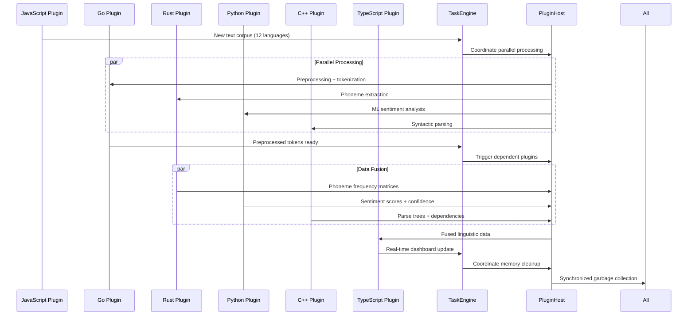

# Scenario: Polyglot Plugin Symphony - Cross-Language Runtime Orchestration

**Date:** 06.10.2025  
**Complexity:** Extreme  
**Category:** Integration Challenges/Performance Extremes

## Scenario Description

Dr. Elena Rodriguez is building a computational linguistics research platform using LogoMesh to analyze patterns across 12 different languages. Her workflow requires real-time coordination between plugins written in different languages, each optimized for specific linguistic tasks:

- **Rust plugin:** Ultra-fast phoneme extraction and frequency analysis
- **Python plugin:** Machine learning sentiment classification using scikit-learn
- **Go plugin:** Concurrent text preprocessing and tokenization
- **C++ plugin:** High-performance syntactic parsing with custom grammars
- **JavaScript/Node.js plugin:** Real-time web scraping and data ingestion
- **TypeScript plugin:** Frontend visualization and interactive linguistic trees

The challenge: All plugins must process the same text corpus simultaneously, share intermediate results, coordinate memory usage, and maintain sub-200ms response times for real-time analysis.

## User Journey

### Step-by-Step Workflow
1. **Data Ingestion (T+0:00)** - JavaScript plugin scrapes multilingual news articles in real-time
2. **Preprocessing Fork (T+0:05)** - Go plugin splits text into sentences, triggers parallel processing
3. **Parallel Analysis (T+0:10)**:
   - Rust: Phoneme extraction + frequency matrices
   - Python: Sentiment scoring + emotion classification  
   - C++: Syntactic parsing + dependency trees
   - TypeScript: Real-time visualization updates
4. **Cross-Language Data Fusion (T+0:15)** - All plugins contribute to unified linguistic analysis
5. **Real-Time Dashboard Update (T+0:20)** - TypeScript plugin renders combined results
6. **Memory Cleanup Coordination (T+0:25)** - All plugins coordinate garbage collection

### Expected Outcomes
- **Sub-200ms latency** from text input to visual output
- **Zero data loss** during plugin handoffs
- **Coordinated memory management** preventing system crashes
- **Atomic transaction semantics** across all language runtimes
- **Real-time error propagation** and recovery coordination

## System Requirements Analysis

### Phase 2 Systems Involved
- [x] **VTC (Vector Translation Core)** - Semantic embeddings shared across all plugins
- [x] **MeshGraphEngine** - Graph updates from multiple plugin sources simultaneously
- [x] **TaskEngine & CCE** - Cross-language workflow orchestration and deadline management
- [x] **Audit Trail System** - Multi-language operation logging and debugging
- [x] **DevShell Environment** - Multi-runtime debugging and hot-reload coordination
- [x] **TTS Plugin Framework** - Real-time audio feedback in multiple languages
- [x] **Security & Transparency** - Sandboxing and permission coordination across runtimes
- [x] **LLM Infrastructure** - Resource quotas shared across language-specific LLM calls
- [x] **Storage Layer** - Atomic multi-language data transactions
- [x] **Plugin System** - Core cross-language runtime coordination
- [x] **API & Backend** - WebSocket coordination for real-time multi-language updates

### Expected System Interactions



### Data Flow Requirements
- **Input:** Real-time multilingual text streams (50+ articles/minute)
- **Processing:** Parallel analysis across 6 different language runtimes
- **Output:** Unified linguistic analysis dashboard with <200ms latency
- **Storage:** Atomic transactions preserving cross-language data consistency

## Gap Analysis

### Discovered Gaps
**GAP-POLYGLOT-001: Multi-Language Plugin Runtime Coordination Missing**
**GAP-POLYGLOT-002: Cross-Runtime Memory Management Missing**
**GAP-POLYGLOT-003: Atomic Cross-Language Transaction Support Missing**
**GAP-POLYGLOT-004: Real-Time Deadline Coordination Across Runtimes Missing**
**GAP-POLYGLOT-005: Cross-Language Error Propagation and Recovery Missing**

### Missing Capabilities
- **Multi-language plugin runtime manager** with coordinated lifecycle management
- **Cross-runtime shared memory interface** for zero-copy data exchange
- **Distributed transaction coordinator** ensuring atomicity across language boundaries
- **Real-time deadline scheduler** with cross-language performance monitoring
- **Multi-runtime error handling** with coordinated rollback and recovery
- **Cross-language resource quotas** preventing any single runtime from starving others

### Integration Issues
- **Plugin isolation vs. communication** - sandboxing that still allows high-speed data exchange
- **Memory model differences** - coordinating garbage collection across Go, Rust, Python, C++
- **Error handling heterogeneity** - translating exceptions/errors between different language paradigms
- **Performance monitoring complexity** - tracking metrics across fundamentally different runtimes
- **Deployment coordination** - ensuring all language runtimes are properly configured

## Phase 2 vs Reality Check

### What Works in Phase 2
- Basic plugin loading framework supports individual plugin types
- Event-driven architecture provides async communication foundation
- Storage layer supports atomic transactions for structured data
- TaskEngine provides basic workflow orchestration capabilities

### What's Missing/Mocked
- **Multi-language runtime coordinator** - Currently assumes single-language plugins
- **Cross-runtime memory management** - No coordination between different language GCs
- **Real-time performance guarantees** - No deadline-aware scheduling across runtimes
- **Atomic cross-language transactions** - Storage atomicity doesn't extend to plugin operations
- **Multi-runtime error handling** - Each language handles errors independently
- **Resource quota enforcement** - No cross-language resource management

### Recommended Phase 2 Enhancements
- **Plugin Runtime Registry** - Track and coordinate multiple language runtimes
- **Cross-Language Event Bus** - High-speed message passing with serialization optimization
- **Shared Memory Pool Interface** - Abstract shared memory access across language boundaries
- **Multi-Runtime Resource Monitor** - Track CPU, memory, and I/O across all runtimes
- **Deadline Coordination Service** - Real-time scheduling across heterogeneous plugins
- **Cross-Language Mock Framework** - Simulate multi-language coordination for testing

## Validation Plan

### Test Scenarios
- [ ] **Sequential Plugin Execution** - Ensure proper handoff between languages
- [ ] **Parallel Plugin Coordination** - Multiple languages processing simultaneously
- [ ] **Memory Pressure Testing** - Coordinated resource management under load
- [ ] **Error Cascade Handling** - Error in one runtime properly handled by others
- [ ] **Performance Deadline Testing** - Sub-200ms latency under realistic load
- [ ] **Plugin Hot-Reload** - Replace individual language plugins without system restart

### Success Criteria
- [ ] **Latency < 200ms** end-to-end for 12-language text analysis
- [ ] **Zero data loss** during cross-language plugin handoffs
- [ ] **Memory usage < 2GB** total across all language runtimes
- [ ] **99.9% uptime** during 8-hour continuous operation
- [ ] **Atomic consistency** - either all plugins succeed or all rollback cleanly
- [ ] **Real-time debugging** - DevShell can inspect state across all runtimes simultaneously

### Failure Modes
- **Memory leak cascade** - One language runtime affects others
- **Deadlock across runtimes** - Plugin coordination creates circular dependencies  
- **Performance degradation** - Cross-language coordination overhead exceeds latency budget
- **Data corruption** - Serialization errors during cross-language data exchange
- **Error propagation failure** - Error in one runtime not properly handled by others

## Implementation Notes

### Cross-Language Coordination Architecture
```typescript
interface MultiLanguagePluginCoordinator {
  runtimes: Map<string, PluginRuntime>; // 'rust', 'python', 'go', etc.

  coordinateExecution(workflow: CrossLanguageWorkflow): Promise<WorkflowResult>;
  shareMemory(data: SharedData, targetRuntimes: string[]): Promise<void>;
  propagateError(error: CrossLanguageError): Promise<void>;
  enforceDeadlines(deadlines: Map<string, number>): Promise<void>;
}

interface CrossLanguageWorkflow {
  steps: WorkflowStep[];
  dependencies: Map<string, string[]>; // runtime -> dependent runtimes
  memoryBudget: Map<string, number>;   // runtime -> max memory MB
  deadlines: Map<string, number>;      // runtime -> max execution time ms
}
```

### Phase 3 Activation Points
- Real multi-language LLM models coordinating across different runtimes
- Hardware-accelerated shared memory for zero-copy cross-language data exchange  
- Advanced performance profiling across heterogeneous plugin ecosystems
- Auto-scaling plugin instances based on cross-language performance analytics

---

**Analysis Status:** COMPLETE  
**Next Actions:** 
1. Implement basic multi-language plugin registry
2. Design cross-language shared memory interface
3. Create mock framework for testing multi-runtime coordination
4. Begin gap resolution planning for POLYGLOT-001 through POLYGLOT-005

# Scenario 018: Polyglot Plugin Symphony

## Scenario Overview
**Context:** A complex LogoMesh deployment orchestrates plugins written in Go, Rust, Python, JavaScript, and C# simultaneously, with real-time coordination and shared memory management across different runtimes.

**User Type:** Advanced Developer / Enterprise Integration Specialist
**Time Horizon:** Phase 2+ (Multi-language plugin ecosystem)
**Risk Level:** High (Complex cross-runtime coordination and memory management)

## Detailed Scenario

### The Orchestra Setup
Marcus, a systems integration specialist, builds a sophisticated LogoMesh workflow that requires:
- **Go plugin** for high-performance network operations and system monitoring
- **Rust plugin** for cryptographic operations and memory-safe data processing
- **Python plugin** for machine learning inference and scientific computing
- **JavaScript plugin** for web API integration and UI manipulation
- **C# plugin** for Windows-specific operations and .NET ecosystem integration

### The Symphony Begins
1. **Plugin Discovery**: LogoMesh scans and registers plugins across all supported runtimes
2. **Resource Allocation**: System allocates memory pools and compute quotas per language runtime
3. **Orchestration Launch**: All plugins initialize simultaneously with shared state coordination
4. **Cross-Runtime Communication**: Plugins exchange data through shared memory and message passing
5. **Deadline Coordination**: Real-time tasks scheduled across runtimes with microsecond precision
6. **Error Propagation**: Failure in one runtime triggers graceful degradation across all plugins
7. **Memory Arbitration**: Garbage collection coordination prevents runtime conflicts
8. **Graceful Shutdown**: All runtimes shut down in coordinated sequence

### Critical Coordination Moments
- **The Memory Crunch**: Python's garbage collector conflicts with Rust's ownership model
- **The Deadline Miss**: JavaScript event loop blocks Go's high-priority network operation
- **The Security Breach**: C# plugin attempts unauthorized system access, triggering containment
- **The Data Race**: Multiple runtimes attempt simultaneous access to shared graph data
- **The Recovery Symphony**: One plugin crashes, others coordinate seamless failover

### Real-Time Constraints
- **Sub-100ms coordination**: Cross-runtime message passing must be nearly instantaneous
- **Memory efficiency**: Total memory footprint must remain under 4GB across all runtimes
- **CPU scheduling**: No runtime can monopolize CPU resources for >10ms
- **Network coordination**: Distributed operations across runtimes must maintain consistency

## System Requirements

### Multi-Runtime Coordination Framework
```typescript
interface MultiRuntimeCoordinator {
  runtimes: Map<string, PluginRuntime>; // Go, Rust, Python, JS, C#
  memoryPools: SharedMemoryManager;
  transactionCoordinator: CrossLanguageTransactionManager;
  deadlineScheduler: RealtimeScheduler;
}

interface PluginRuntime {
  language: 'go' | 'rust' | 'python' | 'javascript' | 'csharp';
  isolationLevel: 'process' | 'container' | 'sandbox';
  resourceQuota: ResourceProfile;
  errorBoundary: RuntimeErrorHandler;
}
```

### Cross-Runtime Memory Management
- **Shared memory pools** with language-specific adapters for zero-copy data transfer
- **Garbage collection coordination** to prevent runtime conflicts during collection cycles
- **Memory quota enforcement** with automatic scaling based on workload demands
- **Reference counting** for shared objects across different memory management models

### Real-Time Scheduling Infrastructure
- **Deadline-aware task scheduling** with microsecond precision across all runtimes
- **Priority inheritance** to prevent priority inversion across language boundaries
- **CPU time slicing** with runtime-aware scheduling to accommodate different execution models
- **Preemption coordination** for time-critical operations without breaking runtime assumptions

### Cross-Language Data Exchange
- **Protocol buffer serialization** for efficient cross-runtime data transfer
- **Type-safe data mapping** between different language type systems
- **Schema evolution** support for plugin updates without breaking compatibility
- **Streaming data pipelines** for continuous data flow between runtimes

## Phase 2 Implementation Status

### What Works in Phase 2
- **Plugin registration**: Basic detection and loading of plugins across multiple runtimes
- **Process isolation**: Each runtime runs in separate process with defined resource limits
- **Basic IPC**: Simple message passing between runtimes using named pipes/sockets
- **Error containment**: Plugin crashes isolated to prevent system-wide failures
- **Resource monitoring**: Basic tracking of CPU and memory usage per runtime

### What's Missing/Mocked in Phase 2
- **Real-time scheduling**: No deadline-aware coordination across runtimes
- **Shared memory management**: No zero-copy data transfer between languages
- **Garbage collection coordination**: Runtimes operate independently without coordination
- **Advanced error recovery**: Basic isolation rather than sophisticated failover
- **Performance optimization**: No runtime-specific optimization or tuning

## Gap Analysis

### Discovered Gaps

**GAP-POLYGLOT-001: Cross-Runtime Memory Coordination**
- **Classification:** Infrastructure | P1 | Critical
- **Systems Affected:** Plugin System, Memory Management, TaskEngine
- **Description:** No coordination between different language runtime memory managers
- **Missing:** Shared memory pools, GC coordination, zero-copy data transfer
- **Phase 2 Impact:** High - blocks efficient multi-language plugin development

**GAP-POLYGLOT-002: Real-Time Cross-Language Scheduling**
- **Classification:** Performance | P1 | Critical
- **Systems Affected:** TaskEngine, Plugin System, Real-Time Processing
- **Description:** No deadline-aware scheduling across different runtime environments
- **Missing:** Microsecond precision scheduling, priority inheritance, preemption coordination
- **Phase 2 Impact:** High - prevents real-time multi-language coordination

**GAP-POLYGLOT-003: Language-Agnostic Error Recovery**
- **Classification:** Reliability | P2 | Technical
- **Systems Affected:** Plugin System, Error Handling, Security Framework
- **Description:** No unified error handling and recovery across different language runtimes
- **Missing:** Cross-runtime error propagation, coordinated failover, state consistency
- **Phase 2 Impact:** Medium - affects reliability of complex multi-language workflows

**GAP-POLYGLOT-004: Type-Safe Cross-Language Data Exchange**
- **Classification:** Infrastructure | P1 | Technical
- **Systems Affected:** Plugin System, Data Layer, Type System
- **Description:** No type-safe data exchange mechanism between different language type systems
- **Missing:** Schema validation, type mapping, data serialization efficiency
- **Phase 2 Impact:** High - essential for complex data sharing between plugins

**GAP-POLYGLOT-005: Runtime-Specific Resource Optimization**
- **Classification:** Performance | P2 | Technical
- **Systems Affected:** Plugin System, Resource Management, Performance Monitoring
- **Description:** No runtime-specific optimization or tuning for different execution models
- **Missing:** Language-aware resource allocation, performance profiling, optimization hints
- **Phase 2 Impact:** Medium - affects performance of multi-language deployments

**GAP-POLYGLOT-006: Cross-Language Security Coordination**
- **Classification:** Security | P1 | Critical
- **Systems Affected:** Security Framework, Plugin System, Access Control
- **Description:** No unified security model across different language runtime security models
- **Missing:** Cross-runtime privilege checking, security context sharing, audit coordination
- **Phase 2 Impact:** High - critical for secure multi-language plugin execution

## Integration Issues

### Memory Management Conflicts
- **GC Coordination**: Python/JavaScript GC cycles can interfere with Rust's deterministic memory management
- **Memory Pressure**: Different runtimes have different memory pressure detection and response mechanisms
- **Shared State**: Cross-runtime access to graph data requires careful synchronization

### Scheduling Conflicts
- **Event Loop Blocking**: JavaScript event loop can block other runtimes during heavy computation
- **Thread Pool Contention**: Multiple runtimes competing for limited OS thread resources
- **Priority Inversion**: High-priority operations in one runtime blocked by lower-priority operations in another

### Security Boundary Issues
- **Privilege Escalation**: Plugins might attempt to gain privileges through cross-runtime communication
- **Data Leakage**: Sensitive data might leak between security contexts across runtime boundaries
- **Audit Complexity**: Tracking security events across multiple runtime security models

## Phase 3 Activation Points

### Advanced Runtime Coordination
- Enable real-time garbage collection coordination across all supported runtimes
- Implement zero-copy shared memory pools with automatic type marshaling
- Deploy advanced scheduling algorithms optimized for multi-language workloads
- Activate runtime-specific performance optimization and auto-tuning

### Enterprise Integration Features
- Support for additional enterprise languages (Java, Scala, Kotlin)
- Integration with container orchestration systems (Kubernetes, Docker)
- Advanced monitoring and observability across all runtime environments
- Compliance and audit features for enterprise security requirements

### Developer Experience Enhancements
- IDE integration for multi-language plugin development
- Real-time debugging across runtime boundaries
- Performance profiling and optimization recommendations
- Automated testing frameworks for cross-language integration

## Implementation Recommendations

### Phase 2 Foundation Requirements
1. **Basic multi-runtime process management** with resource isolation
2. **Simple IPC mechanism** for cross-runtime communication (JSON over pipes/sockets)
3. **Plugin lifecycle coordination** ensuring orderly startup and shutdown
4. **Error boundary enforcement** preventing cascading failures
5. **Resource monitoring** for basic performance and resource usage tracking

### Phase 2 Mock Implementations
- **Mock real-time scheduler** with simulated deadline enforcement
- **Mock shared memory** using file-based data exchange
- **Mock GC coordination** with basic pause synchronization
- **Mock security coordination** with simplified privilege checking

### Success Criteria for Phase 2
- [ ] **Plugin Loading**: Successfully load and execute plugins in 5 different languages
- [ ] **Basic Coordination**: Plugins can exchange simple data structures
- [ ] **Error Isolation**: Plugin crash in one runtime doesn't affect others
- [ ] **Resource Limits**: Each runtime respects allocated CPU/memory quotas
- [ ] **Graceful Shutdown**: All runtimes can shut down cleanly in coordinated sequence

## Validation Plan

### Test Scenarios
- [ ] **Load 5 plugins** (Go, Rust, Python, JS, C#) simultaneously
- [ ] **Cross-runtime data exchange** with complex data structures
- [ ] **Plugin crash recovery** with isolated failure handling
- [ ] **Resource pressure testing** under memory and CPU constraints
- [ ] **Security boundary validation** ensuring proper isolation

### Performance Benchmarks
- [ ] **Plugin startup time** <2 seconds for full polyglot stack
- [ ] **Cross-runtime latency** <10ms for simple data exchange
- [ ] **Memory efficiency** total footprint scales linearly with active plugins
- [ ] **CPU overhead** <5% additional overhead for coordination

### Failure Mode Testing
- [ ] **Memory exhaustion** in one runtime doesn't crash others
- [ ] **Network partition** during cross-runtime communication
- [ ] **Security violation** triggers proper containment
- [ ] **Resource starvation** with graceful degradation

---

**Analysis Status:** COMPLETE
**Implementation Priority:** Phase 2+ (Multi-language plugin ecosystem)
**Technical Complexity:** VERY HIGH - Requires sophisticated cross-runtime coordination