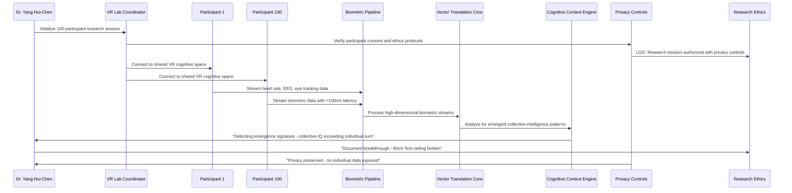

# Scenario: Murmuration Lab - Breaking the Birch Test Ceiling

**Date:** June 17, 2025  
**Complexity:** Extreme  
**Category:** Large-Scale VR Research Infrastructure

## Scenario Description

Dr. Yang Hui-Chen, cognitive neuroscientist at Stanford's Virtual Human Interaction Lab, is conducting breakthrough research into collective intelligence emergence using LogoMesh as the coordination platform for 100+ simultaneous VR participants. Her goal: Break the "Birch Test" ceiling - moving beyond individual AI assistance to detecting genuine emergent collective intelligence patterns that arise only when large groups think together in shared virtual cognitive spaces.

The research examines whether collective intelligence emerges from coordinated human-AI cognitive partnerships at scale, requiring real-time biometric processing, emergent pattern detection across high-dimensional cognitive spaces, and privacy-preserving analytics for sensitive research data.

## User Journey

### Step-by-Step Workflow
1. **Large-Scale VR Coordination**: 100+ participants enter shared VR cognitive space with LogoMesh providing real-time thought synchronization
2. **Real-Time Biometric Integration**: Process heart rate, EEG, eye tracking, and hand gesture data with <100ms latency across all participants  
3. **Emergent Pattern Detection**: AI systems analyze collective cognitive patterns for signs of group intelligence emergence
4. **Privacy-Preserving Analytics**: Maintain participant privacy while enabling breakthrough cognitive research
5. **Distributed Security Framework**: Ensure research ethics compliance and data protection at scale
6. **Collective Intelligence Measurement**: Quantify group cognitive capabilities that exceed individual participants
7. **Research Documentation**: Generate reproducible scientific artifacts from complex multi-participant sessions

### Expected Outcomes
- **Breakthrough Discovery**: Evidence of genuine collective intelligence emergence patterns
- **Scalable Research Platform**: Framework for large-scale cognitive research in VR environments
- **Privacy-Preserved Insights**: Scientific discoveries without compromising participant privacy
- **Reproducible Methods**: Automated generation of research documentation and replication protocols

## System Requirements Analysis

### Phase 2 Systems Involved
- [x] **Plugin System** - VR integration, biometric processing, participant coordination
- [x] **TaskEngine & CCE** - Real-time cognitive workload distribution and pattern analysis
- [x] **VTC (Vector Translation Core)** - High-dimensional pattern detection and emergence analysis
- [x] **Storage Layer** - Privacy-preserving data storage with research compliance
- [x] **Audit Trail System** - Research ethics protocol enforcement and scientific reproducibility
- [x] **Security & Transparency** - Distributed privacy controls and participant consent management
- [x] **LLM Infrastructure** - Collective intelligence analysis and pattern interpretation
- [x] **API & Backend** - Large-scale participant coordination and load balancing
- [x] **MeshGraphEngine** - Collective cognitive state representation and analysis

### Expected System Interactions

### Data Flow Requirements
- **Input:** 100+ VR participant streams, real-time biometric data, cognitive interaction patterns
- **Processing:** Emergent pattern detection, collective intelligence analysis, privacy-preserving computation
- **Output:** Scientific insights, reproducible research artifacts, anonymized collective intelligence metrics
- **Storage:** Privacy-compliant research data with ethics protocol enforcement

## Gap Analysis

### Discovered Gaps

**GAP-MURMURATION-001: Large-Scale VR Participant Coordination Missing**
- **Priority:** Critical
- **Systems Affected:** Plugin System, TaskEngine, EventBus, Storage Layer
- **Description:** No framework for managing 100+ simultaneous VR participants with real-time state synchronization
- **Missing:** Distributed participant registry, role-based coordination, graceful participant dropout handling

**GAP-MURMURATION-002: Real-Time Biometric Processing Infrastructure Missing**
- **Priority:** Critical
- **Systems Affected:** TaskEngine, Plugin System, VTC
- **Description:** No pipeline for processing real-time biometric streams from 100+ participants with <100ms latency
- **Missing:** Biometric data pipelines, real-time processing guarantees, participant privacy controls

**GAP-MURMURATION-003: Emergent Pattern Detection in High-Dimensional Spaces Missing**
- **Priority:** Critical
- **Systems Affected:** VTC, MeshGraphEngine, CCE
- **Description:** No capability to detect emergent cognitive patterns across 100+ simultaneous participants
- **Missing:** High-dimensional pattern analysis, emergence detection algorithms, collective intelligence metrics

**GAP-MURMURATION-004: Distributed Security & Privacy Framework Missing**
- **Priority:** Critical
- **Systems Affected:** Security & Transparency, Plugin System, Audit Trail
- **Description:** No privacy-preserving analytics for sensitive biometric and cognitive data at scale
- **Missing:** Differential privacy, encrypted computation, consent management at scale

**GAP-MURMURATION-005: Scalable Real-Time Rendering Coordination Missing**
- **Priority:** High
- **Systems Affected:** Canvas, Plugin System, TaskEngine
- **Description:** No coordination of real-time rendering across 100+ VR displays with synchronized updates
- **Missing:** Distributed rendering coordination, bandwidth adaptation, quality-of-service management

**GAP-MURMURATION-006: Intelligent Load Balancing for Cognitive Workloads Missing**
- **Priority:** High
- **Systems Affected:** TaskEngine, Plugin System, LLM Infrastructure
- **Description:** No workload distribution optimized for cognitive analysis patterns and hardware capabilities
- **Missing:** Cognitive workload analysis, hardware-aware scheduling, dynamic resource reallocation

**GAP-MURMURATION-007: Ethical Research Protocol Enforcement Missing**
- **Priority:** High
- **Systems Affected:** Audit Trail, Security & Transparency, Storage Layer
- **Description:** No automated enforcement of research ethics protocols with audit capabilities
- **Missing:** Ethics protocol validation, automated consent verification, research audit trails

## Validation Plan

### Test Scenarios
- [ ] **100+ Participant Coordination**: System manages large-scale VR coordination without degradation
- [ ] **Real-Time Biometric Processing**: <100ms latency maintained across all participant streams
- [ ] **Emergent Pattern Detection**: System identifies collective intelligence signatures
- [ ] **Privacy-Preserving Analytics**: Research insights generated without exposing individual data
- [ ] **Research Reproducibility**: Automated generation of scientific documentation

### Success Criteria
- [ ] 100+ participants coordinated simultaneously in VR
- [ ] <100ms biometric processing latency maintained
- [ ] Emergent collective intelligence patterns detected and quantified
- [ ] Complete privacy preservation with research utility
- [ ] Automated research artifact generation

### Failure Modes
- **Coordination Breakdown**: System cannot handle 100+ participant coordination
- **Latency Cascade**: Biometric processing latency exceeds real-time requirements
- **Privacy Breach**: Individual participant data exposed during analysis
- **Emergence Blindness**: System fails to detect genuine collective intelligence patterns

---

**Analysis Status:** COMPLETE  
**Next Actions:** Integrate gaps into comprehensive gap analysis and update priority matrix