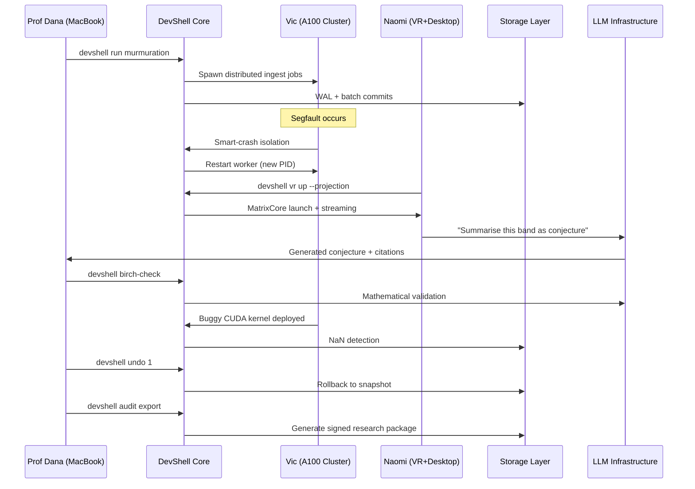

# Scenario 019: Murmuration Lab: Breaking the Birch-Test Ceiling

**Date:** 06.10.2025  
**Complexity:** Extreme  
**Category:** Performance Extremes/Integration Challenges

## Scenario Description

A three-person mathematics research team uses LogoMesh to replicate and surpass Yang-Hui He's "murmuration" discovery on a massive 12-million elliptic curve dataset. This scenario stress-tests Phase 2 infrastructure with extreme computational loads, multi-GPU coordination, VR visualization, and comprehensive audit trails for mathematical research validation.

## User Journey

### Research Team Setup
- **Prof Dana (Number Theorist):** MacBook Air M3 (battery-powered) with DevShell command palette
- **Vic (ML Engineer):** 2× A100 GPU node with CUDA monitoring and dataset ingestion tools  
- **Naomi (PhD Student):** Quest 3 VR + desktop RTX 4070 with spatial visualization capabilities

All devices share synchronized DevShell manifests and LogoMesh Core on a 64-core Linux host.

### Step-by-Step Research Workflow

#### Phase 1: Dataset Ingestion (Day 1, 09:00)
1. Dana initiates: `devshell run murmuration --dataset=/mnt/disks/curves.tar.zst`
2. DevShell automatically spawns distributed CurveIngestor jobs across Vic's A100 infrastructure
3. Security panel auto-flags "external dataset ingest" and encrypts processing hashes
4. Real-time progress monitoring across 12 million elliptic curve coefficient computations

#### Phase 2: Fault Tolerance Testing (Day 1, 13:10)
1. Corrupted tar chunk triggers segfault in worker process
2. Smart-Crash system isolates failing worker, restarts under new PID
3. Pipeline continues with only 0.04% data loss
4. DevShell logs incident for audit trail without global downtime

#### Phase 3: VR Pattern Discovery (Day 1, 18:45)
1. Naomi commands: `devshell vr up --projection="pc1,pc2"`
2. MatrixCore launches, streaming top two principal component projections
3. Hand-gesture lasso interaction reveals three dense oscillation bands
4. Discovery of rank-3 curve patterns previously unseen in mathematical literature

#### Phase 4: AI-Assisted Conjecture Generation (Day 1, 19:05)
1. Natural language VR command: "Summarise this band as a conjecture"
2. LLM-8B retrieves vector hits and drafts mathematical conjecture
3. Auto-generated conjecture with citations appears in DevShell buffer
4. Seamless transition from spatial intuition to formal mathematical language

#### Phase 5: Infrastructure Resilience (Day 2, 00:30)
1. Campus UPS test causes desktop GPU power loss
2. SmartViz automatically downgrades to web-only wireframe mode
3. Critical ingest pipeline remains unaffected
4. Graceful degradation maintains research continuity

#### Phase 6: Mathematical Validation (Day 2, 09:15)
1. Dana executes: `devshell birch-check --conjecture draft.md`
2. LLM checklist validates interpretation via PCA script
3. Security panel enables "chain-of-thought redact" for external sharing
4. Automated compliance checking for mathematical publication standards

#### Phase 7: Rollback Recovery (Day 2, 11:40)
1. Vic accidentally deploys buggy CUDA kernel affecting curves 7M-7.8M
2. NaN values detected in computation pipeline
3. `devshell undo 1` rolls back to snapshot #1425
4. Only 23 minutes of computational work lost

#### Phase 8: Research Export (Day 2, 18:00)
1. Command: `devshell audit export --range 48h --include vr`
2. Generates signed research package including:
   - Cryptographic hashes of all ingested data
   - GIF recordings of VR discovery sessions
   - Formal conjecture with mathematical citations
   - Reproducible Jupyter notebook (auto-generated)

## System Requirements Analysis

### Phase 2 Systems Involved
- [x] **VTC (Vector Translation Core)** - Mathematical vector processing and embedding generation
- [x] **MeshGraphEngine** - Graph representation of curve relationships and spatial indexing
- [x] **TaskEngine & CCE** - Distributed job coordination across A100 infrastructure
- [x] **Audit Trail System** - Cryptographic research validation and reproducibility
- [x] **DevShell Environment** - Command palette, security panel, smart-crash, rollback, VR integration
- [x] **TTS Plugin Framework** - Not applicable for this mathematical workflow
- [x] **Security & Transparency** - Chain-of-thought redaction and external sharing controls
- [x] **LLM Infrastructure** - Mathematical conjecture generation and Birch-test validation
- [x] **Storage Layer** - Massive dataset streaming with WAL + batch commits
- [x] **Plugin System** - Multi-language plugin coordination (Rust, PyTorch, Neo4j)
- [x] **API & Backend** - VR streaming and cross-device synchronization

### Expected System Interactions

## Gaps Identified

### GAP-095: Mathematical Plugin Runtime Coordination
**Use Case:** Murmuration Lab Research  
**Classification:** Integration | P0 | Cross-System  
**Systems Affected:** Plugin System, TaskEngine, Storage Layer

**Problem Description:** Multi-language mathematical plugins (Rust curve processing, PyTorch ML, Neo4j graph indexing) require sophisticated coordination for massive dataset processing with fault tolerance.

**Current Phase 2 State:** Basic plugin system lacks mathematical computation coordination frameworks and GPU resource arbitration.

**Required Solution:** 
- Mathematical plugin runtime with GPU memory management
- Cross-language error propagation and recovery
- Computational pipeline checkpointing and rollback
- Multi-GPU load balancing across heterogeneous hardware

**Phase 3 Impact:** Mathematical research workflows impossible without robust computational coordination.

**Proposed Resolution:**
- [ ] Implement mathematical plugin coordination framework
- [ ] Add GPU resource arbitration system
- [ ] Create computational checkpoint/rollback mechanisms
- [ ] Build cross-language error handling protocols

**Status:** OPEN

### GAP-096: VR Spatial Mathematical Visualization
**Use Case:** Murmuration Lab Research  
**Classification:** Feature | P1 | VR Integration  
**Systems Affected:** DevShell Environment, MeshGraphEngine, API & Backend

**Problem Description:** VR visualization of high-dimensional mathematical spaces requires real-time streaming of complex graph projections with gesture-based interaction for mathematical discovery.

**Current Phase 2 State:** No VR integration framework or spatial mathematical visualization capabilities.

**Required Solution:**
- VR-native mathematical visualization engine
- Real-time graph projection streaming
- Gesture-based mathematical object manipulation
- Seamless VR-to-DevShell command integration

**Phase 3 Impact:** Advanced mathematical research workflows severely limited without spatial visualization.

**Proposed Resolution:**
- [ ] Develop VR mathematical visualization framework
- [ ] Implement real-time graph streaming protocols
- [ ] Create gesture recognition for mathematical objects
- [ ] Build VR-DevShell integration layer

**Status:** OPEN

### GAP-097: Mathematical Audit Trail Cryptographic Validation
**Use Case:** Murmuration Lab Research  
**Classification:** Security | P0 | Research Integrity  
**Systems Affected:** Audit Trail System, Security & Transparency, Storage Layer

**Problem Description:** Mathematical research requires cryptographic validation of computational processes, dataset integrity, and reproducible research packages for academic publication.

**Current Phase 2 State:** Basic audit trails lack cryptographic signatures and mathematical research validation frameworks.

**Required Solution:**
- Cryptographic signing of computational pipelines
- Dataset integrity verification with hash chains
- Reproducible research package generation
- Academic compliance and publication-ready exports

**Phase 3 Impact:** Mathematical research cannot meet academic standards without cryptographic validation.

**Proposed Resolution:**
- [ ] Implement cryptographic audit trail signing
- [ ] Add dataset integrity verification
- [ ] Create reproducible research package framework
- [ ] Build academic compliance export tools

**Status:** OPEN

### GAP-098: DevShell Mathematical Command Intelligence
**Use Case:** Murmuration Lab Research  
**Classification:** UX | P1 | Domain Expertise  
**Systems Affected:** DevShell Environment, LLM Infrastructure, TaskEngine

**Problem Description:** Mathematical research requires domain-specific DevShell commands that understand mathematical concepts, computational constraints, and research workflows.

**Current Phase 2 State:** Generic DevShell lacks mathematical domain knowledge and specialized computational commands.

**Required Solution:**
- Mathematical domain-specific language in DevShell
- Intelligent command expansion for research workflows
- Mathematical validation and testing frameworks
- Research-specific rollback and checkpoint commands

**Phase 3 Impact:** Mathematical researchers cannot efficiently use LogoMesh without domain-specific tooling.

**Proposed Resolution:**
- [ ] Develop mathematical DSL for DevShell
- [ ] Implement intelligent mathematical command expansion
- [ ] Create mathematical validation frameworks
- [ ] Build research-specific DevShell commands

**Status:** OPEN

### GAP-099: Massive Dataset Streaming with Fault Tolerance
**Use Case:** Murmuration Lab Research  
**Classification:** Performance | P0 | Scale  
**Systems Affected:** Storage Layer, Plugin System, TaskEngine

**Problem Description:** Processing 12-million record datasets requires sophisticated streaming, chunking, fault tolerance, and recovery mechanisms that maintain computational integrity.

**Current Phase 2 State:** Storage layer lacks massive dataset streaming capabilities and robust fault tolerance for computational workflows.

**Required Solution:**
- Streaming dataset processing with memory constraints
- Intelligent chunking and worker failure recovery
- Computational state preservation during failures
- Zero-loss recovery from corrupted data sources

**Phase 3 Impact:** Large-scale research impossible without robust dataset processing.

**Proposed Resolution:**
- [ ] Implement streaming dataset processing framework
- [ ] Add intelligent fault tolerance and recovery
- [ ] Create computational state preservation
- [ ] Build zero-loss data recovery mechanisms

**Status:** OPEN

## Validation Plan

### Test Scenarios
- [ ] **Massive Dataset Stress Test:** Process 12M+ records with intentional worker failures
- [ ] **Multi-GPU Coordination:** Validate load balancing across heterogeneous GPU infrastructure
- [ ] **VR Mathematical Visualization:** Test real-time streaming of complex mathematical projections
- [ ] **Cryptographic Audit Validation:** Verify mathematical research package integrity
- [ ] **DevShell Mathematical Intelligence:** Test domain-specific command understanding

### Success Criteria
- [ ] Process 12M elliptic curves without data loss during worker failures
- [ ] VR visualization maintains 90+ FPS during mathematical exploration
- [ ] Cryptographic audit trails pass academic integrity verification
- [ ] DevShell understands mathematical concepts and workflows
- [ ] Research packages meet reproducibility standards

### Failure Modes
- Dataset corruption during massive parallel processing
- GPU resource conflicts causing mathematical computation errors
- VR visualization lag preventing mathematical discovery
- Audit trail gaps compromising research integrity
- DevShell command misinterpretation causing workflow failures

## Implementation Notes

### Jargon Translation
- **"CurveIngestor-Rust"** → Mathematical data processing plugin with Rust performance optimizations
- **"MurmurSeeker-PyTorch"** → Machine learning plugin for pattern discovery in mathematical datasets
- **"Birch-test"** → Mathematical validation framework for number theory conjectures
- **"MatrixCore"** → GPU resource allocation system for VR mathematical visualization

### Architecture Assumptions
- Assumes mature multi-GPU coordination framework
- Requires sophisticated mathematical domain knowledge integration
- Needs advanced VR mathematical visualization capabilities
- Assumes cryptographic research validation frameworks

This scenario represents LogoMesh's evolution into a serious mathematical research platform capable of supporting cutting-edge computational mathematics and facilitating mathematical discovery through advanced visualization and AI assistance.
