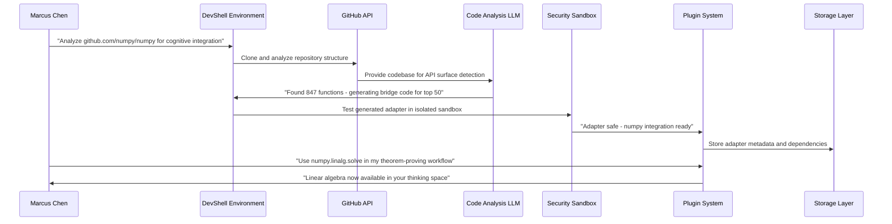

# Scenario: GitHub Plugin Autopilot - Universal Cognitive Adaptation Platform

**Date:** June 17, 2025  
**Complexity:** Extreme  
**Category:** Cognitive Platform Evolution

## Scenario Description

Marcus Chen, a cognitive sovereignty advocate and open-source developer, discovers that LogoMesh can automatically analyze any GitHub repository and generate plugins that integrate external tools into his thinking workflows. His goal: Transform LogoMesh from a "thinking tool" into a "universal cognitive adaptation platform" that can absorb and integrate any digital tool or library, regardless of its original design intent.

Marcus wants to demonstrate that cognitive freedom requires the ability to adapt ANY existing tool for thought augmentation - from scientific computing libraries to creative art tools to financial analysis packages - all without asking permission from the original developers.

## User Journey

### Step-by-Step Workflow
1. **Repository Discovery**: Marcus points LogoMesh at popular GitHub repos (numpy, react, tensorflow, blender-api)
2. **Automatic Analysis**: System analyzes repo structure, API surfaces, dependencies, and usage patterns
3. **Bridge Code Generation**: AI generates adapter code to connect external libraries to LogoMesh plugin interface
4. **Security Sandbox Testing**: System safely tests generated adapters in isolated environments
5. **Plugin Lifecycle Management**: Automatic dependency resolution, version compatibility, hot-reload support
6. **Cognitive Integration**: External tools become available as thinking aids within LogoMesh workflows
7. **Community Sharing**: Successfully adapted plugins shared with other cognitive sovereignty advocates

### Expected Outcomes
- **Universal Tool Integration**: Any GitHub library becomes a cognitive tool
- **Cognitive Platform Evolution**: LogoMesh transforms from app to cognitive operating system
- **Sovereignty Through Adaptation**: Freedom from vendor lock-in through unlimited tool integration
- **Community-Driven Expansion**: Crowdsourced cognitive tool ecosystem

## System Requirements Analysis

### Phase 2 Systems Involved
- [x] **Plugin System** - Universal adapter framework and lifecycle management
- [x] **Security & Transparency** - Safe execution of untrusted external code
- [x] **LLM Infrastructure** - Code analysis and bridge generation
- [x] **DevShell Environment** - Development workflow integration
- [x] **Storage Layer** - Plugin metadata and dependency management
- [x] **TaskEngine & CCE** - External library coordination and cognitive integration
- [x] **API & Backend** - GitHub integration and package management
- [x] **VTC** - Semantic understanding of external tool capabilities
- [x] **Audit Trail System** - Plugin adaptation audit and version tracking

### Expected System Interactions

### Data Flow Requirements
- **Input:** GitHub repository URLs, code analysis results, dependency graphs
- **Processing:** Code analysis, bridge generation, security validation, cognitive integration
- **Output:** Working plugins, cognitive tool availability, adaptation success metrics
- **Storage:** Plugin adapters, dependency metadata, security validation results

## Gap Analysis

### Discovered Gaps

**GAP-GITHUB-001: GitHub Repository Analysis Engine Missing**
- **Priority:** Critical
- **Systems Affected:** Plugin System, Security & Transparency, DevShell
- **Description:** No automated framework for cloning, parsing, and understanding arbitrary GitHub projects
- **Missing:** Repository analysis, API surface detection, dependency resolution, license compliance

**GAP-GITHUB-002: Universal Code Adapter Framework Missing**
- **Priority:** Critical
- **Systems Affected:** Plugin System, LLM Infrastructure, CCE
- **Description:** No automatic bridge code generation between external libraries and LogoMesh plugin interface
- **Missing:** Code generation, data transformation pipelines, interface harmonization, configuration management

**GAP-GITHUB-003: Security Sandbox System for Untrusted Code Missing**
- **Priority:** Critical
- **Systems Affected:** Security & Transparency, Plugin System, TaskEngine
- **Description:** No secure isolated environment for running and testing untrusted external code
- **Missing:** Code isolation, resource monitoring, network restrictions, file system protection

**GAP-GITHUB-004: Plugin Lifecycle Automation Missing**
- **Priority:** High
- **Systems Affected:** Plugin System, Storage Layer, DevShell
- **Description:** No automated dependency management, version compatibility, and plugin manifest generation
- **Missing:** Dependency management, version conflicts, plugin metadata generation, hot reload support

**GAP-GITHUB-005: Compatibility Assessment Framework Missing**
- **Priority:** High
- **Systems Affected:** Plugin System, VTC, LLM Infrastructure
- **Description:** No automated analysis of external library compatibility with LogoMesh data structures and workflows
- **Missing:** Compatibility scanning, data format mapping, API pattern analysis, security assessment

**GAP-GITHUB-006: Multi-Ecosystem Package Management Missing**
- **Priority:** High
- **Systems Affected:** Plugin System, TaskEngine, Storage Layer
- **Description:** No support for npm, Python, Ruby, Go modules with unified dependency resolution
- **Missing:** Multi-language package managers, dependency conflict resolution, unified installation

## Validation Plan

### Test Scenarios
- [ ] **Repository Analysis**: Successfully analyze diverse GitHub repositories
- [ ] **Bridge Code Generation**: Generate working adapters for external libraries
- [ ] **Security Isolation**: Safely execute untrusted code without system compromise
- [ ] **Cognitive Integration**: External tools become useful thinking aids
- [ ] **Community Adoption**: Other users successfully use generated adapters

### Success Criteria
- [ ] Successful adaptation of 10+ diverse GitHub repositories
- [ ] Generated plugins pass security validation
- [ ] External tools integrated into cognitive workflows
- [ ] Zero security incidents from untrusted code
- [ ] Community adoption of adaptation framework

### Failure Modes
- **Security Breach**: Untrusted code compromises system security
- **Integration Failure**: Generated adapters don't work reliably
- **Cognitive Disconnect**: External tools don't enhance thinking workflows
- **Dependency Hell**: Package management conflicts break system

---

**Analysis Status:** COMPLETE  
**Next Actions:** Continue with remaining scenarios and gap integration
