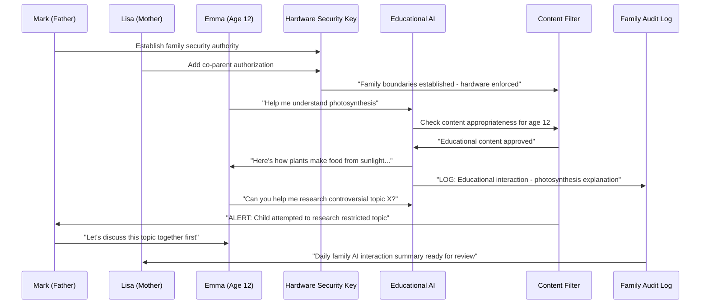

# Scenario: Homeschool Guardian Security Keys - Family-Safe AI Education

**Date:** June 17, 2025
**Complexity:** Critical Family Security Infrastructure
**Category:** Educational AI Safety

## Scenario Description

The Johnson family (parents Mark and Lisa, children ages 8, 12, and 16) implements LogoMesh as their homeschool cognitive platform with hardware-enforced safety boundaries that cannot be bypassed by tech-savvy children. Lisa, a former cybersecurity analyst, designs a family-centered AI education system where parents maintain cryptographic authority over AI interactions while children gain cognitive assistance appropriate to their developmental stage.

The system must balance educational empowerment with absolute safety - enabling children to explore AI-assisted learning while ensuring all AI decisions remain transparent to parents and aligned with family values.

## User Journey

### Step-by-Step Workflow
1. **Family Security Setup**: Hardware security keys establish multi-parent authorization for AI boundaries
2. **Child-Safe AI Filtering**: Hardware-enforced content filtering that cannot be circumvented
3. **Educational Privacy Controls**: COPPA/FERPA compliance with homeschool record-keeping requirements
4. **Transparent AI Decisions**: Child-appropriate explanations of how AI made educational recommendations
5. **Multi-Device Family Coordination**: Secure sync between parent oversight devices and child learning devices
6. **Emergency Override Authority**: Parents can instantly halt any AI interaction across all family devices
7. **Educational Progress Tracking**: AI-assisted learning analytics with complete parental visibility

### Expected Outcomes
- **Child Safety Assurance**: Hardware-enforced boundaries that cannot be bypassed
- **Educational Empowerment**: Age-appropriate AI assistance for all children
- **Family Value Alignment**: AI decisions respect family educational philosophy
- **Complete Parental Oversight**: Full transparency and control over children's AI interactions

## System Requirements Analysis

### Phase 2 Systems Involved
- [x] **Security & Transparency** - Multi-stakeholder family authorization and hardware security integration
- [x] **Plugin System** - Educational content filtering and age-appropriate AI assistance
- [x] **LLM Infrastructure** - Child-safe AI reasoning with transparent decision explanations
- [x] **Audit Trail System** - Educational privacy compliance and family learning analytics
- [x] **Storage Layer** - Secure family data with COPPA/FERPA compliance
- [x] **TaskEngine & CCE** - Multi-device family coordination and role-based access
- [x] **API & Backend** - Hardware security key integration and authentication
- [x] **DevShell Environment** - Family-safe development and customization tools

### Expected System Interactions

### Data Flow Requirements
- **Input:** Family member interactions, educational requests, security authorizations
- **Processing:** Content filtering, age-appropriate responses, family coordination
- **Output:** Educational assistance, safety alerts, family learning analytics
- **Storage:** Privacy-compliant family data with educational record-keeping

## Gap Analysis

### Discovered Gaps

**GAP-FAMILY-001: Multi-Stakeholder Authorization Framework Missing**
- **Priority:** Critical
- **Systems Affected:** Security Framework, Plugin System, Audit Trail, TaskEngine
- **Description:** No framework for multiple family members to collaboratively set boundaries and authorize system access
- **Missing:** Collaborative permission setting, multi-signature authorization, family role management, graduated permissions

**GAP-FAMILY-002: Cryptographic Child Safety Enforcement Missing**
- **Priority:** Critical
- **Systems Affected:** Security Framework, Plugin System, LLM Infrastructure, Content Filtering
- **Description:** No hardware-enforced content filtering and safety boundaries that cannot be bypassed by tech-savvy children
- **Missing:** Hardware security modules, tamper-resistant filtering, cryptographic safety enforcement, bypass detection

**GAP-FAMILY-003: Educational Privacy and COPPA Compliance Missing**
- **Priority:** Critical
- **Systems Affected:** Audit Trail, Storage Layer, Security Framework, Plugin System
- **Description:** No educational data privacy controls meeting COPPA, FERPA, and homeschool record-keeping requirements
- **Missing:** Educational data classification, privacy controls, parental access rights, compliant data retention

**GAP-FAMILY-004: Transparent AI Decision Auditing for Children Missing**
- **Priority:** High
- **Systems Affected:** Audit Trail, LLM Infrastructure, CCE, Security Framework
- **Description:** No child-appropriate transparency showing how AI made educational or content decisions
- **Missing:** Child-friendly decision explanations, parental AI audit access, educational reasoning transparency

**GAP-FAMILY-005: Multi-Device Family Coordination Missing**
- **Priority:** High
- **Systems Affected:** Security Framework, EventBus, Storage Layer, Plugin System
- **Description:** No secure coordination between parent devices, child devices, and shared family systems
- **Missing:** Device role management, secure family networks, cross-device authorization, family state sync

**GAP-FAMILY-006: Hardware Security Key Integration Missing**
- **Priority:** Critical
- **Systems Affected:** Security Framework, Authentication, Plugin System
- **Description:** No integration with hardware security keys for tamper-resistant family authentication and authorization
- **Missing:** FIDO2/WebAuthn integration, hardware key management, secure enrollment, tamper detection

## Validation Plan

### Test Scenarios
- [ ] **Hardware Safety Enforcement**: Children cannot bypass content filtering or safety boundaries
- [ ] **Multi-Parent Authorization**: Both parents required for sensitive permission changes
- [ ] **Educational Privacy Compliance**: COPPA/FERPA requirements met with audit verification
- [ ] **Age-Appropriate AI Assistance**: AI provides developmentally appropriate educational support
- [ ] **Family Emergency Override**: Parents can instantly halt AI interactions across all devices

### Success Criteria
- [ ] Zero successful bypass attempts of safety boundaries
- [ ] 100% multi-parent authorization for sensitive changes
- [ ] Complete COPPA/FERPA compliance verification
- [ ] Age-appropriate content filtering accuracy >99%
- [ ] Emergency override response time <100ms

### Failure Modes
- **Safety Bypass**: Child circumvents hardware-enforced boundaries
- **Privacy Violation**: Educational data exposed without parental consent
- **Authorization Failure**: Single parent can modify family-wide safety settings
- **Age-Inappropriate Content**: AI provides content unsuitable for child's development
- **Emergency Override Failure**: Parents cannot stop AI interaction when needed

---

**Analysis Status:** COMPLETE
**Next Actions:** Update gap analysis with family security framework requirements