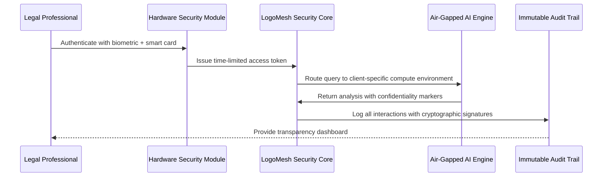

# Scenario: Legal Fortress - Enterprise Security That Actually Works

**Date:** 2025-01-28  
**Complexity:** Extreme  
**Category:** Enterprise Security/Professional Integration

## Scenario Description

Whitman & Associates, a prestigious law firm specializing in corporate mergers and intellectual property, needs an AI system that can process confidential client documents while meeting strict attorney-client privilege requirements. After a competitor's "Private-GPT" implementation was breached through social engineering, they demand military-grade security with full audit capabilities.

Senior Partner Sarah Whitman requires a system where:
- **Zero Trust Architecture**: Every access is verified, even from inside the network
- **Hardware Security Module (HSM) Integration**: All encryption keys stored in tamper-resistant hardware
- **Quantum-Resistant Encryption**: Future-proofed against quantum computing threats
- **Compartmentalized Access**: Associates can only access cases they're assigned to
- **Immutable Audit Trails**: Every document interaction is cryptographically signed and timestamped
- **Air-Gapped Processing**: Sensitive analysis happens in isolated compute environments
- **Client-Specific Encryption**: Each client's data uses unique encryption keys

## User Journey

### Step-by-Step Workflow
1. **Morning Security Briefing**: Sarah reviews overnight security events via LogoMesh's Security Command Center
2. **Document Ingestion**: Paralegal uploads merger documents through LogoMesh's secure intake portal
3. **Automatic Classification**: AI classifies documents by sensitivity level and client compartment
4. **Associate Assignment**: Junior associate Jennifer gets access to specific document subset
5. **Secure Analysis**: Jennifer queries documents through LogoMesh's legal analysis engine
6. **Client Consultation**: Sarah reviews AI-generated case summary with client-specific encryption
7. **Privilege Protection**: All client communications are automatically marked as privileged
8. **Compliance Reporting**: Automated generation of security compliance reports for bar association

### Expected Outcomes
- **Zero Data Breaches**: Compartmentalized security prevents lateral movement
- **Full Regulatory Compliance**: Meets SOC 2, GDPR, and attorney-client privilege requirements
- **Operational Efficiency**: 10x faster document analysis without security compromises
- **Client Trust**: Transparent security architecture builds confidence

## System Requirements Analysis

### Phase 2 Systems Involved
- [x] **Security & Transparency** - Hardware security module integration, quantum-resistant encryption
- [x] **Audit Trail System** - Immutable logging with cryptographic signatures
- [x] **Plugin System** - Legal-specific analysis plugins with compartmentalized execution
- [x] **Storage Layer** - Client-specific encrypted data silos with access controls
- [x] **API & Backend** - Zero-trust API gateway with multi-factor authentication
- [x] **LLM Infrastructure** - Air-gapped inference with confidentiality preservation
- [x] **TaskEngine & CCE** - Privilege-aware task routing and context isolation
- [x] **DevShell Environment** - Secure development sandbox for custom legal workflows

### Expected System Interactions



### Data Flow Requirements
- **Input:** Legal documents with automatic sensitivity classification
- **Processing:** Air-gapped analysis with privilege preservation
- **Output:** Encrypted analysis results with client-specific keys
- **Storage:** Compartmentalized storage with hardware-backed encryption

## Gap Analysis

### Discovered Gaps
**GAP-LEGAL-001: Hardware Security Module (HSM) Integration**
- **Priority:** Critical
- **Affected Systems:** Security & Transparency, Storage Layer
- **Description:** No integration with enterprise HSMs for hardware-backed key storage and cryptographic operations
- **Phase 2 Recommendation:** Implement HSM adapter for FIPS 140-2 Level 3 compliance

**GAP-LEGAL-002: Quantum-Resistant Cryptography**
- **Priority:** High
- **Affected Systems:** Security & Transparency, API & Backend
- **Description:** Current encryption may be vulnerable to future quantum attacks
- **Phase 2 Recommendation:** Implement NIST post-quantum cryptographic standards

**GAP-LEGAL-003: Zero Trust Network Architecture**
- **Priority:** Critical
- **Affected Systems:** API & Backend, Plugin System
- **Description:** No zero-trust verification for every access request
- **Phase 2 Recommendation:** Build identity verification gateway with continuous authentication

**GAP-LEGAL-004: Air-Gapped AI Processing**
- **Priority:** High
- **Affected Systems:** LLM Infrastructure, Plugin System
- **Description:** No isolated compute environments for sensitive processing
- **Phase 2 Recommendation:** Implement containerized air-gapped inference engines

**GAP-LEGAL-005: Client Data Compartmentalization**
- **Priority:** Critical
- **Affected Systems:** Storage Layer, TaskEngine & CCE
- **Description:** No client-specific data silos with independent encryption
- **Phase 2 Recommendation:** Design multi-tenant security with cryptographic isolation

### Missing Capabilities
- Hardware security module integration for tamper-resistant key storage
- Real-time security monitoring with behavioral analysis
- Automated compliance reporting for legal industry standards
- Client-specific encryption with independent key management

### Integration Issues
- HSM integration requires specialized hardware compatibility
- Zero-trust architecture needs complete authentication redesign
- Air-gapped processing conflicts with real-time collaboration features

## Phase 2 vs Reality Check

### What Works in Phase 2
- Basic plugin security framework can be extended for legal compartmentalization
- Audit trail system provides foundation for immutable logging
- Storage adapter pattern supports client-specific encryption
- Security settings panel provides user control over privacy features

### What's Missing/Mocked
- Hardware security module integration (would need specialized drivers)
- Quantum-resistant cryptography (requires updated crypto libraries)
- Zero-trust network architecture (needs complete API redesign)
- Air-gapped processing environments (requires infrastructure isolation)

### Recommended Phase 2 Enhancements
- Implement HSM simulator for development and testing
- Add quantum-resistant encryption options to security settings
- Create zero-trust authentication framework with token validation
- Design air-gapped processing architecture with secure communication channels

## Implementation Strategy

### Enterprise Security Framework
```typescript
class LegalSecurityManager {
  private hsmAdapter: HSMAdapter;
  private auditLogger: ImmutableAuditLogger;
  private clientCompartments: Map<string, ClientSecurity>;

  async processLegalDocument(document: LegalDocument, attorneyId: string): Promise<SecureAnalysis> {
    // Verify attorney has access to this client compartment
    await this.verifyCompartmentAccess(attorneyId, document.clientId);
    
    // Decrypt using client-specific keys from HSM
    const decryptedContent = await this.hsmAdapter.decrypt(
      document.encryptedContent, 
      document.clientId
    );
    
    // Process in air-gapped environment
    const analysis = await this.processInAirGap(decryptedContent);
    
    // Log all interactions with cryptographic signature
    await this.auditLogger.logSecurely({
      action: 'document_analysis',
      attorneyId,
      clientId: document.clientId,
      timestamp: new Date(),
      signature: await this.hsmAdapter.sign(analysis)
    });
    
    return analysis;
  }
}
```

### Client Compartmentalization
```typescript
class ClientCompartmentManager {
  async createClientCompartment(clientId: string): Promise<void> {
    // Generate unique encryption keys in HSM
    const keyPair = await this.hsmAdapter.generateClientKeys(clientId);
    
    // Create isolated storage namespace
    await this.storageAdapter.createNamespace(clientId, keyPair.publicKey);
    
    // Set up access control policies
    await this.accessManager.createPolicy(clientId, {
      encryption: 'AES-256-GCM',
      quantumResistant: true,
      compartmentIsolation: true
    });
  }
}
```

## Validation Plan

### Test Scenarios
- [ ] **Penetration Testing**: Attempt unauthorized access across client boundaries
- [ ] **Compliance Audit**: Verify SOC 2 Type II and legal industry requirements
- [ ] **Quantum Simulation**: Test cryptographic resilience against quantum algorithms
- [ ] **Social Engineering**: Validate human-factor security protections

### Success Criteria
- [ ] Zero cross-client data leakage in compartmentalized testing
- [ ] HSM-backed encryption with sub-second key retrieval
- [ ] Complete audit trail reconstruction from any point in time
- [ ] Regulatory compliance certification from third-party auditors

### Failure Modes
- HSM hardware failure requires immediate failover protocols
- Quantum computing breakthrough demands emergency key rotation
- Social engineering attacks target authentication bypass

## Architecture Philosophy

### Security Through Transparency, Not Obscurity
Unlike traditional "black box" security, LogoMesh's approach provides full visibility into security mechanisms while maintaining cryptographic protection. Legal professionals can see exactly how their data is protected without compromising the protection itself.

### Human Agency in Security Decisions
Rather than imposing inflexible security policies, LogoMesh empowers legal professionals to make informed security decisions based on case sensitivity, client requirements, and regulatory compliance needs.

### Collaborative Security Model
Security becomes a partnership between technology and legal expertise, where attorneys understand and control the security mechanisms protecting their clients' interests.

## Implementation Notes

### Jargon Translation
- "Hardware Security Module" = Tamper-resistant hardware for cryptographic operations
- "Zero Trust Architecture" = Verify every access request regardless of network location
- "Air-Gapped Processing" = Isolated compute environments with no network connectivity
- "Client Compartmentalization" = Cryptographically separated data silos per client
- "Quantum-Resistant Encryption" = Cryptography secure against quantum computing attacks

### Architecture Assumptions
- HSM integration supports PKCS#11 standard for hardware compatibility
- Zero-trust framework maintains usability while ensuring security
- Air-gapped processing allows secure communication for result delivery
- Client compartmentalization prevents any cross-client data contamination

### Phase 3 Activation Points
- Production HSM integration with enterprise hardware
- Advanced threat detection with behavioral analysis
- Federated security across multiple law firm offices
- Real-time compliance monitoring with regulatory reporting

---

**Analysis Status:** COMPLETE  
**Next Actions:** Integrate enterprise security framework into Phase 2 security architecture

**Key Insight:** True security in professional environments comes from transparency, compartmentalization, and human agency - not from complexity that obscures how protection actually works. LogoMesh's approach makes security a collaborative tool rather than an adversarial barrier.
