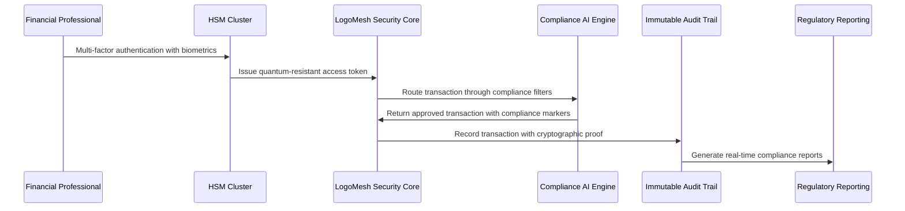

# Scenario: Financial Services Security Bastion - Maximum Enterprise Security

**Date:** 2025-01-28  
**Complexity:** Extreme  
**Category:** Enterprise Security/Financial Services Compliance

## Scenario Description

Fortress Financial Group, a Tier 1 investment bank managing $2.8 trillion in assets, requires an AI system that meets the most stringent financial regulatory requirements. After a competitor suffered a $500M fine for inadequate data protection during a SOX audit, Fortress demands military-grade security with real-time compliance monitoring and automated regulatory reporting.

Chief Risk Officer Dr. Amanda Chen requires a system where:
- **Hardware Security Module (HSM) Cluster**: All cryptographic operations in FIPS 140-2 Level 4 hardware
- **Multi-Level Security Clearances**: Compartmentalized access with need-to-know enforcement
- **Real-Time Transaction Monitoring**: AI-powered fraud detection with <50ms response times
- **Immutable Audit Trails**: Blockchain-based transaction logs with legal non-repudiation
- **Quantum-Resistant Cryptography**: NIST post-quantum standards for future-proofing
- **Air-Gapped Trading Floor**: Physically isolated networks for high-frequency trading
- **Automated Compliance Reporting**: Real-time SOX, FINRA, and Basel III compliance

## User Journey

### Step-by-Step Workflow
1. **Pre-Market Security Briefing**: Dr. Chen reviews overnight security events and threat intelligence
2. **Trader Onboarding**: New quantitative analyst requires multi-factor authentication with biometric verification
3. **Model Deployment**: AI trading algorithm undergoes security audit before production deployment
4. **Transaction Processing**: High-frequency trades processed through air-gapped systems with real-time monitoring
5. **Compliance Monitoring**: Automated detection of potential insider trading patterns
6. **Regulatory Reporting**: End-of-day generation of SOX compliance reports with cryptographic signatures
7. **Incident Response**: Automated containment of suspicious activity with forensic evidence preservation
8. **Audit Trail Verification**: Third-party auditors verify complete transaction history integrity

### Expected Outcomes
- **Zero Regulatory Violations**: Proactive compliance prevents all potential violations
- **Sub-Second Threat Response**: Automated systems respond faster than manual attacks
- **Perfect Audit Trail**: Complete reconstruction of any financial decision or transaction
- **Quantum-Resistant Security**: Protection against future quantum computing threats

## System Requirements Analysis

### Phase 2 Systems Involved
- [x] **Security & Transparency** - HSM cluster integration, quantum-resistant encryption, multi-level clearances
- [x] **Audit Trail System** - Blockchain-based immutable logging with legal non-repudiation
- [x] **Plugin System** - Security-audited financial plugins with code signing verification
- [x] **Storage Layer** - Compartmentalized encrypted storage with transaction-level integrity
- [x] **API & Backend** - Zero-trust API gateway with real-time threat detection
- [x] **LLM Infrastructure** - Air-gapped inference with financial regulatory compliance
- [x] **TaskEngine & CCE** - Compliance-aware task routing with regulatory boundary enforcement
- [x] **DevShell Environment** - Secure development sandbox for financial algorithm testing

### Expected System Interactions



### Data Flow Requirements
- **Input:** Financial transactions with automatic compliance classification
- **Processing:** Air-gapped analysis with regulatory compliance verification
- **Output:** Encrypted transaction results with audit trail integration
- **Storage:** Multi-level encrypted storage with regulatory retention policies

## Gap Analysis

### Discovered Gaps

**GAP-FINANCIAL-001: Hardware Security Module (HSM) Cluster Architecture**
- **Priority:** Critical
- **Affected Systems:** Security & Transparency, Storage Layer, API Backend
- **Description:** No support for enterprise HSM clusters with high availability and load balancing
- **Missing:** HSM failover, load distribution, key ceremony protocols, hardware attestation
- **Phase 2 Recommendation:** Implement HSM cluster management with automatic failover

**GAP-FINANCIAL-002: Multi-Level Security Clearance Framework**
- **Priority:** Critical
- **Affected Systems:** Security & Transparency, Plugin System, TaskEngine
- **Description:** No support for compartmentalized security clearances with need-to-know enforcement
- **Missing:** Clearance level validation, compartment isolation, cross-level data flow controls
- **Phase 2 Recommendation:** Design security clearance engine with cryptographic enforcement

**GAP-FINANCIAL-003: Real-Time Financial Transaction Monitoring**
- **Priority:** Critical
- **Affected Systems:** LLM Infrastructure, API Backend, Audit Trail
- **Description:** No real-time transaction analysis with fraud detection and compliance verification
- **Missing:** Pattern recognition, anomaly detection, regulatory rule engine, real-time alerts
- **Phase 2 Recommendation:** Implement financial AI monitoring with <50ms response guarantees

**GAP-FINANCIAL-004: Blockchain-Based Immutable Audit Trails**
- **Priority:** High
- **Affected Systems:** Audit Trail System, Storage Layer
- **Description:** No blockchain integration for tamper-proof audit logs with legal non-repudiation
- **Missing:** Blockchain consensus, cryptographic integrity, legal timestamping, evidence preservation
- **Phase 2 Recommendation:** Build blockchain audit infrastructure with legal compliance

**GAP-FINANCIAL-005: Automated Regulatory Reporting Engine**
- **Priority:** High
- **Affected Systems:** API Backend, Plugin System, Audit Trail
- **Description:** No automated generation of SOX, FINRA, Basel III, and other regulatory reports
- **Missing:** Regulatory rule engine, report templates, compliance metrics, automated filing
- **Phase 2 Recommendation:** Create regulatory reporting framework with automated compliance

**GAP-FINANCIAL-006: Quantum-Resistant Cryptographic Infrastructure**
- **Priority:** High
- **Affected Systems:** Security & Transparency, Storage Layer, API Backend
- **Description:** No implementation of NIST post-quantum cryptographic standards
- **Missing:** Post-quantum algorithms, key exchange protocols, migration strategy, compatibility
- **Phase 2 Recommendation:** Implement quantum-resistant crypto with hybrid classical/post-quantum approach

**GAP-FINANCIAL-007: Air-Gapped Network Architecture**
- **Priority:** Critical
- **Affected Systems:** All Systems, Network Infrastructure
- **Description:** No support for physically isolated networks with secure data transfer protocols
- **Missing:** Network isolation, secure data diodes, cross-domain solutions, integrity verification
- **Phase 2 Recommendation:** Design air-gapped architecture with secure communication channels

**GAP-FINANCIAL-008: Financial AI Model Security Auditing**
- **Priority:** High
- **Affected Systems:** LLM Infrastructure, Plugin System, DevShell
- **Description:** No security auditing framework for AI models used in financial decision-making
- **Missing:** Model validation, bias detection, explainability requirements, regulatory approval
- **Phase 2 Recommendation:** Build AI model security framework with regulatory compliance

### Missing Enterprise Security Capabilities
- Enterprise HSM cluster management with high availability
- Multi-level security clearance enforcement with compartmentalization
- Real-time financial transaction monitoring with fraud detection
- Blockchain-based audit trails with legal non-repudiation
- Automated regulatory reporting for multiple financial regulations
- Quantum-resistant cryptography implementation
- Air-gapped network architecture for critical operations
- Financial AI model security auditing and validation

## Implementation Strategy

### Financial Security Architecture
```typescript
class FinancialSecurityManager {
  private hsmCluster: HSMClusterManager;
  private clearanceEngine: SecurityClearanceEngine;
  private transactionMonitor: FinancialTransactionMonitor;
  private auditBlockchain: BlockchainAuditTrail;
  private regulatoryReporter: RegulatoryReportingEngine;

  async processFinancialTransaction(
    transaction: FinancialTransaction, 
    traderId: string
  ): Promise<SecureTransactionResult> {
    // Verify trader clearance for transaction type
    await this.clearanceEngine.validateClearance(traderId, transaction.securityLevel);
    
    // Real-time fraud and compliance monitoring
    const complianceResult = await this.transactionMonitor.analyzeTransaction(transaction);
    
    if (complianceResult.riskScore > COMPLIANCE_THRESHOLD) {
      await this.initiateComplianceAlert(traderId, transaction, complianceResult);
      throw new RegulatoryComplianceException();
    }
    
    // Process with quantum-resistant encryption
    const encryptedTransaction = await this.hsmCluster.encryptQuantumResistant(transaction);
    
    // Record in immutable blockchain audit trail
    const auditRecord = await this.auditBlockchain.recordTransaction({
      transaction: encryptedTransaction,
      traderId,
      timestamp: new Date(),
      complianceValidation: complianceResult,
      cryptographicProof: await this.hsmCluster.generateProof(encryptedTransaction)
    });
    
    // Generate real-time regulatory reports
    await this.regulatoryReporter.updateComplianceMetrics(transaction, complianceResult);
    
    return {
      transactionId: transaction.id,
      auditTrailHash: auditRecord.blockchainHash,
      complianceValidation: complianceResult,
      quantumResistantProof: auditRecord.cryptographicProof
    };
  }
}
```

### Multi-Level Security Clearance Engine
```typescript
class SecurityClearanceEngine {
  private clearanceDatabase: ClearanceDatabase;
  private compartmentManager: CompartmentManager;
  
  async validateClearance(
    userId: string, 
    requiredSecurityLevel: SecurityLevel
  ): Promise<ClearanceValidation> {
    const userClearance = await this.clearanceDatabase.getUserClearance(userId);
    
    // Verify clearance level meets requirement
    if (!this.clearanceLevelSufficient(userClearance.level, requiredSecurityLevel)) {
      throw new InsufficientClearanceException();
    }
    
    // Verify compartment access
    const compartmentAccess = await this.compartmentManager.validateCompartmentAccess(
      userId, 
      requiredSecurityLevel.compartments
    );
    
    // Log clearance verification for audit
    await this.auditClearanceAccess(userId, requiredSecurityLevel, userClearance);
    
    return {
      userId,
      clearanceLevel: userClearance.level,
      compartmentAccess,
      validationTimestamp: new Date(),
      cryptographicProof: await this.generateClearanceProof(userClearance)
    };
  }
}
```

### Real-Time Financial Transaction Monitor
```typescript
class FinancialTransactionMonitor {
  private fraudDetectionAI: FraudDetectionEngine;
  private complianceRuleEngine: ComplianceRuleEngine;
  private riskAnalyzer: RiskAnalysisEngine;
  
  async analyzeTransaction(transaction: FinancialTransaction): Promise<ComplianceResult> {
    // Parallel analysis for sub-50ms response time
    const [fraudAnalysis, complianceCheck, riskAssessment] = await Promise.all([
      this.fraudDetectionAI.analyzeFraudPatterns(transaction),
      this.complianceRuleEngine.validateRegulations(transaction),
      this.riskAnalyzer.assessTransactionRisk(transaction)
    ]);
    
    const aggregateRiskScore = this.calculateAggregateRisk(
      fraudAnalysis, 
      complianceCheck, 
      riskAssessment
    );
    
    return {
      riskScore: aggregateRiskScore,
      fraudIndicators: fraudAnalysis.indicators,
      complianceViolations: complianceCheck.violations,
      riskFactors: riskAssessment.factors,
      recommendedAction: this.determineAction(aggregateRiskScore),
      analysisTimestamp: new Date(),
      processingTimeMs: Date.now() - transaction.timestamp.getTime()
    };
  }
}
```

## Validation Plan

### Test Scenarios
- [ ] **Penetration Testing**: Attempt unauthorized access across security clearance boundaries
- [ ] **Regulatory Compliance Audit**: Full SOX, FINRA, and Basel III compliance verification
- [ ] **Quantum Cryptography Simulation**: Test post-quantum cryptographic resilience
- [ ] **High-Frequency Trading Stress Test**: Validate <50ms transaction processing under load
- [ ] **Air-Gap Security Verification**: Confirm complete network isolation effectiveness
- [ ] **Insider Threat Simulation**: Test detection of sophisticated insider trading patterns

### Success Criteria
- [ ] Zero cross-clearance data leakage in compartmentalized security testing
- [ ] Sub-50ms transaction processing with complete compliance validation
- [ ] 100% regulatory compliance across all applicable financial regulations
- [ ] Quantum-resistant cryptography passing NIST standardization tests
- [ ] Complete audit trail reconstruction with blockchain integrity verification
- [ ] Real-time threat detection with automated containment under 100ms

### Failure Modes
- HSM cluster failure requires immediate failover without transaction loss
- Quantum computing breakthrough demands emergency cryptographic migration
- Regulatory rule changes require automated compliance framework updates
- Air-gap breaches trigger immediate network isolation and forensic analysis

## Architecture Philosophy

### Security Through Mathematical Guarantees
Financial security must be based on cryptographic proofs and mathematical guarantees, not assumptions about threat actors or regulatory stability.

### Zero Trust Financial Architecture
Every transaction, every user, every system component must be continuously verified with hardware-backed cryptographic proof - no exceptions for convenience or legacy compatibility.

### Proactive Regulatory Compliance
Compliance must be built into the system architecture at the foundational level, not added as an afterthought or external audit requirement.

## Implementation Notes

### Technical Requirements
- HSM cluster with FIPS 140-2 Level 4 certification and high availability
- Real-time AI inference infrastructure with <50ms latency guarantees
- Blockchain infrastructure with legal-grade timestamping and integrity
- Quantum-resistant cryptographic library with NIST standardized algorithms
- Air-gapped network infrastructure with secure cross-domain communication
- Multi-level security framework with compartmentalized data isolation

### Compliance Frameworks
- SOX (Sarbanes-Oxley) compliance with automated financial reporting
- FINRA regulatory requirements for investment firms
- Basel III capital adequacy and risk management standards
- GDPR and privacy regulations for international operations
- PCI DSS for any payment card processing
- ISO 27001 information security management standards

### Phase 3 Activation Points
- Production HSM cluster deployment with enterprise support
- Integration with existing financial regulatory reporting systems
- Real-time connection to financial market data feeds
- Advanced threat intelligence integration with government sources
- Full disaster recovery and business continuity implementation

---

**Analysis Status:** COMPLETE  
**Next Actions:** Integrate comprehensive financial security framework into Phase 2 architecture

**Key Insight:** Financial services security requires mathematical guarantees, not best-effort protections. Every component must be designed with the assumption that billions of dollars and regulatory compliance depend on its absolute reliability and security.
