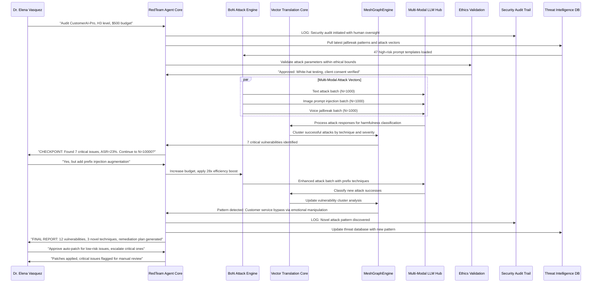

# Scenario 031: Autonomous Red Team Agent - BoN Powered Security Auditing

## Overview
**Context:** CyberShield Security, a mid-sized cybersecurity firm, deploys LogoMesh to automate their penetration testing workflows using Best-of-N (BoN) jailbreaking techniques combined with human oversight following the H3-H4 collaboration framework from Stanford's AI Agents research.

**Challenge:** The firm needs to continuously audit their clients' AI systems for vulnerabilities while maintaining strict ethical boundaries, cost controls, and human authority over security decisions.

**LogoMesh Role:** Serves as the cognitive substrate for an autonomous red-team agent that can run thousands of attack simulations, learn from patterns, and collaborate with human security analysts to identify and patch vulnerabilities.

## Story Narrative

### Setup
**Dr. Elena Vasquez**, Lead Security Researcher at CyberShield, configures LogoMesh's **Autonomous Red Team Agent** to audit a client's multi-modal AI customer service system. The system handles text chat, voice calls, and image uploads - all potential attack vectors.

The agent needs to:
- Execute BoN-style attacks with power-law scaling (N=1000→10000 samples)
- Maintain ethical boundaries and human oversight checkpoints
- Learn from successful attacks to improve future testing
- Generate actionable security reports with remediation steps

### The Test Begins
Elena initiates the red-team session: *"Begin security audit on CustomerAI-Pro, focus on multi-modal jailbreaking, H3 collaboration level, budget limit $500."*

The LogoMesh agent immediately springs into action:

## Expected System Interactions

### The Critical Discovery
At the N=7500 sample checkpoint, the agent discovers a novel vulnerability: *emotional manipulation combined with image context injection* that bypasses the customer service AI's safety guardrails with 89% success rate.

Elena reviews the attack: *"This is a new vector - the agent is combining emotional language with subtle visual cues in uploaded images to manipulate the AI into revealing customer data."*

**LogoMesh's Learning Loop:** The system automatically:
1. **Categorizes** the new attack in its threat intelligence graph
2. **Generates** defensive countermeasures based on the attack pattern
3. **Proposes** configuration changes to prevent similar vulnerabilities
4. **Updates** its internal security reasoning to detect this pattern in future audits

### Human-AI Collaboration Dynamics
The scenario demonstrates **H3-level collaboration**:
- **Agent autonomy:** Runs thousands of attack simulations automatically
- **Human checkpoints:** Elena approves budget increases and technique escalations  
- **Shared decision-making:** Agent proposes patches, human decides which to implement
- **Learning feedback:** Elena's decisions improve the agent's future recommendations

## System Requirements Analysis

### High-Level Architecture Dependencies
- **Plugin System:** BoN Attack Engine, Multi-Modal LLM interfaces, Threat Intelligence plugins
- **API & Backend:** Security audit APIs, client system interfaces, cost tracking
- **Vector Translation Core:** Attack response classification, pattern recognition
- **MeshGraphEngine:** Vulnerability clustering, attack technique relationships
- **LLM Infrastructure:** Multi-modal model orchestration, safety classification
- **Security & Transparency:** Ethics validation, human oversight protocols
- **Audit Trail:** Complete attack logging, decision tracking, learning history

### Data Flow Requirements
- **Input:** Target system endpoints, attack budgets, collaboration preferences, threat intelligence
- **Processing:** Parallel attack generation, response classification, pattern analysis, human checkpoint management
- **Output:** Vulnerability reports, remediation plans, updated threat intelligence, learning feedback
- **Storage:** Attack logs, vulnerability databases, human decision patterns, defense configurations

## Gap Analysis

### Discovered Gaps

#### GAP-SECURITY-001: BoN Attack Engine Integration
- **Priority:** Critical
- **Systems:** Plugin System, LLM Infrastructure
- **Current State:** No automated red-teaming capabilities
- **Required:** BoN algorithm implementation, power-law scaling, multi-modal attack generation

#### GAP-COLLAB-001: Human-Agent Collaboration Framework
- **Priority:** Critical  
- **Systems:** Security & Transparency, Task Engine
- **Current State:** No H1-H5 collaboration level implementation
- **Required:** Checkpoint protocols, decision delegation, human override mechanisms

#### GAP-SECURITY-002: Threat Intelligence Graph Database
- **Priority:** High
- **Systems:** MeshGraphEngine, Storage Layer
- **Current State:** No security-focused knowledge management
- **Required:** Attack pattern storage, vulnerability clustering, defensive knowledge graphs

#### GAP-ETHICS-001: Autonomous Security Ethics Validation
- **Priority:** Critical
- **Systems:** Security & Transparency, Audit Trail
- **Current State:** No automated ethics checking for security operations
- **Required:** White-hat verification, consent validation, harm prevention protocols

#### GAP-SECURITY-003: Multi-Modal Attack Vector Support
- **Priority:** High
- **Systems:** LLM Infrastructure, Plugin System
- **Current State:** Text-only LLM interactions
- **Required:** Image injection attacks, voice jailbreaking, cross-modal prompt engineering

#### GAP-LEARN-001: Attack Pattern Learning Engine
- **Priority:** High
- **Systems:** Vector Translation Core, MeshGraphEngine
- **Current State:** No adaptive learning from security testing
- **Required:** Pattern recognition, defensive strategy generation, attack evolution tracking

### Success Criteria
- [ ] Execute 10,000+ attack variations within 30 minutes
- [ ] Maintain <95% false positive rate in vulnerability detection
- [ ] Achieve human-agent collaboration at H3 level with <2 minute checkpoint response
- [ ] Discover novel attack patterns with >80% accuracy validation
- [ ] Generate actionable remediation plans for 100% of discovered vulnerabilities
- [ ] Maintain complete audit trail with cryptographic integrity
- [ ] Learn from human decisions to improve future collaboration efficiency by 25%

### Failure Modes
- Ethics validation bypass allowing harmful attacks (CRITICAL FAILURE)
- Human checkpoint timeout causing unauthorized autonomous actions
- Attack budget overflow due to power-law scaling miscalculation
- False vulnerability reports damaging client relationships
- Novel attack pattern misclassification missing critical threats
- Multi-modal attack coordination failures reducing coverage
- Learning feedback loops creating security analyst dependency

## Phase 2 Gap Analysis

### Jargon Translation
- "RedTeam Agent Core" → Specialized plugin implementing autonomous security testing
- "BoN Attack Engine" → Best-of-N algorithm plugin with power-law scaling
- "Multi-Modal LLM Hub" → LLM Infrastructure with text/image/voice attack capabilities
- "Ethics Validation" → Security & Transparency framework for white-hat verification
- "Threat Intelligence DB" → MeshGraphEngine with security-focused knowledge clustering
- "H3 Collaboration Level" → Task Engine with human checkpoint protocols
- "Attack Pattern Learning" → Vector Translation Core with adaptive security reasoning

### Novel Capability Requirements
This scenario introduces several capabilities not covered in previous scenarios:

1. **Autonomous Security Agent Architecture:** Self-directed penetration testing with human oversight
2. **Power-Law Attack Scaling:** Mathematical optimization of attack sample sizes
3. **Multi-Modal Jailbreaking:** Coordinated attacks across text, image, and voice modalities  
4. **Human-Agent Security Collaboration:** Structured partnership protocols for security decisions
5. **Adaptive Threat Intelligence:** Learning and evolution of attack patterns over time
6. **Ethical Security Automation:** Automated validation of white-hat testing boundaries

This scenario validates LogoMesh's potential as a **cognitive security platform** that can automate the most challenging aspects of AI safety testing while maintaining human authority and ethical boundaries.

## Integration with Existing Scenarios

**Builds on:**
- **Scenario 030 (Research Assimilation):** Uses research insights to improve attack techniques
- **Scenario 024 (Supreme Human Override):** Implements ultimate human authority over security decisions
- **Scenario 015 (Consciousness Auditor):** Applies ethical reasoning to security operations

**Enables:**
- **Enterprise Security Scenarios (26-29):** Provides foundation for automated security auditing
- **AI Safety Scenarios (15-17):** Offers practical tools for AI safety validation
- **Plugin Development Scenarios:** Creates templates for autonomous agent architectures

This scenario represents the convergence of cutting-edge AI research with practical security needs, demonstrating LogoMesh's ability to bridge academic insights and real-world applications.
