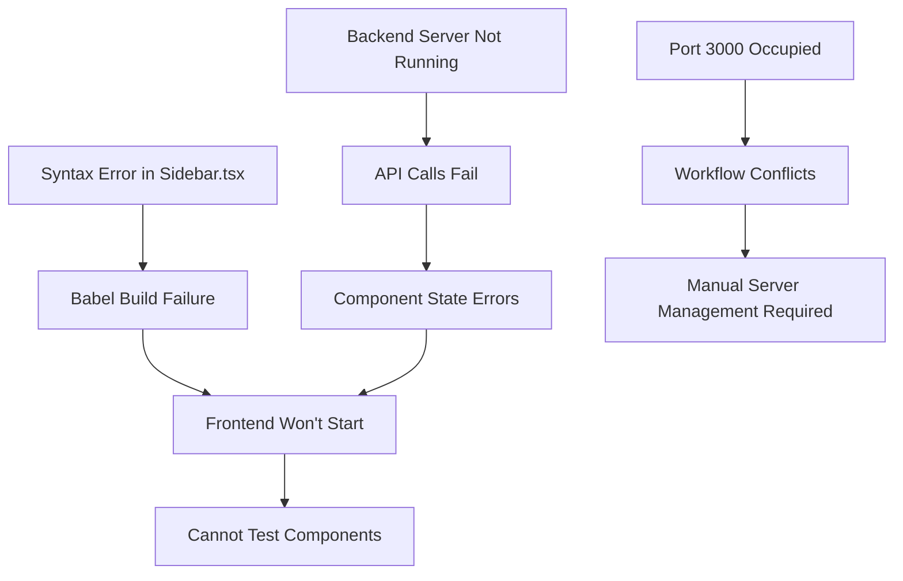

# Error Pattern Analysis
**Date:** January 27, 2025  
**Analysis Type:** Cross-category pattern identification

## Primary Error Pattern: Cascade Failure

### Root Cause Chain

## Error Categories by Impact

### Critical (Blocking Development)
1. **Syntax Errors** - Prevents any development progress
2. **Backend Unavailability** - Blocks all API-dependent features

### High (Affects Functionality)
3. **Port Conflicts** - Complicates development workflow
4. **Module Resolution** - Prevents proper component loading

### Medium (Development Friction)
5. **Test Suite Blocked** - Can't verify code quality
6. **Workflow Failures** - Manual intervention required

### Low (Cosmetic/Warnings)
7. **CSS Box-shadow warnings** - Visual inconsistencies
8. **ESLint warnings** - Code style issues

## Dependency Relationships

### Syntax Fix Dependencies
- Sidebar.tsx syntax → Build process → Test execution → Development workflow

### Backend Dependencies  
- Server startup → API availability → Component data → Graph visualization

### Infrastructure Dependencies
- Port management → Workflow execution → Development efficiency

## Resolution Strategy by Priority

### Phase 1: Critical Blockers (Immediate)
1. ✅ Fix Sidebar.tsx syntax error  
2. 🔄 Start backend server on port 3001
3. 🔄 Verify API endpoints responding

### Phase 2: High Impact (Next)
4. Configure proper port management for workflows
5. Test component functionality with live backend
6. Validate graph visualization with real data

### Phase 3: Quality & Polish (Future)  
7. Run full test suite and fix test failures
8. Address CSS warnings and style issues
9. Optimize workflow configurations

## Success Metrics
- [ ] Frontend builds without errors
- [ ] Backend API responds to all endpoints  
- [ ] Components render with live data
- [ ] Test suite passes completely
- [ ] Workflows run without manual intervention
