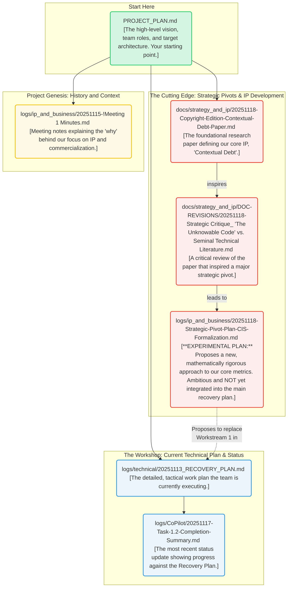

# Strategic Master Log (2025-11-18)

## A Guide for Humans and AI Agents

Welcome to the LogoMesh project. This document is a master log designed for two distinct audiences:
1.  **For Human Developers:** It serves as a guided tour through our project's key documents, helping you understand our high-level strategy, current technical plans, and core intellectual property.
2.  **For AI Agents:** It acts as a primary context file. The structured format and explicit linking of documents are designed to be parsed by AI development assistants (like GitHub Copilot or Jules) to provide accurate, context-aware answers and generate relevant code.

Our goal is to maintain a "living document" that bridges the gap between human understanding and machine-readable context, mitigating the very "Contextual Debt" our project aims to solve.

## Documentation Flowchart: A "Choose Your Own Adventure"

This diagram provides a high-level map of the project's documentation. Start with the `PROJECT_PLAN.md` to understand the overall vision, then explore the different paths based on your area of interest.

---

## 1. The Big Picture: Core Strategy & Vision

This section provides the high-level context for the entire project. If you are new, start here to understand our goals and the problems we are trying to solve.

*   **`PROJECT_PLAN.md`**: This is the canonical starting point for any new team member. It outlines our strategic vision for the AgentX competition, defines the "Cyber-Sentinel Agent" narrative, details team roles, and describes the target multi-agent architecture. It is the "what" and "why" of our project. While it agrees with the current technical plan, it is intentionally less detailed.

---

## 2. The Workshop: Current Technical Plan & Status

This section details the current, day-to-day engineering work. This is the "how"—the specific tasks the development team is actively working on.

*   **`logs/technical/20251113_RECOVERY_PLAN.md`**: This is the project's tactical source of truth. It translates the high-level goals from the `PROJECT_PLAN.md` into concrete, actionable engineering workstreams. It is the most important document for understanding what the team is building *right now*.

*   **`logs/CoPilot/20251117-Task-1.2-Completion-Summary.md`**: This is the most recent changelog or status report for the codebase. It documents the completion of a specific task from the `RECOVERY_PLAN.md`, providing a snapshot of our recent progress and technical decisions.

---

## 3. The Cutting Edge: Strategic Pivots & IP Development

This section contains the project's most ambitious and forward-looking ideas. The documents here define our core intellectual property and explore a potential major evolution of our technical strategy. **Note:** The ideas here are influential but have not yet been formally merged into the main development plan.

*   **`docs/strategy_and_ip/20251118-Copyright-Edition-Contextual-Debt-Paper.md`**: This is the foundational document for our entire project. It defines the concept of "Contextual Debt," which is our core intellectual property and the central problem we aim to solve. The latest version has been updated to prepare it for a formal copyright application.

*   **`docs/strategy_and_ip/DOC-REVISIONS/20251118-Strategic Critique_ 'The Unknowable Code' vs. Seminal Technical Literature.md`**: This is a deep, critical analysis of the research paper. It argues that to be truly groundbreaking, our "Contextual Integrity Score (CIS)" must evolve from a rubric into a mathematically rigorous formula. This critique is the direct inspiration for the experimental pivot plan.

*   **`logs/ip_and_business/20251118-Strategic-Pivot-Plan-CIS-Formalization.md`**: **(Experimental & Ambitious)** This document outlines a concrete plan to implement the ideas from the "Strategic Critique." It proposes a new, more advanced technical direction for our core analyzers, based on vector embeddings and graph theory. While this plan is the likely future of the project, it is **not** the plan we are currently executing. It represents a major potential pivot that is still under investigation.

---

## 4. Project Genesis: History and Context

This section provides historical context that explains key strategic decisions and the project's origins.

*   **`logs/ip_and_business/20251115-!Meeting 1 Minutes.md`**: These are the notes from the first formal meeting between teammates Josh and Deepti. This document is the primary source for understanding *why* the project has a strong focus on intellectual property, copyright, and commercialization, as it records the moment these strategic initiatives were formally adopted.
